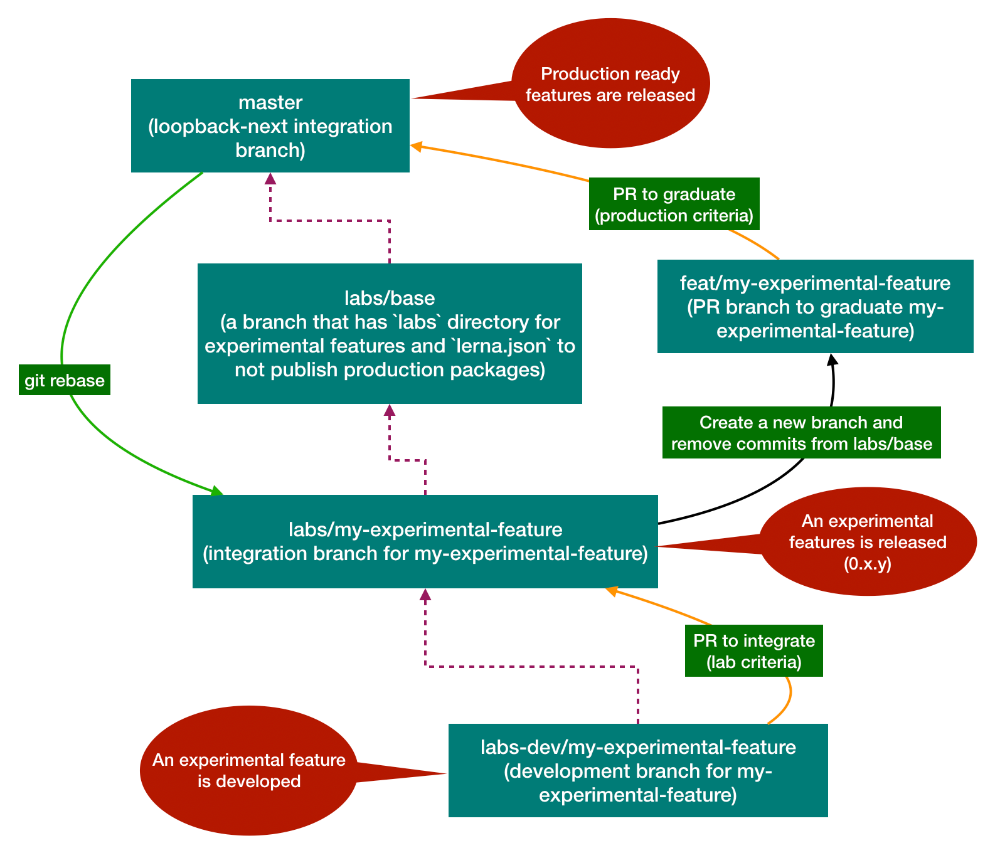

# LoopBack Labs

`Labs` is an incubation process to build experimental features and make it easy
for our developers to try out via `npm install`. Such features are usually not
production ready. The design, implementation and APIs may change significantly
over versions. We may graduate or abandon experimental features based on the
community feedback.

## Workflow

We use a convention based git branching strategy to work on experimental
features along with regular ones in `loopback-next` repository.



### Work on an experimental feature

1. Set up local git repository for an experiment feature

```sh
cd loopback-next
git fetch --all
git checkout labs && git checkout -b lab/<my-experimental-feature> && git checkout -b lab-dev/<my-experimental-feature>
git rebase origin/master
```

Or you can execute the following shell script to provision your experimental feature. It does the same setup as the commands above.

```sh
cd loopback-next
./bin/setup-lab.sh <my-experimental-feature>
```

2. Work on an experimental feature

```sh
cd loopback-next
git checkout lab-dev/<my-experimental-feature>
```

You can now start to make changes, commit them, and push to remote.

3. Rebase the experimental feature branch against master

To get the latest change from master, you can rebase your dev branch:

```
cd loopback-next
git checkout lab-dev/<my-experimental-feature>
git fetch --all
git rebase origin/master
git push --force-with-lease
```

If you want to have a clean commit history in your PR without the noisy commits from the master branch, make sure branch `/labs` is rebased against master and `/lab/<my-experimental-feature>` is rebased against `/labs`.

4. Release for an experimental feature

- Use `0.x.y` versioning scheme
- Use `lab/<my-experimental-feature>` as the branch

*The release script to be created*

### Graduate an experimental feature

1. Create a PR from `lab/<my-experimental-feature>` against `master`
2. Remove the lab setup commits from `/labs`
3. Update the entries/links in [register the new package](https://loopback.io/doc/en/contrib/code-contrib-lb4.html#register-the-new-package)
4. Update the `CODEOWNERS` file in the root folder: add the graduated package and owners' names
5. Follow the code review process to land the PR

