## Overview

[Appsody](https://appsody.dev/docs#welcome-to-appsody) helps developers build
containerized applications for the cloud that are ready to be deployed to
Kubernetes without being an expert on the underlying container technology.

It is part of a broader offering named [Kabanero](https://kabanero.io/) where it
is used for developing and deploying cloud native applications. But it can also
be used on its own.

It consists of 3 key components:

- [Appsody Stacks](https://appsody.dev/docs#appsody-stacks): Configurable
  technology stacks built with popular runtimes and frameworks which provide the
  foundation for building applications that can be deployed and managed
  effectively in Kubernetes.

- [Appsody Hub](https://appsody.dev/docs#appsody-hub): The central point of
  control for Appsody Stacks where you can find available stacks, create new
  stacks, or modify existing ones.

- [Appsody CLI](https://appsody.dev/docs#appsody-cli): Makes it extremely easy
  for a developer to: scaffold, run, stop, debug, test, build, and deploy an
  application.

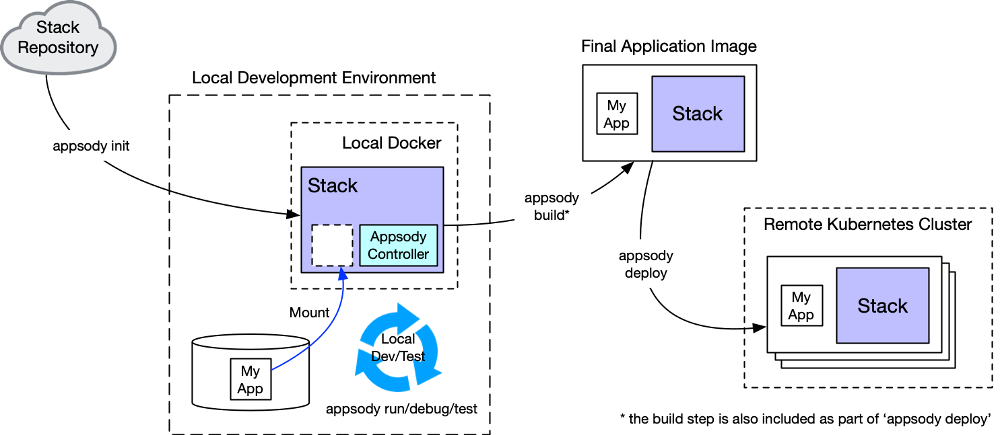

The LoopBack team has recently contributed the
[Node.js LoopBack stack](https://github.com/appsody/stacks/tree/master/incubator/nodejs-loopback)
which extends the
[Node.js stack](https://github.com/appsody/stacks/tree/master/incubator/nodejs)
and provides a powerful solution to build open APIs and Microservices in
TypeScript with [LoopBack](https://loopback.io/), an open source Node.js API
framework. It is based on
[LoopBack 4](https://github.com/strongloop/loopback-next).

We're going to show you how to scaffold, run, stop, debug, and test a LoopBack 4
application locally. Then, you'll learn how to build and deploy this application
to the [IBM Cloud](https://www.ibm.com/cloud).

### Installing Appsody

To install the
[Appsody CLI](https://appsody.dev/docs/using-appsody/cli-commands/), please
follow these
[instructions](https://appsody.dev/docs/getting-started/installation).

## Scaffolding a LoopBack 4 Application using Appsody

Using the Appsody CLI, you can quickly scaffold a LoopBack 4 application.

1. Open a terminal window
2. Create a directory named **appsodyLB4Todo**:

   ```sh
   mkdir appsodyLB4Todo
   ```

3. Navigate to that directory

   ```sh
   cd appsodyLB4Todo
   ```

4. List the available Appsody stacks (templates) with:

   ```sh
   appsody list
   ```

   You should see the
   [nodejs-loopback](https://github.com/appsody/stacks/tree/master/incubator/nodejs-loopback)
   stack (template) listed

   ```
   REPO            ID                              VERSION         TEMPLATES               DESCRIPTION

   ...
   *incubator      nodejs-loopback                 0.1.7           *scaffold               LoopBack 4 API Framework for Node.js
   ...
   ```

5. Scaffold a LoopBack 4 application in the current directory with:

   ```sh
   appsody init nodejs-loopback
   ```

   You should see output like this:

   ```
   Checking stack requirements...
   Skipping Buildah - No requirements set.
   Skipping Docker - No requirements set.
   Skipping Appsody - No requirements set.
   Running appsody init...
   Downloading nodejs-loopback template project from https://github.com/appsody/stacks/releases/download/nodejs-loopback-v0.1.7/incubator.nodejs-loopback.v0.1.7.templates.scaffold.ta
   r.gz
   Download complete. Extracting files from /appsodyLB4Todo/nodejs-loopback.tar.gz
   Setting up the development environment
   Your Appsody project name has been set to appsodylb4todo
   Pulling docker image appsody/nodejs-loopback:0.1
   Running command: docker pull appsody/nodejs-loopback:0.1
   0.1: Pulling from appsody/nodejs-loopback
   ...
   Status: Downloaded newer image for appsody/nodejs-loopback:0.1
   docker.io/appsody/nodejs-loopback:0.1
   [Warning] The stack image does not contain APPSODY_PROJECT_DIR. Using /project
   Running command: docker run --rm --entrypoint /bin/bash appsody/nodejs-loopback:0.1 -c find /project -type f -name .appsody-init.sh
   Successfully initialized Appsody project with the nodejs-loopback stack and the default template.
   ```

   The most important lines to make note of are:

   ```
   Your Appsody project name has been set to appsodylb4todo

   and

   Successfully initialized Appsody project with the nodejs-loopback stack and the default template.
   ```

6. Install all the dependencies of this application with:

   ```sh
   npm install
   ```

7. Now that all the dependencies have been installed, open your favourite IDE
   editor on this project.

   In my case, I use VS Code.

   ```sh
   code .
   ```

8. The basic structure of the application looks like this:

   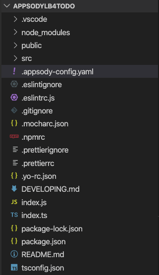

   One important file is the Appsody configuration file for your project named
   **.appsody-config.yaml** .

   It defines the **name** of your project, and the **stack** (template) on
   which it is based.

   ```yaml
   project-name: appsodylb4todo
   stack: appsody/nodejs-loopback:0.1
   ```

9. The source code of the LoopBack 4 application is located in the **src**
   directory.

   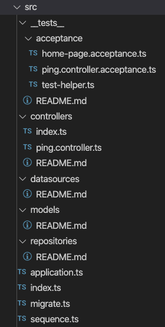

10. This basic application only defines one API endpoint `'/ping'` in the file
    **src/controllers/ping.controller.ts**

    The initial application is very similar to the one generated by the
    `'lb4 app'`
    [command](https://loopback.io/doc/en/lb4/Application-generator.html), but
    it's going to be a loaded by a facade that sets up health/metrics for cloud
    native observability.

In the next section, we will add more API endpoints.

## Building Your Application

The template application is only a starting point.

Let's build a proper, basic LoopBack 4 application.

We'll use the `todo list` application from the
[Todo Tutorial](https://loopback.io/doc/en/lb4/todo-tutorial.html) as an
example.

### Add the Todo model

Let's create the `Todo` model using:

```
lb4 model
```

You will be prompted with different questions. Specify the same responses as
below.

```
? Model class name: todo
? Please select the model base class: Entity (A persisted m
odel with an ID)
? Allow additional (free-form) properties? No
Model Todo will be created in src/models/todo.model.ts

Let's add a property to Todo
Enter an empty property name when done

? Enter the property name: id
? Property type: number
? Is id the ID property? Yes
? Is id generated automatically? Yes

Let's add another property to Todo
Enter an empty property name when done

? Enter the property name: title
? Property type: string
? Is it required?: Yes
? Default value [leave blank for none]:

Let's add another property to Todo
Enter an empty property name when done

? Enter the property name: desc
? Property type: string
? Is it required?: No
? Default value [leave blank for none]:

Let's add another property to Todo
Enter an empty property name when done

? Enter the property name: isComplete
? Property type: boolean
? Is it required?: No
? Default value [leave blank for none]:

Let's add another property to Todo
Enter an empty property name when done
```

We are done adding properties, so just hit the ENTER key at this point.

```
? Enter the property name:
  create src/models/todo.model.ts
  update src/models/index.ts

Model Todo was created in src/models/
```

### Add a Datasource

1. Let's create a datasource for an in-memory database using:

   ```
   lb4 datasource
   ```

   You will be prompted with different questions. Specify the same responses as
   below.

   ```
   ? Datasource name: db
   ? Select the connector for db: In-memory db (supported by StrongLoop)
   ? window.localStorage key to use for persistence (browser only):
   ? Full path to file for persistence (server only): ./data/db.json
   create src/datasources/db.datasource.ts
   update src/datasources/index.ts

   Datasource Db was created in src/datasources/
   ```

2. Create a folder named `/appsodyLB4Todo/data`
3. Create a file named `/appsodyLB4Todo/data/db.json`
4. Place the following content inside `db.json`:
   ```json
   {
     "ids": {
       "Todo": 5
     },
     "models": {
       "Todo": {
         "1": "{\"title\":\"Take over the galaxy\",\"desc\":\"MWAHAHAHAHAHAHAHAHAHAHAHAHAMWAHAHAHAHAHAHAHAHAHAHAHAHA\",\"id\":1}",
         "2": "{\"title\":\"destroy alderaan\",\"desc\":\"Make sure there are no survivors left!\",\"id\":2}",
         "3": "{\"title\":\"play space invaders\",\"desc\":\"Become the very best!\",\"id\":3}",
         "4": "{\"title\":\"crush rebel scum\",\"desc\":\"Every.Last.One.\",\"id\":4}"
       }
     }
   }
   ```

### Add a Repository

Let's a repository to handle the database CRUD functions of the `Todo` model
using:

```
lb4 repository
```

You will be prompted with different questions. Specify the same responses as
below.

```
? Please select the datasource DbDatasource
? Select the model(s) you want to generate a repository Todo
? Please select the repository base class DefaultCrudRepository (Juggler bridge)
   create src/repositories/todo.repository.ts
   update src/repositories/index.ts

Repository TodoRepository was created in src/repositories/
```

### Add a Controller

Let's create a controller to define and handle the request-response lifecycle
for our API endpoints using:

```
lb4 controller
```

You will be prompted with different questions. Specify the same responses as
below.

```
? Controller class name: todo
Controller Todo will be created in src/controllers/todo.controller.ts

? What kind of controller would you like to generate? REST Controller with CRUD functions
? What is the name of the model to use with this CRUD repository? Todo
? What is the name of your CRUD repository? TodoRepository
? What is the name of ID property? id
? What is the type of your ID? number
? Is the id omitted when creating a new instance? Yes
? What is the base HTTP path name of the CRUD operations? /todos
   create src/controllers/todo.controller.ts
   update src/controllers/index.ts

Controller Todo was created in src/controllers/
```

Look inside `src/controllers/todo.controller.ts`, and you will notice we have
several more endpoints:

- GET / POST / PATCH `/todos`
- GET / PATCH / PUT / DEL `/todos/{id}`
- GET `/todos/count`

So, in total, these are the available endpoints of this application:

- Application endpoint: http://localhost:3000/
- API explorer: http://localhost:3000/explorer
- Open API Spec: http://localhost:3000/openapi.json
- API endpoints:
  - http://localhost:3000/ping
  - http://localhost:3000/todos
  - http://localhost:3000/todos/{id}
  - http://localhost:3000/todos/count
- Health endpoint: http://localhost:3000/health
- Liveness endpoint: http://localhost:3000/live
- Readiness endpoint: http://localhost:3000/ready
- Metrics endpoint: http://localhost:3000/metrics

We will run, test, debug, and stop this application **locally** in the next
section.

## Running/Testing/Debugging/Stopping a LoopBack 4 Application Locally using Appsody

Using the Appsody CLI, you can quickly run, test, debug, and stop a LoopBack 4
application.

### Running a LoopBack 4 Application Locally using Appsody

1. **Run** the application using:

   ```
   appsody run
   ```

   Appsody takes your current application artifacts and builds/starts up a
   docker container for you.

   The output of the command looks similar to this:

   ```
   Running development environment...
   Pulling docker image appsody/nodejs-loopback:0.1
   Running command: docker pull appsody/nodejs-loopback:0.10.1: Pulling from appsody/nodejs-loopback
   Digest: sha256:c810188750a998bbc84a3dba1a2bb04413851453da6874d224a129994b12c9c5
   Status: Image is up to date for appsody/nodejs-loopback:0.1
   docker.io/appsody/nodejs-loopback:0.1
   Running command: docker run --rm -p 3000:3000 -p 9229:9229 --name appsodylb4todo-dev -v /Users/dremond/Documents/appsody_stuff/appsodyLB4Todo/:/project/user-app -v appsodylb4todo-deps:/pr
   oject/user-app/node_modules -v appsody-controller-0.3.1:/.appsody -t --entrypoint /.appsody/appsody-controller appsody/nodejs-loopback:0.1 --mode=run
   [Container] Running APPSODY_PREP command: npm install --prefix user-app && npm run build --prefix user-app
   npm WARN nodejs-loopback-scaffold@1.0.0 No license field.
   [Container]
   audited 4510 packages in 6.142s
   [Container]
   [Container] > nodejs-loopback-scaffold@1.0.0 build /project/user-app
   [Container] > lb-tsc
   [Container]
   [Container] Running command:  npm start
   [Container]
   [Container] > nodejs-loopback@0.1.7 start /project
   [Container] > node -r source-map-support/register .
   [Container]
   [Container] Server is running at http://[::1]:3000
   [Container] Try http://[::1]:3000/ping
   ```

2. In your browser, navigate to : `http://[::1]:3000`

   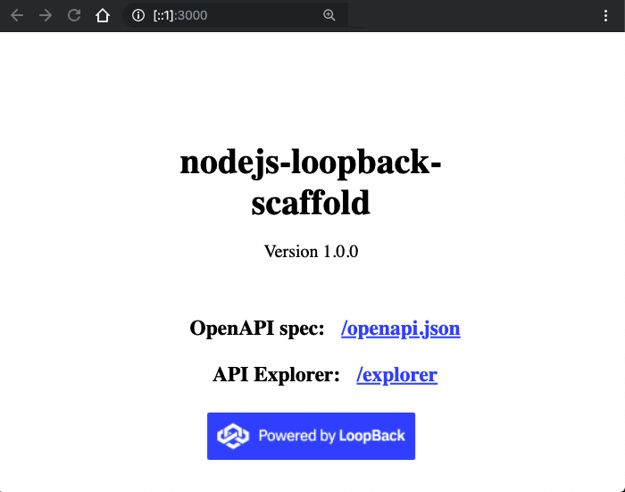

3. Click on the `'/explorer'` link to open the `'API Explorer'` and interact
   with the REST API endpoints.

   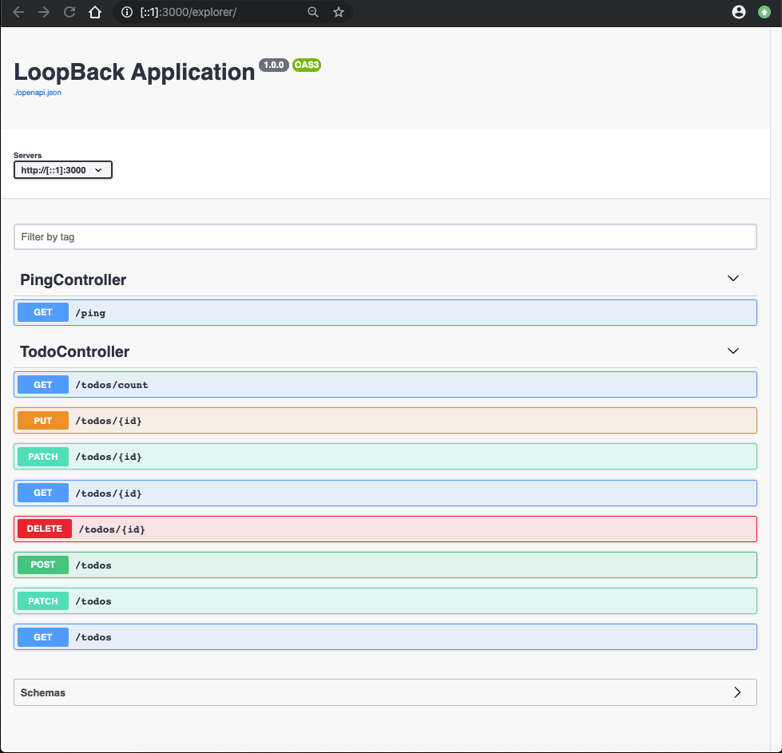

4. Expand **PingController**'s `'GET /ping'` section, click on the
   `'Try it Out'` button, and then click on the `'Execute'` button.

   You should obtain a response code of `200` and a message body of:

   ```json
   {
     "greeting": "Hello from LoopBack",
     "date": "2019-11-21T18:01:28.786Z",
     "url": "/ping",
     "headers": {
       "host": "[::1]:3000",
       "connection": "keep-alive",
       "accept": "application/json",
       "user-agent": "Mozilla/5.0 (Macintosh; Intel Mac OS X 10_15_1) AppleWebKit/537.36 (KHTML, like Gecko) Chrome/78.0.3904.97 Safari/537.36",
       "sec-fetch-site": "same-origin",
       "sec-fetch-mode": "cors",
       "referer": "http://[::1]:3000/explorer/",
       "accept-encoding": "gzip, deflate, br",
       "accept-language": "en-US,en;q=0.9"
     }
   }
   ```

5. By default, `'File watching'` is **enabled** when you run the command
   `'appsody run'`. This means you can change a file in your project, and then
   Appsody builds/runs a new Docker container for you automatically.

6. Open **src/controllers/ping.controller.ts**, and change the greeting from
   `'Hello from LoopBack'` to `'Hello from LoopBack 4!'`. Save the file. You
   will see some activity in console output:

   ```
    [Container] Running command:  npm run pretest --prefix user-app && npm start
    [Container] Wait received error on APPSODY_RUN/DEBUG/TEST signal: interrupt
    [Container]
    [Container] > nodejs-loopback-scaffold@1.0.0 pretest /project/user-app
    [Container] > npm run clean && npm run build
    [Container]
    [Container]
    [Container] > nodejs-loopback-scaffold@1.0.0 clean /project/user-app
    [Container] > lb-clean dist *.tsbuildinfo
    [Container]
    [Container]
    [Container] > nodejs-loopback-scaffold@1.0.0 build /project/user-app
    [Container] > lb-tsc
    [Container] > nodejs-loopback@0.1.7 start /project
    [Container] > node -r source-map-support/register .
    [Container]
    [Container] Server is running at http://[::1]:3000
    [Container] Try http://[::1]:3000/ping
   ```

7. In the `'API Explorer'`, try the `'GET /ping'` endpoint again, and you will
   receive the new **greeting** response:

   ```json
   {
     "greeting": "Hello from LoopBack 4!",
     "date": "2019-11-21T18:22:22.975Z",
     "url": "/ping",
     "headers": {
       "host": "[::1]:3000",
       "connection": "keep-alive",
       "accept": "application/json",
       "user-agent": "Mozilla/5.0 (Macintosh; Intel Mac OS X 10_15_1) AppleWebKit/537.36 (KHTML, like Gecko) Chrome/78.0.3904.97 Safari/537.36",
       "sec-fetch-site": "same-origin",
       "sec-fetch-mode": "cors",
       "referer": "http://[::1]:3000/explorer/",
       "accept-encoding": "gzip, deflate, br",
       "accept-language": "en-US,en;q=0.9"
     }
   }
   ```

8. In the `'API Explorer'`, try the `'GET /todos'` endpoint.

   Click on the `'Try it Out'` button, clear the filter field, and then click on
   the `'Execute'` button.

   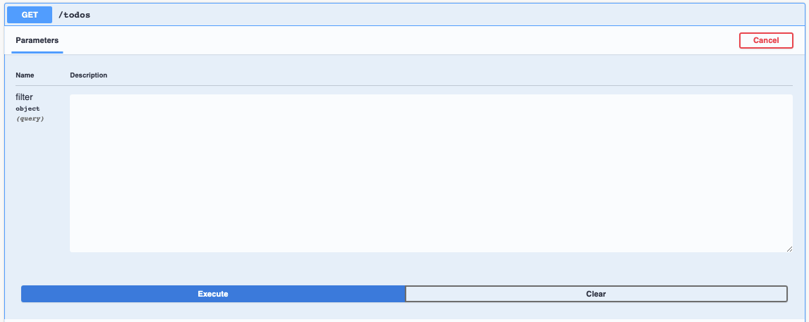

   The response will be:

   ```json
   [
     {
       "id": 1,
       "title": "Take over the galaxy",
       "desc": "MWAHAHAHAHAHAHAHAHAHAHAHAHAMWAHAHAHAHAHAHAHAHAHAHAHAHA"
     },
     {
       "id": 2,
       "title": "destroy alderaan",
       "desc": "Make sure there are no survivors left!"
     },
     {
       "id": 3,
       "title": "play space invaders",
       "desc": "Become the very best!"
     },
     {
       "id": 4,
       "title": "crush rebel scum",
       "desc": "Every.Last.One."
     }
   ]
   ```

9. To see the docker container the Appsody started for you,
   `open a new terminal` and use:

   ```
   appsody ps
   ```

   It will show something similar to this:

   ```
   CONTAINER ID    NAME                    IMAGE                           STATUS
   d39c90c5191d    appsodylb4todo-dev      appsody/nodejs-loopback:0.1     Up About a minute
   ```

   `'docker ps'` will accomplish the same thing.

### Stopping a LoopBack 4 Application Locally using Appsody

If your application is currently running under Appsody control, you can stop it
with `Ctrl+C`, or by running the command `'appsody stop'` from another terminal.

The output will be the similar to this:

```
Stopping development environment
Running command: docker stop appsodylb4todo-dev -t 10
```

### Testing a LoopBack 4 Application Locally using Appsody

1. If your application is currently running under Appsody control,
   [stop it](#stopping-a-loopback-4-application-locally-using-appsody).
2. Open **src/controllers/ping.controller.ts**, and revert the **greeting** back
   to `'Hello from LoopBack'`. Save the file. (We don't want our first test run
   to fail ;) )
3. Let's also make sure to fix up any 'lint' errors beforehand.
   ```
   npm run lint:fix
   ```
4. **Test** the application against the **suite of test cases** located in
   **src/tests** by using:

   ```
   appsody test
   ```

   Appsody will build the project, and then run the mocha test suites. The
   output should be similar to this:

   ```
   ...
   [Container] > nodejs-loopback-scaffold@1.0.0 test /project/user-app
   [Container] > lb-mocha --allow-console-logs "dist/__tests__"
   [Container]
   [Container]
   [Container]
   [Container]   HomePage
   [Container]     ✓ exposes a default home page (72ms)
   [Container]     ✓ exposes self-hosted explorer
   [Container]
   [Container]   PingController
   [Container]     ✓ invokes GET /ping
   [Container]
   [Container]
   [Container]   3 passing (369ms)

   ...
   Closing down development environment.
   ```

   After the test suites have completed, Appsody stops the application's docker
   container automatically.

### Debugging a LoopBack 4 Application Locally using Appsody

1. If your application is currently running under Appsody control,
   [stop it](#stopping-a-loopback-4-application-locally-using-appsody).
2. Open **src/controllers/ping.controller.ts**, and let's set a **breakpoint**
   on the `'return'` statement in the `'ping(): object'` function.

   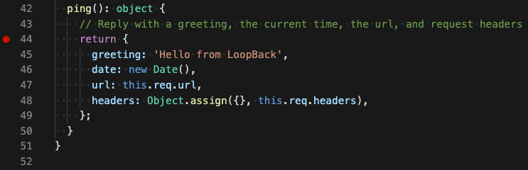

3. Start **debugging** the application by using:

   ```
   appsody debug
   ```

   You will see output similar to this:

   ```
   Running debug environment
   ...
   [Container] > nodejs-loopback-scaffold@1.0.0 build /project/user-app
   [Container] > lb-tsc
   [Container]
   [Container] Running command:  npm run debug
   [Container]
   [Container] > nodejs-loopback@0.1.7 debug /project
   [Container] > node -r source-map-support/register --inspect=0.0.0.0 .
   [Container]
   [Container] Debugger listening on ws://0.0.0.0:9229/dd6869ce-d940-4b8b-9867-cfde382f4856
   [Container] For help, see: https://nodejs.org/en/docs/inspector
   [Container] Server is running at http://[::1]:3000
   [Container] Try http://[::1]:3000/ping
   ```

4. Switch to the **debugging view** in VS Code, and you will notice that there
   is a debugging configuration provided for Appsody.

   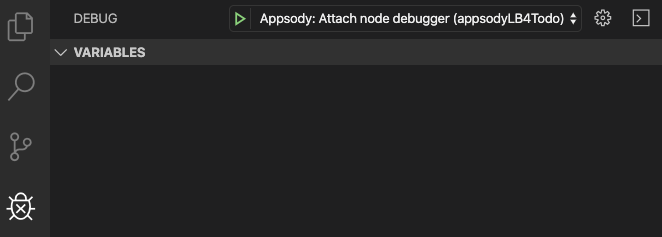

5. Press the **green** `'Start Debugging'` button to attach to the debugger.

   The console view will show

   ```
   [Container] Debugger attached.
   [Container] Server is running at http://[::1]:3000
   [Container] Try http://[::1]:3000/ping
   ```

6. In your browser, navigate to `http://[::1]:3000/explorer`, and call the
   `'GET /ping'` endpoint.

   The debugger stops at the breakpoint.

   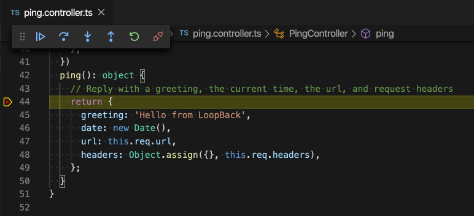

7. Press the **blue** `'Continue (F5)'` button in the debugger toolbar, and then
   return to the `'API Explorer'`.

   The response shows up.

   ```json
   {
     "greeting": "Hello from LoopBack",
     "date": "2019-11-21T18:43:00.786Z",
     "url": "/ping",
     "headers": {
       "host": "[::1]:3000",
       "connection": "keep-alive",
       "accept": "application/json",
       "user-agent": "Mozilla/5.0 (Macintosh; Intel Mac OS X 10_15_1) AppleWebKit/537.36 (KHTML, like Gecko) Chrome/78.0.3904.97 Safari/537.36",
       "sec-fetch-site": "same-origin",
       "sec-fetch-mode": "cors",
       "referer": "http://[::1]:3000/explorer/",
       "accept-encoding": "gzip, deflate, br",
       "accept-language": "en-US,en;q=0.9"
     }
   }
   ```

8. Press `'Ctrl+C'` to stop the debugger and the application.

### Turning on DEBUG tracing

To turn on debug tracing in a LoopBack 4 application running under the control
of Appsody, you need to use the `'--docker-options'` parameter. You can specify
this parameter for the run, debug and test commands.

```
appsody [run | debug | test] --docker-options "--env DEBUG=loopback*"
```

You will see output similar to this:

```
[Container]   loopback:context:view Finding matching bindings +0ms
[Container]   loopback:context:view Reading bindings +0ms
[Container]   loopback:core:lifecycle Finished notification start of +26ms
[Container]   loopback:context [application] Resolving binding synchronously: servers.RestServer +89ms
[Container]   loopback:context:binding Get value for binding servers.RestServer +83ms
```

## Deploying to a Kubernetes Cluster on IBM Cloud

Before deploying your application to the IBM Cloud, please ensure you have a
terminal window opened in your project directory. In our case, this is the
`appsodyLB4Todo` directory.

1. Log into IBM Cloud : `ibmcloud login`
2. Log into the IBM Cloud Container Registry : `ibmcloud cr login`
3. List your container registry namespaces : `ibmcloud cr namespace-list`
4. Create a namespace : `ibmcloud cr namespace-add <my_namespace>`. In my case
   my namespace is `dremond`.
5. [Create a Kubernetes cluster](https://cloud.ibm.com/kubernetes/clusters) on
   IBM Cloud.
6. Go to the `'Access'` tab of your cluster and **follow the instructions** to
   set up `kubectl` against your cluster configuration.

   In my case, my cluster is named `dremondOne`.

   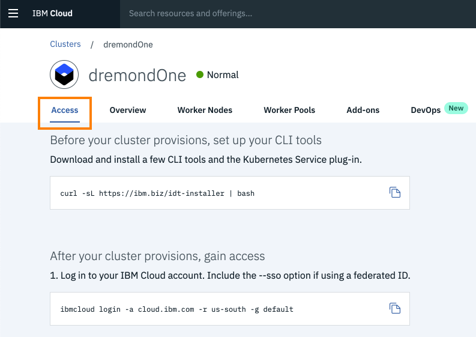

7. Confirm the **region** of your container registry:

   ```
   ibmcloud cr region
   ```

   You will see something like:

   ```
   You are targeting region 'us-south', the registry is 'us.icr.io'.
   ```

8. List the secrets in Kubernetes:

   ```
   kubectl get secrets
   ```

   It will list many secrets. You are interested in the one that matches your
   region. In my case :

   ```
   NAME                           TYPE
   ...                            ...
   default-us-icr-io              kubernetes.io/dockerconfigjson
   ```

   We will make use of `'default-us-icr-io'`.

9. Create the **deployment manifest** with:

   ```
   appsody deploy --generate-only
   ```

   The output will look similar to this:

   ```
    Pulling docker image appsody/nodejs-loopback:0.1
    Running command: docker pull appsody/nodejs-loopback:0.1
    0.1: Pulling from appsody/nodejs-loopback
    Digest: sha256:c810188750a998bbc84a3dba1a2bb04413851453da6874d224a129994b12c9c5
    Status: Image is up to date for appsody/nodejs-loopback:0.1
    docker.io/appsody/nodejs-loopback:0.1
    Running command: docker create --name appsodylb4todo-extract appsody/nodejs-loopback:0.1
    Running command: docker cp appsodylb4todo-extract:/config/app-deploy.yaml /Users/dremond/Documents/appsody_stuff/appsodyLB4Todo/app-deploy.yaml
    Running command: docker rm appsodylb4todo-extract -f
    Running git command: git version
    Running git command: git status -sb
    Created deployment manifest: /Users/dremond/Documents/appsody_stuff/appsodyLB4Todo/app-deploy.yaml
   ```

10. In `/appsodylb4todo/app-deploy.yaml`, under `applicationImage`, insert a
    line:

    ```yaml
    pullSecret: default-us-icr-io
    ```

    It should look like this now:

    ```yaml
    spec:
      applicationImage: dev.local/appsodylb4todo
      pullSecret: default-us-icr-io
    ```

    **This pull secret is necessary for kubernetes to pull images from your
    private container registry.**

11. Finally build and deploy your image to kubernetes using:

    ```
    appsody deploy -t us.icr.io/dremond/appsodylb4todo:1 --push
    ```

    You will see output similar to this:

    ```
    Extracting project from development environment
    Pulling docker image appsody/nodejs-loopback:0.1
    ...
    [Docker] Successfully built 7b7f1a04624b
    [Docker] Successfully tagged us.icr.io/dremond/appsodylb4todo:1
    Pushing image us.icr.io/dremond/appsodylb4todo:1
    ...
    Updated existing deployment manifest /Users/dremond/Documents/appsody_stuff/appsodyLB4Todo/app-deploy.yaml
    ...
    Attempting to get resource from Kubernetes ...
    Running command: kubectl get svc appsodylb4todo -o jsonpath=http://{.status.loadBalancer.ingress[0].hostname}:{.spec.ports[0].nodePort} --namespace default
    Deployed project running at http://:32556
    ```

    It takes a bit of time, so please wait patiently.

    Ensure it completes successfully.

    It **may** fail the first time if the
    [Apposody Operator](https://operatorhub.io/operator/appsody-operator)
    installation fails. See
    [Resolving the Appsody Operator Error ](#resolving-the-appsody-operator-error).


    If deployment was successful, the `applicationImage` field in `app-deploy.yaml` will have a value of:
    ```yaml
    applicationImage: us.icr.io/dremond/appsodylb4todo:1
    ```
    which matches what you specified in the deploy command.

12. Confirm the deployment with:

    ```
    kubectl get deployments
    ```

    You should see the deployments named `'appsodylb4todo'` and
    `'appsody-operator'`:

    ```
    NAME                DESIRED   CURRENT   UP-TO-DATE   AVAILABLE   AGE
    appsody-operator    1         1         1            1           11m
    appsodylb4todo      1         1         1            1           10m
    ```

13. Confirm your pod is running with:

    ```
    kubectl get pods
    ```

    You should see a pod with a name beginning with `'appsodylb4todo'`. Ensure
    its state is `'Running'`.

    ```
    NAME                                READY     STATUS    RESTARTS   AGE
    appsody-operator-586db784fc-kmfdg   1/1       Running   0          13m
    appsodylb4todo-745cdc479d-k5hlp     1/1       Running   0          14m
    ```

    You can also use the Kubernetes Dashboard to view the same information:

    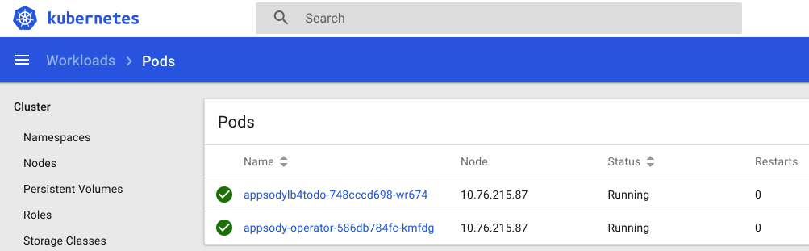

14. Determine the public IP address of your cluster with:

    ```
    kubectl get node -o wide
    ```

    Look at the `EXTERNAL-IP` value.

    ```
    NAME           STATUS    ROLES     AGE       VERSION       EXTERNAL-IP       OS-IMAGE             KERNEL-VERSION      CONTAINER-RUNTIME
    10.76.215.87   Ready     <none>    4d        v1.14.8+IKS   184.172.214.253   Ubuntu 16.04.6 LTS   4.4.0-166-generic   containerd://1.2.10
    ```

15. Determine the port of your application with:

    ```
    kubectl get svc appsodylb4todo
    ```

    Looking at the `PORT(S)` value.

    ```
    NAME             TYPE       CLUSTER-IP     EXTERNAL-IP   PORT(S)          AGE
    appsodylb4todo   NodePort   172.21.74.42   <none>        3000:32556/TCP   21m
    ```

    The value you are interested in is the numeric value after the ':'
    character.

    In my case, this is the value `32556`.

16. In your browser, navigate to `http://{external IP}:{port}` . In my case,
    this is: http://184.172.214.253:32556 .

    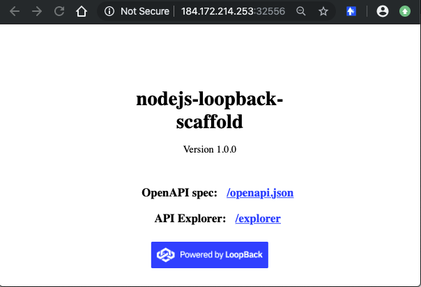

    As mentioned earlier, all these endpoints are available:

    - Application endpoint: /
    - API explorer: /explorer
    - Open API Spec: /openapi.json
    - API endpoints:
      - /ping
      - /todos
      - /todos/{id}
      - /todos/count
    - Health endpoint: /health
    - Liveness endpoint: /live
    - Readiness endpoint: /ready
    - Metrics endpoint: /metrics

17. When you make **additional** code changes and you deploy again, it is
    **necessary** to `increase the tag number` in order for kubernetes to reload
    the pod with the new image.

    For example :

    ```
    appsody deploy -t us.icr.io/dremond/appsodylb4todo:2 --push
    ```

    This is a workaround for a known
    [bug](https://github.com/appsody/appsody/issues/261) at this time.

### Resolving the Appsody Operator Error

If the `'appsody deploy'` command fails with an error related to the
`Appsody operator` :

```
Running command: kubectl apply -f /Users/dremond/.appsody/deploy/appsody-app-crd.yaml --namespace default
Attempting to apply resource in Kubernetes ...
Running command: kubectl apply -f /Users/dremond/.appsody/deploy/appsody-app-operator.yaml --namespace default
[Error] Failed to install an Appsody operator in namespace default watching namespace default. Error was: kubectl apply failed: exit status 1: W1120 11:44:03.152352   12911 factory_object_mapping.go:423] Failed to download OpenAPI (the server could not find the requested resource), falling back to swagger
error: error validating "/Users/dremond/.appsody/deploy/appsody-app-operator.yaml": error validating data: the server could not find the requested resource; if you choose to ignore these errors, turn validation off with --validate=false
```

This is easy to fix. Simply take the command that failed, and add the suggested
parameter `--validate=false`

In my case, I had to enter the following command:

```
kubectl apply -f /Users/dremond/.appsody/deploy/appsody-app-crd.yaml --validate=false --namespace default
```

This command should succeed.

Confirm the deployment exists with:

```
kubectl get deployments
```

You should see an entry named `'appsody-operator'`.

Confirm the pod is running with:

```
kubectl get pods
```

You should see a pod with a name beginning with `'appsody-operator'`. Ensure its
state is `'Running'`.

## Deleting the Deployment from Kubernetes

Deleting the deployed application from Kubernetes is very simple.

Simply enter the command:

```
appsody deploy delete
```

The output should be:

```
Deleting deployment using deployment manifest app-deploy.yaml
Attempting to delete resource from Kubernetes...
Running command: kubectl delete -f app-deploy.yaml --namespace default
Deployment deleted
```

Confirm the deployment no longer exists with:

```
kubectl get deployments
```

You should **not** see a deployment named `'appsodylb4todo'`.

Confirm your pod no longer exists with:

```
kubectl get pods
```

You should **not** see a pod with a name beginning with `'appsodylb4todo'`.

## Summary

Congratulations!

Using the [Appsody CLI](https://appsody.dev/docs/using-appsody/cli-commands/),
you've learnt how to:

- scaffold, run, stop, debug, and test a LoopBack 4 application locally.
- build and deploy the application to the
  [IBM Cloud](https://www.ibm.com/cloud).
