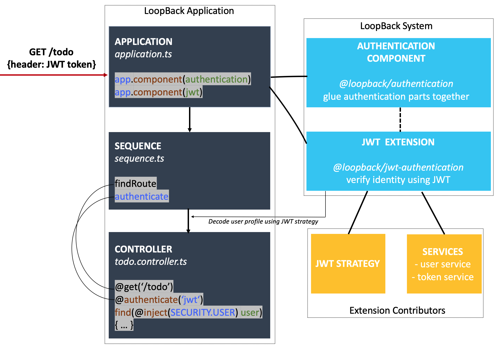

## Overview

Security is of paramount importance when developing a web or mobile application
and usually consists of two distinct pieces:

- Authentication
- Authorization

Authentication is a process of verifying user/entity to the system, which
enables identified/validated access to the protected routes.

Authorization is a process of deciding if a user can perform an action on a
protected resource.



This document gives you an overview of the authentication system provided in
LoopBack 4.

Let's start with the following scenario: Suppose you want to limit access to
todo items to the owner. The diagram below shows how such authentication process
works with LoopBack's authentication mechanism.

As illustrated above, during the request `GET /todo`, an access token in the
Authorization header is handled by the REST server's sequence. The
authentication action is then invoked to decode the user profile from token so
that controllers can have the user injected.

To implement this, all you need to add is the code in the highlighted code
snippet:

- Register the authentication component and JWT extension in your application.
- Enable the authenticate action in sequence.
- Decorate the controller endpoint with `@authenticate()` and inject the user
  passed from the authentication layer.



The rest will be handled by the authentication component
`@loopback/authentication`, which incorporates the authentication mechanism, and
the JWT extension `@loopback/authentication-jwt`, which helps in implementing
JWT-based authentication to the system and should be provided by extension
developers.

## Tutorials

The authentication system is highly extensible and pluggable. It's easy to get
started with. While there are more advanced features to explorer - of which are
beneficial when you build more complicated and larger scale applications, it
requires understanding the mechanics of the system, like how component
`@loopback/authentication` works. To help you learn the full features gradually,
we've broken down the documentations into several parts:

- [**JWT todo example**](./tutorials/authentication/Authentication-Tutorial.md):
  A tutorial to get started by applying the JWT authentication in the
  [todo example](https://loopback.io/doc/en/lb4/todo-tutorial.html). We highly
  recommend you to get started with this example.
- Understand the modules provided out-of-the-box:
  - [**JWT extension**](JWT-authentication-extension.md): A prototype
    implementation of the JWT authentication.
  - [**Authentication component**](Loopback-component-authentication.md): A deep
    dive of component `@loopback/authentication`.
- [**Create your own authentication strategy**](Create-custom-authentication-strategy.md):
  Particularly for extension developers.
- [Use **Express Passport** strategies](Authentication-passport.md): The usage
  of passport adapter module `@loopback/authentication-passport`.

## Examples

Here is a list of authentication related examples created by LoopBack team or
contributed by community members:

- **[passport-login](https://github.com/loopbackio/loopback-next/tree/master/examples/passport-login)**:
  An example implementing authentication in a LoopBack application using
  [Passport](https://github.com/jaredhanson/passport) modules.

- **[todo-jwt](https://github.com/loopbackio/loopback-next/tree/master/examples/todo-jwt)**:
  A modified
  [Todo example](https://github.com/loopbackio/loopback-next/tree/master/examples/todo)
  with JWT authentication.

- **[(community) build jwt authentication from scratch](https://github.com/HrithikMittal/Loopback4-auth)**:
  An example to enable JWT authentication in a LoopBack application with
  detailed steps.
