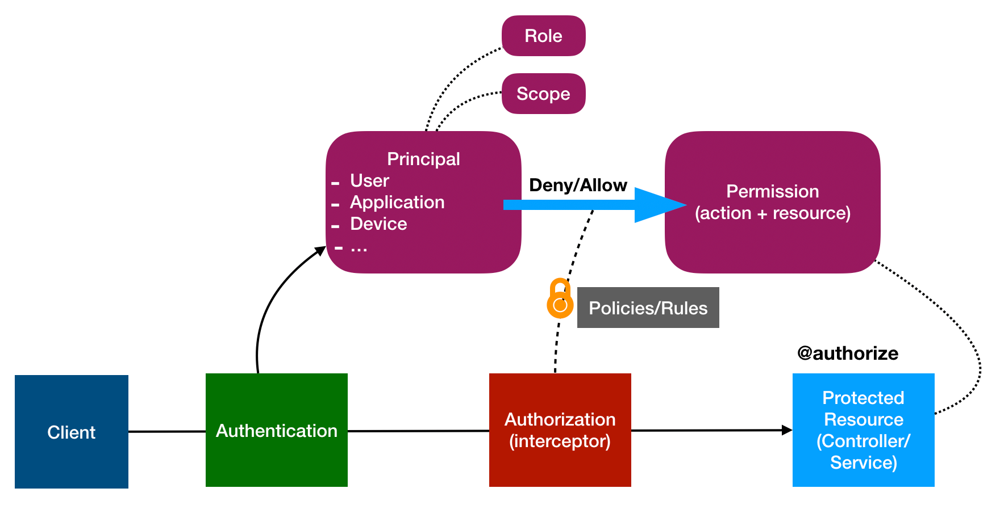

## Overview

> Wikipedia: Authorization is the function of specifying access
> rights/privileges to resources

LoopBack's highly extensible authorization package
[@loopback/authorization](https://github.com/loopbackio/loopback-next/tree/master/packages/authorization)
provides various features and provisions to check access rights of a client on a
API endpoint.

API clients login to get a credential (can be a token, api-key, claim or cert).
When the client calls an API endpoint, they pass the credential in the request
to identify themselves (Authentication) as well as claim their access rights
(Authorization).

LoopBack's authorization component checks if the permissions associated with the
credential provided by the client satisfies the accessibility criteria defined
by the users.

## Design

A `Principal` could be a User, Application or Device. The `Principal` is
identified from the credential provided by a client, by the configured
`Authentication strategy` of the endpoint
([see, LoopBack Authentication](Loopback-component-authentication.md)). Access
rights of the client is either associated with or included in the credential.

The `Principal` is then used by LoopBack's authorization mechanism to enforce
necessary privileges/access rights by using the permissions annotated by the
`@authorize` decorator on the controller methods.

The expectations from various stake holders (LoopBack, Architects, Developers)
for implementation of the authorization features are given below in the
[Chain of Responsibility](#chain-of-responsibility) section.

## Chain of Responsibility

LoopBack as a framework provides certain provisions and expects the developers
to extend with their specific implementations. Architects or Security analysts
generally provide security policies to clarify how the developers should
approach authorization.

`The framework` provides,

- the `@authorize` decorator to provide authorization metadata and voters
- various `types` and `interfaces` to declare user provided `artifacts`
- a mechanism to enforce authorization policies
  - abstractions of `authorizers` as user provided functions and voters
  - create a decision matrix to combine results of all user provided
    `authorizers`
  - an interceptor which enforces policies by creating the decision matrix
- a LoopBack authorization component which packs all the above

`Architects` should,

- separate global authorization concerns as `authorizers`
- identify specific responsibilities of an endpoint as `voters`
- provide security policies for conflicting decisions from `authorizers` and
  `voters`
- provide authentication policies with necessary scopes and roles for every
  endpoint

`Developers` need to,

- mount the authorization component, see
  [Registering the Authorization Component](Authorization-component.md)
- decorate endpoints with authorization metadata, see
  [Configuring API Endpoints](Authorization-component-decorator.md)
- define `authorizer` and `voter` functions, see
  [Programming Access Policies](Authorization-component-interceptor.md)
- design security policies as decision matrix, see
  [Authorization by decision matrix](Authorization-component-decision-matrix.md)
- plug in external enforcer libraries, see
  [Enforcer Libraries](Authorization-component-enforcer.md)

## Tutorials

- [Building RBAC system with @loopback/authorization](./RBAC-with-authorization.md):
  A tutorial for beginners to get started with the concepts and
  responsibilities.

- [Using component `@loopback/authorization`](./Authorization-component.md): The
  instructions of how to apply component `@loopback/authorization`.
