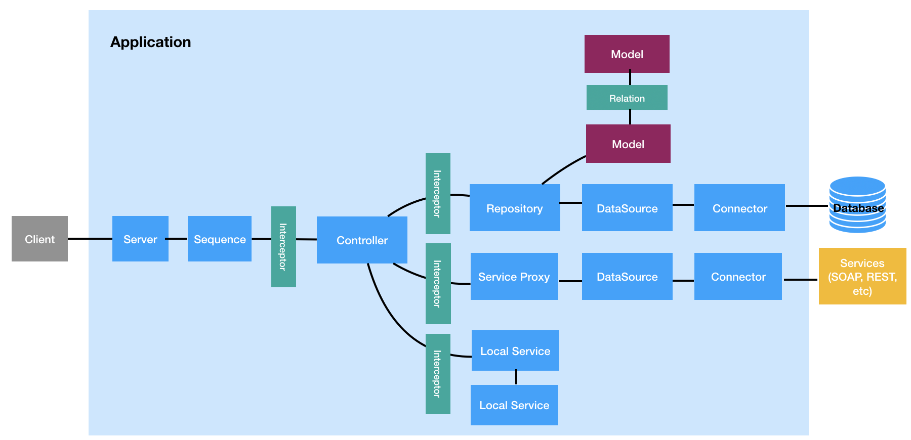

LoopBack 4 defines some key building blocks to represent different
responsibilities for typical API and/or Microservice applications.

- [**Application**](Application.md): The central class for setting up all of
  your module’s components, controllers, servers and bindings. The Application
  class extends [Context](Context.md) and provides the controls for starting and
  stopping its associated servers.

- [**Server**](Server.md): An implementation for inbound transports/protocols
  such as REST (http, https), gRPC (http2) and graphQL (http, https). It
  typically listens on a specific endpoint (protocol/host/port), handles
  incoming requests, and then returns appropriate responses.

- [**Controller**](Controllers.md): A class that implements operations defined
  by the application’s REST API. It implements an application’s business logic
  and acts as a bridge between the HTTP/REST API and domain/database models. A
  Controller operates only on processed input and abstractions of backend
  services / databases.

- [**Interceptors**](Interceptors.md): A function that intercepts static or
  instance method invocations on a class or object.

- [**Route**](Routes.md): The mapping between your API specification and an
  Operation. It tells LoopBack which Operation to `invoke()` when given an HTTP
  request.

- [**Sequence**](Sequence.md): A stateless grouping of
  [Actions](Sequence.md#actions) that control how a Server responds to requests.

- [**Model**](Model.md): The definition of an object in respect to the
  datasource juggler. The `@loopback/repository` module provides special
  decorators for adding metadata to TypeScript/JavaScript classes to use them
  with DataSource Juggler. In addition, `@loopback/repository-json-schema`
  module uses the decorators' metadata to build a matching JSON Schema.

- [**DataSources**](DataSources.md): A named configuration for a Connector
  instance that represents data in an external system.

- [**Repository**](Repositories.md): A type of service that represents a
  collection of data within a DataSource.

- [**Relation**](Relations.md): A mapping between two models which describes a
  real world link between them and exposes CRUD APIs based on the configuration.

- [**Decorator**](Decorators.md): The pattern used to annotate or modify your
  class declarations and their members with metadata.

Here are the infrastructures that get all the artifacts working together:

- [**Context**](Context.md): An abstraction of states and dependencies in your
  application that LoopBack uses to manage everything. It’s a global registry
  for everything in your app (configurations, state, dependencies, classes and
  so on).

- [**Binding**](Binding.md): An abstraction of items managed by a context. Each
  binding has a unique key within the context and a value provider to resolve
  the key to a value.

- [**Dependency Injection**](Dependency-injection.md): The technique used to
  separate the construction of dependencies of a class or function from its
  behavior to keep the code loosely coupled.

- [**Component**](Components.md): A package that bundles one or more LoopBack
  extensions.
