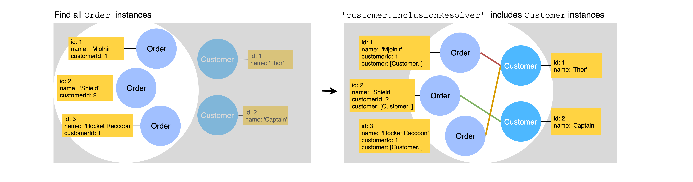

## Overview

{% include note.html content="
This relation best works with databases that support foreign key
constraints (SQL).
Using this relation with NoSQL databases will result in unexpected behavior,
such as the ability to create a relation with a model that does not exist. We are [working on a solution](https://github.com/strongloop/loopback-next/issues/2341) to better handle this. It is fine to use this relation with NoSQL databases for purposes such as navigating
related models, where the referential integrity is not critical.
" %}

A `belongsTo` relation denotes a many-to-one connection of a model to another
model through referential integrity. The referential integrity is enforced by a
foreign key constraint on the source model which usually references a primary
key on the target model. This relation indicates that each instance of the
declaring or source model belongs to exactly one instance of the target model.
For example, in an application with customers and orders, an order always
belongs to exactly one customer as illustrated in the diagram below.


The diagram shows the declaring (source) model **Order** has property
**customerId** as the foreign key to reference the target model **Customer's**
primary key **id**.

To add a `belongsTo` relation to your LoopBack application and expose its
related routes, you need to perform the following steps:

1. Add a property to your source model to define the foreign key.
2. Modify the source model repository class to provide an accessor function for
   obtaining the target model instance.
3. Call the accessor function in your controller methods.

## Defining a belongsTo Relation

This section describes how to define a `belongsTo` relation at the model level
using the `@belongsTo` decorator to define the constraining foreign key.

LB4 also provides an CLI tool `lb4 relation` to generate `belongsTo` relation
for you. Before you check out the
[`Relation Generator`](https://loopback.io/doc/en/lb4/Relation-generator.html)
page, read on to learn how you can define relations to meet your requirements.

### Relation Metadata

LB4 uses three `keyFrom`, `keyTo` and `name` fields in the `belongsTo` relation
metadata to configure relations. The relation metadata has its own default
values for these three fields:

<table>
  <thead>
    <tr>
      <th width="95">Field Name</th>
      <th width="260">Description</th>
      <th width="260">Default Value</th>
      <th>Example</th>
    </tr>
  </thead>
  <tbody>
    <tr>
      <td><code>keyFrom</code></td>
      <td>the foreign key of the source model</td>
      <td>the target model name appended with `Id` in camel case</td>
      <td><code>Order.customerId</code></td>
    </tr>
    <tr>
      <td><code>keyTo</code></td>
      <td>the source key of the target model</td>
      <td>the primary key in the target model</td>
      <td><code>Customer.id</code></td>
    </tr>
    <tr>
      <td><code>name</code></td>
      <td>the name of the relation</td>
      <td>@belongsTo decorated property name without <code>Id</code></td>
      <td><code>customer</code></td>
    </tr>

  </tbody>
</table>

We recommend to use default values. If you'd like to customize the foreign key
name or the relation name, you'll need to specify some fields through the
relation decorator.

The standard naming convention for the foreign key property in the source model
is `relation name` + `Id` (for example, Order.customerId).



```ts
import {belongsTo, Entity, model, property} from '@loopback/repository';
import {Customer} from './customer.model';

@model()
export class Order extends Entity {
  @property({
    type: 'number',
    id: true,
  })
  id: number;

  @belongsTo(() => Customer)
  customerId: number; // relation name will default to `customer`

  @property({type: 'number'})
  quantity: number;

  constructor(data: Partial<Order>) {
    super(data);
  }
}

export interface OrderRelations {
  // describe navigational properties here
}

export type OrderWithRelations = Order & OrderRelations;
```

If the foreign key property name in the source model has to be customized
(`customer_id` instead of `customerId` for example), the relation name has to be
explicitly specified in the `name` attribute of the relation definition.
Otherwise the _default relation name_ generates by LB4 (`customer_id` in this
case) will be the same as the customized foreign key name, which is invalid.



```ts
// import statements
@model()
export class Order extends Entity {
  @property({
    type: 'number',
    id: true,
  })
  id: number;

  @belongsTo(() => Customer, {name: 'customer'}) // specify the relation name if fk is customized
  customer_id: number; // customized fk

  // other properties, constructor, etc.
}
```

In addition, if you have a corresponding `hasMany` or `hasOne` relation in the
target model (for example, a Customer has many Orders), the `keyTo` attribute of
that corresponding relation needs to be stated explicitly:

```ts
// import statements
@model()
export class Order extends Entity {
  // constructor, properties, etc.

  @belongsTo(() => Customer, {name: 'customer'})
  customer_id: number; // customized foreign key name
}
```

```ts
@model()
export class Customer extends Entity {
  // constructor, properties, etc.
  @hasMany(() => Order, {keyTo: 'customer_id'})
  orders: Order[];
}
```

Check the relation metadata in
[hasMany](https://loopback.io/doc/en/lb4/HasMany-relation.html#relation-metadata)
and
[hasOne](https://loopback.io/doc/en/lb4/hasOne-relation.html#relation-metadata)
for more details.

If you need to use _different names for models and database columns_, to use
`customer_id` as db column name other than `customerId` for example, passing the
column name in the third argument to the `belongsTo` decorator would allow you
to do so:

```ts
class Order extends Entity {
  // constructor, properties, etc.
  @belongsTo(() => Customer, {keyFrom: 'customerId'}, {name: 'customer_id'})
  customerId: number;
}
```

If you need to use another attribute other than the id property to be the source
key of the target model (joining two tables on non-primary attribute), the
`keyTo` attribute in the relation definition has to be stated explicitly.

```ts
class Order extends Entity {
  // constructor, properties, etc.
  @belongsTo(() => Customer, { keyTo: 'customized_target_property' }),
  customerId: number;
}

export interface OrderRelations {
  customer?: CustomerWithRelations;
}
```



## Configuring a belongsTo relation

The configuration and resolution of a `belongsTo` relation takes place at the
repository level. Once `belongsTo` relation is defined on the source model, then
there are a couple of steps involved to configure it and use it. On the source
repository, the following are required:

- In the constructor of your source repository class, use
  [Dependency Injection](Dependency-injection.md) to receive a getter function
  for obtaining an instance of the target repository. _Note: We need a getter
  function, accepting a string repository name instead of a repository
  constructor, or a repository instance, in order to break a cyclic dependency
  between a repository with a belongsTo relation and a repository with the
  matching hasMany relation._
- Declare a property with the factory function type
  `BelongsToAccessor<targetModel, typeof sourceModel.prototype.id>` on the
  source repository class.
- call the `createBelongsToAccessorFor` function in the constructor of the
  source repository class with the relation name (decorated relation property on
  the source model) and target repository instance and assign it the property
  mentioned above.

The following code snippet shows how it would look like:



```ts
import {Getter, inject} from '@loopback/context';
import {
  BelongsToAccessor,
  DefaultCrudRepository,
  juggler,
  repository,
} from '@loopback/repository';
import {Customer, Order, OrderRelations} from '../models';
import {CustomerRepository} from '../repositories';

export class OrderRepository extends DefaultCrudRepository<
  Order,
  typeof Order.prototype.id,
  OrderRelations
> {
  public readonly customer: BelongsToAccessor<
    Customer,
    typeof Order.prototype.id
  >;

  constructor(
    @inject('datasources.db') protected db: juggler.DataSource,
    @repository.getter('CustomerRepository')
    customerRepositoryGetter: Getter<CustomerRepository>,
  ) {
    super(Order, db);
    this.customer = this.createBelongsToAccessorFor(
      'customer',
      customerRepositoryGetter,
    );
  }
}
```

`BelongsToAccessor` is a function accepting the primary key (id) of a source
model instance (e.g. `order.id`) and returning back the related target model
instance (e.g. a `Customer` the order belongs to). See also
[API Docs](https://loopback.io/doc/en/lb4/apidocs.repository.belongstoaccessor.html)

## Using BelongsToAccessor in a controller

The same pattern used for ordinary repositories to expose their CRUD APIs via
controller methods is employed for `belongsTo` relation too. Once the belongsTo
relation has been defined and configured, a new controller method can expose the
accessor API as a new endpoint.



```ts
import {repository} from '@loopback/repository';
import {get} from '@loopback/rest';
import {Customer, Order} from '../models/';
import {OrderRepository} from '../repositories/';

export class OrderController {
  constructor(
    @repository(OrderRepository) protected orderRepository: OrderRepository,
  ) {}

  // (skipping regular CRUD methods for Order)

  @get('/orders/{id}/customer')
  async getCustomer(
    @param.path.number('id') orderId: typeof Order.prototype.id,
  ): Promise<Customer> {
    return this.orderRepository.customer(orderId);
  }
}
```

In LoopBack 3, the REST APIs for relations were exposed using static methods
with the name following the pattern `__{methodName}__{relationName}__` (e.g.
`Order.__get__customer`). While we recommend to create a new controller for each
hasMany relation in LoopBack 4, we also think it's best to use the main CRUD
controller as the place where to explose `belongsTo` API.

## Handling recursive relations

Given an e-commerce system has many `Category`, each `Category` may have several
sub-categories, and may belong to 1 parent-category.

```ts
export class Category extends Entity {
  @property({
    type: 'number',
    id: true,
    generated: true,
  })
  id?: number;

  @hasMany(() => Category, {keyTo: 'parentId'})
  categories?: Category[];

  @belongsTo(() => Category)
  parentId?: number;

  constructor(data?: Partial<Category>) {
    super(data);
  }
}

export interface CategoryRelations {
  categories?: CategoryWithRelations[];
  parent?: CategoryWithRelations;
}

export type CategoryWithRelations = Category & CategoryRelations;
```

The `CategoryRepository` must be declared like below

```ts
export class CategoryRepository extends DefaultCrudRepository<
  Category,
  typeof Category.prototype.id,
  CategoryRelations
> {
  public readonly parent: BelongsToAccessor<
    Category,
    typeof Category.prototype.id
  >;
  public readonly categories: HasManyRepositoryFactory<
    Category,
    typeof Category.prototype.id
  >;

  constructor(@inject('datasources.db') dataSource: DbDataSource) {
    super(Category, dataSource);
    this.categories = this.createHasManyRepositoryFactoryFor(
      'categories',
      Getter.fromValue(this),
    );
    this.parent = this.createBelongsToAccessorFor(
      'parent',
      Getter.fromValue(this),
    ); // for recursive relationship
  }
}
```

DO NOT declare
`@repository.getter(CategoryRepository) protected categoryRepositoryGetter: Getter<CategoryRepository>`
on constructor to avoid "Circular dependency" error (see
[issue #2118](https://github.com/strongloop/loopback-next/issues/2118))

## Querying related models

Different from LB3, LB4 creates a different inclusion resolver for each relation
type to query related models. Each **relation** has its own inclusion resolver
`inclusionResolver`. And each **repository** has a built-in property
`inclusionResolvers` as a registry for its inclusionResolvers. Here is a diagram
to show the idea:


A `belongsTo` relation has an `inclusionResolver` function as a property. It
fetches target models for the given list of source model instances.

Use the relation between `Customer` and `Order` we show above, an `Order`
belongs to a `Customer`.

After setting up the relation in the repository class, the inclusion resolver
allows users to retrieve all orders along with their related customers through
the following code at the repository level:

```ts
orderRepo.find({include: [{relation: 'customer'}]});
```

or use APIs with controllers:

```
GET http://localhost:3000/orders?filter[include][][relation]=customer
```

### Enable/disable the inclusion resolvers

- Base repository classes have a public property `inclusionResolvers`, which
  maintains a map containing inclusion resolvers for each relation.
- The `inclusionResolver` of a certain relation is built when the source
  repository class calls the `createBelongsToAccessorFor` function in the
  constructor with the relation name.
- Call `registerInclusionResolver` to add the resolver of that relation to the
  `inclusionResolvers` map. (As we realized in LB3, not all relations are
  allowed to be traversed. Users can decide to which resolvers can be added.)
  The first parameter is the name of the relation.

The following code snippet shows how to register the inclusion resolver for the
belongsTo relation 'customer':

```ts
export class OrderRepository extends DefaultCrudRepository {
  customer: BelongsToAccessor<Customer, typeof Order.prototype.id>;

  constructor(
    dataSource: juggler.DataSource,
    customerRepositoryGetter: Getter<CustomerRepository>,
  ) {
    super(Order, dataSource);

    // we already have this line to create a BelongsToRepository factory
    this.customer = this.createBelongsToAccessorFor(
      'customer',
      customerRepositoryGetter,
    );

    // add this line to register inclusion resolver.
    this.registerInclusionResolver('customer', this.customer.inclusionResolver);
  }
}
```

- We can simply include the relation in queries via `find()`, `findOne()`, and
  `findById()` methods. For example, these queries return all orders with their
  `Customer`:

  if you process data at the repository level:

  ```ts
  orderRepository.find({include: [{relation: 'customer'}]});
  ```

  this is the same as the url:

  ```
  GET http://localhost:3000/orders?filter[include][][relation]=customer
  ```

  which returns:

  ```ts
  [
    {
      id: 1,
      description: 'Mjolnir',
      customerId: 1,
      customer: {
        id: 12,
        name: 'Thor',
      },
    },
    {
      id: 2,
      description: 'Shield',
      customer: {
        id: 10,
        name: 'Captain',
      },
    },
    {
      id: 3,
      description: 'Rocket Raccoon',
      customerId: 1,
      customer: {
        id: 12,
        name: 'Thor',
      },
    },
  ];
  ```



Here is a diagram to make this more intuitive:



- You can delete a relation from `inclusionResolvers` to disable the inclusion
  for a certain relation. e.g
  `orderRepository.inclusionResolvers.delete('customer')`

### Query multiple relations

It is possible to query several relations or nested include relations with
custom scope once you have the inclusion resolver of each relation set up.
Check[HasMany - Query multiple relations](HasMany-relation.md#query-multiple-relations)
for the usage and examples.

{% include important.html content="There are some limitations of inclusion:. <br/>We don’t support recursive inclusion of related models. Related GH issue: [Recursive inclusion of related models](https://github.com/strongloop/loopback-next/issues/3454). <br/>It doesn’t split numbers of queries. Related GH issue: [Support inq splitting](https://github.com/strongloop/loopback-next/issues/3444). <br/>It might not work well with ObjectId of MongoDB. Related GH issue: [Spike: robust handling of ObjectID type for MongoDB](https://github.com/strongloop/loopback-next/issues/3456).
" %}
