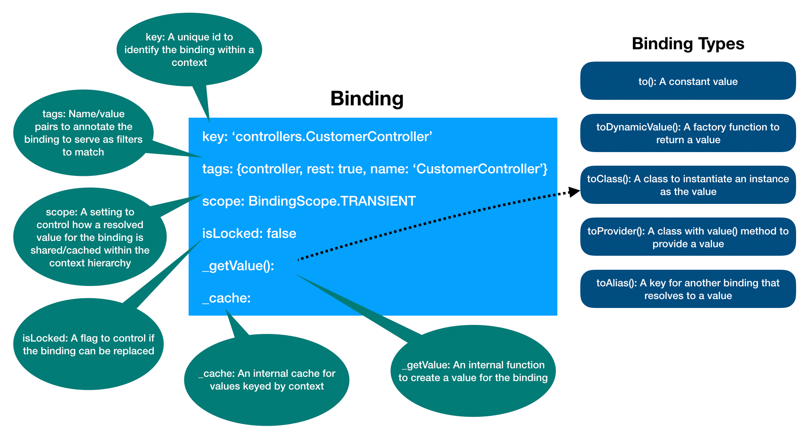

## What is Binding?

`Binding` represents items within a [Context](Context.md) instance. A binding
connects its value to a unique key as the address to access the entry in a
context.

### Attributes of a binding

A binding typically has the following attributes:

- key: Each binding has a `key` to uniquely identify itself within the context
- scope: The scope controls how the binding value is created and cached within
  the context
- tags: Tags are names or name/value pairs to describe or annotate a binding
- value: Each binding must be configured with a type of value provider so that
  it be resolved to a constant or calculated value



## How to create a binding?

There are a few ways to create a binding:

- Use `Binding` constructor:

  ```ts
  const binding = new Binding('my-key');
  ```

- Use `Binding.bind()`

  ```ts
  const binding = Binding.bind('my-key');
  ```

- Use `context.bind()`

  ```ts
  const context = new Context();
  context.bind('my-key');
  ```

## How to set up a binding?

The `Binding` class provides a set of fluent APIs to create and configure a
binding.

### Supply the value or a way to resolve the value

The value can be supplied in one the following forms:

#### A constant

If binding is always resolved to a fixed value, we can bind it to a constant,
which can be a string, a function, an object, an array, or any other types.

```ts
binding.to('my-value');
```

Please note the constant value cannot be a `Promise` to avoid confusions.

#### A factory function

Sometimes the value needs to be dynamically calculated, such as the current time
or a value fetched from a remote service or database.

```ts
binding.toDynamicValue(() => 'my-value');
binding.toDynamicValue(() => new Date());
binding.toDynamicValue(() => Promise.resolve('my-value'));
```

#### A class

The binding can represent an instance of a class, for example, a controller. A
class can be used to instantiate an instance as the resolved value. Dependency
injection is often leveraged for its members.

```ts
class MyController {
  constructor(@inject('my-options') private options: MyOptions) {
    // ...
  }
}

binding.toClass(MyController);
```

#### A provider

A provider is a class with `value()` method to calculate the value from its
instance. The main reason to use a provider class is to leverage dependency
injection for the factory function.

```ts
class MyValueProvider implements Provider<string> {
  constructor(@inject('my-options') private options: MyOptions) {
    // ...
  }

  value() {
    return this.options.defaultValue;
  }
}

binding.toProvider(MyValueProvider);
```

#### An alias

An alias is the key with optional path to resolve the value from another
binding. For example, if we want to get options from RestServer for the API
explorer, we can configure the `apiExplorer.options` to be resolved from
`servers.RestServer.options#apiExplorer`.

```ts
ctx.bind('servers.RestServer.options').to({apiExplorer: {path: '/explorer'}});
ctx
  .bind('apiExplorer.options')
  .toAlias('servers.RestServer.options#apiExplorer');
const apiExplorerOptions = await ctx.get('apiExplorer.options'); // => {path: '/explorer'}
```

### Configure the scope

We allow a binding to be resolved within a context using one of the following
scopes:

- BindingScope.TRANSIENT (default)
- BindingScope.CONTEXT
- BindingScope.SINGLETON

For a complete list of descriptions, please see
[BindingScope](https://loopback.io/doc/en/lb4/apidocs.context.bindingscope.html).

```ts
binding.inScope(BindingScope.SINGLETON);
```

The binding scope can be accessed via `binding.scope`.

### Describe tags

Tags can be used to annotate bindings so that they can be grouped or searched.
For example, we can tag a binding as a `controller` or `repository`. The tags
are often introduced by an extension point to mark its extensions contributed by
other components.

There are two types of tags:

- Simple tag - a tag string, such as `'controller'`
- Value tag - a name/value pair, such as `{name: 'MyController'}`

Internally, we use the tag name as its value for simple tags, for example,
`{controller: 'controller'}`.

```ts
binding.tag('controller');
binding.tag('controller', {name: 'MyController'});
```

The binding tags can be accessed via `binding.tagMap` or `binding.tagNames`.

### Chain multiple steps

The `Binding` fluent APIs allow us to chain multiple steps as follows:

```ts
context
  .bind('my-key')
  .to('my-value')
  .tag('my-tag');
```

### Apply a template function

It's common that we want to configure certain bindings with the same attributes
such as tags and scope. To allow such setting, use `binding.apply()`:

```ts
export const serverTemplate = (binding: Binding) =>
  binding.inScope(BindingScope.SINGLETON).tag('server');
```

```ts
const serverBinding = new Binding<RestServer>('servers.RestServer1');
serverBinding.apply(serverTemplate);
```

### Configure binding attributes for a class

Classes can be discovered and bound to the application context during `boot`. In
addition to conventions, it's often desirable to allow certain binding
attributes, such as scope and tags, to be specified as metadata for the class.
When the class is bound, these attributes are honored to create a binding. You
can use `@bind` decorator to configure how to bind a class.

```ts
import {bind, BindingScope} from '@loopback/context';

// @bind() accepts scope and tags
@bind({
  scope: BindingScope.SINGLETON,
  tags: ['service'],
})
export class MyService {}

// @binding.provider is a shortcut for a provider class
@bind.provider({
  tags: {
    key: 'my-date-provider',
  },
})
export class MyDateProvider implements Provider<Date> {
  value() {
    return new Date();
  }
}

@bind({
  tags: ['controller', {name: 'my-controller'}],
})
export class MyController {}

// @bind() can take one or more binding template functions
@bind(binding => binding.tag('controller', {name: 'your-controller'})
export class YourController {}
```

Then a binding can be created by inspecting the class,

```ts
import {createBindingFromClass} from '@loopback/context';

const ctx = new Context();
const binding = createBindingFromClass(MyService);
ctx.add(binding);
```

Please note `createBindingFromClass` also accepts an optional `options`
parameter of `BindingFromClassOptions` type with the following settings:

- key: Binding key, such as `controllers.MyController`
- type: Artifact type, such as `server`, `controller`, `repository` or `service`
- name: Artifact name, such as `my-rest-server` and `my-controller`, default to
  the name of the bound class
- namespace: Namespace for the binding key, such as `servers` and `controllers`.
  If `key` does not exist, its value is calculated as `<namespace>.<name>`.
- typeNamespaceMapping: Mapping artifact type to binding key namespaces, such
  as:

  ```ts
  {
    controller: 'controllers',
    repository: 'repositories'
  }
  ```

- defaultScope: Default scope if the binding does not have an explicit scope
  set. The `scope` from `@bind` of the bound class takes precedence.

### Encoding value types in binding keys

String keys for bindings do not help enforce the value type. Consider the
example from the previous section:

```ts
app.bind('hello').to('world');
console.log(app.getSync<string>('hello'));
```

The code obtaining the bound value is explicitly specifying the type of this
value. Such solution is far from ideal:

1.  Consumers have to know the exact name of the type that's associated with
    each binding key and also where to import it from.
2.  Consumers must explicitly provide this type to the compiler when calling
    ctx.get in order to benefit from compile-type checks.
3.  It's easy to accidentally provide a wrong type when retrieving the value and
    get a false sense of security.

The third point is important because the bugs can be subtle and difficult to
spot.

Consider the following REST binding key:

```ts
export const HOST = 'rest.host';
```

The binding key does not provide any indication that `undefined` is a valid
value for the HOST binding. Without that knowledge, one could write the
following code and get it accepted by TypeScript compiler, only to learn at
runtime that HOST may be also undefined and the code needs to find the server's
host name using a different way.:

```ts
const resolve = promisify(dns.resolve);

const host = await ctx.get<string>(RestBindings.HOST);
const records = await resolve(host);
// etc.
```

To address this problem, LoopBack provides a templated wrapper class allowing
binding keys to encode the value type too. The `HOST` binding described above
can be defined as follows:

```ts
export const HOST = new BindingKey<string | undefined>('rest.host');
```

Context methods like `.get()` and `.getSync()` understand this wrapper and use
the value type from the binding key to describe the type of the value they are
returning themselves. This allows binding consumers to omit the expected value
type when calling `.get()` and `.getSync()`.

When we rewrite the failing snippet resolving HOST names to use the new API, the
TypeScript compiler immediatelly tells us about the problem:

```ts
const host = await ctx.get(RestBindings.HOST);
const records = await resolve(host);
// Compiler complains:
// - cannot convert string | undefined to string
//  - cannot convert undefined to string
```
