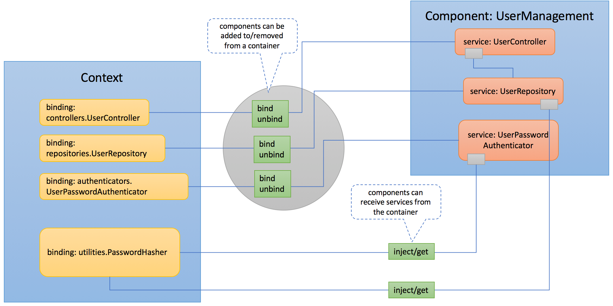

## Overview

Components play an important role in the extensibility of LoopBack 4. A
Component makes it easy for independent developers to contribute additional
features to LoopBack. Components serve as a vehicle to group extension
contributions such as [Context Bindings](Context.md) and various artifacts to
allow easier extensibility of your Application.

A typical LoopBack component is an [npm](https://www.npmjs.com) package
exporting a Component class which can be added to your application.

Apart from its own properties, `Component` class can have the following
properties:

- `controllers` - An array of [controller](Controllers.md) classes.
- `providers` - A map of providers to be bound to the application
  [context](Context.md).
- `classes` - A map of TypeScipt classes to be bound to the application context.
- `servers` - A map of name/class pairs for [servers](Server.md).
- `lifeCycleObservers` - An array of [life cycle observers](Life-cycle.md).
- `bindings` - An array of [bindings](Bindings.md) to be aded to the application
  context. A good example of using bindings to extend the functionality of a
  LoopBack 4 app is
  [contributing an additional body parser](Extending-request-body-parsing.html#contribute-a-body-parser-from-a-component).

These properties contribute to the application to add additional features and
capabilities.

LoopBack 4 was built with extensibility in mind and this includes Components,
which can be allowed to contribute additional artifacts by adding a Mixin to
your Application class. This doesn't change how a Component is registered
(`app.component()`) but it enables the Component to contribute additional
artifacts. For example:

- [Repositories](Repositories.md) can be contributed by a Component by adding
  `RepositoryMixin` from `@loopback/repository` to your Application
- [Booters](Booting-an-Application.md#booters) can be contributed by a Component
  by adding `BootMixin` from `@loopback/boot` to your Application



See [Using components](Using-components.md) and
[Creating components](Creating-components.md) for more information.
