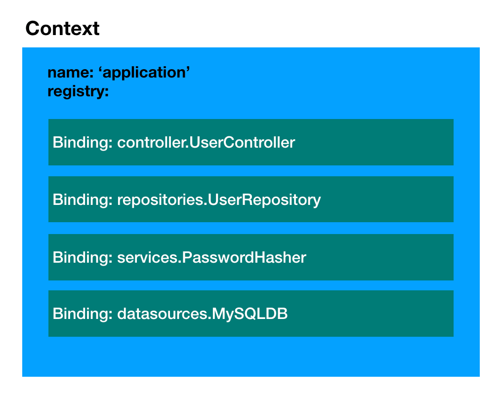
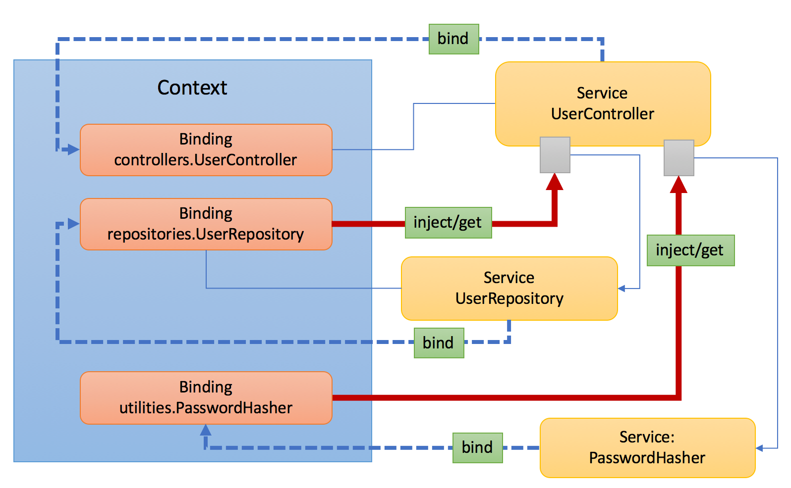
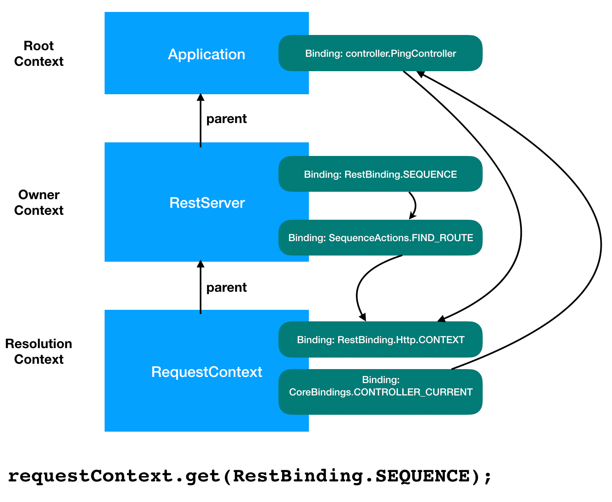

## What is Context?

- An abstraction of all state and dependencies in your application
- LoopBack uses context to manage everything
- A global registry for anything/everything in your app (all configs, state,
  dependencies, classes, etc)
- An [inversion of control](https://en.wikipedia.org/wiki/Inversion_of_control)
  container used to inject dependencies into your code



### Why is it important?

- You can use the context as a way to give loopback more "info" so that other
  dependencies in your app may retrieve it. It works as a centralized place/
  global built-in/in-memory storage mechanism.
- LoopBack can help "manage" your resources automatically (through
  [Dependency Injection](Dependency-injection.md) and decorators).
- You have full access to updated/real-time application and request state at all
  times.



## How to create a context?

A context can be created with an optional parent and an optional name. If the
name is not provided, a UUID will be generated as the value. Context instances
can be chained using the `parent` to form a hierarchy. For example, the code
below creates a chain of three contexts: `reqCtx -> serverCtx -> rootCtx`.

```ts
import {Context} from '@loopback/context';

const rootCtx = new Context('root-ctx'); // No parent
const serverCtx = new Context(rootCtx, 'server-ctx'); // rootCtx as the parent
const reqCtx = new Context(serverCtx); // No explicit name, a UUID will be generated
```

LoopBack's context system allows an unlimited amount of Context instances, each
of which may have a parent Context.

An application typically has three "levels" of context: application-level,
server-level, and request-level.

## Application-level context (global)

- Stores all the initial and modified app states throughout the entire life of
  the app (while the process is alive)
- Generally configured when the application is created (though the context may
  be modified while running)

Here is a simple example:

```ts
import {Application} from '@loopback/core';

// Please note `Application` extends from `Context`
const app = new Application(); // `app` is a "Context"
class MyController {}
app.controller(MyController);
```

In this case, you are using the `.controller` helper method to register a new
controller. The important point to note is `MyController` is actually registered
into the Application Context (`app` is a Context).

## Server-level context

Server-level context:

- Is a child of application-level context
- Holds configuration specific to a particular server instance

Your application will typically contain one or more server instances, each of
which will have the application-level context as its parent. This means that any
bindings that are defined on the application will also be available to the
server(s), unless you replace these bindings on the server instance(s) directly.

For example,
[`@loopback/rest`](https://github.com/strongloop/loopback-next/blob/master/packages/rest)
has the `RestServer` class, which sets up a running HTTP/S server on a port, as
well as defining routes on that server for a REST API. To set the port binding
for the `RestServer`, you would bind the `RestBindings.PORT` key to a number.

We can selectively re-bind this value for certain server instances to change
what port they use:

```ts
// src/application.ts
async start() {
  // publicApi will use port 443, since it inherits this binding from the app.
  app.bind(RestBindings.PORT).to(443);
  const publicApi = await app.getServer<RestServer>('public');
  const privateApi = await app.getServer<RestServer>('private');
  // privateApi will be bound to 8080 instead.
  privateApi.bind(RestBindings.PORT).to(8080);
  await super.start();
}
```

## Request-level context (request)

Using
[`@loopback/rest`](https://github.com/strongloop/loopback-next/blob/master/packages/rest)
as an example, we can create custom sequences that:

- are dynamically created for each incoming server request
- extend the application level context to give you access to application-level
  dependencies during the request/response lifecycle
- are garbage-collected once the response is sent for memory management

Let's see this in action:

```ts
import {DefaultSequence, RestBindings, RequestContext} from '@loopback/rest';

class MySequence extends DefaultSequence {
  async handle(context: RequestContext) {
    // RequestContext provides request/response properties for convenience
    // and performance, but they are still available in the context too
    const req = await this.ctx.get(RestBindings.Http.REQUEST);
    const res = await this.ctx.get(RestBindings.Http.RESPONSE);
    this.send(res, `hello ${req.query.name}`);
  }
}
```

- `this.ctx` is available to your sequence
- allows you to craft your response using resources from the app in addition to
  the resources available to the request in real-time (right when you need it)

The context hierarchy is illustrated in the diagram below:



## Storing and retrieving items from a Context

Items in the Context are indexed via a key and bound to a `BoundValue`. A
`BindingKey` is simply a string value and is used to look up whatever you store
along with the key. For example:

```ts
// app level
const app = new Application();
app.bind('hello').to('world'); // BindingKey='hello', BoundValue='world'
console.log(app.getSync<string>('hello')); // => 'world'
```

In this case, we bind the 'world' string BoundValue to the 'hello' BindingKey.
When we fetch the BoundValue via `getSync`, we give it the BindingKey and it
returns the BoundValue that was initially bound (we can do other fancy things
too -- ie. instantiate your classes, etc)

The process of registering a BoundValue into the Context is known as _binding_.
Please find more details at [Binding](Binding.md).

For a list of the available functions you can use for binding, visit the
[Context API Docs](https://loopback.io/doc/en/lb4/apidocs.context.html).

## Dependency injection

- Many configs are adding to the Context during app instantiation/boot time by
  you/developer.
- When things are registered, the Context provides a way to use your
  dependencies during runtime.

How you access these things is via low level helpers like `app.getSync` or the
`sequence` class that is provided to you as shown in the example in the previous
section.

However, when using classes, LoopBack provides a better way to get at stuff in
the context via the `@inject` decorator:

```ts
import {inject} from '@loopback/context';
import {Application} from '@loopback/core';

const app = new Application();
app.bind('defaultName').to('John');

export class HelloController {
  constructor(@inject('defaultName') private name: string) {}

  greet(name?: string) {
    return `Hello ${name || this.name}`;
  }
}
```

Notice we just use the default name as though it were available to the
constructor. Context allows LoopBack to give you the necessary information at
runtime even if you do not know the value when writing up the Controller. The
above will print `Hello John` at run time.



Please refer to [Dependency injection](Dependency-injection.md) for further
details.

## Context metadata and sugar decorators

Other interesting decorators can be used to help give LoopBack hints to
additional metadata you may want to provide in order to automatically set things
up. For example, let's take the previous example and make it available on the
`GET /greet` route using decorators provided by
[`@loopback/rest`](https://github.com/strongloop/loopback-next/blob/master/packages/rest):

```ts
class HelloController {
  // tell LoopBack you want this controller method
  // to be available at the GET /greet route
  @get('/greet')
  greet(
    // tell LoopBack you want to accept
    // the name parameter as a string from
    // the query string
    @param.query.string('name') name: string,
  ) {
    return `Hello ${name}`;
  }
}
```

These "sugar" decorators allow you to quickly build up your application without
having to code up all the additional logic by simply giving LoopBack hints (in
the form of metadata) to your intent.

## Context events

The `Context` emits the following events:

- `bind`: Emitted when a new binding is added to the context.
  - binding: the newly added binding object
  - context: Owner context of the binding object
- `unbind`: Emitted when an existing binding is removed from the context
  - binding: the newly removed binding object
  - context: Owner context of the binding object
- `error`: Emitted when an observer throws an error during the notification
  process
  - err: the error object thrown

When an existing binding key is replaced with a new one, an `unbind` event is
emitted for the existing binding followed by a `bind` event for the new binding.

If a context has a parent, binding events from the parent are re-emitted on the
context when the binding key does not exist within the current context.

## Context observers

Bindings can be added or removed to a context object. With emitted context
events, we can add listeners to a context object to be invoked when bindings
come and go. There are a few caveats associated with that:

1. The binding object might not be fully configured when a `bind` event is
   emitted.

   For example:

   ```ts
   const ctx = new Context();
   ctx
     .bind('foo')
     .to('foo-value')
     .tag('foo-tag');
   ctx.on('bind', binding => {
     console.log(binding.tagNames); // returns an empty array `[]`
   });
   ```

   The context object emits a `bind` event when `ctx.bind` method is called. It
   does not control the fluent apis `.to('foo-value').tag('foo-tag')`, which
   happens on the newly created binding object. As a result, the `bind` event
   listener receives a binding object which only has the binding key populated.

   A workaround is to create the binding first before add it to a context:

   ```ts
   const ctx = new Context();
   const binding = Binding.create('foo')
     .to('foo-value')
     .tag('foo-tag');
   ctx.add(binding);
   ctx.on('bind', binding => {
     console.log(binding.tagMap); // returns `['foo-tag']`
   });
   ```

2. It's hard for event listeners to perform asynchronous operations.

To make it easy to support asynchronous event processing, we introduce
`ContextObserver` and corresponding APIs on `Context`:

1. `ContextObserverFn` type and `ContextObserver` interface

```ts
/**
 * Listen on `bind`, `unbind`, or other events
 * @param eventType - Context event type
 * @param binding - The binding as event source
 * @param context - Context object for the binding event
 */
export type ContextObserverFn = (
  eventType: ContextEventType,
  binding: Readonly<Binding<unknown>>,
  context: Context,
) => ValueOrPromise<void>;

/**
 * Observers of context bind/unbind events
 */
export interface ContextObserver {
  /**
   * An optional filter function to match bindings. If not present, the listener
   * will be notified of all binding events.
   */
  filter?: BindingFilter;

  /**
   * Listen on `bind`, `unbind`, or other events
   * @param eventType - Context event type
   * @param binding - The binding as event source
   */
  observe: ContextObserverFn;
}

/**
 * Context event observer type - An instance of `ContextObserver` or a function
 */
export type ContextEventObserver = ContextObserver | ContextObserverFn;
```

If `filter` is not required, we can simply use `ContextObserverFn`.

2. Context APIs

- `subscribe(observer: ContextEventObserver)`

  Add a context event observer to the context chain, including its ancestors

- `unsubscribe(observer: ContextEventObserver)`

  Remove the context event observer from the context chain

- `close()`

  Close the context and release references to other objects in the context
  chain. Please note a child context registers event listeners with its parent
  context. As a result, the `close` method must be called to avoid memory leak
  if the child context is to be recycled.

To react on context events asynchronously, we need to implement the
`ContextObserver` interface or provide a `ContextObserverFn` and register it
with the context.

For example:

```ts
const app = new Context('app');
server = new Context(app, 'server');

const observer: ContextObserver = {
  // Only interested in bindings tagged with `foo`
  filter: binding => binding.tagMap.foo != null,

  observe(event: ContextEventType, binding: Readonly<Binding<unknown>>) {
    if (event === 'bind') {
      console.log('bind: %s', binding.key);
      // ... perform async operation
    } else if (event === 'unbind') {
      console.log('unbind: %s', binding.key);
      // ... perform async operation
    }
  },
};

server.subscribe(observer);
server
  .bind('foo-server')
  .to('foo-value')
  .tag('foo');
app
  .bind('foo-app')
  .to('foo-value')
  .tag('foo');

// The following messages will be printed:
// bind: foo-server
// bind: foo-app
```

Please note when an observer subscribes to a context, it will be registered with
all contexts on the chain. In the example above, the observer is added to both
`server` and `app` contexts so that it can be notified when bindings are added
or removed from any of the context on the chain.

- Observers are called in the next turn of
  [Promise micro-task queue](https://jsblog.insiderattack.net/promises-next-ticks-and-immediates-nodejs-event-loop-part-3-9226cbe7a6aa)

- When there are multiple async observers registered, they are notified in
  series for an event.

- When multiple binding events are emitted in the same event loop tick and there
  are async observers registered, such events are queued and observers are
  notified by the order of events.

### Observer error handling

It's recommended that `ContextEventObserver` implementations should not throw
errors in their code. Errors thrown by context event observers are reported as
follows over the context chain.

1. Check if the current context object has `error` listeners, if yes, emit an
   `error` event on the context and we're done. if not, try its parent context
   by repeating step 1.

2. If no context object of the chain has `error` listeners, emit an `error`
   event on the current context. As a result, the process exits abnormally. See
   https://nodejs.org/api/events.html#events_error_events for more details.

## Context view

Bindings in a context can come and go. It's often desirable for an artifact
(especially an extension point) to keep track of other artifacts (extensions).
For example, the `RestServer` needs to know routes contributed by `controller`
classes or other handlers. Such routes can be added or removed after the
`RestServer` starts. When a controller is added after the application starts,
new routes are bound into the application context. Ideally, the `RestServer`
should be able to pick up these new routes without restarting.

To support the dynamic tracking of such artifacts registered within a context
chain, we introduce `ContextObserver` interface and `ContextView` class that can
be used to watch a list of bindings matching certain criteria depicted by a
`BindingFilter` function and an optional `BindingComparator` function to sort
matched bindings.

```ts
import {Context, ContextView} from '@loopback/context';

// Set up a context chain
const appCtx = new Context('app');
const serverCtx = new Context(appCtx, 'server'); // server -> app

// Define a binding filter to select bindings with tag `controller`
const controllerFilter = binding => binding.tagMap.controller != null;

// Watch for bindings with tag `controller`
const view = serverCtx.createView(controllerFilter);

// No controllers yet
await view.values(); // returns []

// Bind Controller1 to server context
serverCtx
  .bind('controllers.Controller1')
  .toClass(Controller1)
  .tag('controller');

// Resolve to an instance of Controller1
await view.values(); // returns [an instance of Controller1];

// Bind Controller2 to app context
appCtx
  .bind('controllers.Controller2')
  .toClass(Controller2)
  .tag('controller');

// Resolve to an instance of Controller1 and an instance of Controller2
await view.values(); // returns [an instance of Controller1, an instance of Controller2];

// Unbind Controller2
appCtx.unbind('controllers.Controller2');

// No more instance of Controller2
await view.values(); // returns [an instance of Controller1];
```

The key benefit of `ContextView` is that it caches resolved values until context
bindings matching the filter function are added/removed. For most cases, we
don't have to pay the penalty to find/resolve per request.

To fully leverage the live list of extensions, an extension point such as
`RoutingTable` should either keep a pointer to an instance of `ContextView`
corresponding to all `routes` (extensions) in the context chain and use the
`values()` function to match again the live `routes` per request or implement
itself as a `ContextObserver` to rebuild the routes upon changes of routes in
the context with `listen()`.

If your dependency needs to follow the context for values from bindings matching
a filter, use [`@inject.view`](Decorators_inject.md#@inject.view) for dependency
injection.

### ContextView events

A `ContextView` object can emit one of the following events:

- 'refresh': when the view is refreshed as bindings are added/removed
- 'resolve': when the cached values are resolved and updated
- 'close': when the view is closed (stopped observing context events)

Such as events can be used to update other states/cached values other than the
values watched by the `ContextView` object itself. For example:

```ts
class MyController {
  private _total: number | undefined = undefined;
  constructor(
    @inject.view(filterByTag('counter'))
    private taggedAsFoo: ContextView<Counter>,
  ) {
    // Invalidate cached `_total` if the view is refreshed
    taggedAsFoo.on('refresh', () => {
      this._total = undefined;
    });
  }

  async total() {
    if (this._total != null) return this._total;
    // Calculate the total of all counters
    const counters = await this.taggedAsFoo.values();
    let result = 0;
    for (const c of counters) {
      result += c.value;
    }
    this._total = result;
    return this._total;
  }
}
```

## Configuration by convention

To allow bound items in the context to be configured, we introduce some
conventions and corresponding APIs to make it simple and consistent.

We treat configurations for bound items in the context as dependencies, which
can be resolved and injected in the same way of other forms of dependencies. For
example, the `RestServer` can be configured with `RestServerConfig`.

Let's first look at an example:

```ts
export class RestServer {
  constructor(
    @inject(CoreBindings.APPLICATION_INSTANCE) app: Application,
    @inject(RestBindings.CONFIG, {optional: true})
    config: RestServerConfig = {},
  ) {
    // ...
  }
  // ...
}
```

The configuration (`RestServerConfig`) itself is a binding
(`RestBindings.CONFIG`) in the context. It's independent of the binding for
`RestServer`. The caveat is that we need to maintain a different binding key for
the configuration. Referencing a hard-coded key for the configuration also makes
it impossible to have more than one instances of the `RestServer` to be
configured with different options, such as `protocol` or `port`.

To solve these problems, we introduce an accompanying binding for an item that
expects configuration. For example:

- `servers.RestServer.server1`: RestServer
- `servers.RestServer.server1:$config`: RestServerConfig

- `servers.RestServer.server2`: RestServer
- `servers.RestServer.server2:$config`: RestServerConfig

The following APIs are available to enforce/leverage this convention:

1. `ctx.configure('servers.RestServer.server1')` => Binding for the
   configuration
2. `Binding.configure('servers.RestServer.server1')` => Creates a accompanying
   binding for the configuration of the target binding
3. `ctx.getConfig('servers.RestServer.server1')` => Get configuration
4. `@config` to inject corresponding configuration
5. `@config.getter` to inject a getter function for corresponding configuration
6. `@config.view` to inject a `ContextView` for corresponding configuration

The `RestServer` can now use `@config` to inject configuration for the current
binding of `RestServer`.

```ts
export class RestServer {
  constructor(
    @inject(CoreBindings.APPLICATION_INSTANCE) app: Application,
    @config()
    config: RestServerConfig = {},
  ) {
    // ...
  }
  // ...
}
```

The `@config.*` decorators can take an optional `propertyPath` parameter to
allow the configuration value to be a deep property of the bound value. For
example, `@config('port')` injects `RestServerConfig.port` to the target.

```ts
export class MyRestServer {
  constructor(
    @config('host')
    host: string,
    @config('port')
    port: number,
  ) {
    // ...
  }
  // ...
}
```

We also allow `@config.*` to be resolved from another binding than the current
one:

```ts
export class MyRestServer {
  constructor(
    // Inject the `rest.host` from the application config
    @config({fromBinding: 'application', propertyPath: 'rest.host'})
    host: string,
    // Inject the `rest.port` from the application config
    @config({fromBinding: 'application', propertyPath: 'rest.port'})
    port: number,
  ) {
    // ...
  }
  // ...
}
```

Now we can use `context.configure()` to provide configuration for target
bindings.

```ts
const appCtx = new Context();
appCtx.bind('servers.RestServer.server1').toClass(RestServer);
appCtx
  .configure('servers.RestServer.server1')
  .to({protocol: 'https', port: 473});

appCtx.bind('servers.RestServer.server2').toClass(RestServer);
appCtx.configure('servers.RestServer.server2').to({protocol: 'http', port: 80});
```

Please note that `@config.*` is different from `@inject.*` as `@config.*`
injects configuration based on the current binding where `@config.*` is applied.
No hard-coded binding key is needed. The `@config.*` also allows the same class
such as `RestServer` to be bound to different keys with different configurations
as illustrated in the code snippet above.

All configuration accessors or injectors (such as `ctx.getConfig`, `@config`) by
default treat the configuration binding as optional, i.e. return `undefined` if
no configuration was bound. This is different from `ctx.get` and `@inject` APIs,
which require the binding to exist and throw an error when the requested binding
is not found. The behavior can be customized via `ResolutionOptions.optional`
flag.

### Allow configuration to be changed dynamically

Some configurations are designed to be changeable dynamically, for example, the
logging level for an application. To allow that, we introduce `@config.getter`
to always fetch the latest value of the configuration.

```ts
export class Logger {
  @config.getter()
  private getLevel: Getter<string>;

  async log(level: string, message: string) {
    const currentLevel = await getLevel();
    if (shouldLog(level, currentLevel)) {
      // ...
    }
  }
}
```
