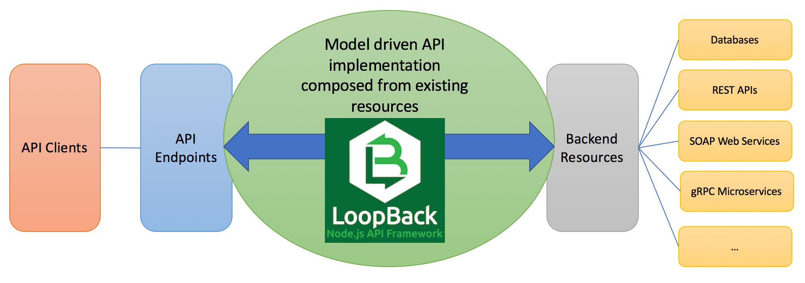
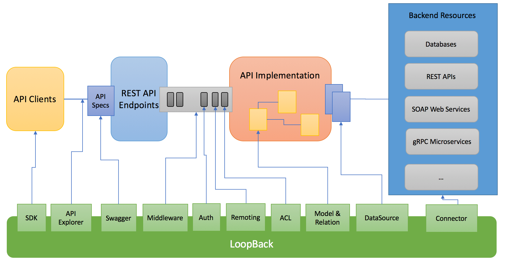
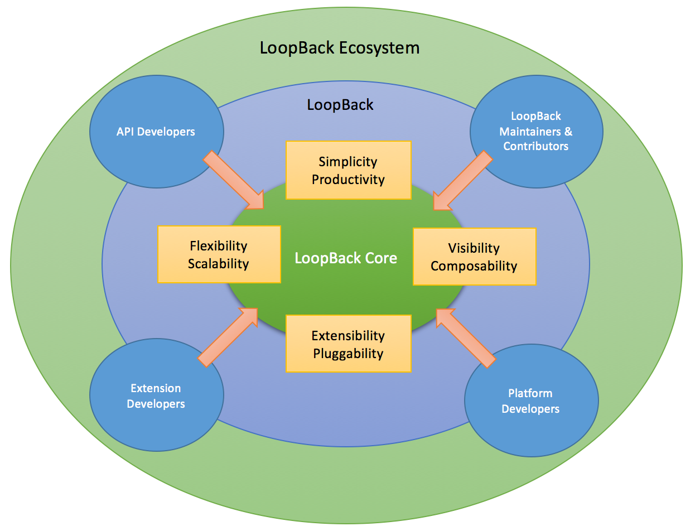
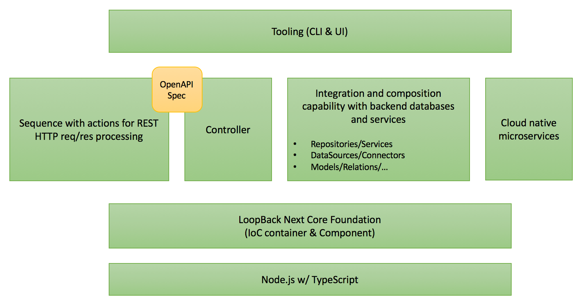

## Background

[LoopBack](http://loopback.io) is an open-source [Node.js](https://nodejs.org)
framework built for API developers. Its primary goal is to help create APIs as
microservices from existing services/databases and expose them as endpoints for
client applications, such as web, mobile, and IoT. LoopBack connects the dots
between accepting API requests and interacting with backend resources. By
facilitating developers to implement API logic with out of box integration
capabilities, LoopBack establishes itself as the API composition layer to
[differentiate](http://loopback.io/resources/#compare) from other frameworks,
such as [Express](https://expressjs.com), [Hapi](https://hapijs.com), and
[Sails](http://sailsjs.com).

Up to version 3.x, LoopBack built on the popular
[Express framework](https://expressjs.com). In retrospect, basing LoopBack on
Express was the right decision: Standing on the shoulders of Express enabled
LoopBack to focus on adding value for API creation experience without
reinventing the wheel. LoopBack also has benefitted from the Express ecosystem,
especially ready-to-use middleware modules from npm as well as valuable
knowledge and support by the community.

With LoopBack, developers can create and expose APIs just like following a
recipe. LoopBack introduces a set of
[core concepts](https://loopback.io/doc/en/lb3/LoopBack-core-concepts) that
represent the key aspects of API implementation. To create APIs out of existing
databases or services, developers can simply scaffold a LoopBack application,
then add necessary JSON declarations and Node.js code to get their APIs up and
running in a few minutes.

LoopBack uses Express routing and middleware as the plumbing to a
request/response pipeline for API use cases, such as authentication,
authorization, and routing. Beyond inbound HTTP processing, LoopBack provides
integration facilities such as models, datasources, and connectors to allow API
logic to interact with various backend systems, including but not limited to,
databases, REST APIs, SOAP web services and gRPC microservices. The ability to
glue inbound communication and outbound integration makes LoopBack a very
powerful framework for API developers. The diagram below illustrates how
LoopBack fits into a typical end-to-end API processing flow.

LoopBack has grown significantly in features and users with many years of
development and multiple releases. LoopBack has been well-recieved by the
developer community. As an indication, the community has developed
[many extensions](https://github.com/pasindud/awesome-loopback). The core team
has also learned a lot from what we have done as well as great feedback from the
community.

## Why LoopBack 4?

Like many projects, LoopBack has started to experience growing pains, especially
as:

1.  The code base becomes more complicated over time with more modules and more
    functionality. We would like to have more maintainers and contributors to
    help out. But the learning curve is getting steep. One of the things to
    blame is JavaScript itself, which is weakly-typed and lack of constructs
    such as interfaces to explicitly define contracts between code. There is
    quite a bit hidden knowledge that is not explicit or obvious for new comers.

2.  Technical debt is accumulating, for example inconsistent designs across
    modules and feature flags for different behaviors. Here are a few examples:

    - Various modules use different registries to manage different types of
      artifacts, such as remoting metadata, models, datasources, and middleware.
    - Different flavors are used to allow custom logic to intercept
      requests/responses at various layers, such as middleware, remote hooks,
      CRUD operation hooks, and connector hooks.
    - More feature flags were added over time to keep backward compatibility
      while enabling users to opt-in to new behaviors.

3.  It is becoming more difficult to add new features or fix bugs as some areas
    start to reach the limit of the current design.

    - The `loopback-datasource-juggler` module is a kitchen sink for many
      things, such as typing, data modeling, validation, aggregation,
      persistence, and service integration.
    - Models are overloaded with multiple responsibilities, such as data
      representation, persistence, and mapping to REST. Models are tied to
      datasources and it's not easy to reuse the same model definition against
      different datasources.

4.  It's not easy to extend the framework without requesting the core team to
    make code changes in LoopBack modules. The current version of LoopBack has
    ad-hoc extensibility at various layers. Extension points are not
    consistently defined. For example,

    - Use Express to register middleware.
    - Use remoting hooks to intercept remote method invocations.
    - Use CRUD hooks to add logic around CRUD operations.

5.  More projects start to use LoopBack as the underlying platform. Such use
    cases require more knowledge of LoopBack internals and more flexibility and
    dynamicity to leverage LoopBack to manage and compose artifacts using a
    metadata driven approach. Some good examples are:
    - Multi-tenancy which requires artifact isolation between tenants.
    - Metadata APIs to manage/activate model definitions and datasources.
    - New interaction patterns for connectors, such as eventing or messaging.
    - Extra metadata for model definitions.

Since the release of 3.x, the team has been brainstorming about how to sustain
and advance LoopBack. We did a lot of homework, triaged existing GitHub issues,
reached out to community members and downstream products, and evaluated relevant
frameworks and technologies to answer to the following questions:

- Who is the target audience of LoopBack? Why are they interested in LoopBack?
  What do they use LoopBack for and how do they use it?
- What are the critical pain points? Can we address them incrementally without
  rebuilding a new foundation?
- What are the most requested features? Is it possible to add such features with
  the current design?
- What are latest and greatest technologies in our space? What value will they
  bring in if we start to adopt them?
- How to scale the development and maintenance of LoopBack? How do we allow
  larger development teams to collaborate on creating APIs using LoopBack?
- How to further grow the community and expand its ecosystem? What can we do to
  bring more users and contributors to LoopBack?

LoopBack has gained traction among a spectrum of users beyond Node.js
application developers, including:

- **API developers** - Use LoopBack to create APIs in Node.js.
- **LoopBack maintainers and contributors** - Build and maintain modules by the
  LoopBack project .
- **Extension developers** - Contribute extensions to LoopBack to augment the
  framework.
- **Platform developers** - Leverage LoopBack as the base to build their
  value-added offerings.

The core team decided to make a bold move and rebuild LoopBack to meet the needs
of all the above groups. The decision led to the inception of LoopBack 4, a new
generation of API creation platform. For more information, read the blog post
[Announcing LoopBack.next, the Next Step to Make LoopBack Effortlessly Extensible](https://strongloop.com/strongblog/announcing-loopback-next).

## Objectives

LoopBack 4's goals are:

1.  Catch up with latest and greatest technology advances.

    - Adopt [ES2016/2017](http://exploringjs.com/es2016-es2017/index.html) and
      [TypeScript](https://www.typescriptlang.org/) for ease of maintenance and
      productivity.
    - Embrace new standards such as [OpenAPI Spec](https://www.openapis.org/)
      and [GraphQL](http://graphql.org/).

2.  Promote extensibility to grow the ecosystem.

    - Build a minimal core and enable everything else to be implemented via
      extensions.
    - Open the door for more
      [extension points and extensions](https://github.com/strongloop/loopback-next/issues/512).

3.  Align with cloud native experience for microservices.

    - Adopt cloud native microservices by adopting initiatives such as
      [Cloud Native Computing Foundation](https://www.cncf.io/).
    - Make LoopBack a first-class citizen of the microservices ecosystem.

4.  Remove the complexity and inconsistency across modules.

    - Use a consistent registry and APIs to manage artifacts and their
      dependencies.
    - Pay down technical debts by refactoring complex modules.

5.  Separate concerns for better composability.
    - Introduce new concepts such as controllers and repositories to represent
      different responsibilities.
    - Break down the runtime as a set of services and utilize the extension
      points/extensions pattern to manage the registration, resolution, and
      composition.

## Design principles

We decided not to take a "big-bang" approach to build LoopBack 4. Instead, we
are doing it incrementally in multiple stages with smaller steps. This approach
allows us to better engage the community from the beginning. We are following
the principles below to pursue architectural simplicity and extensibility:

1.  **Imperative first, declarative later**

    Everything can be done by code via `APIs`. The LoopBack team or community
    contributors can then create varieties of user experiences with such APIs.
    For example, with APIs to define models, we allow applications to declare
    models in JSON or YAML files so that they can be discovered and loaded. An
    extension can parse other forms of model definition, such as JSON schemas,
    ES6 classes with decorators, schemas in OpenAPI spec, or even XML schemas
    into LoopBack model definitions.

    We can also leverage programming constructs such as
    [decorators](https://www.typescriptlang.org/docs/handbook/decorators.html)
    allow developers to supply metadata in code. Furthermore, LoopBack artifacts
    can be declared in JSON or YAML files, which will be handy for users to
    generate and manipulate them by hand or tooling.

2.  **Build minimum features and add more later if necessary**

    Apply YAGNI (You Aint’t Gonna Need It). Design and build for what is needed
    now, not for what you think you may need in the future. There are many
    different perspectives in API creation and people ask for a lot of features.
    Starting with MVP allow us to reach the root of the issues without being
    derailed by noises and build the absolutely necessary features as the core
    building blocks.

3.  **Developer experience first**

    Always keep in mind that LoopBack is built for developers by developers. Our
    first priority is to make API developers' life easier. When we design APIs
    and user interfaces such as a CLI or GUI, we want to make sure they are
    intuitive to and natural to their thought process.

## Implementation stages

Here are the stages we are marching through toward the final version of LoopBack
4 as illustrated below.

1.  **Rebase and rewrite the core**

    - Leverage TypeScript for better code quality and productivity.

      - Provide optional type system for JavaScript.
      - Provide planned features from future JavaScript editions to current
        JavaScript engines.

    - Unify the asynchronous programming model/style.

      - 100% promise-based APIs.
      - Async/Await as first-class async programming style.

    - Implement an IoC Container for better visibility and extensibility

      - Universal registry across different modules
      - Dependency injection as a pattern to manage dependencies

    - Introduce Component as packaging model for extensions
      - Component can be a npm module or a local directory
      - Component encapsulates a list of extensions as a whole

2.  **Validate the core design by implementing an REST/HTTP invocation chain**

    - Add top-down REST API creation which starts with OpenAPI specs.

    - Build sequence of actions for inbound http processing

      - Introduce sequence as the composition of actions
      - Implement the most critical actions to fulfill the REST API routing and
        invocation

    - Introduce controllers as entry points for API-related business logic.

      Models are the centerpieces of the current LoopBack applications. . They
      take multiple responsibilities:

      - Data modeling
      - Anchor for API related business logic
      - Persistence or service invocation
      - Mapping to REST HTTP/JSON endpoints

    - Authentication as a component

      Implement the core functionality of authentication as a component, which
      includes:

      - Decorators to denote authentication requirement
      - `authenticate` action to handle authentication
      - Extension points for various authentication strategies

3.  **Rebuild our integration and composition capabilities**

    - Introduce repositories to represent data access patterns such as CRUD or
      Key/Value stores
    - Provide a reference implementation of CRUD and KV flavors of repository
      interfaces using juggler and connectors
    - Refactor/rewrite the juggler into separate modules
      - Typing system
      - Model and relation definition
      - Validation
      - Query and mutation language
      - DataSource
      - Repository interfaces and implementations for data access
      - Service interfaces and implementations for service invocations
    - Define interfaces and metadata for connectors
    - Rewrite connectors

4.  **Declarative metadata and bootstrapping**

    LoopBack manages a set of artifacts, such as models, relations, datasources,
    connectors, ACLs, controllers, repositories, actions, sequences, components,
    utility functions, and OpenAPI specs. In addition to the programmatic
    approach to describe these artifacts by code (apis and decorators), we would
    like to add declarative support so that they can be declared in JSON/YAML
    files.

    - Define a new domain-specific language (DSL) in JSON/YAML format and
      corresponding templates.
    - Define the project layout to organize project artifacts.
    - Leverage the IoC Context to manage metadata/instances of such artifacts
      following the extension point/extension pattern.
    - Define the lifecycle and serialization/de-serialization requirements for
      each type of artifact.
    - Add a boot component to discover/load/resolve/activate the artifacts. The
      boot process can be tailored for both tooling and runtime.

5.  **Tooling (CLI & UI)**

    - Add CLI and UI tools to:
      - Scaffold LoopBack 4 applications
      - Manage artifacts such as sequences, actions, controllers, repositories,
        services, datasources and models

6.  **Enable cloud native experience**

    - Allow controllers to be exposed as gRPC services
    - Allow interaction with other gRPC services
    - Integration with microservices deployment infrastructure such as Docker
      and Kubernetes
    - Integration with service mesh

The following diagram illustrates the high-level building blocks of LoopBack 4:

Please note there is a common layer below the different functional areas in the
stack. Let's examine the need to build a new core foundation for LoopBack 4.

## A new core foundation

### The core responsibility

LoopBack itself is already modular. For example, a typical LoopBack 3.x
application's dependency graph will have the following npm modules:

- loopback
- strong-remoting
- loopback-datasource-juggler
- loopback-connector-\*
- loopback-component-explorer

LoopBack manages various artifacts across different modules. The following are a
list of built-in types of artifacts that LoopBack 3.x supports out of box:

- Model definitions/relations: describes data models and their relations
- Validation: validates model instances and properties
- Model configurations: configures models and attaches them to data sources
- Datasources: configures connectivity to backend systems
- Connectors: implements interactions with the underlying backend system
- Components: wraps a module that be bootstrapped with LoopBack
- Remoting: maps JavaScript methods to REST API operations
- ACLs: controls access to protected resources
- Built-in models: provides set of prebuilt models such as User, AccessToken,
  and Role
- Hooks/interceptors
  - Express middleware
  - remote hooks
  - CRUD operation hooks
  - connector hooks
- Security integration
  - Identity and token management
  - Authentication schemes
    - Passport component for various authentication strategies
- Storage component for various local/cloud object storage systems
  - Local file system
  - Amazon S3
  - Rackspace
  - Azure
  - Google Cloud
  - OpenStack
  - IBM Cloud Object Storage
- Push component for mobile push notifications
  - iOS
  - Android
- Different API styles
  - REST
  - gRPC
  - GraphQL

Metadata for these artifacts form the knowledge base for LoopBack to glue all
the pieces together and build capabilities to handle common API use cases.

How to represent the metadata and their relations is the key responsibility of
the LoopBack core foundation. It needs to provide a consistent way to contribute
and consume such building blocks.

### Key ingredients for the core

The core foundation for LoopBack 4 is responsible for managing various artifacts
independent of the nature of such artifacts.

- A consistent registry to provide visibility and addressability for all
  artifacts.

  - Visibility: Each artifact has a unique address and can be accessed via a URI
    or key. Artifacts can also be visible at different scopes.

  - Extensibility: LoopBack artifacts can be managed by types. New artifact
    types can be introduced. Instances for a given type can be added, removed,
    or replaced. Organizing artifacts in a hierarchy of extension
    points/extensions decouples providers and consumers.

- Ability to compose with dependency resolution.

  - Composability: It's common that one artifact to have dependencies on other
    artifacts. With dependency injection or service locator patterns, the core
    will greatly simplify how multiple artifacts work together.

- A packaging model for extensions.

  - Pluggability: Extensions can be organized and contributed as a whole. We
    need to have a packaging model so that extension developers can create their
    own modules as bundles and plug into a LoopBack application.

### Why Express behind the scenes?

#### Background

LoopBack had always been built on Express so we can leverage the vast community
and middleware in the Express ecosystem **BUT** it presented some challenges for
LoopBack. With LoopBack 4 we considered moving away from Express (and even built
the framework without Express) but eventually circled back to Express because of
its vast ecosystem.

Some of the gaps between what Express offers and LoopBack's needs are:

- Lack of extensibility
  > Express is only extensibile via middleware. It neither exposes a registry
  > nor provides APIs to manage artifacts such as middleware or routers.
- Lack of composability
  > Express is not composable. For example, `app.use()` is the only way to
  > register a middleware. The order of middleware is determined by the order of
  > `app.use`.
- Lack of declarative support
  > In Express, everything is done by JavaScript ... In contrast, LoopBack is
  > designed to facilitate API creation and composition by conventions and
  > patterns as best practices.

#### Circling back to Express with a twist

The main purpose of LoopBack is to make API creation easy, interacting with
databases, services, etc., not middleware for CORS, static file serving, etc. We
didn't want to reinvent the wheel by writing new middleware for LoopBack 4.

The team explored leveraging
[Express or Koa](https://github.com/strongloop/loopback-next/pull/1082) (but
only for their middleware support). The final decision was to use Express in a
way that bridges the gap by addressing the gaps identified above as follows:

- LoopBack provides its own
  [Controller / OpenAPI metadata optimized routing engine](Routes.md)
- Express is used exclusively for allowing us to consume Express middleware
  (CORS, Static File Serving)
- LoopBack uses a [Sequence of Actions](Sequence.md) to craft the response in a
  composable manner and leverages `@loopback/context` as a registry.

You can learn more details in our blog post on
[improving inbound http processing](https://strongloop.com/strongblog/loopback4-improves-inbound-http-processing).

## Deep dive into LoopBack 4 extensibility

There are several key pillars to make extensibility a reality for LoopBack 4.

- [Context](Context.md), the IoC container to manage services
- [Dependency injection](Dependency-injection.md) to facilitate composition
- [Decorators](Decorators.md) to supply metadata using annotations
- [Component](Using-components.md) as the packaging model to bundle extensions

Please check out [Extending LoopBack 4](Extending-LoopBack-4.md).

## Rebuilding LoopBack experience on top of the new core

With the extensible foundation in place, we start to rebuild the LoopBack REST
API experience by "eating your own dog food" with the following artifacts:

- [Sequence and actions](Sequence.md): A sequence of actions to handle HTTP
  requests/responses.
- [Controllers](Controllers.md): A class with methods to implement API
  operations behind REST endpoints.
- [Model](Model.md): Definition of data models.
- [Repositories](Repositories.md): Interfaces of access patterns for data
  sources.

The features are provided by the following modules:

- [@loopback/rest](https://github.com/strongloop/loopback-next/tree/master/packages/rest/)
- [@loopback/repository](https://github.com/strongloop/loopback-next/tree/master/packages/repository/)

## Example for application developers

Before we go further, let's try to build a 'hello world' application with
LoopBack 4.

### Basic Hello-World

[@loopback/example-hello-world](https://github.com/strongloop/loopback-next/tree/master/examples/hello-world)

### Intermediate example

[@loopback/example-todo](https://github.com/strongloop/loopback-next/tree/master/examples/todo)

## Example for extension developers

### Learn from existing ones

- [@loopback/example-log-extension](https://github.com/strongloop/loopback-next/tree/master/examples/log-extension)
- [@loopback/authentication](https://github.com/strongloop/loopback-next/tree/master/packages/authentication)

## References

- <https://strongloop.com/strongblog/announcing-loopback-next/>
- <https://www.infoq.com/articles/driving-architectural-simplicity>
- <https://strongloop.com/strongblog/creating-a-multi-tenant-connector-microservice-using-loopback/>
- <https://strongloop.com/strongblog/loopback-as-an-event-publisher/>
- <https://strongloop.com/strongblog/loopback-as-a-service-using-openwhisk/>
