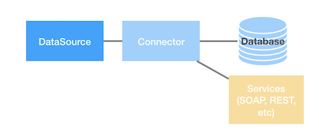

## Overview

A `DataSource` in LoopBack 4 is a named configuration for a Connector instance
that represents data in an external system. The Connector is used by
`legacy-juggler-bridge` to power LoopBack 4 Repositories for Data operations.



### Creating a DataSource

It is recommended to use the [`lb4 datasource` command](DataSource-generator.md)
provided by the CLI to generate a DataSource. The CLI will prompt for all
necessary connector information and create the following files:

- `${dataSource.dataSourceName}.datasource.json` containing the connector
  configuration
- `${dataSource.dataSourceName}.datasource.ts` containing a class extending
  `juggler.DataSource`. This class can be used to override the default
  DataSource behaviour programaticaly. Note: The connector configuration stored
  in the `.json` file is injected into this class using
  [Dependency Injection](Dependency-injection.md).

Both the above files are generated in `src/datasources/` directory by the CLI.
It will also update `src/datasources/index.ts` to export the new DataSource
class.

Example DataSource Class:

```ts
import {inject} from '@loopback/core';
import {juggler} from '@loopback/repository';
import * as config from './db.datasource.json';

export class DbDataSource extends juggler.DataSource {
  static dataSourceName = 'db';

  constructor(
    @inject('datasources.config.db', {optional: true})
    dsConfig: object = config,
  ) {
    super(dsConfig);
  }
}
```
