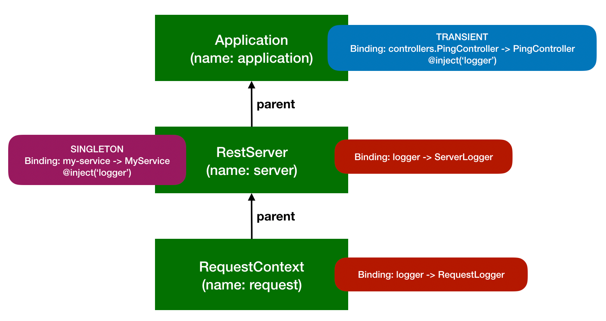

## Introduction

[Dependency Injection](https://en.wikipedia.org/wiki/Dependency_injection) is a
technique where the construction of dependencies of a class or function is
separated from its behavior, in order to keep the code
[loosely coupled](https://en.wikipedia.org/wiki/Loose_coupling).

For example, the Sequence Action `authenticate` in `@loopback/authentication`
supports different authentication strategies (e.g. HTTP Basic Auth, OAuth2,
etc.). Instead of hard-coding some sort of a lookup table to find the right
strategy instance, the `authenticate` action uses dependency injection to let
the caller specify which strategy to use.

The implementation of the `authenticate` action is shown below.

```ts
export class AuthenticateActionProvider implements Provider<AuthenticateFn> {
  constructor(
    // The provider is instantiated for Sequence constructor,
    // at which time we don't have information about the current
    // route yet. This information is needed to determine
    // what auth strategy should be used.
    // To solve this, we are injecting a getter function that will
    // defer resolution of the strategy until authenticate() action
    // is executed.
    @inject.getter(AuthenticationBindings.STRATEGY)
    readonly getStrategy: Getter<AuthenticationStrategy>,
    @inject.setter(AuthenticationBindings.CURRENT_USER)
    readonly setCurrentUser: Setter<UserProfile>,
  ) {}

  /**
   * @returns AuthenticateFn
   */
  value(): AuthenticateFn {
    return request => this.action(request);
  }

  /**
   * The implementation of authenticate() sequence action.
   * @param request - The incoming request provided by the REST layer
   */
  async action(request: Request): Promise<UserProfile | undefined> {
    const strategy = await this.getStrategy();
    if (!strategy) {
      // The invoked operation does not require authentication.
      return undefined;
    }

    const userProfile = await strategy.authenticate(request);
    if (!userProfile) {
      // important to throw a non-protocol-specific error here
      let error = new Error(
        `User profile not returned from strategy's authenticate function`,
      );
      Object.assign(error, {
        code: USER_PROFILE_NOT_FOUND,
      });
      throw error;
    }

    this.setCurrentUser(userProfile);
    return userProfile;
  }
}
```

Dependency Injection makes the code easier to extend and customize, because the
dependencies can be easily rewired by the application developer. It makes the
code easier to test in isolation (in a pure unit test), because the test can
inject a custom version of the dependency (a mock or a stub). This is especially
important when testing code interacting with external services like a database
or an OAuth2 provider. Instead of making expensive network requests, the test
can provide a lightweight implementation returning pre-defined responses.

## Configure what to inject

Now that we write a class that gets the dependencies injected, you are probably
wondering where are these values going to be injected from and how to configure
what should be injected. This part is typically handled by an IoC Container,
where IoC means
[Inversion of Control](https://en.wikipedia.org/wiki/Inversion_of_control).

In LoopBack, we use [Context](Context.md) to keep track of all injectable
dependencies.

There are several different ways for configuring the values to inject, the
simplest options is to call `app.bind(key).to(value)`.

```ts
export namespace JWTAuthenticationStrategyBindings {
  export const TOKEN_SECRET = BindingKey.create<string>(
    'authentication.strategy.jwt.secret',
  );
  export const TOKEN_EXPIRES_IN = BindingKey.create<string>(
    'authentication.strategy.jwt.expires.in.seconds',
  );
}

...

server
  .bind(JWTAuthenticationStrategyBindings.TOKEN_SECRET)
  .to('myjwts3cr3t');

server
  .bind(JWTAuthenticationStrategyBindings.TOKEN_EXPIRES_IN)
  .to('600');
```

However, when you want to create a binding that will instantiate a class and
automatically inject required dependencies, then you need to use `.toClass()`
method:

```ts
server.bind(TokenServiceBindings.TOKEN_SERVICE).toClass(TokenService);

const tokenService = await server.get(TokenServiceBindings.TOKEN_SERVICE);
// tokenService is a TokenService instance
```

When a binding is created via `.toClass()`, [Context](Context.md) will create a
new instance of the class when resolving the value of this binding, injecting
constructor arguments and property values as configured via `@inject` decorator.

Note that the dependencies to be injected could be classes themselves, in which
case [Context](Context.md) will recursively instantiate these classes first,
resolving their dependencies as needed.

In this particular example, the class is a
[Provider](Writing-Components#providers). Providers allow you to customize the
way how a value is created by the Context, possibly depending on other Context
values. A provider is typically bound using `.toProvider()` API:

```js
app
  .bind(AuthenticationBindings.AUTH_ACTION)
  .toProvider(AuthenticateActionProvider);

const authenticate = await app.get(AuthenticationBindings.AUTH_ACTION);
// authenticate is the function returned by provider's value() method
```

You can learn more about Providers in
[Creating Components](Creating-components.md).

## Flavors of Dependency Injection

LoopBack supports three kinds of dependency injection:

1.  constructor injection: the dependencies are provided as arguments of the
    class constructor.
2.  property injection: the dependencies are stored in instance properties after
    the class was constructed.
3.  method injection: the dependencies are provided as arguments of a method
    invocation. Please note that constructor injection is a special form of
    method injection to instantiate a class by calling its constructor.

### Constructor injection

This is the most common flavor that should be your default choice.

```js
class ProductController {
  constructor(@inject('repositories.Product') repo) {
    this.repo = repo;
  }

  async list() {
    return this.repo.find({where: {available: true}});
  }
}
```

### Property injection

Property injection is usually used for optional dependencies which are not
required for the class to function or for dependencies that have a reasonable
default.

```ts
class InfoController {
  @inject('logger', {optional: true})
  private logger = ConsoleLogger();

  status() {
    this.logger.info('Status endpoint accessed.');
    return {pid: process.pid};
  }
}
```

### Method injection

Method injection allows injection of dependencies at method invocation level.
The parameters are decorated with `@inject` or other variants to declare
dependencies as method arguments.

```ts
class InfoController {
  greet(@inject(AuthenticationBindings.CURRENT_USER) user: UserProfile) {
    return `Hello, ${user.name}`;
  }
}
```

## Optional dependencies

Sometimes the dependencies are optional. For example, the logging level for a
Logger provider can have a default value if it is not set (bound to the
context).

To resolve an optional dependency, set `optional` flag to true:

```ts
const ctx = new Context();
await ctx.get('optional-key', {optional: true});
// returns `undefined` instead of throwing an error
```

Here is another example showing optional dependency injection using properties
with default values:

```ts
// Optional property injection
export class LoggerProvider implements Provider<Logger> {
  // Log writer is an optional dependency and it falls back to `logToConsole`
  @inject('log.writer', {optional: true})
  private logWriter: LogWriterFn = logToConsole;

  // Log level is an optional dependency with a default value `WARN`
  @inject('log.level', {optional: true})
  private logLevel: string = 'WARN';
}
```

Optional dependencies can also be used with constructor and method injections.

An example showing optional constructor injection in action:

```ts
export class LoggerProvider implements Provider<Logger> {
  constructor(
    // Log writer is an optional dependency and it falls back to `logToConsole`
    @inject('log.writer', {optional: true})
    private logWriter: LogWriterFn = logToConsole,
    // Log level is an optional dependency with a default value `WARN`
    @inject('log.level', {optional: true}) private logLevel: string = 'WARN',
  ) {}
}
```

An example of optional method injection, where the `prefix` argument is
optional:

```ts
export class MyController {
  greet(@inject('hello.prefix', {optional: true}) prefix: string = 'Hello') {
    return `${prefix}, world!`;
  }
}
```

## Additional `inject.*` decorators

There are a few special decorators from the `inject` namespace.

- [`@inject.getter`](Decorators_inject.md#@inject.getter)
- [`@inject.setter`](Decorators_inject.md#@inject.setter)
- [`@inject.binding`](Decorators_inject.md#@inject.binding)
- [`@inject.context`](Decorators_inject.md#@inject.context)
- [`@inject.tag`](Decorators_inject.md#@inject.tag)
- [`@inject.view`](Decorators_inject.md#@inject.view)

See [Inject decorators](Decorators_inject.md) for more details.

## Circular dependencies

LoopBack can detect circular dependencies and report the path which leads to the
problem.

Consider the following example:

```ts
import {Context, inject} from '@loopback/context';

interface Developer {
  // Each developer belongs to a team
  team: Team;
}

interface Team {
  // Each team works on a project
  project: Project;
}

interface Project {
  // Each project has a lead developer
  lead: Developer;
}

class DeveloperImpl implements Developer {
  constructor(@inject('team') public team: Team) {}
}

class TeamImpl implements Team {
  constructor(@inject('project') public project: Project) {}
}

class ProjectImpl implements Project {
  constructor(@inject('lead') public lead: Developer) {}
}

const context = new Context();

context.bind('lead').toClass(DeveloperImpl);
context.bind('team').toClass(TeamImpl);
context.bind('project').toClass(ProjectImpl);

try {
  // The following call will fail
  context.getSync('lead');
} catch (e) {
  console.error(e.toString());
}
```

When the user attempts to resolve "lead" binding, LoopBack detects a circular
dependency and prints the following error:

```text
Error: Circular dependency detected:
  lead --> @DeveloperImpl.constructor[0] -->
  team --> @TeamImpl.constructor[0] -->
  project --> @ProjectImpl.constructor[0] -->
  lead
```

## Dependency injection for bindings with different scopes

Contexts can form a chain and bindings can be registered at different levels.
The binding scope controls not only how bound values are cached, but also how
its dependencies are resolved.

Let's take a look at the following example:



The corresponding code is:

```ts
import {inject, Context, BindingScope} from '@loopback/context';
import {RestBindings} from '@loopback/rest';

interface Logger() {
  log(message: string);
}

class PingController {
  constructor(@inject('logger') private logger: Logger) {}
}

class MyService {
  constructor(@inject('logger') private logger: Logger) {}
}

class ServerLogger implements Logger {
  log(message: string) {
    console.log('server: %s', message);
  }
}

class RequestLogger implements Logger {
  // Inject the http request
  constructor(@inject(RestBindings.Http.REQUEST) private req: Request) {}
  log(message: string) {
    console.log('%s: %s', this.req.url, message);
  }
}

const appCtx = new Context('application');
appCtx
  .bind('controllers.PingController')
  .toClass(PingController)
  .inScope(BindingScope.TRANSIENT);

const serverCtx = new Context(appCtx, 'server');
serverCtx
  .bind('my-service')
  .toClass(MyService)
  .inScope(BindingScope.SINGLETON);

serverCtx.bind('logger').toClass(ServerLogger);
```

Please note that `my-service` is a `SINGLETON` for the `server` context subtree
and it expects a `logger` to be injected.

Now we create a new context per request:

```ts
const requestCtx = new Context(serverCtx, 'request');
requestCtx.bind('logger').toClass(RequestLogger);

const myService = await requestCtx.get<MyService>('my-service');
// myService.logger should be an instance of `ServerLogger` instead of `RequestLogger`

requestCtx.close();
// myService survives as it's a singleton
```

Dependency injection for bindings in `SINGLETON` scope is resolved using the
owner context instead of the current one. This is needed to ensure that resolved
singleton bindings won't have dependencies from descendant contexts, which can
be closed before the owner context. The singleton cannot have dangling
references to values from the child context.

The story is different for `PingController` as its binding scope is `TRANSIENT`.

```ts
const requestCtx = new Context(serverCtx, 'request');
requestCtx.bind('logger').toClass(RequestLogger);

const pingController = await requestCtx.get<PingController>(
  'controllers.PingController',
);
// pingController.logger should be an instance of `RequestLogger` instead of `ServerLogger`
```

A new instance of `PingController` is created for each invocation of
`await requestCtx.get<PingController>('controllers.PingController')` and its
`logger` is injected to an instance of `RequestLogger` so that it can log
information (such as `url` or `request-id`) for the `request`.

The following table illustrates how bindings and their dependencies are
resolved.

| Code                                             | Binding Scope | Resolution Context | Owner Context | Cache Context | Dependency              |
| ------------------------------------------------ | ------------- | ------------------ | ------------- | ------------- | ----------------------- |
| requestCtx.get<br>('my-service')                 | SINGLETON     | requestCtx         | serverCtx     | serverCtx     | logger -> ServerLogger  |
| serverCtx.get<br>('my-service')                  | SINGLETON     | serverCtx          | serverCtx     | serverCtx     | logger -> ServerLogger  |
| requestCtx.get<br>('controllers.PingController') | TRANSIENT     | requestCtx         | appCtx        | N/A           | logger -> RequestLogger |

## Additional resources

- [Dependency Injection](https://en.wikipedia.org/wiki/Dependency_injection) on
  Wikipedia
- [Dependency Inversion Principle](https://en.wikipedia.org/wiki/Dependency_inversion_principle)
  on Wikipedia
