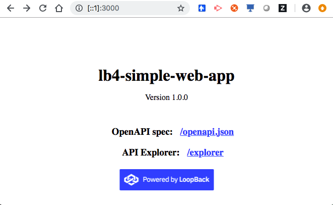
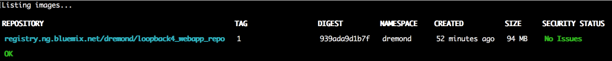
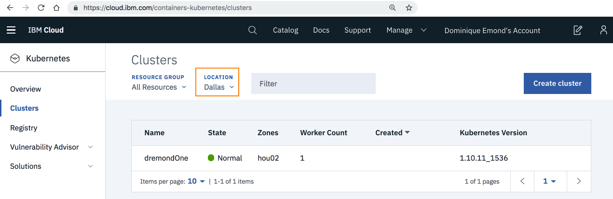
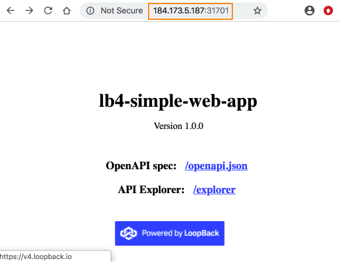
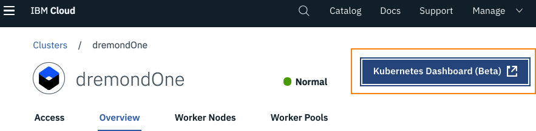
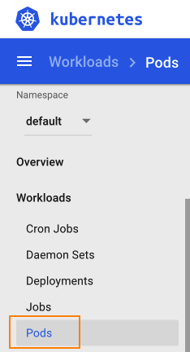
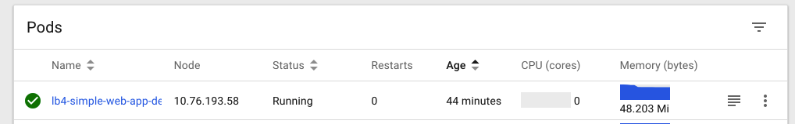
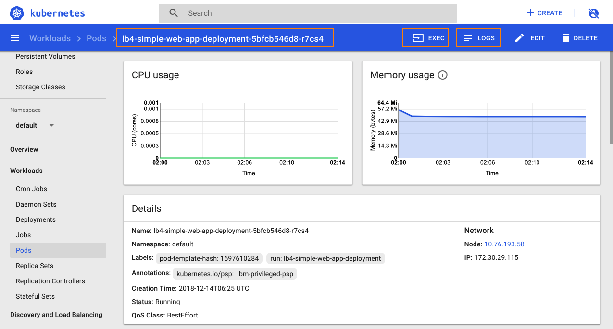

## Overview

This tutorial shows how to deploy a [LoopBack4](http://v4.loopback.io/)
application onto [Kubernetes](http://kubernetes.io/) on the
[IBM Cloud](http://cloud.ibm.com).

## Prerequisite

You’ll need the following:

1. [Node.js 8.9 or higher](https://nodejs.org)
2. [Docker 18.06 or higher](https://docs.docker.com/install/)
3. [Sign up for an IBM Cloud account](https://cloud.ibm.com/) if you don't have
   one already.
4. [IBM Cloud CLI, Container registry CLI, etc](https://cloud.ibm.com/docs/cli/index.html#overview)
5. [Kubernetes CLI (kubectl)](https://kubernetes.io/docs/reference/kubectl/overview/)
6. [LoopBack 4 CLI](https://v4.loopback.io/getting-started.html)

Let's install the LoopBack 4 CLI :

```
npm i -g @loopback/cli
```

After you have scaffolded a LoopBack4 application, you’ll get a default endpoint
/ping. For simplicity sake, we’ll use this.

## Step 1: Scaffold LoopBack 4 app

Run `lb4 app` command.

```
$ lb4 app
? Project name: deploy-test
? Project description: loopback example
? Project root directory: deploy-test
? Application class name: DeployTestApplication
? Select features to enable in the project Enable tslint, Enable prettier, Enable mocha, Enable loopback
Build, Enable vscode, Enable repositories, Enable services
...
Application deploy-test was created in deploy-test.
Next steps:
$ cd deploy-test
$ npm start
```

Navigate to the main directory of your project

```
cd deploy-test
```

Let's **not** run `npm start` yet, we have some changes to make to certain
files.

## Step 2: Modify deploy-test/index.js



```
  const config = {
    rest: {
      port: 8080,
      host: '0.0.0.0',
      openApiSpec: {
        // useful when used with OASGraph to locate your application
        setServersFromRequest: true,
      },
    },
  };
```

## Step 3: Add .dockerignore file

At project root, create a file called `.dockerignore` with the following
content:

```
node_modules
npm-debug.log
```

## Step 4: Build the application

In a command window, navigate the main directory of your project and type :

```
npm run build
```

Make sure there are no errors before continuing to the next step.

## Step 5: Run the application locally

In a command window in the main directory of your project, type:

```
npm start
```

The server should start up successfully and display

```
Server is running at http://127.0.0.1:8080
Try http://127.0.0.1:8080/ping
```

Open your browser and attempt to access all these urls

<http://127.0.0.1:8080/>

<http://127.0.0.1:8080/ping>

<http://127.0.0.1:8080/explorer>

<http://127.0.0.1:8080/openapi.json>



Make sure that the application runs well before continuing to the next step.

In the command window, stop the application with

```
Ctrl + C
```

## Step 6: Create a Dockerfile

Let's get the application running in Docker.

In the main project directory, create a file named `Dockerfile` .

Place this inside:

```
FROM node:10.14-alpine

EXPOSE 8080

COPY package.json package.json
RUN npm install

COPY . .


RUN npm run build

CMD ["npm", "start" ]
```



## Step 7: Build a Docker image

This will build a docker image and give it a tag name.

```
docker build -t lb4-simple-web-app .
```

When it completes, you will see :

```
Successfully built 7d26df6c1561
Successfully tagged lb4-simple-web-app:latest
```

You can find your image by typing:

```
docker images | grep lb4-simple-web-app
```

It will display something like this :

```
lb4-simple-web-app   latest 7d26df6c1561
```

## Step 8: Run the application in Docker

To run the application in a Docker container, type:

```
docker run -d -i -t  -p 8080:8080 lb4-simple-web-app
```

This starts the container in detached mode (-d), connects your machine's 8080
port to the 8080 port of the container (-p), and permits you to open a bash
shell into the container later on if you'd like (-i -t).

Afterwards, type:

```
docker ps
```

You should see something like this:

```

CONTAINER ID   IMAGE                COMMAND          CREATED             STATUS         PORTS
a9962339e863   lb4-simple-web-app   "npm start"      8 seconds ago       Up 7 seconds   0.0.0.0:8080->8080/tcp

```

To see the log output of your container, you can type:

```
docker logs <container id>    For example : a9962339e863
```

You should see something like:

```
> deploy-test@1.0.0 start /
> node .

Server is running at http://127.0.0.1:8080
Try http://127.0.0.1:8080/ping
```

Open your browser and attempt to access all these urls

<http://127.0.0.1:8080/>

<http://127.0.0.1:8080/ping>

<http://127.0.0.1:8080/explorer>

<http://127.0.0.1:8080/openapi.json>

## Step 9: Stop the application running in Docker

Find the container id

```
docker ps | grep lb4
```

You should see something like this:

```
a9962339e863        lb4-simple-web-app      "npm start"
```

The leftmost value is the container id.

Type:

```
docker stop <container id>         For example : a9962339e863
```

## Step 10: Log into IBM Cloud using ibmcloud login command

Use `ibmcloud login` command to login.



After you’ve been successfully logged in, you’ll see something like:

```
API endpoint:      https://api.ng.bluemix.net
Region:            us-south
User:              dremond@ca.ibm.com
Account:           Dominique Emond's Account
Resource group:    default
CF API endpoint:
Org:
Space:
```

## Step 11: Log into IBM Cloud Container Registry

```
ibmcloud cr login
```

You should see:

```
Logging in to 'registry.ng.bluemix.net'...
Logged in to 'registry.ng.bluemix.net'.
OK
```

## Step 12: Upload a docker image to the Container Registry

This requires several steps, let's quickly go through them.

### Create a namespace

List your current namespace by typing:

```
ibmcloud cr namespace-list
```

If you want to create a new namespace for yourself, you can do so with this
command:

```
ibmcloud cr namespace-add <my_namespace>
```



### Tag your local docker image with the IBM Cloud container registry

Here is the command:

```
docker tag <source_image>:<tag> registry.<region>.bluemix.net/<my_namespace>/<new_image_repo>:<new_tag>
```

`<source_image>:<tag>` is what you have on your machine that you created
earlier.

For example : `lb4-simple-web-app:latest`

`registry.<region>.bluemix.net` is the container registry region you logged into
before.

For example : `registry.ng.bluemix.net`

`<my_namespace>` is the namespace you created for yourself

For example : `dremond`

`<new_image_repo>:<new_tag>` can be whatever you want it to be; they don't have
to exist yet

For example : `loopback4_webapp_repo:1`

So, putting these values together, my command will look like this:

```
docker tag lb4-simple-web-app:latest registry.ng.bluemix.net/dremond/loopback4_webapp_repo:1
```

### Push the local image to the container registry

```
docker push registry.ng.bluemix.net/dremond/loopback4_webapp_repo:1
```

You will see a progress bar like this:

```
The push refers to repository [registry.ng.bluemix.net/dremond/loopback4_webapp_repo]
478b1e842aa3: Pushed
6fd2223ea65e: Pushed
a90c4aba186a: Pushing [============>                                      ]   51.4MB/207.9MB
bb288a38c607: Pushed
53981d6ec3d2: Mounted from dremond/loopback4_repo
b727cac390f6: Mounted fro
```

Wait until it is completed.

```
The push refers to repository [registry.ng.bluemix.net/dremond/loopback4_webapp_repo]
478b1e842aa3: Pushed
6fd2223ea65e: Pushed
a90c4aba186a: Pushed
bb288a38c607: Pushed
53981d6ec3d2: Mounted from dremond/loopback4_repo
b727cac390f6: Mounted from dremond/loopback4_repo
df64d3292fd6: Mounted from dremond/loopback4_repo
1: digest: sha256:939ada9d1b7f6a7483aed69dff5ccc28d1931ed249b38d51d34b854b32139177 size: 1787
```

### Verify the image is in the container registry

Type the command :

```
ibmcloud cr image-list
```

You should see your image listed.



{% include tip.html content="One important column is the last one on the right <b>'Security Status'</b>. Initially it will have a value of <b>'Scanning...'</b> . Wait until the scanning is complete. My image has a <b>'No Issues'</b> status. This is good. If it instead stated <b>'9 Issues'</b> (in red), then I would need to take some extra steps later on in my account to view the issues, figure out a way to resolve them, or create an Exemption for them. <a href='https://console.bluemix.net/docs/services/va/va_index.html#va_index'>Managing image security with Vulnerability Advisor</a>" %}

### Perform a build for the container registry

Perform a build for the container registry.

```
ibmcloud cr build -t registry.ng.bluemix.net/dremond/loopback4_webapp_repo:1 .
```



This step may fail if you have exceeded the QUOTA for images in your account. In
that case clear up some room and try again.

Wait until it completes.

In your IBM Cloud account, you can view your images
[here](https://cloud.ibm.com/containers-kubernetes/registry/main/images).

## Step 13: Point to your Kubernetes Cluster

In a browser, log into your IBM Cloud account, and navigate to **Kubernetes >
Clusters**.



I am choosing my cluster `dremondOne` in Dallas .

( If you do not have a Kubernetes cluster, you can create one for free by going
to <https://cloud.ibm.com/containers-kubernetes/overview> , clicking on the
`'Create a cluster'` button, specifying a Resource Group of `'default'`, a
Location of `'Dallas'`, choosing a Cluster Type of `'Free'`, and giving it a
name. )

Select the **'Access'** tab of your cluster and follow the instructions.


We already logged into the IBM Cloud in an earlier step, so we only need to
point to the cluster.

```
ibmcloud cs region-set us-south
```

```
ibmcloud cs cluster-config <Cluster Name>
```

My cluster name is **'dremondOne'** so I see this output:

```
OK
The configuration for dremondOne was downloaded successfully. Export environment variables to start using Kubernetes.

export KUBECONFIG=/Users/dremond/.bluemix/plugins/container-service/clusters/dremondOne/kube-config-hou02-dremondOne.yml
```

Take the entire **'export'** line above, and paste it into your command window.

Now you should be able to perform Kubernetes commands like:

```
kubectl get nodes
```

You will see output like this:

```
NAME           STATUS    ROLES     AGE       VERSION
10.76.193.58   Ready     <none>    13d       v1.10.8+IKS
```

Ok, so now we are ready to deploy our Loopback4 application to Kubernetes!

## Step 14: Deploy your Loopback4 application to Kubernetes

### Create a deployment

Create a deployment named : lb4-simple-web-app-deployment ; using the image we
placed in the container registry.

```
kubectl run lb4-simple-web-app-deployment --image=registry.ng.bluemix.net/dremond/loopback4_webapp_repo:1
```

### Verify that the pods are running

```
kubectl get pods
```

You should see

```
NAME                                             READY     STATUS             RESTARTS   AGE
lb4-simple-web-app-deployment-5bfcb546d8-r7cs4   1/1       Running            0          7m
```

A status of **'Running'** is a good sign. If you have anything other than this,
then there may be something wrong with your docker image , or it may have
vulnerability issues you need to address.

To see the logs of your pod, type:

```
kubectl logs lb4-simple-web-app-deployment-5bfcb546d8-r7cs4
```

and you will see something like this:

```

> deploy-test@1.0.0 start /
> node .

Server is running at http://127.0.0.1:8080
Try http://127.0.0.1:8080/ping
```

### Create a service

Expose your deployment with a service named : lb4-simple-web-app-service

```
kubectl expose deployment/lb4-simple-web-app-deployment --type=NodePort --port=8080 --name=lb4-simple-web-app-service --target-port=8080

```



### Obtain the NodePort of your service

Let's determine the NodePort of your service.

```
kubectl describe service lb4-simple-web-app-service
```

You will see output like this:

```
Name:                     lb4-simple-web-app-service
Namespace:                default
Labels:                   run=lb4-simple-web-app-deployment
Annotations:              <none>
Selector:                 run=lb4-simple-web-app-deployment
Type:                     NodePort
IP:                       172.21.138.39
Port:                     <unset>  8080/TCP
TargetPort:               8080/TCP
NodePort:                 <unset>  31701/TCP
Endpoints:                172.30.29.115:8080
Session Affinity:         None
External Traffic Policy:  Cluster
Events:                   <none>

```

In this case, the NodePort is 31701 .

### Obtain the public IP address of the cluster

Let's determine the public IP address of the cluster

```
ibmcloud ks workers dremondOne
```

You should see something like this

```
OK
ID                        Public IP       Private IP     Machine Type   State    Status
kube-hou02-pa45e...6-w1   184.173.5.187   10.76.193.58   free           normal   Ready

```

In my case, the public IP is: 184.173.5.187

So now we can formulate the url of our loopback4 application using those two
pieces :

```
http://184.173.5.187:31701
```

Open your browser and attempt to access all these urls

```
http://184.173.5.187:31701/

http://184.173.5.187:31701/ping

http://184.173.5.187:31701/explorer

http://184.173.5.187:31701/openapi.json
```



## Step 15: View your app in the Kubernetes Dashboard

Let's go take a look at your application in the Kubernetes dashboard.

Click the **'Kubernetes Dashboard'** button next to your cluster's name.



Under **'Workloads'**, select **'Pods'**



Locate your application, and click on its name



If you want to open a shell into the container in the pod, click on the `EXEC`
button.

If you want to view the logs of the container in the pod, click on the `LOGS`
button.



So there you have it! You have successfully deployed a Loopback4 application to
Kubernetes on the IBM Cloud.

# References

- [Getting started with the IBM Cloud CLI](https://cloud.ibm.com/docs/cli/index.html#overview)
  (This document helps you install all the CLIs you will need)

- [Kubernetes CLI (kubectl)](https://kubernetes.io/docs/reference/kubectl/overview/)

- [Installing Docker](https://docs.docker.com/install/)

- [Tutorial: Deploying apps into Kubernetes clusters](https://console.bluemix.net/docs/containers/cs_tutorials_apps.html#cs_apps_tutorial)

- [Getting started with IBM Cloud Container Registry](https://console.bluemix.net/docs/services/Registry/index.html#index)

- [Managing image security with Vulnerability Advisor](https://console.bluemix.net/docs/services/va/va_index.html#va_index)
