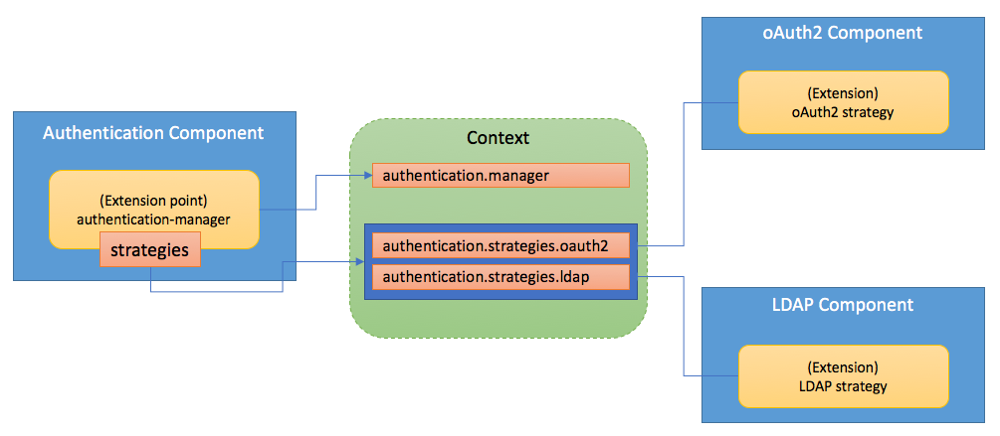
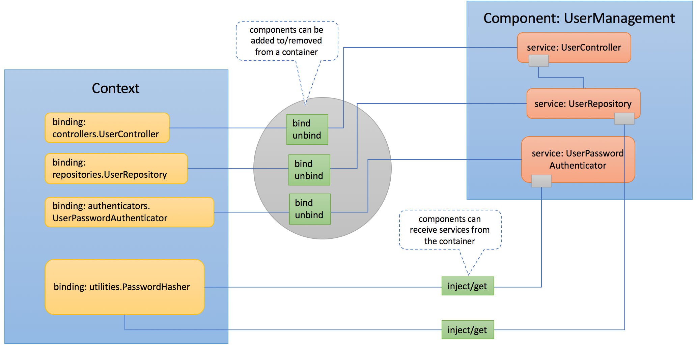

## Overview

LoopBack 4 is designed to be highly extensible. For architectural rationale and
motivation, see [Crafting LoopBack 4](Crafting-LoopBack-4.md).

## Building blocks for extensibility

The
[@loopback/context](https://github.com/strongloop/loopback-next/tree/master/packages/context)
module implements an
[Inversion of Control](https://en.wikipedia.org/wiki/Inversion_of_control) (IoC)
container called [Context](Context.md) as a service registry that supports
[Dependency injection](Dependency-injection.md).

The IoC container decouples service providers and consumers. A service provider
can be bound to the context with a key, which can be treated as an address of
the service provider.

The diagram below shows how the Context manages services and their dependencies.


In the example above, there are three services in the Context and each of them
are bound to a unique key.

- _controllers.UserController_: A controller to implement user management APIs
- _repositories.UserRepository_: A repository to provide persistence for user
  records
- _utilities.PasswordHasher_: A utility function to hash passwords

Please also note that `UserController` depends on an instance of
`UserRepository` and `PasswordHasher`. Such dependencies are also managed by the
Context to provide composition capability for service instances.

Service consumers can then either locate the provider using the binding key or
declare a dependency using `@inject('binding-key-of-a-service-provider')` so
that the service provider can be injected into the consumer class. The code
snippet below shows the usage of `@inject` for dependency injection.

```ts
import {inject, Context} from '@loopback/context';

/**
 * A UserController implementation that depends on UserRepository and PasswordHasher
 */
class UserController {
  // UserRepository and PasswordHasher are injected via the constructor
  constructor(
    @inject('repositories.UserRepository') private userRepository: UserRepository,
    @inject('utilities.PasswordHasher') private passwordHasher: PasswordHasher),
  ) {}

  /**
   * Login a user with name and password
   */
  async login(userName: string, password: String): boolean {
    const hash = this.passwordHasher.hash(password);
    const user = await this.userRepository.findById(userName);
    return user && user.passwordHash === hash;
  }
}

const ctx = new Context();
// Bind repositories.UserRepository to UserRepository class
ctx.bind('repositories.UserRepository').toClass(MySQLUserRepository);
// Bind utilities.PasswordHash to a function
ctx.bind('utilities.PasswordHash').to(PasswordHasher)
// Bind the UserController class as the user management implementation
ctx.bind('controllers.UserController').toClass(UserController);

// Locate the an instance of UserController from the context
const userController: UserController = await ctx.get<UserController>('controller.UserController');
// Run the login()
const ok = await userController.login('John', 'MyPassWord');
```

Now you might wonder why the IoC container is fundamental to extensibility.
Here's how it's achieved.

1.  An alternative implementation of the service provider can be bound the
    context to replace the existing one. For example, we can implement different
    hashing functions for password encryption. The user management system can
    then receive custom password hashing functions.

2.  Services can be organized as extension points and extensions. For example,
    to allow multiple authentication strategies, the `authentication` component
    can define an extension point as `authentication-manager` and various
    authentication strategies such as user/password, LDAP, oAuth2 can be
    contributed to the extension point as extensions. The relation will look
    like:



To allow a list of extensions to be contributed to LoopBack framework and
applications, we introduce `Component` as the packaging model to bundle
extensions. A component is either a npm module or a local folder structure that
contains one or more extensions. It's then exported as a class implementing the
`Component` interface. For example:

```ts
...
import {Component, ProviderMap} from '@loopback/core';

export class UserManagementComponent implements Component {
  providers?: ProviderMap;

  constructor() {
    this.controllers = [UserController];
    this.repositories = [UserRepository];
    };
  }
}
```

The interaction between the application context and `UserManagement` component
is illustrated below:



For more information about components, see:

- [Creating components](Creating-components.md)
- [Using Components](Using-components.md)

## Types of extensions

- Binding providers
- Decorators
- Sequence Actions
- Connectors
- Utility functions
- Controllers
- Repositories
- Models
- Mixins

For a list of candidate extensions, see
[loopback-next issue #512](https://github.com/strongloop/loopback-next/issues/512).

### System vs Application extensions

Some extensions are meant to extend the programming model and integration
capability of the LoopBack 4 framework. Good examples of such extensions are:

- Binding providers
- Decorators
- Sequence & Actions
- Connectors
- Utility functions
- Mixins (for application)

An application may consist of multiple components for the business logic. For
example, an online shopping application typically has the following component:

- UserManagement
- ShoppingCart
- AddressBook
- OrderManagement

An application-level component usually contributes:

- Controllers
- Repositories
- Models
- Mixins (for models)

## How to build my own extensions

### Learn from existing ones

- [loopback4-example-log-extension](https://github.com/strongloop/loopback-next/tree/master/examples/log-extension)
- [@loopback/authentication](https://github.com/strongloop/loopback-next/tree/master/packages/authentication)

### Create your own extension

You can scaffold a LoopBack 4 extension project using `@loopback/cli`'s
`lb4 extension` command.
