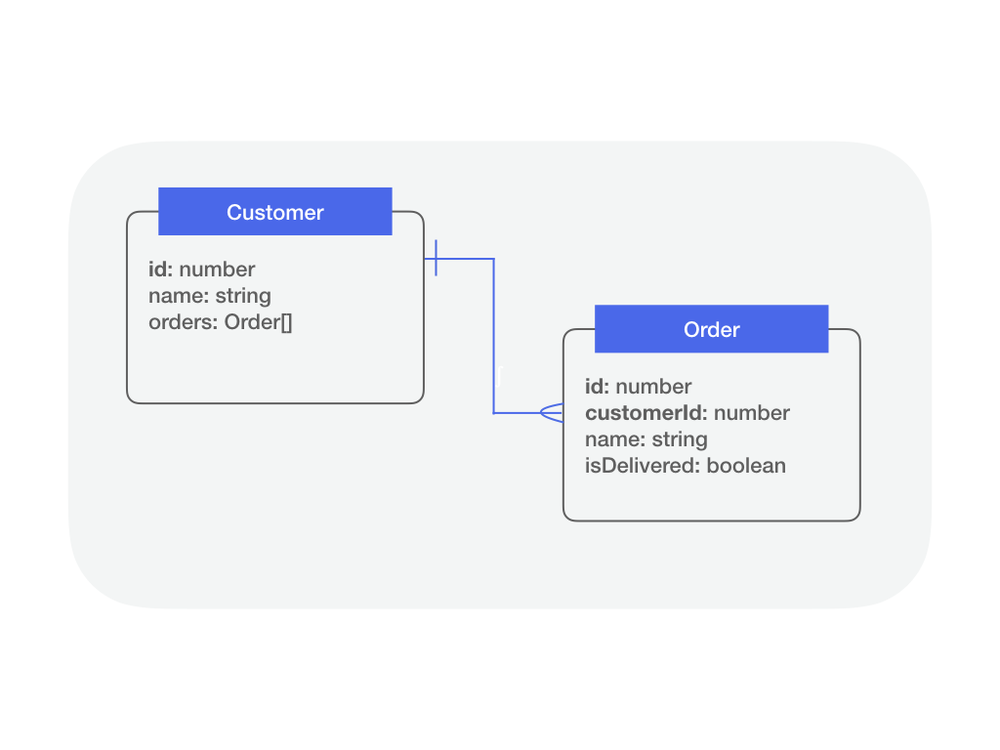

## Overview

{% include note.html content="
This relation best works with databases that support foreign key
constraints (SQL).
Using this relation with NoSQL databases will result in unexpected behavior,
such as the ability to create a relation with a model that does not exist. We are [working on a solution](https://github.com/strongloop/loopback-next/issues/2341) to better handle this. It is fine to use this relation with NoSQL databases for purposes such as navigating related models, where the referential integrity is not critical.
" %}

A `hasMany` relation denotes a one-to-many connection of a model to another
model through referential integrity. The referential integrity is enforced by a
foreign key constraint on the target model which usually references a primary
key on the source model. This relation indicates that each instance of the
declaring or source model has zero or more instances of the target model. For
example, in an application with customers and orders, a customer can have many
orders as illustrated in the diagram below.



The diagram shows target model **Order** has property **customerId** as the
foreign key to reference the declaring model **Customer's** primary key **id**.

To add a `hasMany` relation to your LoopBack application and expose its related
routes, you need to perform the following steps:

1.  Add a property to your model to access related model instances.
2.  Add a foreign key property in the target model referring to the source
    model's id.
3.  Modify the source model repository class to provide access to a constrained
    target model repository.
4.  Call the constrained target model repository CRUD APIs in your controller
    methods.

## Defining a hasMany Relation

This section describes how to define a `hasMany` relation at the model level
using the `@hasMany` decorator. The relation constrains the target repository by
the foreign key property on its associated model. The following example shows
how to define a `hasMany` relation on a source model `Customer` and a target
model `Order`.



```ts
import {Order} from './order.model';
import {Entity, property, hasMany} from '@loopback/repository';

export class Customer extends Entity {
  @property({
    type: 'number',
    id: true,
  })
  id: number;

  @property({
    type: 'string',
    required: true,
  })
  name: string;

  @hasMany(() => Order)
  orders?: Order[];

  constructor(data: Partial<Customer>) {
    super(data);
  }
}
```

The definition of the `hasMany` relation is inferred by using the `@hasMany`
decorator. The decorator takes in a function resolving the target model class
constructor and optionally a custom foreign key to store the relation metadata.
The decorator logic also designates the relation type and tries to infer the
foreign key on the target model (`keyTo` in the relation metadata) to a default
value (source model name appended with `id` in camel case, same as LoopBack 3).
It also calls `property.array()` to ensure that the type of the property is
inferred properly as an array of the target model instances.

The decorated property name is used as the relation name and stored as part of
the source model definition's relation metadata. The property type metadata is
also preserved as an array of type `Order` as part of the decoration. (Check
[Relation Metadata](HasMany-relation.md#relation-metadata) section below for
more details)

A usage of the decorator with a custom foreign key name for the above example is
as follows:

```ts
// import statements
class Customer extends Entity {
  // constructor, properties, etc.
  @hasMany(() => Order, {keyTo: 'customerId'})
  orders?: Order[];
}
```

Add the source model's id as the foreign key property (`customerId`) in the
target model.



```ts
import {Entity, model, property} from '@loopback/repository';

@model()
export class Order extends Entity {
  @property({
    type: 'number',
    id: true,
    required: true,
  })
  id: number;

  @property({
    type: 'string',
    required: true,
  })
  name: string;

  @property({
    type: 'number',
  })
  customerId?: number;

  constructor(data?: Partial<Order>) {
    super(data);
  }
}

export interface OrderRelations {
  // describe navigational properties here
}

export type OrderWithRelations = Order & OrderRelations;
```

The foreign key property (`customerId`) in the target model can be added via a
corresponding [belongsTo](BelongsTo-relation.md) relation, too.



```ts
import {Entity, model, property, belongsTo} from '@loopback/repository';
import {Customer, CustomerWithRelations} from './customer.model';

@model()
export class Order extends Entity {
  @property({
    type: 'number',
    id: true,
    required: true,
  })
  id: number;

  @property({
    type: 'string',
    required: true,
  })
  name: string;

  @belongsTo(() => Customer)
  customerId: number;

  constructor(data?: Partial<Order>) {
    super(data);
  }
}

export interface OrderRelations {
  customer?: CustomerWithRelations;
}

export type OrderWithRelations = Order & OrderRelations;
```

### Relation Metadata

LB4 uses three `keyFrom`, `keyTo` and `name` fields in the `hasMany` relation
metadata to configure relations. The relation metadata has its own default
values for these three fields:

<table>
  <thead>
    <tr>
      <th width="95">Field Name</th>
      <th width="260">Description</th>
      <th width="260">Default Value</th>
      <th>Example</th>
    </tr>
  </thead>
  <tbody>
    <tr>
      <td><code>keyFrom</code></td>
      <td>the primary key of the source model</td>
      <td>the id property of the source model</td>
      <td><code>Customer.id</code></td>
    </tr>
    <tr>
      <td><code>keyTo</code></td>
      <td>the foreign key of the target model</td>
      <td>the source model name appended with `id` in camel case</td>
      <td><code>Order.customerId</code></td>
    </tr>
    <tr>
      <td><code>name</code></td>
      <td>the name of the relation</td>
      <td>decorated property name</td>
      <td><code>Customer.orders</code></td>
    </tr>

  </tbody>
</table>

We recommend to use default values. If you'd like to customize foreign key name,
you'll need to specify some fields through the relation decorator.

For customizing the foreign key name, `keyTo` field needs to be specified via
`@hasMany` decorator. The following example shows how to customize the foreign
key name as `my_customer_id` instead of `customerId`:

```ts
// import statements
@model()
export class Customer extends Entity {
  // constructor, properties, etc.
  @hasMany(() => Order, {keyTo: 'my_customer_id'})
  orders: Order[];
}
```

```ts
// import statements
@model()
export class Order extends Entity {
  // constructor, properties, etc.
  @property({
    type: 'number',
  })
  my_customer_id: number; // customized foreign key name
}
```

Notice that if you decorate the corresponding foreign key of the target model
with `@belongsTo`, you also need to specify the `belongsTo` relation name in the
`name` field of its relation metadata. See [BelongsTo](BelongsTo-relation.md)
for more details.

```ts
// import statements
@model()
export class Order extends Entity {
  // constructor, properties, etc.

  // specify the belongsTo relation name if a customized name is used here
  @belongsTo(() => Customer, {name: 'customer'}) // the name of this belongsTo relation
  my_customer_id: number; // customized foreign key name
}
```

If you need to use _different names for models and database columns_, to use
`my_orders` as db column name other than `orders` for example, the following
setting would allow you to do so:

```ts
// import statements
@model()
export class Customer extends Entity {
  // constructor, properties, etc.
  @hasMany(() => Order, {keyFrom: 'orders'}, {name: 'my_orders'})
  orders: Order[];
}
```

_Notice: the `name` field in the third parameter is not part of the relation
metadata. It's part of property definition._

## Configuring a hasMany relation

The configuration and resolution of a `hasMany` relation takes place at the
repository level. Once `hasMany` relation is defined on the source model, then
there are a couple of steps involved to configure it and use it. On the source
repository, the following are required:

- In the constructor of your source repository class, use
  [Dependency Injection](Dependency-injection.md) to receive a getter function
  for obtaining an instance of the target repository. _Note: We need a getter
  function, accepting a string repository name instead of a repository
  constructor, or a repository instance, in order to break a cyclic dependency
  between a repository with a hasMany relation and a repository with the
  matching belongsTo relation._

- Declare a property with the factory function type
  `HasManyRepositoryFactory<targetModel, typeof sourceModel.prototype.id>` on
  the source repository class.
- call the `createHasManyRepositoryFactoryFor` function in the constructor of
  the source repository class with the relation name (decorated relation
  property on the source model) and target repository instance and assign it the
  property mentioned above.

The following code snippet shows how it would look like:



```ts
import {Order, Customer, CustomerRelations} from '../models';
import {OrderRepository} from './order.repository';
import {
  DefaultCrudRepository,
  juggler,
  HasManyRepositoryFactory,
  repository,
} from '@loopback/repository';
import {inject, Getter} from '@loopback/core';

export class CustomerRepository extends DefaultCrudRepository<
  Customer,
  typeof Customer.prototype.id,
  CustomerRelations
> {
  public readonly orders: HasManyRepositoryFactory<
    Order,
    typeof Customer.prototype.id
  >;
  constructor(
    @inject('datasources.db') protected db: juggler.DataSource,
    @repository.getter('OrderRepository')
    getOrderRepository: Getter<OrderRepository>,
  ) {
    super(Customer, db);
    this.orders = this.createHasManyRepositoryFactoryFor(
      'orders',
      getOrderRepository,
    );
  }
}
```

The following CRUD APIs are now available in the constrained target repository
factory `orders` for instances of `customerRepository`:

- `create` for creating a target model instance belonging to customer model
  instance
  ([API Docs](https://loopback.io/doc/en/lb4/apidocs.repository.hasmanyrepository.create.html))
- `find` finding target model instance(s) belonging to customer model instance
  ([API Docs](https://loopback.io/doc/en/lb4/apidocs.repository.hasmanyrepository.find.html))
- `delete` for deleting target model instance(s) belonging to customer model
  instance
  ([API Docs](https://loopback.io/doc/en/lb4/apidocs.repository.hasmanyrepository.delete.html))
- `patch` for patching target model instance(s) belonging to customer model
  instance
  ([API Docs](https://loopback.io/doc/en/lb4/apidocs.repository.hasmanyrepository.patch.html))

For **updating** (full replace of all properties on a `PUT` endpoint for
instance) a target model you have to directly use this model repository. In this
case, the caller must provide both the foreignKey value and the primary key
(id). Since the caller already has access to the primary key of the target
model, there is no need to go through the relation repository and the operation
can be performed directly on `DefaultCrudRepository` for the target model
(`OrderRepository` in our example).

## Using hasMany constrained repository in a controller

The same pattern used for ordinary repositories to expose their CRUD APIs via
controller methods is employed for `hasMany` repositories. Once the hasMany
relation has been defined and configured, controller methods can call the
underlying constrained repository CRUD APIs and expose them as routes once
decorated with
[Route decorators](Routes.md#using-route-decorators-with-controller-methods). It
will require the value of the foreign key and, depending on the request method,
a value for the target model instance as demonstrated below.



```ts
import {post, param, requestBody} from '@loopback/rest';
import {CustomerRepository} from '../repositories/';
import {Customer, Order} from '../models/';
import {repository} from '@loopback/repository';

export class CustomerOrdersController {
  constructor(
    @repository(CustomerRepository)
    protected customerRepository: CustomerRepository,
  ) {}

  @post('/customers/{id}/order')
  async createOrder(
    @param.path.number('id') customerId: typeof Customer.prototype.id,
    @requestBody() orderData: Order,
  ): Promise<Order> {
    return this.customerRepository.orders(customerId).create(orderData);
  }
}
```

In LoopBack 3, the REST APIs for relations were exposed using static methods
with the name following the pattern `__{methodName}__{relationName}__` (e.g.
`Customer.__find__orders`). We recommend to create a new controller for each
relation in LoopBack 4. First, it keeps controller classes smaller. Second, it
creates a logical separation of ordinary repositories and relational
repositories and thus the controllers which use them. Therefore, as shown above,
don't add order-related methods to `CustomerController`, but instead create a
new `CustomerOrdersController` class for them.



## Querying related models

Different from LB3, LB4 creates a different inclusion resolver for each relation
type to query related models. Each **relation** has its own inclusion resolver
`inclusionResolver`. And each **repository** has a built-in property
`inclusionResolvers` as a registry for its inclusionResolvers. Here is a diagram
to show the idea:


A `hasMany` relation has an `inclusionResolver` function as a property. It
fetches target models for the given list of source model instances.

Use the relation between `Customer` and `Order` we show above, a `Customer` has
many `Order`s.

After setting up the relation in the repository class, the inclusion resolver
allows users to retrieve all customers along with their related orders through
the following code at the repository level:

```ts
customerRepo.find({include: [{relation: 'orders'}]});
```

or use APIs with controllers:

```
GET http://localhost:3000/customers?filter[include][][relation]=orders
```

### Enable/disable the inclusion resolvers:

- Base repository classes have a public property `inclusionResolvers`, which
  maintains a map containing inclusion resolvers for each relation.
- The `inclusionResolver` of a certain relation is built when the source
  repository class calls the `createHasManyRepositoryFactoryFor` function in the
  constructor with the relation name.
- Call `registerInclusionResolver` to add the resolver of that relation to the
  `inclusionResolvers` map. (As we realized in LB3, not all relations are
  allowed to be traversed. Users can decide to which resolvers can be added.)

The following code snippet shows how to register the inclusion resolver for the
has-many relation 'orders':

```ts
export class CustomerRepository extends DefaultCrudRepository {
  products: HasManyRepositoryFactory<Order, typeof Customer.prototype.id>;

  constructor(
    dataSource: juggler.DataSource,
    orderRepositoryGetter: Getter<OrderRepository>,
  ) {
    super(Customer, dataSource);

    // we already have this line to create a HasManyRepository factory
    this.orders = this.createHasManyRepositoryFactoryFor(
      'orders',
      orderRepositoryGetter,
    );

    // add this line to register inclusion resolver
    this.registerInclusionResolver('orders', this.orders.inclusionResolver);
  }
}
```

- We can simply include the relation in queries via `find()`, `findOne()`, and
  `findById()` methods. For example, these queries return all customers with
  their `Order`s:

  if you process data at the repository level:

  ```ts
  customerRepository.find({include: [{relation: 'orders'}]});
  ```

  this is the same as the url:

  ```
  GET http://localhost:3000/customers?filter[include][][relation]=orders
  ```

  which returns:

  ```ts
  [
    {
      id: 1,
      name: 'Thor',
      orders: [
        {name: 'Mjolnir', customerId: 1},
        {name: 'Rocket Raccoon', customerId: 1},
      ],
    },
    {
      id: 2,
      name: 'Captain',
      orders: [{name: 'Shield', customerId: 2}],
    },
  ];
  ```

  Here is a diagram to make this more intuitive:

  

- You can delete a relation from `inclusionResolvers` to disable the inclusion
  for a certain relation. e.g
  `customerRepository.inclusionResolvers.delete('orders')`


