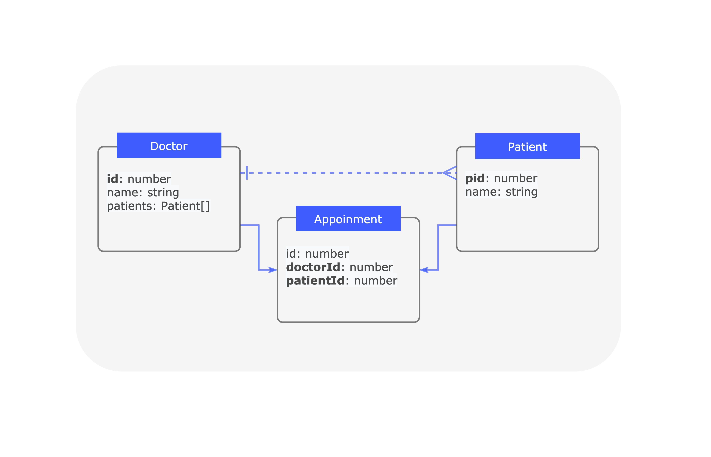

## Overview

{% include note.html content="
This relation best works with databases that support foreign key
constraints (SQL).
Using this relation with NoSQL databases will result in unexpected behavior,
such as the ability to create a relation with a model that does not exist. We are [working on a solution](https://github.com/strongloop/loopback-next/issues/2341) to better handle this. It is fine to use this relation with NoSQL databases for purposes such as navigating related models, where the referential integrity is not critical.
" %}

A `hasManyThrough` relation denotes a many-to-many connection with another
model. The referential integrity is enforced by foreign key constraints on the
through model which usually references primary keys on the source model and the
target model. This relation indicates that the declaring model can be matched
with zero or more instances of another model by proceeding through a third
model. For example, in an application for a medical practice where patients make
appointments to see doctors, the relevant relation declarations are illustrated
in the diagram below.



The diagram shows through model **Appointment** has a property **doctorId** as
the foreign key to reference the source model **Doctor**'s primary key **id**
and a property **patientId** as the foreign key to reference the target model
**Patient**'s primary key **pid**.

To add a `hasManyThrough` relation to your LoopBack application and expose its
related routes, you need to perform the following steps:

1.  Add a property to define the relation to your model to access related model
    instances.
2.  Add a foreign key property in the through model referring to the **source**
    model's id.
3.  Add a foreign key property in the through model referring to the **target**
    model's id.
4.  Modify the source model repository class to provide access to a constrained
    target model repository.
5.  Call the constrained target model repository CRUD APIs in your controller
    methods.

## Defining a hasManyThrough Relation

This section describes how to define a `hasManyThrough` relation at the model
level using the `@hasMany` decorator (in LoopBack, `hasManyThrough` is
considered being part of `hasMany`). Instead of constraining the target
repository by the foreign key property on the target model, it uses a through
model that has two foreign keys that reference the source model and target
model, respectively. The following example shows how to define a
`hasManyThrough` relation on a source model `Doctor` and a target model
`Patient` through model `Appointment`.



```ts
import {Patient} from './patient.model';
import {Appointment} from './appointment.model';
import {Entity, property, hasMany} from '@loopback/repository';

export class Doctor extends Entity {
  @property({
    type: 'number',
    id: true,
  })
  id: number;

  @property({
    type: 'string',
    required: true,
  })
  name: string;

  @hasMany(() => Patient, {through: {model: () => Appointment}})
  patients: Patient[];

  constructor(data: Partial<Doctor>) {
    super(data);
  }
}
```



```ts
import {Entity, property, hasMany} from '@loopback/repository';

export class Appointment extends Entity {
  // id property and others

  @property({
    type: 'number',
  })
  doctorId?: number;

  @property({
    type: 'number',
  })
  patientId?: number;

  constructor(data: Partial<Appointment>) {
    super(data);
  }
}
```



```ts
import {Entity, property, hasMany} from '@loopback/repository';

export class Patient extends Entity {
  @property({
    type: 'number',
    id: true,
  })
  pid: number;
  // other properties
```

The definition of the `hasManyThrough` relation is inferred by using the
`@hasMany` decorator. The decorator takes in a function resolving the relation
metadata. Except for the target model, you will need to specify the through
model and optionally foreign keys that infer source and target models.

LB4 also provides an CLI tool `lb4 relation` to generate `hasManyThrough`
relation for you. Before you check out the
[`Relation Generator`](https://loopback.io/doc/en/lb4/Relation-generator.html)
page, read on to learn how you can define relations to meet your requirements.

### Relation metadata

There are several fields we care when defining a `hasManyThrough`. The decorated
property name is used as the relation name and stored as part of the source
model definition's relation metadata.

<table>
  <thead>
    <tr>
      <th width="95">Field Name</th>
      <th width="260">Description</th>
      <th width="260">Default Value</th>
      <th>Example</th>
    </tr>
  </thead>
  <tbody>
    <tr>
      <td><code>name</code></td>
      <td>the name of the relation</td>
      <td>decorated property name</td>
      <td><code>Doctor.patients</code></td>
    </tr>
    <tr>
      <td><code>keyFrom</code></td>
      <td>the primary key of the source model</td>
      <td>the id property of the source model</td>
      <td><code>Doctor.id</code></td>
    </tr>
    <tr>
      <td><code>keyTo</code></td>
      <td>the primary key of the target model</td>
      <td>the id property of the target model</td>
      <td><code>Patient.pid</code></td>
    </tr>
    <tr>
      <td><code>through.model</code></td>
      <td>the name of the through model</td>
      <td>N/A. The through model name is needed for defining a hasManyThrough relation.</td>
      <td><code>Appointment</code></td>
    </tr>
    <tr>
      <td><code>through.keyFrom</code></td>
      <td>the foreign key that references the source model on the through model</td>
      <td>the source model name appended with <code>Id</code> in camel case</td>
      <td><code>Appointment.doctorId</code></td>
    </tr>
    <tr>
      <td><code>through.keyTo</code></td>
      <td>the foreign key of the target model</td>
      <td>the target model name appended with <code>Id</code> in camel case</td>
      <td><code>Appointment.patientId</code></td>
    </tr>
  </tbody>
</table>

The two foreign keys on through model can only reference the primary keys of
source and target models. Customization of `keyFrom` and `keyTo` is not
supported yet. However, custom foreign keys on through model is possible. A
usage of the decorator with custom foreign keys name for the above example is as
follows:



```ts
// import statements
class Doctor extends Entity {
  // constructor, properties, etc.
  @hasMany(() => Patient, {
    through: {
      model: () => Appointment,
      keyFrom: 'myDoctor',
      keyTo: 'myPatient',
    },
  })
  patients: Patient[];
}
```



```ts
import {Entity, property, hasMany} from '@loopback/repository';

export class Appointment extends Entity {
  // id property and others

  @property({
    type: 'number',
  })
  myDoctor?: number; // custom name, refers to Doctor.id

  @property({
    type: 'number',
  })
  myPatient?: number; // custom name, refers to Patient.pid
  // ...
}
```

If you need to use _different names for models and database columns_, to use
`my_patients` as db column name other than `patients` for example, the following
setting would allow you to do so:

```ts
// import statements
@model()
export class Doctor extends Entity {
  // constructor, properties, etc.
  @hasMany(() => Patient, {_relationMetadata_}, {name: 'my_patients'})
  patients: Patient[];
}
```

_Notice: the `name` field in the third parameter is not part of the relation
metadata. It's part of property definition._

## Configuring a hasManyThrough relation

The configuration and resolution of a `hasManyThrough` relation takes place at
the repository level. Once the relation is defined on the source model, then
there are a couple of steps involved to configure it and use it. On the source
repository, the following are required:

- In the constructor of your source repository class, use
  [Dependency Injection](Dependency-injection.md) to receive getter functions
  for obtaining an instance of the target repository and through repository.
- Declare a property with the factory function type
  `HasManyThroughRepositoryFactory<targetModel, typeof targetModel.prototype.id, throughModel, typeof sourceModel.prototype.id>`
  on the source repository class.
- call the `createHasManyThroughRepositoryFactoryFor` function in the
  constructor of the source repository class with the relation name (decorated
  relation property on the source model), target repository getter, and through
  repository getter.

The following code snippet shows how it would look like:



```ts
import {Patient, Doctor, DoctorRelations, Appointment} from '../models';
import {PatientRepository, AppointmentRepository} from '../repositories';
import {
  DefaultCrudRepository,
  juggler,
  HasManyThroughRepositoryFactory,
  repository,
} from '@loopback/repository';
import {inject, Getter} from '@loopback/core';

export class DoctorRepository extends DefaultCrudRepository<
  Doctor,
  typeof Doctor.prototype.id,
  DoctorRelations
> {
  public readonly patients: HasManyThroughRepositoryFactory<
    Patient,
    typeof Patient.prototype.pid,
    Appointment,
    typeof Doctor.prototype.id
  >;
  constructor(
    @inject('datasources.db') protected db: juggler.DataSource,
    @repository.getter('PatientRepository')
    patientRepositoryGetter: Getter<PatientRepository>,
    @repository.getter('AppointmentRepository')
    appointmentRepositoryGetter: Getter<AppointmentRepository>,
  ) {
    super(Doctor, db);
    this.patients = this.createHasManyThroughRepositoryFactoryFor(
      'patients',
      patientRepositoryGetter,
      appointmentRepositoryGetter,
    );
  }
}
```

### Available CRUD APIs

- `create` for creating a target model instance belonging to source model
  instance
  ([API Docs](https://loopback.io/doc/en/lb4/apidocs.repository.defaulthasmanythroughrepository.create.html))
- `find` finding target model instance(s) belonging to source model instance
  ([API Docs](https://loopback.io/doc/en/lb4/apidocs.repository.defaulthasmanythroughrepository.find.html))
- `delete` for deleting target model instance(s) belonging to source model
  instance
  ([API Docs](https://loopback.io/doc/en/lb4/apidocs.repository.defaulthasmanythroughrepository.delete.html))
- `patch` for patching target model instance(s) belonging to source model
  instance
  ([API Docs](https://loopback.io/doc/en/lb4/apidocs.repository.defaulthasmanythroughrepository.patch.html))
- `link` for linking a target model instance to source model instance
  ([API Docs](https://loopback.io/doc/en/lb4/apidocs.repository.defaulthasmanythroughrepository.link.html))
- `unlink` for unlinking a target model instance from source model instance
  ([API Docs](https://loopback.io/doc/en/lb4/apidocs.repository.defaulthasmanythroughrepository.unlink.html))

Here are examples of applying CRUD APIs with constrained target repository
factory `patients` for instances of `doctorRepository`:

- creation:

```ts
const myDoctor = await doctorRepository.create({id: 1, name: 'Rachael'});
const patientData = {pid: 1, name: 'Batty'};
// create the related patient
doctorRepository.patients(myDoctor.id).create(patientData);
```



- deletion: `doctorRepository.patients(myDoctor.id).delete()` deletes all
  patients relate to `myDoctor`.
- link: `doctorRepository.patients(myDoctor.id).link(anotherPatient.pid)` links
  `anotherPatient` to `myDoctor`.

### Self through

In some cases, you may want to define a relationship from a model to itself. For
example, consider a social media application where users can follow other users.
In this case, a user may follow many other users and may be followed by many
other users. The setup is mostly the same. Please make sure to define your own
two foreign key names on the through model to avoid duplicate name errors.

The code below shows how this might be defined in models, along with
corresponding repository setups:



```ts
// import statements
class User extends Entity {
  @property(
    type: 'number',
    id: true
  )
  uid: number;

  @property(
    type: 'string',
  )
  name: string;

  @hasMany(() => User, {
    through: {
      model: () => UserLink,
      keyFrom: 'followerId',
      keyTo: 'followeeId',
    },
  })
  users: User[];
  // constructor, properties, etc.
}
```



```ts
// imports
export class UserLink extends Entity {
  // id property and others

  @property({
    type: 'number',
  })
  followerId?: number;

  @property({
    type: 'number',
  })
  followeeId?: number;
  // ...
}
```



```ts
// imports
export class UserRepository extends DefaultCrudRepository<
  User,
  typeof User.prototype.id,
  UserRelations
> {
  public readonly users: HasManyThroughRepositoryFactory<
    User,
    typeof User.prototype.pid,
    UserLink,
    typeof User.prototype.id
  >;
  constructor(
    @inject('datasources.db') protected db: juggler.DataSource,
    @repository.getter('UserLinkRepository')
    protected userLinkRepositoryGetter: Getter<UserLinkRepository>,
  ) {
    super(User, dataSource);
    this.users = this.createHasManyThroughRepositoryFactoryFor(
      'users',
      Getter.fromValue(this), // getter for self repository
      userLinkRepositoryGetter,
    );
  }
}
```

## Querying related models

In contrast with LB3, LB4 creates a different inclusion resolver for each
relation type to query related models. Each **relation** has its own inclusion
resolver `inclusionResolver`. And each **repository** has a built-in property
`inclusionResolvers` as a registry for its inclusionResolvers.

A `hasManyThrough` relation has an `inclusionResolver` function as a property.
It fetches target models for the given list of source model instances via a
through model.

Using the models from above, a `Doctor` has many `Patient`s through
`Appointments`.

After setting up the relation in the repository class, the inclusion resolver
allows users to retrieve all doctors along with their related patients through
the following code at the repository level:

```ts
doctorRepository.find({include: [{relation: 'patients'}]});
```

or use APIs with controllers:

```
GET http://localhost:3000/doctors?filter[include][][relation]=patients
```

### Enable/disable the inclusion resolvers

- Base repository classes have a public property `inclusionResolvers`, which
  maintains a map containing inclusion resolvers for each relation.
- The `inclusionResolver` of a certain relation is built when the source
  repository class calls the `createHasManyThroughRepositoryFactoryFor` function
  in the constructor with the relation name.
- Call `registerInclusionResolver` to add the resolver of that relation to the
  `inclusionResolvers` map. (As we realized in LB3, not all relations are
  allowed to be traversed. Users can decide to which resolvers can be added.)

The following code snippet shows how to register the inclusion resolver for the
has many through relation 'patients':

```ts
export class DoctorRepository extends DefaultCrudRepository<
  Doctor,
  typeof Doctor.prototype.id,
  DoctorRelations
> {
  public readonly patients: HasManyThroughRepositoryFactory<
    Patient,
    typeof Patient.prototype.pid,
    Appointment,
    typeof Doctor.prototype.id
  >;
  constructor(
    @inject('datasources.db') protected db: juggler.DataSource,
    @repository.getter('PatientRepository')
    patientRepositoryGetter: Getter<PatientRepository>,
    @repository.getter('AppointmentRepository')
    appointmentRepositoryGetter: Getter<AppointmentRepository>,
  ) {
    super(Doctor, db);
    // we already have this line to create a HasManyThroughRepository factory
    this.patients = this.createHasManyThroughRepositoryFactoryFor(
      'patients',
      patientRepositoryGetter,
      appointmentRepositoryGetter,
    );

    // add this line to register inclusion resolver
    this.registerInclusionResolver('patients', this.patients.inclusionResolver);
  }
}
```

- We can simply include the relation in queries via `find()`, `findOne()`, and
  `findById()` methods. For example, these queries return all doctors with their
  patients:

  if you process data at the repository level:

  ```ts
  doctorRepository.find({include: [{relation: 'patients'}]});
  ```

  this is the same as the url:

  ```
  GET http://localhost:3000/doctors?filter[include][][relation]=patients
  ```

  which returns:

  ```ts
  [
    {
      id: 1,
      name: 'Doctor Mario',
      patients: [{name: 'Luigi'}, {name: 'Peach'}],
    },
    {
      id: 2,
      name: 'Doctor Link',
      patients: [{name: 'Zelda'}],
    },
  ];
  ```



- You can delete a relation from `inclusionResolvers` to disable the inclusion
  for a certain relation. e.g
  `doctorRepository.inclusionResolvers.delete('patients')`

## Using hasManyThrough constrained repository in a controller

Once the hasManyThrough relation has been defined and configured, controller
methods can call the underlying constrained repository CRUD APIs and expose them
as routes once decorated with
[Route decorators](Route.md#using-route-decorators-with-controller-methods). It
will require the value of the foreign key and, depending on the request method,
a value for the target model instance as demonstrated below.



```ts
import {post, param, requestBody} from '@loopback/rest';
import {DoctorRepository} from '../repositories/';
import {Doctor, Patient} from '../models/';
import {repository} from '@loopback/repository';

export class DoctorPatientController {
  constructor(
    @repository(DoctorRepository)
    protected doctorRepository: DoctorRepository,
  ) {}

  @post('/doctors/{id}/patient')
  async createPatient(
    @param.path.number('id') id: typeof Doctor.prototype.id,
    @requestBody() patientData: Patient,
  ): Promise<Patient> {
    return this.doctorRepository.patients(id).create(patientData);
  }
}
```

We recommend to create a new controller for each relation in LoopBack 4. First,
it keeps controller classes smaller. Second, it creates a logical separation of
ordinary repositories and relational repositories and thus the controllers which
use them. Therefore, as shown above, don't add patient-related methods to
`DoctorController`, but instead create a new `DoctorPatientController` class for
them.



## Features on the way

As an experimental feature, there are some functionalities of `hasManyThrough`
that are not yet being implemented:

- customize `keyFrom` and/or `keyTo` for hasManyThrough
