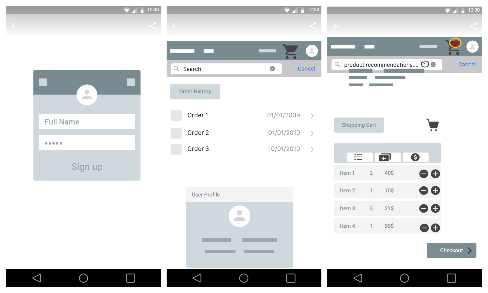
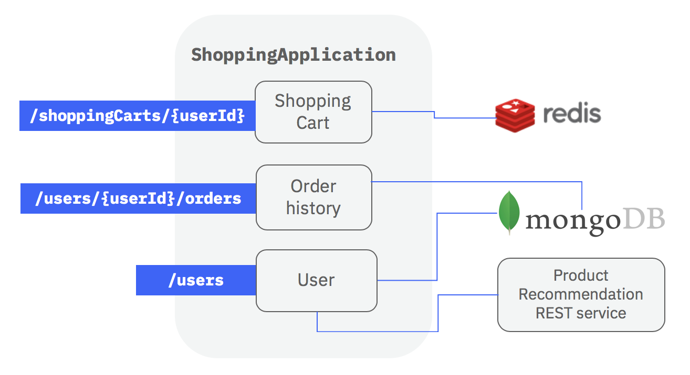
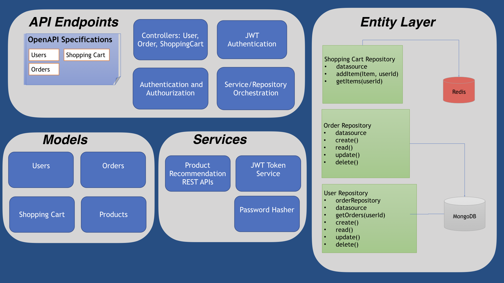
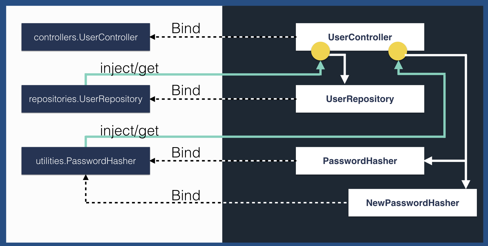
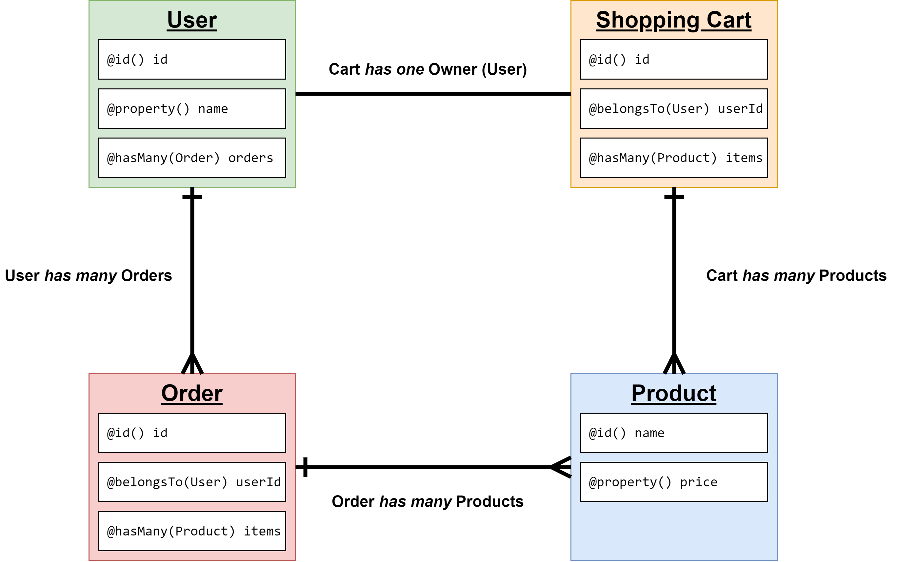

## APIs in a digital era

Digital transformation is changing how data and services are shared across
Web/Mobile/IoT platforms. APIs allow easy and secure access to digital resources
and capabilities of an organization by internal and external parties.

Developers are looking out for more productive ways of creating and consuming
APIs.

Consider a typical `Online Shopping` site. First the UI requirements are
gathered. Customers would be provided a home page, a product list, a shopping
cart and an order history page.

Next, the API requirements are assessed. If the capability to choose products,
add to cart and submit an order are exposed as secure APIs, they can be used by
a web or mobile application which could be developed in-house or by a third
party developer.

Once the API requirements are assessed,

- LoopBack's features can be used to satisfy the requirements from different
  developers:

  - Front end designers:

    > Can create an `Online Shopping prototype` to try the UI experience by
    > using LoopBack's features to configure simple methods as remote API
    > endpoints.

  - API developers:

    > Can assess API specifications and security options by creating and
    > decorating remote methods with security options.

  - Back end developers:
    > Can create Entity-Relationship models from backend datasources using
    > LoopBack's extensive model discovery features and connectors.

The example application
[loopback4-example-shopping](https://github.com/strongloop/loopback4-example-shopping)
is a nice place for developers to begin their LoopBack 4 journey.

In the following sections we will see how LoopBack can be used for the online
shopping example.

## Use Cases for Online Shopping

For our `Online Shopping` site how the customer might interact with a web or
mobile application is the same.

- `Login use cases`
  - The customer would register as a user.
  - The customer logs in as a user.
  - After the user logs in, the mobile/web app creates a shopping cart for the
    user.
  - We have the following API requirements for this use case:

| Use case          | operations          | summary                                           |
| ----------------- | ------------------- | ------------------------------------------------- |
| create a new user | POST /users         | creates a user entity                             |
| query for a user  | GET /users/{userId} | query for user entity by id                       |
| login as a user   | POST /users/login   | does basic authentication and returns a jwt token |

Similar to this we can breakdown further use cases into API requirements.

- `Shopping use cases`

  - User starts adding and removing items to the shopping cart.
  - If the user logs out the shopping cart is saved and re-loaded when the user
    logs in next time.

- `Order use cases`
  - User creates an order with items in the shopping cart.
  - The mobile/web app submits the order and resets the shopping cart.
  - User takes a look at all the previous orders.

In the example,

- [A product recommendations application](https://github.com/strongloop/loopback4-example-shopping/tree/master/packages/recommender)
  is defined to mock shopping recommendation APIs. This also gives an
  appropriate use case to demonstrate invoking external APIs.

- `MongoDB` is used for saving `User` and `Order` data. This demonstrates CRUD
  operations on a model.

- `Redis` is used for caching items in the shopping cart. This allows
  demonstrating use of a KeyValue Connector as well as having multiple
  datasources.

## API Implementation

The API business logic is separated between various layers in LoopBack:

- [Controllers](https://loopback.io/doc/en/lb4/Controllers.html) represent the
  `API Endpoints`. These endpoints will have to authenticate incoming request,
  parse and validate as well as orchestrate calls to `Services` and
  `Repositories`.

- [Services](https://loopback.io/doc/en/lb4/Calling-other-APIs-and-web-services.html)
  provide common interfaces for external apis and services. This allows invoking
  external services without mentioning connection details every time. `Services`
  interchangeably also provide common interfaces for locally available classes.

- [Models](https://loopback.io/doc/en/lb4/Model.html) and
  [Relations](https://loopback.io/doc/en/lb4/Relations.html) represent domain
  objects and provide entity relationship models.

- [Repositories](https://loopback.io/doc/en/lb4/Repositories.html) represent the
  `Entity layer` for a specific model and handle all CRUD operations on the
  model. They also use repository of other models to handle `entity relations`.

## Exposing the API endpoints

> LoopBack developers can configure simple controller classes and methods as
> remote endpoints. Out-of-the-box parsing and validation is done using the
> provided specification.

Developers typically create server-side "handler functions" for each route as
remote methods. In LoopBack, remote methods are defined in
[controller classes](https://loopback.io/doc/en/lb4/Controllers.html#routing-to-controllers)
and configured as API endpoints with api `decorators`.

> LoopBack has built-in decorators to indicate api specification and the
> expected arguments for the remote method.

For example,

- `login()` method in the
  [UserController](https://github.com/strongloop/loopback4-example-shopping/blob/master/packages/shopping/src/controllers/user.controller.ts)
  class is defined as `/users/login` API endpoint.
- argument of method `findById` in the
  [UserController](https://github.com/strongloop/loopback4-example-shopping/blob/master/packages/shopping/src/controllers/user.controller.ts)
  is decorated with `@param.path.string('userId')` which means that the userId
  parameter in the URL path is passed into the method at runtime.

## Classes and wiring dependencies

> Dependency injection features in LoopBack is used to
> [wire dependencies](https://loopback.io/doc/en/lb4/Dependency-injection.html#flavors-of-dependency-injection)
> into constructors, class properties and methods.

The `UserController` in the shopping example needs to connect to a user service
to verify the user credentials and a jwt token service to create a token. Having
these `dependencies` loosely coupled with the `UserController` will help
developers of the `Login` use case with separation of duties and inject mock
services for rapid testing.

For example, a `TokenService` interface is injected into the `UserController` to
`verify` and `generate` tokens. A
[JWT Service](https://github.com/strongloop/loopback4-example-shopping/blob/master/packages/shopping/src/services/jwt-service.ts)
provides a local implementation of this interface specifically for jwt tokens.

Dependency injection is used to wire services and repositories with controllers
dynamically at run time. We will also see that this feature is extensively used
across LoopBack for all types of classes. For example, datasources are injected
into repository classes.

## API Security

> Security implementations in LoopBack can be created as separate
> [Authentication strategies](https://loopback.io/doc/en/lb4/Loopback-component-authentication.html)
> and the `@authenticate` decorator can be used to define the authentication
> strategy of a particular endpoint.

For example,

- A
  [JWT Authentication Strategy](https://github.com/strongloop/loopback4-example-shopping/blob/master/packages/shopping/src/authentication-strategies/jwt-strategy.ts)
  is implemented with a name property `jwt`.
- `printCurrentUser` remote method in
  [UserController](https://github.com/strongloop/loopback4-example-shopping/blob/master/packages/shopping/src/controllers/user.controller.ts)
  is decorated with `authenticate('jwt')` to indicate the API endpoint is
  authenticated with json web tokens.

This helps in separation of security aspects of API endpoints from business
logic and easy understanding of security specifications.

## Models and Relations

> LoopBack provides extensive support in representing domain models and
> relations. Built-in `decorators` are used to annotate property data types as
> well as entity relationships in a `Model` class.

[Models](https://loopback.io/doc/en/lb4/Model.html#definition-of-a-model) define
the structure of domain objects.
[Model Relations](https://loopback.io/doc/en/lb4/Relations.html) help in
defining entity composition and cardinalities like one-to-many or one-to-one.

> Models can also be generated from
> [existing tables](https://loopback.io/doc/en/lb4/Discovering-models.html) in
> relational databases.

[User](https://github.com/strongloop/loopback4-example-shopping/blob/master/packages/shopping/src/models/user.model.ts)
and
[Order](https://github.com/strongloop/loopback4-example-shopping/blob/master/packages/shopping/src/models/order.model.ts)
are domain objects in the shopping cart use case:

- They have the same structure and relations when posted by users from the front
  end as well as when persisted towards a backend datastore.
- A user can have multiple orders, and hence `User` model has a
  [has-many relation](https://loopback.io/doc/en/lb4/HasMany-relation.html)
  (ie., one-to-many) with `Order` model. Hence the `orders` property in `User`
  model is annotated with the `@hasMany(() => Order)` decorator.
- An `Order` is composed with a list of products added in the shopping cart and
  submitted towards the order. Hence the `products` property in `Order` model is
  annotated as `@property.array()` to indicate that it is a list property.
- An `Order` can be made only by one `User`. So, the `userId` property in
  `Order` model is annotated with `@belongsTo()` decorator, to indicate `Order`
  has a one-to-one relation with `User`.

## Entity layer and Database connectivity

> [Repositories](https://loopback.io/doc/en/lb4/Repositories.html) in LoopBack
> represent the `Entity` layer for querying and persisting a domain model. They
> also connect with other repositories to resolve `Entity relations`.

Applications displaying a `user` profile might need a list of associated recent
`orders` made by the user. The same also applies for an order page, some
associated user data could be needed. Querying for associated data for demands
from front end as well as for logical and persistence reasons is a common
requirement. Having a separate `Entity` layer helps in model driven CRUD
operations.

From the example,

- To query and persist `User` model data, the example uses a
  [UserRepository](https://github.com/strongloop/loopback4-example-shopping/blob/master/packages/shopping/src/repositories/user.repository.ts).
- For the `Order` model,
  [OrderRepository](https://github.com/strongloop/loopback4-example-shopping/blob/master/packages/shopping/src/repositories/order.repository.ts)
  is defined.
- The `UserRepository` uses the entity composition defined in the `User` model
  to create a has-many relation with the `OrderRepository`

We need appropriate drivers to connect with the backend datasources.

> LoopBack has readily available connectors for most
> [databases](https://loopback.io/doc/en/lb4/Database-connectors.html) and other
> backend resources like
> [REST, SOAP, Email, etc](https://loopback.io/doc/en/lb4/Other-connectors.html)
> to provide easy to use CRUD operations and connection configurations.

In the example,
[Redis datasource definition](https://github.com/strongloop/loopback4-example-shopping/blob/master/packages/shopping/src/datasources/redis.datasource.json)
uses the LoopBack `kv-redis` connector and
[MongoDB datasource definition](https://github.com/strongloop/loopback4-example-shopping/blob/master/packages/shopping/src/datasources/mongo.datasource.json)
uses the LoopBack `mongodb` connector.

## Application startup

The `Shopping` APIs have to be setup with configurations so that they are
accessible on a specific port, have a base url, etc. Also we may want to setup
[various bootup activities](https://loopback.io/doc/en/lb4/Application.html) if
there are tasks to be completed before the APIs are available online.

The
[ShoppingApplication class](https://github.com/strongloop/loopback4-example-shopping/blob/master/packages/shopping/src/application.ts)
is a palette to hold all common configurations and startup activities of the
`Shopping` microservice.

The `ShoppingApplication` class extends the `RestApplication` class from the
`@loopback\rest` package and so has inherited the capabilities of the in-built
[LoopBack Server](https://loopback.io/doc/en/lb4/Server.html) to `boot`, `start`
and `stop`. The application can now be booted and started by calling the
`app.boot` and `app.start` methods respectively. In the example, this call is
made from the
[index.ts](https://github.com/strongloop/loopback4-example-shopping/blob/master/packages/shopping/src/index.ts)
file.

## Summary

LoopBack as a model-driven framework provides various provisions for quick and
easy API development :

- modeling API endpoints
- modeling domain objects
- implementing authentication components independently
- decorating API endpoints with authentication configurations
- provides programming constructs for external APIs as `Services`
- provides entity layer abstraction with `Repository` pattern
- dependency injection to wire classes and methods with their dependencies
