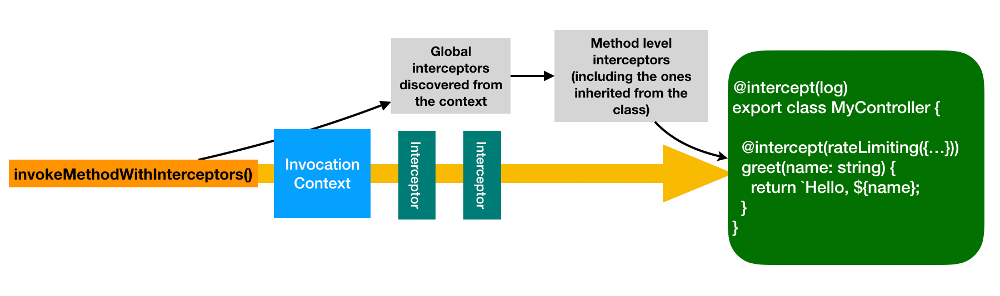

## Overview

Interceptors are reusable functions to provide aspect-oriented logic around
method invocations. There are many use cases for interceptors, such as:

- Add extra logic before / after method invocation, for example, logging or
  measuring method invocations.
- Validate/transform arguments
- Validate/transform return values
- Catch/transform errors, for example, normalize error objects
- Override the method invocation, for example, return from cache

The following diagram illustrates how interceptors can be applied to the
invocation of a method on the controller class.



## Basic use

### Interceptors on controllers

Interceptors are supported for public controller methods (including both static
and prototype) and handler functions for REST routes.

Controller methods decorated with `@intercept` are invoked with applied
interceptors for corresponding routes upon API requests.

```ts
import {intercept} from '@loopback/context';

@intercept(log) // `log` is an interceptor function
export class OrderController {
  @intercept('caching-interceptor') // `caching-interceptor` is a binding key
  async listOrders(userId: string) {
    // ...
  }
}
```

**NOTE**: `log` and `'caching-interceptor'` are illustrated in
[Example interceptors](#example-interceptors).

It's also possible to configure global interceptors that are invoked before
method level interceptors. For example, the following code registers a global
`caching-interceptor` for all methods.

```ts
app
  .bind('caching-interceptor')
  .toProvider(CachingInterceptorProvider)
  .apply(asGlobalInterceptor('caching'));
```

Global interceptors are also executed for route handler functions without a
controller class. See an example in
[Route Handler](Routes.md#using-partial-openapi-spec-fragments).

### Create a proxy to apply interceptors

A
[proxy](https://developer.mozilla.org/en-US/docs/Web/JavaScript/Reference/Global_Objects/Proxy)
can be created from the target class or object to apply interceptors. This is
useful for the case that a controller declares dependencies of repositories or
services and would like to allow repository or service methods to be
intercepted.

```ts
import {createProxyWithInterceptors} from '@loopback/context';

const proxy = createProxyWithInterceptors(controllerInstance, ctx);
const msg = await proxy.greet('John');
```

There is also an `asProxyWithInterceptors` option for binding resolution or
dependency injection to return a proxy for the class to apply interceptors when
methods are invoked.

```ts
class DummyController {
  constructor(
    @inject('my-controller', {asProxyWithInterceptors: true})
    public readonly myController: MyController,
  ) {}
}
ctx.bind('my-controller').toClass(MyController);
ctx.bind('dummy-controller').toClass(DummyController);
const dummyController = await ctx.get<DummyController>('dummy-controller');
const msg = await dummyController.myController.greet('John');
);
```

Or:

```ts
const proxy = await ctx.get<MyController>('my-controller', {
  asProxyWithInterceptors: true,
});
const msg = await proxy.greet('John');
```

Please note synchronous methods (which don't return `Promise`) are converted to
return `ValueOrPromise` (synchronous or asynchronous) in the proxy so that
interceptors can be applied. For example,

```ts
class MyController {
  name: string;

  greet(name: string): string {
    return `Hello, ${name}`;
  }

  async hello(name: string) {
    return `Hello, ${name}`;
  }
}
```

The proxy from an instance of `MyController` has the `AsyncProxy<MyController>`
type:

```ts
{
  name: string; // the same as MyController
  greet(name: string): ValueOrPromise<string>; // the return type becomes `ValueOrPromise<string>`
  hello(name: string): Promise<string>; // the same as MyController
}
```

The return value of `greet` now has two possible types:

- `string`: No async interceptor is applied
- `Promise<string>`: At least one async interceptor is applied

### Use `invokeMethod` to apply interceptors

To explicitly invoke a method with interceptors, use `invokeMethod` from
`@loopback/context`. Please note `invokeMethod` is used internally by
`RestServer` for controller methods.

```ts
import {Context, invokeMethod} from '@loopback/context';

const ctx: Context = new Context();

ctx.bind('name').to('John');

// Invoke a static method
let msg = await invokeMethod(MyController, 'greetStaticWithDI', ctx);

// Invoke an instance method
const controller = new MyController();
msg = await invokeMethod(controller, 'greetWithDI', ctx);
```

Please note that `invokeMethod` internally uses `invokeMethodWithInterceptors`
to support both injection of method parameters and application of interceptors.

## Apply interceptors

Interceptors form a cascading chain of handlers around the target method
invocation. We can apply interceptors by decorating methods/classes with
`@intercept`. Please note `@intercept` does **NOT** return a new method wrapping
the target one. Instead, it adds some metadata instead and such information is
used by `invokeMethod` or `invokeWithMethodWithInterceptors` functions to
trigger interceptors around the target method. The original method stays intact.
Invoking it directly won't apply any interceptors.

### `@intercept`

Syntax: `@intercept(...interceptorFunctionsOrBindingKeys)`

The `@intercept` decorator adds interceptors to a class or its methods including
static and instance methods. Two flavors are accepted:

- An interceptor function

  ```ts
  class MyController {
    @intercept(log) // Use the `log` function
    greet(name: string) {
      return `Hello, ${name}`;
    }
  }
  ```

- A binding key that can be resolved to an interface function

  ```ts
  class MyController {
    @intercept('name-validator') // Use the `name-validator` binding
    async helloWithNameValidation(name: string) {
      return `Hello, ${name}`;
    }
  }

  // Bind options and provider for `NameValidator`
  ctx.bind('valid-names').to(['John', 'Mary']);
  ctx.bind('name-validator').toProvider(NameValidator);
  ```

### Method level interceptors

A **public** static or prototype method on a class can be decorated with
`@intercept` to attach interceptors to the target method. Please note
interceptors don't apply to protected or private methods.

#### Static methods

```ts
class MyControllerWithStaticMethods {
  // Apply `log` to a static method
  @intercept(log)
  static async greetStatic(name: string) {
    return `Hello, ${name}`;
  }

  // Apply `log` to a static method with parameter injection
  @intercept(log)
  static async greetStaticWithDI(@inject('name') name: string) {
    return `Hello, ${name}`;
  }
}
```

#### Prototype methods

```ts
class MyController {
  // Apply `logSync` to a sync instance method
  @intercept(logSync)
  greetSync(name: string) {
    return `Hello, ${name}`;
  }

  // Apply `log` to a sync instance method
  @intercept(log)
  greet(name: string) {
    return `Hello, ${name}`;
  }

  // Apply `log` as a binding key to an async instance method
  @intercept('log')
  async greetWithABoundInterceptor(name: string) {
    return `Hello, ${name}`;
  }

  // Apply `log` to an async instance method with parameter injection
  @intercept(log)
  async greetWithDI(@inject('name') name: string) {
    return `Hello, ${name}`;
  }

  // Apply `log` and `logSync` to an async instance method
  @intercept('log', logSync)
  async greetWithTwoInterceptors(name: string) {
    return `Hello, ${name}`;
  }

  // No interceptors are attached
  async greetWithoutInterceptors(name: string) {
    return `Hello, ${name}`;
  }

  // Apply `convertName` to convert `name` arg to upper case
  @intercept(convertName)
  async greetWithUpperCaseName(name: string) {
    return `Hello, ${name}`;
  }

  // Apply `name-validator` backed by a provider class
  @intercept('name-validator')
  async greetWithNameValidation(name: string) {
    return `Hello, ${name}`;
  }

  // Apply `logError` to catch errors
  @intercept(logError)
  async greetWithError(name: string) {
    throw new Error('error: ' + name);
  }
}
```

### Class level interceptors

To apply interceptors to be invoked for all methods on a class, we can use
`@intercept` to decorate the class. When a method is invoked, class level
interceptors (if not explicitly listed at method level) are invoked before
method level ones.

```ts
// Apply `log` to all methods on the class
@intercept(log)
class MyControllerWithClassLevelInterceptors {
  // The class level `log` will be applied
  static async greetStatic(name: string) {
    return `Hello, ${name}`;
  }

  // A static method with parameter injection
  @intercept(log)
  static async greetStaticWithDI(@inject('name') name: string) {
    return `Hello, ${name}`;
  }

  // We can apply `@intercept` multiple times on the same method
  // This is needed if a custom decorator is created for `@intercept`
  @intercept(log)
  @intercept(logSync)
  greetSync(name: string) {
    return `Hello, ${name}`;
  }

  // Apply multiple interceptors. The order of `log` will be preserved as it
  // explicitly listed at method level
  @intercept(convertName, log)
  async greet(name: string) {
    return `Hello, ${name}`;
  }
}
```

### Global interceptors

Global interceptors are discovered from the `InvocationContext`. They are
registered as bindings with `interceptor` tag. For example,

```ts
import {asGlobalInterceptor} from '@loopback/context';

app
  .bind('interceptors.MetricsInterceptor')
  .toProvider(MetricsInterceptorProvider)
  .apply(asGlobalInterceptor('metrics'));
```

Please note `asGlobalInterceptor` is a factory function to create binding
templates that mark bindings of global interceptors. It takes an optional
`group` name to control the order of invocation. For example:

- `asGlobalInterceptor('metrics')`: mark a binding as a global interceptor in
  the `metrics` group
- - `asGlobalInterceptor()`: mark a binding as a global interceptor in the
    default group

### Order of invocation for interceptors

Multiple `@intercept` decorators can be applied to a class or a method. The
order of invocation is determined by how `@intercept` is specified. The list of
interceptors is created from top to bottom and from left to right. Duplicate
entries are removed from their first occurrences.

Let's examine the list of interceptors invoked for each method on
`MyController`, which has a class level `log` decorator:

1. A static method on the class - `greetStatic`

   ```ts
   @intercept(log)
   class MyController {
     // No explicit `@intercept` at method level. The class level `log` will
     // be applied
     static async greetStatic(name: string) {
       return `Hello, ${name}`;
     }
   }
   ```

   Interceptors to apply: [`log`]

2. A static method that requires parameter injection: `greetStaticWithDI`

   ```ts
   @intercept(log)
   class MyController {
     // The method level `log` overrides the class level one
     @intercept(log)
     static async greetStaticWithDI(@inject('name') name: string) {
       return `Hello, ${name}`;
     }
   }
   ```

   Interceptors to apply: [`log`]

3. A prototype method with multiple `@intercept` - `greetSync`

   ```ts
   @intercept(log)
   class MyController {
     // We can apply `@intercept` multiple times on the same method
     // This is needed if a custom decorator is created for `@intercept`
     @intercept(log) // The method level `log` overrides the class level one
     @intercept(logSync)
     greetSync(name: string) {
       return `Hello, ${name}`;
     }
   }
   ```

   Interceptors to apply: [`log`, `logSync`]

4. A prototype method that preserves the order of an interceptor - `greet`

   ```ts
   @intercept(log)
   class MyController {
     // Apply multiple interceptors. The order of `log` will be preserved as it
     // explicitly listed at method level
     @intercept(convertName, log)
     async greet(name: string) {
       return `Hello, ${name}`;
     }
   }
   ```

   Interceptors to apply: [`convertName`, `log`]

Global interceptors are invoked before class/method level ones unless they are
explicitly overridden by `@intercept`.

Global interceptors can be sorted as follows:

1. Tag global interceptor binding with `ContextTags.GLOBAL_INTERCEPTOR_GROUP`.
   The tag value will be treated as the `group` name of the interceptor. For
   example:

   ```ts
   app
     .bind('globalInterceptors.authInterceptor')
     .to(authInterceptor)
     .apply(asGlobalInterceptor('auth'));
   ```

   If the group tag does not exist, the value is default to `''`.

2. Control the ordered groups for global interceptors

   ```ts
   app
     .bind(ContextBindings.GLOBAL_INTERCEPTOR_ORDERED_GROUPS)
     .to(['log', 'auth']);
   ```

If ordered groups is not bound to
`ContextBindings.GLOBAL_INTERCEPTOR_ORDERED_GROUPS`, global interceptors will be
sorted by their group names alphabetically. Interceptors with unknown groups are
invoked before those listed in ordered groups.

## Create your own interceptors

Interceptors can be made available by LoopBack itself, extension modules, or
applications. They can be a function that implements `Interceptor` signature or
a binding that is resolved to an `Interceptor` function.

### Interceptor functions

The interceptor function is invoked to intercept a method invocation with two
parameters:

- `context`: the [invocation context](#invocation-context)
- `next`: a function to invoke next interceptor or the target method. It returns
  a value or promise depending on whether downstream interceptors and the target
  method are synchronous or asynchronous.

```ts
/**
 * Interceptor function to intercept method invocations
 */
export interface Interceptor {
  /**
   * @param context - Invocation context
   * @param next - A function to invoke next interceptor or the target method
   * @returns A result as value or promise
   */
  (
    context: InvocationContext,
    next: () => ValueOrPromise<InvocationResult>,
  ): ValueOrPromise<InvocationResult>;
}
```

An interceptor can be asynchronous (returning a promise) or synchronous
(returning a value). If one of the interceptors or the target method is
asynchronous, the invocation will be asynchronous. The following table show how
the final return type is determined.

| Interceptor | Target method | Return type |
| ----------- | ------------- | ----------- |
| async       | async         | promise     |
| async       | sync          | promise     |
| sync        | async         | promise     |
| sync        | sync          | value       |

To keep things simple and consistent, we recommend that interceptors function to
be asynchronous as much as possible.

### Invocation context

The `InvocationContext` object provides access to metadata for the given
invocation in addition to the parent `Context` that can be used to locate other
bindings. It extends `Context` with additional properties as follows:

- `target` (`object`): Target class (for static methods) or prototype/object
  (for instance methods)
- `methodName` (`string`): Method name
- `args` (`InvocationArgs`, i.e., `any[]`): An array of arguments

```ts
/**
 * InvocationContext for method invocations
 */
export class InvocationContext extends Context {
  /**
   * Construct a new instance
   * @param parent - Parent context, such as the RequestContext
   * @param target - Target class (for static methods) or prototype/object
   * (for instance methods)
   * @param methodName - Method name
   * @param args - An array of arguments
   */
  constructor(
    parent: Context,
    public readonly target: object,
    public readonly methodName: string,
    public readonly args: InvocationArgs, // any[]
  ) {
    super(parent);
  }
}
```

It's possible for an interceptor to mutate items in the `args` array to pass in
transformed input to downstream interceptors and the target method.

### Logic around `next`

An interceptor will receive the `next` parameter, which is a function to execute
the downstream interceptors and the target method.

The interceptor function is responsible for calling `next()` if it wants to
proceed with next interceptor or the target method invocation. A typical
interceptor implementation looks like the following:

```ts
async function intercept<T>(
  invocationCtx: InvocationContext,
  next: () => ValueOrPromise<T>,
) {
  // Pre-process the request
  try {
    const result = await next();
    // Post-process the response
    return result;
  } catch (err) {
    // Handle errors
    throw err;
  }
}
```

If `next()` is not invoked, neither downstream interceptors nor the target
method be executed. It's valid to skip `next()` if it's by intention, for
example, an interceptor can fail the invocation early due to validation errors
or return a response from cache without invoking the target method.

### Example interceptors

Here are some example interceptor functions:

1. An asynchronous interceptor to log method invocations:

```ts
const log: Interceptor = async (invocationCtx, next) => {
  console.log('log: before-' + invocationCtx.methodName);
  // Wait until the interceptor/method chain returns
  const result = await next();
  console.log('log: after-' + invocationCtx.methodName);
  return result;
};
```

2. An interceptor to catch and log errors:

```ts
const logError: Interceptor = async (invocationCtx, next) => {
  console.log('logError: before-' + invocationCtx.methodName);
  try {
    const result = await next();
    console.log('logError: after-' + invocationCtx.methodName);
    return result;
  } catch (err) {
    console.log('logError: error-' + invocationCtx.methodName);
    throw err;
  }
};
```

3. An interceptor to convert `name` arg to upper case:

```ts
const convertName: Interceptor = async (invocationCtx, next) => {
  console.log('convertName:before-' + invocationCtx.methodName);
  invocationCtx.args[0] = (invocationCtx.args[0] as string).toUpperCase();
  const result = await next();
  console.log('convertName: after-' + invocationCtx.methodName);
  return result;
};
```

4. An provider class for an interceptor that performs parameter validation

To leverage dependency injection, a provider class can be defined as the
interceptor:

```ts
/**
 * A binding provider class to produce an interceptor that validates the
 * `name` argument
 */
class NameValidator implements Provider<Interceptor> {
  constructor(@inject('valid-names') private validNames: string[]) {}

  value() {
    return this.intercept.bind(this);
  }

  async intercept<T>(
    invocationCtx: InvocationContext,
    next: () => ValueOrPromise<T>,
  ) {
    const name = invocationCtx.args[0];
    if (!this.validNames.includes(name)) {
      throw new Error(
        `Name '${name}' is not on the list of '${this.validNames}`,
      );
    }
    return next();
  }
}
```

5. A synchronous interceptor to log method invocations:

```ts
const logSync: Interceptor = (invocationCtx, next) => {
  console.log('logSync: before-' + invocationCtx.methodName);
  // Calling `next()` without `await`
  const result = next();
  // It's possible that the statement below is executed before downstream
  // interceptors or the target method finish
  console.log('logSync: after-' + invocationCtx.methodName);
  return result;
};
```
