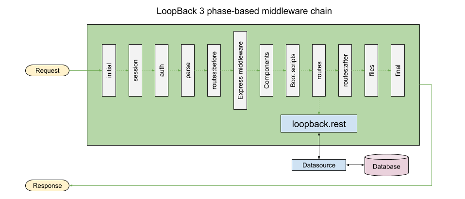
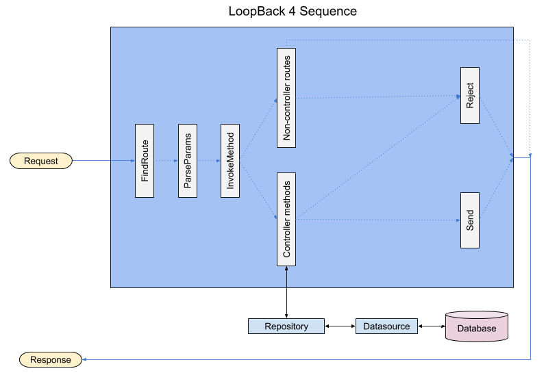

## Differences between LoopBack 3 and LoopBack 4 request/response cycle

The request/response cycle infrastructure and pathway are very different in
LoopBack 3 and LoopBack 4. Knowing the differences will help you migrate
LoopBack 3 applications to LoopBack 4 and implement new request/response related
features in LoopBack 4.

This document will guide you through the differences and show the LoopBack 4
equivalent, if there is any.

### Request/response infrastructure

The difference begins with the LoopBack application object itself. In LoopBack
3, it is an instance of an Express application; in LoopBack 4, it is not.
Although LoopBack 4 uses Express as the HTTP server, it is not directly exposed
anymore.

In LoopBack 3, Express middleware and routers, models, components, boot scripts,
and remote methods are the ways endpoints can be created on the application.
Let's take a look at how they have changed and how their functionality can be
migrated in LoopBack 4.

#### Express middleware and routers

In LoopBack 3 you could add routes and load custom middleware using `app.get()`,
`app.post()`, `app.use()`, etc., just like how you do in Express. In LoopBack 4,
you cannot do it yet. However, you can
[mount a LoopBack 4 application](./express-with-lb4-rest-tutorial.md) on an
Express application, which would allow you to still use the familiar routing
methods.



If you want to mount an Express router in a LoopBack 4 application, you can use
the
[RestApplication.mountExpressRouter()](./apidocs/apidocs.rest.restapplication.mountexpressrouter.md)
API.

Using [Controllers](./Controllers.md) is the recommended way for creating custom
(and REST) endpoints on your application. Its support for
[dependency injection](./Dependency-injection.md) and
[Interceptors](./Interceptors.md) makes it a very powerful extension mechanism.

In LoopBack 4
[middleware.json](https://loopback.io/doc/en/lb3/middleware.json.html) is not
required anymore because of architectural changes.

#### Models

In LoopBack 3, models files automatically create the corresponding REST API
endpoints and the database query machinery (using the configured datasource). In
LoopBack 4, model files are limited only to describing the properties of the
data. You will have to create a corresponding [Repository](./Repositories.md)
for database connectivity, and [controllers](./Controllers.md) for creating the
REST API endpoint.

The fact that you have to create two more artifacts along with the model to get
a REST endpoint working might seem overly tedious at first. However, the
separation of concerns and decoupling the functionality makes the codebase
cleaner, easier to maintain, and much easier to customize functionality at
various levels. This can be better appreciated as the complexity of your
application grows.

For those who are uncomfortable with the concept of having to creating a
repository and a controller for a model, we have a component
[@loopback/rest-crud](./Creating-crud-rest-apis.md) ; with a little bit of
configuration, a model file is all you will need to create the REST endpoints.
Once your requirements outgrow what `@loopback/rest-crud` provides, you can
implement your REST endpoints the idiomatic way.

#### Components

Components are still supported in LoopBack 4, but the concept of component has
completely changed.

In LoopBack 3, a
[component](https://loopback.io/doc/en/lb3/LoopBack-components.html) is a simple
Node.js module which exports a function with the signature
`function(app, options)`. In LoopBack 4, a [component](./Creating-components.md)
is a TypeScript class which can add [servers](./Server.md),
[observers](./Life-cycle.md), [providers](./Creating-components.md#providers),
and [controllers](./Controllers.md) to the application using dependency
injection.

LoopBack 3 components adding routes can be migrated to LoopBack 4 by moving the
functionality to the controller of a LoopBack 4 component.

Here is an example of migrating a LoopBack 3 routing component to a LoopBack 4
component's controller.



```js
module.exports = (app, options) => {
  app.get('/hi', (req, res) => {
    res.send('Hi!');
  });
};
```



```ts
import {get} from '@loopback/rest';
import {Component} from '@loopback/core';

export class HiController {
  @get('/hi', {
    responses: {
      '200': {
        content: {'application/json': {schema: {type: 'string'}}},
      },
    },
  })
  hello(): string {
    return 'Hi!';
  }
}

export class HiComponent implements Component {
  controllers = [HiController];
}
```



```ts
import { HiComponent} from './components/hi.component';
...
export class Lb4AppApplication extends BootMixin(
  ServiceMixin(RepositoryMixin(RestApplication)),
) {
  constructor(options: ApplicationConfig = {}) {
    ...
    this.component(HiComponent);
    ...
  }
}
```

Because of the architectural changes, `component-config.json` is not required in
LoopBack 4 anymore.

#### Boot scripts

If you used LoopBack 3 boot scripts for adding routes to the application, it
should now be moved to a standalone controller, a component, or implemented
using `app.mountExpressRouter()`.

Here is an example of migrating a route added by a boot script to a controller.



```js
module.exports = function (server) {
  server.get('/hello', (req, res) => {
    res.send('Hello!');
  });
};
```



```ts
import {get} from '@loopback/rest';

export class HelloController {
  @get('/hello')
  hello(): string {
    return 'Hello!';
  }
}
```



#### Remote methods

[Remote methods](https://loopback.io/doc/en/lb3/Remote-methods.html) add custom
endpoints to a model's REST interface.



```js
module.exports = function (Person) {
  Person.greet = function (message, cb) {
    cb(null, 'Greetings: ' + message);
  };

  Person.remoteMethod('greet', {
    accepts: {arg: 'message', type: 'string'},
    returns: {arg: 'message', type: 'string'},
  });
};
```

The above remote method's functionality can be migrated to a controller in
LoopBack 4 in the following manner.



```ts
import {post, requestBody} from '@loopback/rest';

export type Greeting = {
  message: string;
};

const spec = {
  content: {
    'application/json': {
      schema: {
        type: 'object',
        properties: {
          message: {
            type: 'string',
          },
        },
      },
    },
  },
};

export class PersonController {
  @post('/person/greet', {
    responses: {
      '200': spec,
    },
  })
  greet(@requestBody(spec) greeting: Greeting): string {
    return 'Greetings: ' + greeting.message;
  }
}
```

### Request/response pathway

The request/response architecture has undergone a drastic change in LoopBack 4.
LoopBack 3's
[phase-based middleware routing system](https://loopback.io/doc/en/lb3/Routing.html)
is now replaced by a
[sequence handler](./apidocs/apidocs.rest.defaultsequence.md) that sits infront
of a [routing table](./apidocs/apidocs.rest.routingtable.md).

In LoopBack 3, middleware are added using Express APIs and via phases in
`middleware.json` or using
[app.middleware()](https://apidocs.loopback.io/loopback/#app-middleware).
Request to the app passes through the middleware chain in the following order.

- `initial:before`
- `initial`
- `initial:after`
- `session:before`
- `session`
- `session:after`
- `auth:before`
- `auth`
- `auth:after`
- `parse:before`
- `parse`
- `parse:after`
- `routes:before`
- [Express middleware](http://expressjs.com/guide/writing-middleware.html)
- [Components](https://loopback.io/doc/en/lb3/LoopBack-components.html)
- [Boot scripts](https://loopback.io/doc/en/lb3/Defining-boot-scripts.html)
- `routes`
- `routes:after`
- `files:before`
- `files`
- `files:after`
- `final:before`
- `final`
- `final:after`

Any middleware higher up in the chain may terminate the request by sending a
response back to the client.



The REST API middleware is added in the `routes` phase and error handlers in the
`final` and `final:after` phases.

The REST API middleware is responsible for creating REST API endpoints out of
the models in the application. It then uses the configured datasource for
connecting and querying the undelying database for the corresponding REST
requests.

In LoopBack 4, the [sequence](./Sequence.md) is the gatekeeper of all requests
to the application. Every request to the application must pass through the
sequence. It identifies the responsible handler for the requested endpoint and
passes on the request to the handler.



Unlike LoopBack 3, models in LoopBack 4 do not create REST endpoints. Use the
`lb4 controller` command to quickly generate the REST endpoints for a model.

For more details, refer to the LoopBack 4
[request/response cycle](./Request-response-cycle.md) doc.

#### Access to the request/response object

Since LoopBack 3 uses the Express middleware pattern, the request and response
objects can always be accessed in all the middleware functions.

In LoopBack 4, the request and response objects can be accessed in routers
loaded using the
[app.mountExpressRouter() ](./apidocs/apidocs.rest.restapplication.mountexpressrouter.md)
method, using the familiar Express middleware signature.

[Controllers](./Controllers.md), [services](./Services.md), and
[repositories](./Repositories.md) are LoopBack 4 artifacts that participate in
the request/response cycle. The request and response objects can be made
available to them via [dependency injection](./Dependency-injection.md).

Example of accesssing the request and response object in a Controller:

```ts
import {inject} from '@loopback/core';
import {Request, Response, RestBindings, get} from '@loopback/rest';

export class ExampleController {
  constructor(
    @inject(RestBindings.Http.REQUEST) private req: Request,
    @inject(RestBindings.Http.RESPONSE) private res: Response,
  ) {}

  @get('/headers')
  headers() {
    // Sends back the request headers
    this.res.send(this.req.headers);
  }
}
```

Similarly, the request and response objects can be injected into services and
respositories along with other objects from the [context](./Context.md).

It may be tempting to use an Express router (because of familiarity) instead of
a controller to add custom endpoints to the application, but bear it in mind
that controllers are way more powerful and capable than Express routers because
of the following reasons:

1. Support for dependency injection
2. Access to the application context
3. In-built support for parsing and validating submitted data based on the
   endpoint's OpenAPI spec
4. Controller routes are included in the auto-generated OpenAPI spec document

[Interceptors](./Interceptors.md) can intercept execution of controller methods,
thus have access to the request and response objects.

#### Data coercion and validation



[strong-remoting](https://github.com/strongloop/strong-remoting) is the core of
data coercion and validation in LoopBack 3. Validation rules are defined using
the `accepts` metadata and data-access level validation are defined by model
validation methods like `validatesPresenceOf()`.

`strong-remoting`'s supported data types can be found in its
[type definitions](https://github.com/strongloop/strong-remoting/tree/master/lib/types),
each type comes with a validation and coercion methods. While the validations
are minimal (e.g. object properties are not validated), the coercions are very
comprehensive and applies different rules for values coming from JSON
(implemented by `fromTypeValue`) or from string sources like the url query and
HTTP headers.

LoopBack 4 does a full JSON Schema validation at the REST layer and
property-based validation at the data-access layer.

OpenAPI is used to describe the type and constraints of request parameters in
LoopBack 4. In a typical controller, OpenAPI schemas describing the model data
are built from the metadata provided by LoopBack Models. Non-model parameters
(e.g. id in `findById(id)`, `filter` in `find(filter)`) are described using
inline schema.

When a request arrives, a light weight
[coercion](https://github.com/strongloop/loopback-next/blob/master/packages/rest/src/coercion/coerce-parameter.ts)
and
[validation](https://github.com/strongloop/loopback-next/blob/master/packages/rest/src/coercion/validator.ts)
is performed on the request body at OpenAPI parameters level. Then, the OpenAPI
schema is converted to JSON schema on which
[AJV validation](https://github.com/strongloop/loopback-next/tree/master/packages/rest/src/validation)
is run against the schema.

Currently, LoopBack 4 does not validate non-body parameters against schema. It
will be supported in future, follow
[loopback-next#1573](https://github.com/strongloop/loopback-next/issues/1573) to
keep track of the progress.

In LoopBack 4, it is possible to apply additional validation of model data at
the REST layer via `jsonSchema` model setting, which can partially replace
advanced validations provided by LoopBack 3 at data-access level. However, it is
not a direct replacement for Model validation methods in LoopBack 3. The former
performs the validation at the REST API layer, while the later performs the
validation at the data access layer; that means, the data validation of
`jsonSchema` will not be applied if data is modified using repository methods.

Here is an example of enforcing the string length of a model property using
`jsonSchema` in LoopBack 4:

```ts
export class Book extends Entity {
  ...
  @property({
    type: 'string',
    jsonSchema: {
      'minLength': 5,
      'maxLength': 25
    }
  })
  title: string;
  ...
}
```

If the length of `title` is less than 5 characters, or is more than 25
characters a 422 error will be thrown by the server.

LoopBack 4 does not yet offer advanced validation rules at data-access layer
like LoopBack 3 does,
[we are working on it](https://github.com/strongloop/loopback-next/issues/1872).

#### Access to data before writing to the databases

In LoopBack 3, the `before save`
[operation hook](https://loopback.io/doc/en/lb3/Operation-hooks.html) enable
users to access the model data before it is written to the database. A similar
functionality can be achieved in LoopBack 4 by overriding the `create()` method
of the
[default CRUD repository](./apidocs/apidocs.repository.defaultcrudrepository.md)
in the repository of the model.

Example of accessing model data before saving in LoopBack 3, using the
`before save` operation hook:

```js
Book.observe('before save', async ctx => {
  if (!ctx.instance.author) {
    ctx.instance.author = 'Anonymous';
  }
});
```

Example of accessing model data before saving in LoopBack 4, by overriding the
`create()` method of the model's repository.

```ts
async create(book: Book, options?: Options): Promise<Book> {
  if (!book.author) {
    book.author = 'Anonymous';
  }
  return super.create(book, options);
}
```

Similarly, various other repository methods in LoopBack 4 can be overriden to
access the model data in the context of their operation.



## Summary

The phase-based middleware chain of LoopBack 3 is replaced by the sequence class
in LoopBack 4. Controllers, services, and respositories are part of the
request/response cycle in LoopBack 4; they provide interfaces and points of
access to the request object, the response object, and the model data.
