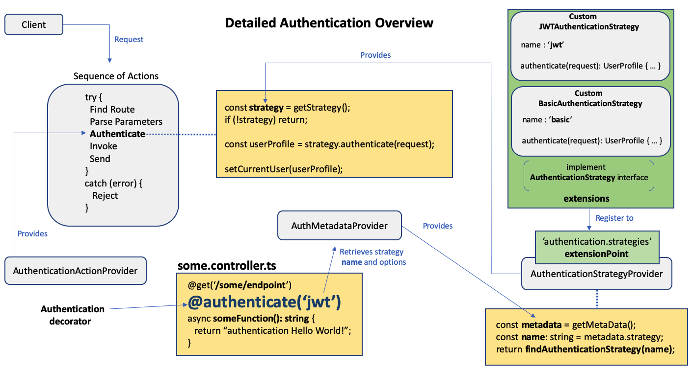

## Overview

Security is of paramount importance when developing a web or mobile application
and usually consists of two distinct pieces:

- Authentication
- Authorization

[Authentication](https://en.wikipedia.org/wiki/Authentication) is a process of
verifying someone's identity before a protected resource is accessed.

[Authorization](https://en.wikipedia.org/wiki/Authorization) is a process of
deciding if a user can perform an action on a protected resource.



This document describes the details of the LoopBack 4 `Authentication` component
from the `@loopback/authentication` package.

Here is a **high level** overview of the authentication component.


- A decorator to express an authentication requirement on controller methods
- A provider to access method-level authentication metadata
- An action in the REST sequence to enforce authentication
- An extension point to discover all authentication strategies and handle the
  delegation

Here is a **detailed** overview of the authentication component.



Basically, to secure your API endpoints, you need to:

- decorate the endpoints of a controller with the
  `@authenticate(strategyName, options?)` decorator (app developer)
- insert the authentication action in a custom sequence (app developer)
- create a custom authentication strategy with a unique **name** (extension
  developer)
- register the custom authentication strategy (app developer)

The **Authentication Component** takes care of the rest.

## Installation

```sh
npm install --save @loopback/authentication
```

## Authentication Component

To utilize `authentication` in an application `application.ts`, you must load
the authentication component named `AuthenticationComponent`.

```ts
export class MyApplication extends BootMixin(
  ServiceMixin(RepositoryMixin(RestApplication)),
) {
  constructor(options?: ApplicationConfig) {
    super(options);

    //...

    this.component(AuthenticationComponent);

    //...
  }
}
```

The `AuthenticationComponent` is defined as follows:

```ts
export class AuthenticationComponent implements Component {
  providers?: ProviderMap;

  constructor() {
    this.providers = {
      [AuthenticationBindings.AUTH_ACTION.key]: AuthenticateActionProvider,
      [AuthenticationBindings.STRATEGY.key]: AuthenticationStrategyProvider,
      [AuthenticationBindings.METADATA.key]: AuthMetadataProvider,
    };
  }
}
```

As you can see, there are a few [providers](Creating-components.md#providers)
which make up the bulk of the authentication component.

Essentially

- The binding key `AuthenticationBindings.AUTH_ACTION.key` is bound to
  `AuthenticateActionProvider` which returns an authenticating function of type
  `AuthenticateFn`
- The binding key `AuthenticationBindings.STRATEGY.key` is bound to
  `AuthenticationStrategyProvider` which resolves and returns an authentication
  strategy of type `AuthenticationStrategy`
- The binding key `AuthenticationBindings.METADATA.key` is bound to
  `AuthMetadataProvider` which returns authentication decorator metadata of type
  `AuthenticationMetadata`

The purpose of these providers and the values they return will be explained in
the sections below.

## Using the Authentication Decorator

Securing your application's API endpoints is done by decorating **controller**
functions with the
[Authentication Decorator](decorators/Decorators_authenticate.md).

The decorator's syntax is:

```ts
@authenticate(strategyName: string, options?: object)
```

or

```ts
@authenticate(metadata: AuthenticationMetadata)
```

The **strategyName** is the **unique** name of the authentication strategy.

When the **options** object is specified, it must be relevant to that particular
strategy.

Here is an example of the decorator using a custom authentication strategy named
**'basic'** without options, for the endpoint `/whoami` in a controller named
`WhoAmIController`. (We will
[create](#creating-a-custom-authentication-strategy) and
[register](#registering-a-custom-authentication-strategy) the **'basic'**
authentication strategy in later sections)

```ts
import {inject} from '@loopback/context';
import {AuthenticationBindings, authenticate} from '@loopback/authentication';
import {SecurityBindings, securityId, UserProfile} from '@loopback/security';
import {get} from '@loopback/rest';

export class WhoAmIController {
  constructor(
    // After extracting the CURRENT_USER key to module `@loopback/security`,
    // `AuthenticationBindings.CURRENT_USER` is turned to an alias of
    // `SecurityBindings.USER`
    @inject(SecurityBindings.USER)
    private userProfile: UserProfile,
  ) {}

  @authenticate('basic')
  @get('/whoami')
  whoAmI(): string {
    // `securityId` is Symbol to represent the security id of the user,
    // typically the user id. You can find more information of `securityId` in
    // https://loopback.io/doc/en/lb4/Security
    return this.userProfile[securityId];
  }
}
```

{% include note.html content="If only <b>some</b> of the controller methods are decorated with the <b>@authenticate</b> decorator, then the injection decorator for CURRENT_USER in the controller's constructor must be specified as <b>@inject(SecurityBindings.USER, {optional:true})</b> to avoid a binding error when an unauthenticated endpoint is accessed. Alternatively, do not inject CURRENT_USER in the controller <b>constructor</b>, but in the controller <b>methods</b> which are actually decorated with the <b>@authenticate</b> decorator. See [Method Injection](Dependency-injection.md#method-injection), [Constructor Injection](Dependency-injection.md#constructor-injection) and [Optional Dependencies](Dependency-injection.md#optional-dependencies) for details.
" %}

An example of the decorator when options **are** specified looks like this:

```ts
@authenticate('basic', { /* some options for the strategy */})
```

{% include tip.html content="
To avoid repeating the same options in the <b>@authenticate</b> decorator for many endpoints in a controller, you can instead define global options which can be injected into an authentication strategy thereby allowing you to avoid specifying the options object in the decorator itself. For controller endpoints that need to override a global option, you can specify it in an options object passed into the decorator. Your authentication strategy would need to handle the option overrides. See [Managing Custom Authentication Strategy Options](#managing-custom-authentication-strategy-options) for details.
" %}

After a request is successfully authenticated, the current user profile is
available on the request context. You can obtain it via dependency injection by
using the `SecurityBindings.USER` binding key.

Parameters of the `@authenticate` decorator can be obtained via dependency
injection using the `AuthenticationBindings.METADATA` binding key. It returns
data of type `AuthenticationMetadata` provided by `AuthMetadataProvider`. The
`AuthenticationStrategyProvider`, discussed in a later section, makes use of
`AuthenticationMetadata` to figure out what **name** you specified as a
parameter in the `@authenticate` decorator of a specific controller endpoint.

## Default authentication metadata

In some cases, it's desirable to have a default authentication enforcement for
methods that are not explicitly decorated with `@authenticate`. To do so, we can
simply configure the authentication component with `defaultMetadata` as follows:

```ts
app
  .configure(AuthenticationBindings.COMPONENT)
  .to({defaultMetadata: {strategy: 'xyz'}});
```

## Adding an Authentication Action to a Custom Sequence

In a LoopBack 4 application with REST API endpoints, each request passes through
a stateless grouping of actions called a [Sequence](Sequence.md).

Here is an example of the default sequence that is created in a LoopBack 4
application.

```ts
export class DefaultSequence implements SequenceHandler {
  /**
   * Constructor: Injects findRoute, invokeMethod & logError
   * methods as promises.
   *
   * @param {FindRoute} findRoute Finds the appropriate controller method,
   *  spec and args for invocation (injected via SequenceActions.FIND_ROUTE).
   * @param {ParseParams} parseParams The parameter parsing function (injected
   * via SequenceActions.PARSE_PARAMS).
   * @param {InvokeMethod} invoke Invokes the method specified by the route
   * (injected via SequenceActions.INVOKE_METHOD).
   * @param {Send} send The action to merge the invoke result with the response
   * (injected via SequenceActions.SEND)
   * @param {Reject} reject The action to take if the invoke returns a rejected
   * promise result (injected via SequenceActions.REJECT).
   */
  constructor(
    @inject(SequenceActions.FIND_ROUTE) protected findRoute: FindRoute,
    @inject(SequenceActions.PARSE_PARAMS) protected parseParams: ParseParams,
    @inject(SequenceActions.INVOKE_METHOD) protected invoke: InvokeMethod,
    @inject(SequenceActions.SEND) public send: Send,
    @inject(SequenceActions.REJECT) public reject: Reject,
  ) {}

  /**
   * Runs the default sequence. Given a handler context (request and response),
   * running the sequence will produce a response or an error.
   *
   * Default sequence executes these steps
   *  - Finds the appropriate controller method, swagger spec
   *    and args for invocation
   *  - Parses HTTP request to get API argument list
   *  - Invokes the API which is defined in the Application Controller
   *  - Writes the result from API into the HTTP response
   *  - Error is caught and logged using 'logError' if any of the above steps
   *    in the sequence fails with an error.
   *
   * @param context The request context: HTTP request and response objects,
   * per-request IoC container and more.
   */
  async handle(context: RequestContext): Promise<void> {
    try {
      const {request, response} = context;
      const route = this.findRoute(request);
      const args = await this.parseParams(request, route);
      const result = await this.invoke(route, args);

      debug('%s result -', route.describe(), result);
      this.send(response, result);
    } catch (error) {
      this.reject(context, error);
    }
  }
}
```

By default, authentication is **not** part of the sequence of actions, so you
must create a custom sequence and add the authentication action.

An authentication action `AuthenticateFn` is provided by the
`AuthenticateActionProvider` class.

`AuthenticateActionProvider` is defined as follows:

```ts
export class AuthenticateActionProvider implements Provider<AuthenticateFn> {
  constructor(
    // The provider is instantiated for Sequence constructor,
    // at which time we don't have information about the current
    // route yet. This information is needed to determine
    // what auth strategy should be used.
    // To solve this, we are injecting a getter function that will
    // defer resolution of the strategy until authenticate() action
    // is executed.
    @inject.getter(AuthenticationBindings.STRATEGY)
    readonly getStrategy: Getter<AuthenticationStrategy>,
    @inject.setter(SecurityBindings.USER)
    readonly setCurrentUser: Setter<UserProfile>,
  ) {}

  /**
   * @returns authenticateFn
   */
  value(): AuthenticateFn {
    return request => this.action(request);
  }

  /**
   * The implementation of authenticate() sequence action.
   * @param request The incoming request provided by the REST layer
   */
  async action(request: Request): Promise<UserProfile | undefined> {
    const strategy = await this.getStrategy();
    if (!strategy) {
      // The invoked operation does not require authentication.
      return undefined;
    }

    const userProfile = await strategy.authenticate(request);
    if (!userProfile) {
      // important to throw a non-protocol-specific error here
      let error = new Error(
        `User profile not returned from strategy's authenticate function`,
      );
      Object.assign(error, {
        code: USER_PROFILE_NOT_FOUND,
      });
      throw error;
    }

    this.setCurrentUser(userProfile);
    return userProfile;
  }
}
```

`AuthenticateActionProvider`'s `value()` function returns a function of type
`AuthenticateFn`. This function attempts to obtain an authentication strategy
(resolved by `AuthenticationStrategyProvider` via the
`AuthenticationBindings.STRATEGY` binding). If **no** authentication strategy
was specified for this endpoint, the action immediately returns. If an
authentication strategy **was** specified for this endpoint, its
`authenticate(request)` function is called. If a user profile is returned, this
means the user was authenticated successfully, and the user profile is added to
the request context (via the `SecurityBindings.USER` binding); otherwise an
error is thrown.

Here is an example of a custom sequence which utilizes the `authentication`
action.

```ts
export class MyAuthenticatingSequence implements SequenceHandler {
  constructor(
    @inject(SequenceActions.FIND_ROUTE) protected findRoute: FindRoute,
    @inject(SequenceActions.PARSE_PARAMS)
    protected parseParams: ParseParams,
    @inject(SequenceActions.INVOKE_METHOD) protected invoke: InvokeMethod,
    @inject(SequenceActions.SEND) protected send: Send,
    @inject(SequenceActions.REJECT) protected reject: Reject,
    @inject(AuthenticationBindings.AUTH_ACTION)
    protected authenticateRequest: AuthenticateFn,
  ) {}

  async handle(context: RequestContext) {
    try {
      const {request, response} = context;
      const route = this.findRoute(request);

      //call authentication action
      await this.authenticateRequest(request);

      // Authentication successful, proceed to invoke controller
      const args = await this.parseParams(request, route);
      const result = await this.invoke(route, args);
      this.send(response, result);
    } catch (error) {
      //
      // The authentication action utilizes a strategy resolver to find
      // an authentication strategy by name, and then it calls
      // strategy.authenticate(request).
      //
      // The strategy resolver throws a non-http error if it cannot
      // resolve the strategy. When the strategy resolver obtains
      // a strategy, it calls strategy.authenticate(request) which
      // is expected to return a user profile. If the user profile
      // is undefined, then it throws a non-http error.
      //
      // It is necessary to catch these errors and add HTTP-specific status
      // code property.
      //
      // Errors thrown by the strategy implementations already come
      // with statusCode set.
      //
      // In the future, we want to improve `@loopback/rest` to provide
      // an extension point allowing `@loopback/authentication` to contribute
      // mappings from error codes to HTTP status codes, so that application
      // don't have to map codes themselves.
      if (
        error.code === AUTHENTICATION_STRATEGY_NOT_FOUND ||
        error.code === USER_PROFILE_NOT_FOUND
      ) {
        Object.assign(error, {statusCode: 401 /* Unauthorized */});
      }

      this.reject(context, error);
      return;
    }
  }
}
```

Notice the new dependency injection in the sequence's constructor.

```ts
@inject(AuthenticationBindings.AUTH_ACTION)
protected authenticateRequest: AuthenticateFn,
```

The binding key `AuthenticationBindings.AUTH_ACTION` gives us access to the
authentication function `authenticateRequest` of type `AuthenticateFn` provided
by `AuthenticateActionProvider`.

Now the authentication function `authenticateRequest` can be called in our
custom sequence anywhere `before` the `invoke` action in order secure the
endpoint.

There are two particular protocol-agnostic errors
`AUTHENTICATION_STRATEGY_NOT_FOUND` and `USER_PROFILE_NOT_FOUND` which must be
addressed in the sequence, and given an HTTP status code of 401 (UnAuthorized).

It is up to the developer to throw the appropriate HTTP error code from within a
custom authentications strategy or its custom services.

If any error is thrown during the authentication process, the controller
function of the endpoint is never executed.

## Binding the Authenticating Sequence to the Application

Now that we've defined a custom sequence that performs an authentication action
on every request, we must bind it to the application `application.ts`

```ts
export class MyApplication extends BootMixin(
  ServiceMixin(RepositoryMixin(RestApplication)),
) {
  constructor(options?: ApplicationConfig) {
    super(options);

    //...

    this.sequence(MyAuthenticatingSequence);

    //...
  }
}
```

## Creating a Custom Authentication Strategy

Support for multiple authentication strategies is possible with a **common**
authentication strategy interface, and an **extensionPoint/extensions** pattern
used to **register** and **discover** authentication strategies.

The `AuthenticationComponent` declares a common authentication strategy
interface named `AuthenticationStrategy`.

```ts
export interface AuthenticationStrategy {
  /**
   * The 'name' property is a unique identifier for the
   * authentication strategy (for example: 'basic', 'jwt', etc)
   */
  name: string;

  /**
   * The 'authenticate' method takes in a given request and returns a user profile
   * which is an instance of 'UserProfile'.
   * (A user profile is a minimal subset of a user object)
   * If the user credentials are valid, this method should return a 'UserProfile' instance.
   * If the user credentials are invalid, this method should throw an error
   * If the user credentials are missing, this method should throw an error, or return 'undefined'
   * and let the authentication action deal with it.
   *
   * @param request - Express request object
   */
  authenticate(request: Request): Promise<UserProfile | undefined>;
}
```

Developers that wish to create a custom authentication strategy must implement
this interface. The custom authentication strategy must have a **unique** `name`
and have an `authenticate` function which takes in a request and returns the
user profile of an authenticated user.

Here is an example of a basic authentication strategy
`BasicAuthenticationStrategy` with the **name** `'basic'` in
`basic-strategy.ts`:

```ts
export interface Credentials {
  username: string;
  password: string;
}

export class BasicAuthenticationStrategy implements AuthenticationStrategy {
  name: string = 'basic';

  constructor(
    @inject(UserServiceBindings.USER_SERVICE)
    private userService: UserService,
  ) {}

  async authenticate(request: Request): Promise<UserProfile | undefined> {
    const credentials: Credentials = this.extractCredentials(request);
    const user = await this.userService.verifyCredentials(credentials);
    const userProfile = this.userService.convertToUserProfile(user);

    return userProfile;
  }

  extractCredentials(request: Request): Credentials {
    let creds: Credentials;

    /**
     * Code to extract the 'basic' user credentials from the Authorization header
     */

    return creds;
  }
}
```

As you can see in the example, an authentication strategy can inject custom
services to help it accomplish certain tasks. See the complete examples for
[basic authentication strategy](https://github.com/strongloop/loopback-next/blob/master/packages/authentication/src/__tests__/fixtures/strategies/basic-strategy.ts)
and
[jwt authentication strategy](https://github.com/strongloop/loopback-next/blob/master/packages/authentication/src/__tests__/fixtures/strategies/jwt-strategy.ts).

The `AuthenticationComponent` component also provides two **optional** service
interfaces which may be of use to your application:
[UserService](https://github.com/strongloop/loopback-next/blob/master/packages/authentication/src/services/user.service.ts)
and
[TokenService](https://github.com/strongloop/loopback-next/blob/master/packages/authentication/src/services/token.service.ts).

## Registering a Custom Authentication Strategy

The **registration** and **discovery** of authentication strategies is possible
via the [Extension Point and Extensions](Extension-point-and-extensions.md)
pattern.

You don't have to worry about the **discovery** of authentication strategies,
this is taken care of by `AuthenticationStrategyProvider` which resolves and
returns an authentication strategy of type `AuthenticationStrategy`.

The `AuthenticationStrategyProvider` class **(shown below)** declares an
`extension point` named
`AuthenticationBindings.AUTHENTICATION_STRATEGY_EXTENSION_POINT_NAME` via the
`@extensionPoint` decorator. The binding scope is set to **transient** because
an authentication strategy **may** differ with each request.

With the aid of **metadata** of type `AuthenticationMetadata` (provided by
`AuthMetadataProvider` and injected via the `AuthenticationBindings.METADATA`
binding key), the **name** of the authentication strategy, specified in the
`@authenticate` decorator for this request, is obtained.

Then, with the aid of the `@extensions()` **getter** decorator,
`AuthenticationStrategyProvider` is responsible for **finding** and
**returning** the authentication strategy which has that specific **name** and
has been `registered` as an **extension** of the aforementioned **extension
point**.

```ts
@extensionPoint(
  AuthenticationBindings.AUTHENTICATION_STRATEGY_EXTENSION_POINT_NAME,
  {scope: BindingScope.TRANSIENT},
) //this needs to be transient, e.g. for request level context.
export class AuthenticationStrategyProvider
  implements Provider<AuthenticationStrategy | undefined> {
  constructor(
    @extensions()
    private authenticationStrategies: Getter<AuthenticationStrategy[]>,
    @inject(AuthenticationBindings.METADATA)
    private metadata?: AuthenticationMetadata,
  ) {}
  async value(): Promise<AuthenticationStrategy | undefined> {
    if (!this.metadata) {
      return undefined;
    }
    const name = this.metadata.strategy;
    const strategy = await this.findAuthenticationStrategy(name);
    if (!strategy) {
      // important to throw a non-protocol-specific error here
      let error = new Error(`The strategy '${name}' is not available.`);
      Object.assign(error, {
        code: AUTHENTICATION_STRATEGY_NOT_FOUND,
      });
      throw error;
    }
    return strategy;
  }

  async findAuthenticationStrategy(name: string) {
    const strategies = await this.authenticationStrategies();
    const matchingAuthStrategy = strategies.find(a => a.name === name);
    return matchingAuthStrategy;
  }
}
```

In order for your custom authentication strategy to be **found**, it needs to be
**registered**.

**Registering** a custom authentication strategy `BasicAuthenticationStrategy`
as an extension of the
`AuthenticationBindings.AUTHENTICATION_STRATEGY_EXTENSION_POINT_NAME` extension
point in an application `application.ts` is as simple as:

```ts
import {registerAuthenticationStrategy} from '@loopback/authentication';

export class MyApplication extends BootMixin(
  ServiceMixin(RepositoryMixin(RestApplication)),
) {
  constructor(options?: ApplicationConfig) {
    super(options);

    //...

    registerAuthenticationStrategy(this, BasicAuthenticationStrategy);

    //...
  }
}
```

### Using Passport-based Strategies

The earlier version of `@loopback/authentication` is based on an express
middleware called `passport`, which supports 500+ passport strategies for
verifying an express app's requests. In `@loopback/authentication@2.0`, we
defined our own interface `AuthenticationStrategy` that describes a strategy
with different contracts than the passport strategy, but we still want to keep
the ability to support those existing 500+ community passport strategies.
Therefore, we rewrote the adapter class. It now converts a passport strategy to
the one that LoopBack 4 authentication system expects and it was released in a
new package `@loopback/authentication-passport`.

Creating and registering a passport strategy is explained in
[the README.md file](https://www.npmjs.com/package/@loopback/authentication-passport)

The usage of authentication decorator and the change in sequence stay the same.

## Managing Custom Authentication Strategy Options

This is an **optional** step.

If your custom authentication strategy doesn't require special options, you can
skip this section.

As previously mentioned in the
[Using the Authentication Decorator](#using-the-authentication-decorator)
section, a custom authentication strategy should avoid repeatedly specifying its
**default** options in the **@authenticate** decorator. Instead, it should
define its **default** options in one place, and only specify **overriding**
options in the **@authenticate** decorator when necessary.

Here are the steps for accomplishing this.

### Define the Options Interface and Binding Key

Define an options interface and a binding key for the default options of that
specific authentication strategy.

```ts
export interface AuthenticationStrategyOptions {
  [property: string]: any;
}

export namespace BasicAuthenticationStrategyBindings {
  export const DEFAULT_OPTIONS = BindingKey.create<
    AuthenticationStrategyOptions
  >('authentication.strategies.basic.defaultoptions');
}
```

### Bind the Default Options

Bind the **default** options of the custom authentication strategy to the
application `application.ts` via the
`BasicAuthenticationStrategyBindings.DEFAULT_OPTIONS` binding key.

In this hypothetical example, our custom authentication strategy has a
**default** option of `gatherStatistics` with a value of `true`. (In a real
custom authentication strategy, the number of options could be more numerous)

```ts
export class MyApplication extends BootMixin(
  ServiceMixin(RepositoryMixin(RestApplication)),
) {
  constructor(options?: ApplicationConfig) {
    super(options);

    //...
    this.bind(BasicAuthenticationStrategyBindings.DEFAULT_OPTIONS).to({
      gatherStatistics: true,
    });
    //...
  }
}
```

### Override Default Options In Authentication Decorator

Specify overriding options in the `@authenticate` decorator only when necessary.

In this example, we only specify an **overriding** option `gatherStatistics`
with a value of `false` for the `/scareme` endpoint. We use the **default**
option value for the `/whoami` endpoint.

```ts
import {inject} from '@loopback/context';
import {AuthenticationBindings, authenticate} from '@loopback/authentication';
import {UserProfile, securityId} from '@loopback/security';
import {get} from '@loopback/rest';

export class WhoAmIController {
  constructor(
    @inject(SecurityBindings.USER)
    private userProfile: UserProfile,
  ) {}

  @authenticate('basic')
  @get('/whoami')
  whoAmI(): string {
    return this.userProfile[securityId];
  }

  @authenticate('basic', {gatherStatistics: false})
  @get('/scareme')
  scareMe(): string {
    return 'boo!';
  }
}
```

### Update Custom Authentication Strategy to Handle Options

The custom authentication strategy must be updated to handle the loading of
default options, and overriding them if they have been specified in the
`@authenticate` decorator.

Here is the updated `BasicAuthenticationStrategy`:

```ts
import {
  AuthenticationStrategy,
  TokenService,
  AuthenticationMetadata,
  AuthenticationBindings,
} from '@loopback/authentication';
import {UserProfile} from '@loopback/security';
import {Getter} from '@loopback/core';

export interface Credentials {
  username: string;
  password: string;
}

export class BasicAuthenticationStrategy implements AuthenticationStrategy {
  name: string = 'basic';

  @inject(BasicAuthenticationStrategyBindings.DEFAULT_OPTIONS)
  options: AuthenticationStrategyOptions;

  constructor(
    @inject(UserServiceBindings.USER_SERVICE)
    private userService: UserService,
    @inject.getter(AuthenticationBindings.METADATA)
    readonly getMetaData: Getter<AuthenticationMetadata>,
  ) {}

  async authenticate(request: Request): Promise<UserProfile | undefined> {
    const credentials: Credentials = this.extractCredentials(request);

    await this.processOptions();

    if (this.options.gatherStatistics === true) {
      console.log(`\nGathering statistics...\n`);
    } else {
      console.log(`\nNot gathering statistics...\n`);
    }

    const user = await this.userService.verifyCredentials(credentials);
    const userProfile = this.userService.convertToUserProfile(user);

    return userProfile;
  }

  extractCredentials(request: Request): Credentials {
    let creds: Credentials;

    /**
     * Code to extract the 'basic' user credentials from the Authorization header
     */

    return creds;
  }

  async processOptions() {
    /**
        Obtain the options object specified in the @authenticate decorator
        of a controller method associated with the current request.
        The AuthenticationMetadata interface contains : strategy:string, options?:object
        We want the options property.
    */
    const controllerMethodAuthenticationMetadata = await this.getMetaData();

    if (!this.options) this.options = {}; //if no default options were bound, assign empty options object

    //override default options with request-level options
    this.options = Object.assign(
      {},
      this.options,
      controllerMethodAuthenticationMetadata.options,
    );
  }
}
```

**Inject** default options into a property `options` using the
`BasicAuthenticationStrategyBindings.DEFAULT_OPTIONS` binding key.

**Inject** a `getter` named `getMetaData` that returns `AuthenticationMetadata`
using the `AuthenticationBindings.METADATA` binding key. This metadata contains
the parameters passed into the `@authenticate` decorator.

Create a function named `processOptions()` that obtains the default options, and
overrides them with any request-level overriding options specified in the
`@authenticate` decorator.

Then, in the `authenticate()` function of the custom authentication strategy,
call the `processOptions()` function, and have the custom authentication
strategy react to the updated options.

## Summary

We've gone through the main steps for adding `authentication` to your LoopBack 4
application.

Your `application.ts` should look similar to this:

```ts
import {
  AuthenticationComponent,
  registerAuthenticationStrategy,
} from '@loopback/authentication';

export class MyApplication extends BootMixin(
  ServiceMixin(RepositoryMixin(RestApplication)),
) {
  constructor(options?: ApplicationConfig) {
    super(options);

    /* set up miscellaneous bindings */

    //...

    // load the authentication component
    this.component(AuthenticationComponent);

    // register your custom authentication strategy
    registerAuthenticationStrategy(this, BasicAuthenticationStrategy);

    // use your custom authenticating sequence
    this.sequence(MyAuthenticatingSequence);

    this.static('/', path.join(__dirname, '../public'));

    this.projectRoot = __dirname;

    this.bootOptions = {
      controllers: {
        dirs: ['controllers'],
        extensions: ['.controller.js'],
        nested: true,
      },
    };
  }
```

You can find a **completed example** and **tutorial** of a LoopBack 4 shopping
cart application with JWT authentication
[here](./tutorials/authentication/Authentication-Tutorial.md).
