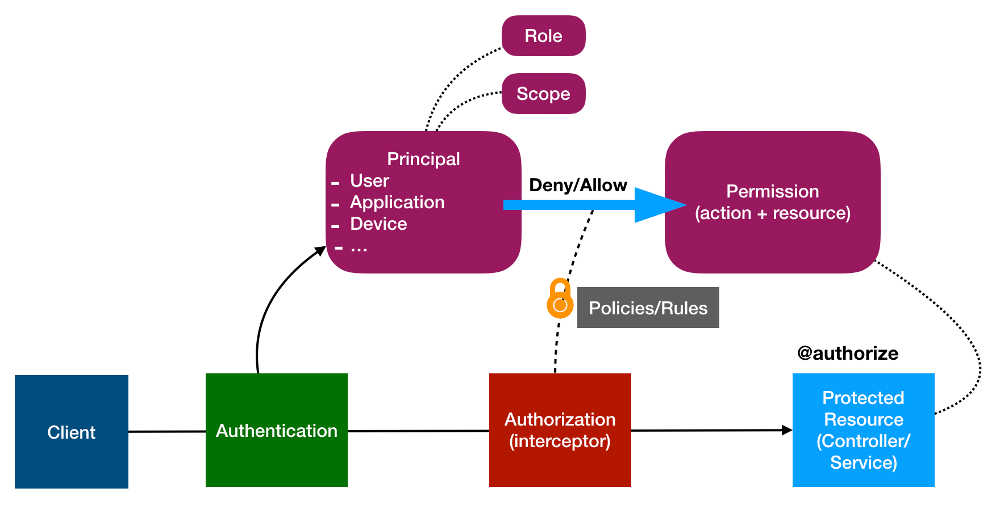

## Overview

Authorization decides if a subject can perform specific action on an object. Every
protected API endpoint can restrict access based on roles or permissions.
Clients authenticate to get a token (JWT or similar) which they pass as authorization
header in every API call. User permissions are included in the token as `scopes` and `roles`.
The user identity is deducted from the incoming request by the `Authentication Component` as `Principal`.

## Design

LoopBack's highly extensible authorization package
[@loopback/authorization](https://github.com/strongloop/loopback-next/tree/master/packages/authorization)
provides various features and provisions to check access rights of a `Principal` on a API endpoint.

It provides,
- a decorator `to annotate controller methods` with authorization metadata ([see, Configuring API Endpoints](##Configuring-API-Endpoints)) which consists of the following
  - type of the protected resource (such as customer or order)
  - allowed roles and denied roles (to provide ACL based rules)
  - scopes (oauth scopes such as `delete public images` or `register user`)
  - voters (supply a list of functions to vote on a decision)

- an interceptor to enforce authorization with `user provided voters/authorizers` ([see, Programming Access Policies](##Programming-Access-Policies)) on API calls using,
  - authorization metadata added by the decorator on the target controller method (roles, scopes, voters)
  - a Principal/Subject deducted from the incoming request
  - [a decision matrix](##Authorization-by-decision-matrix)




## Authorization Component

- The `@loopback/authorization` package exports an
  [Authorization Component class](https://github.com/strongloop/loopback-next/blob/master/packages/authorization/src/authorization-component.ts).

  - Developers will have to register this component to use access control
    features in their application.

  - The component binds an in-built interceptor (`Authorization Interceptor`) to
    all API calls.

    - The interceptor checks to see if the endpoint is annotated with an
      authorization specification.
    - It executes all classes tagged as `Authorizer` to enforce access/privilege
      control.
    - Based on the result of every `Authorizer` it decides if the current
      identity has access to the endpoint.

  - The component also declares various
    [types](https://github.com/strongloop/loopback-next/blob/master/packages/authorization/src/types.ts)
    to use in defining necessary classes and inputs by developers.

    - `Authorizer`: A class implementing access policies. Accepts
      `AuthorizationContext` and `AuthorizationMetadata` as input and returns an
      `AuthorizationDecision`.

    - `AuthorizationDecision`: expected type to be returned by an `Authorizer`

    - `AuthorizationMetadata`: expected type of the authorization spec passed to
      the decorator used to annotate a controller method. Also provided as input
      parameter to the `Authorizer`.

    - `AuthorizationContext`: contains current principal invoking an endpoint
      and expected roles and scopes.

    - `Enforcer`: type of extension classes that provide authorization services
      for an `Authorizer`.

    - `AuthorizationRequest`: type of the input provided to an `Enforcer`.

    - `AuthorizationError`: expected type of the error thrown by an `Authorizer`

## Configuring API Endpoints

Users can annotate the controller methods with access specifications using an
`authorize` decorator. The access specifications are defined as per type
[AuthorizationMetadata](https://github.com/strongloop/loopback-next/blob/master/packages/authorization/src/types.ts).

```ts
  @post('/users/{userId}/orders', {
    responses: {
      '200': {
        description: 'User.Order model instance',
        content: {'application/json': {schema: {'x-ts-type': Order}}},
      },
    },
  })
  @authenticate('jwt')
  @authorize({resource: 'order', scopes: ['create']})
  async createOrder(
    @param.path.string('userId') userId: string,
    @requestBody() order: Order,
  ): Promise<Order> {
    await this.userRepo.orders(userId).create(order);
  }
```

Please note that `@authorize` can also be applied at class level for all methods
within the class. In the code below, `numOfViews` is protected with
`BasicStrategy` (inherited from the class level) while `hello` does not require
authorization (skipped by `@authorize.skip`).

```ts
@authorize({allow: ['ADMIN']})
export class MyController {
  @get('/number-of-views')
  numOfViews(): number {
    return 100;
  }

  @authorize.skip()
  @get('/hello')
  hello(): string {
    return 'Hello';
  }
}
```

## Programming Access Policies

Users are expected to program policies that enforce access control, in classes
of type `Authorizer` as below. The `authorize()` function in this class is
expected to be called by the `Authorization Interceptor` which is called for
every API endpoint decorated with `@authorize()`.

> Usually the `authorize()` function in a `Authorizer` is binded through a
> provider as below

```ts
class MyAuthorizationProvider implements Provider<Authorizer> {
  /**
   * @returns authenticateFn
   */
  value(): Authorizer {
    return this.authorize.bind(this);
  }

  async authorize(
    context: AuthorizationContext,
    metadata: AuthorizationMetadata,
  ) {
    events.push(context.resource);
    if (
      context.resource === 'OrderController.prototype.cancelOrder' &&
      context.principals[0].name === 'user-01'
    ) {
      return AuthorizationDecision.DENY;
    }
    return AuthorizationDecision.ALLOW;
  }
}
```

> and then tagged to an application as `AuthorizationTags.AUTHORIZER` as below.

```ts
import AuthorizationTags from '@loopback/authorization';
let app = new Application();
app
  .bind('authorizationProviders.my-provider')
  .toProvider(MyAuthorizationProvider)
  .tag(AuthorizationTags.AUTHORIZER);
```

This creates a list of `authorize()` funtions. The authorize interceptor gets
the list of classes tagged with AuthorizationTags.`AUTHORIZER` and calls the
functions one after another. The `authorize()` function is expected to return an
object of type `AuthorizationDecision`. If the type returned is
`AuthorizationDecision.ALLOW` the current `Principal` has passed the executed
`authorize()` function's criteria.


## Authorization by decision matrix

The final decision is controlled by voting results from authorizers and options
for the authorization component.

The following table illustrates the decision matrix with 3 voters and
corresponding options.

| Vote #1 | Vote # 2 | Vote #3 | Options                  | Final Decision |
| ------- | -------- | ------- | ------------------------ | -------------- |
| Deny    | Deny     | Deny    | **any**                  | Deny           |
| Allow   | Allow    | Allow   | **any**                  | Allow          |
| Abstain | Allow    | Abstain | **any**                  | Allow          |
| Abstain | Deny     | Abstain | **any**                  | Deny           |
| Deny    | Allow    | Abstain | {precedence: Deny}       | Deny           |
| Deny    | Allow    | Abstain | {precedence: Allow}      | Allow          |
| Allow   | Abstain  | Deny    | {precedence: Deny}       | Deny           |
| Allow   | Abstain  | Deny    | {precedence: Allow}      | Allow          |
| Abstain | Abstain  | Abstain | {defaultDecision: Deny}  | Deny           |
| Abstain | Abstain  | Abstain | {defaultDecision: Allow} | Allow          |

The `options` is described as follows:

```ts
export interface AuthorizationOptions {
  /**
   * Default decision if all authorizers vote for ABSTAIN
   */
  defaultDecision?: AuthorizationDecision.DENY | AuthorizationDecision.ALLOW;
  /**
   * Controls if Allow/Deny vote takes precedence and override other votes
   */
  precedence?: AuthorizationDecision.DENY | AuthorizationDecision.ALLOW;
}
```

The authorization component can be configured with options:

```ts
const options: AuthorizationOptions = {
  precedence: AuthorizationDecisions.DENY;
  defaultDecision: AuthorizationDecisions.DENY;
}

const binding = app.component(AuthorizationComponent);
app.configure(binding.key).to(options);
```
