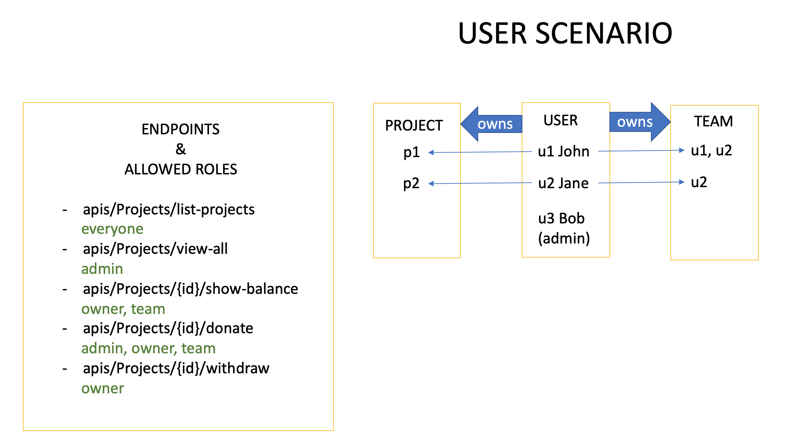
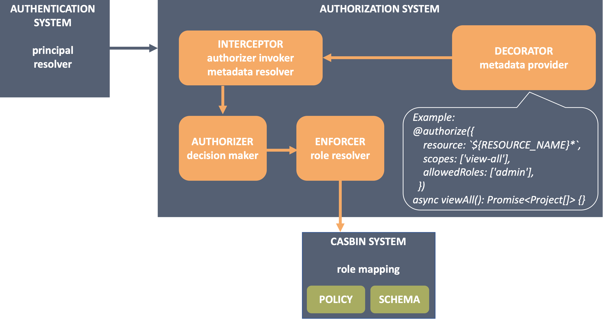

To get familiar with the authorization module and each element's responsibility,
this page will use the implementation of a RBAC(role-based-access-control)
system as example.

## User scenario

This is a RBAC system for users to manage their projects and teams. A user can
create a project and an associated team, then it becomes the project owner and
other users in the team become team members. When a user wants to perform an
action to the protected resource, its role and a collection of access control
rules makes decision: allowed or denied.

As you can tell from the table, there are different level's permission rules:

- class level permission: admin can view all projects.
- instance level permission: a project's owner/team member can check its
  balance.

## Architecture

To build such a system, this is a list of what are needed and how to do it:

| WHAT ARE NEEDED                                                                 | HOW TO DO                                                                                                                                                                                                                                                              |
| ------------------------------------------------------------------------------- | ---------------------------------------------------------------------------------------------------------------------------------------------------------------------------------------------------------------------------------------------------------------------- |
| A way to annotate endpoints with permission rules.                              | **Decorate** your endpoints with permission metadata using `@authorize()`.                                                                                                                                                                                             |
| A decision maker that processes the metadata and calls the role resolver.       | Create **authorizers** to make decision. They process context like the metadata and the principal resolved from request, then invoke enforcer which talks to 3rd party libraries to calculate the result.                                                              |
| A role resolver to determine whether the principal have access to the resource. | Create **enforcers** calling 3rd party (casbin in this case) APIs to calculate the decision.                                                                                                                                                                           |
| A 3rd party system manages the role mapping.                                    | Leverage a **[casbin system](https://casbin.org/en/)** to define and understand the role mapping. It consists of: 1. A **model file** describes the shape of request, policy, role mapping, and the decision rules. 2. **Policy files** contains all the policy rules. |
| A module to put all parts above together.                                       | Mount component `@loopback/authorization`.                                                                                                                                                                                                                             |

The architecture diagram is:

## Tutorial

The example is created in repository
[access-control-migration](https://github.com/strongloop/loopback-next/tree/master/examples/access-control-migration),
and a tutorial of building it from scratch can be found in
[access control example migration](./migration/auth/example.md).
