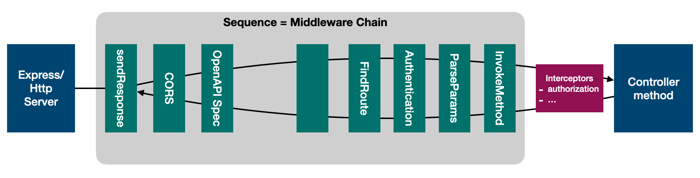
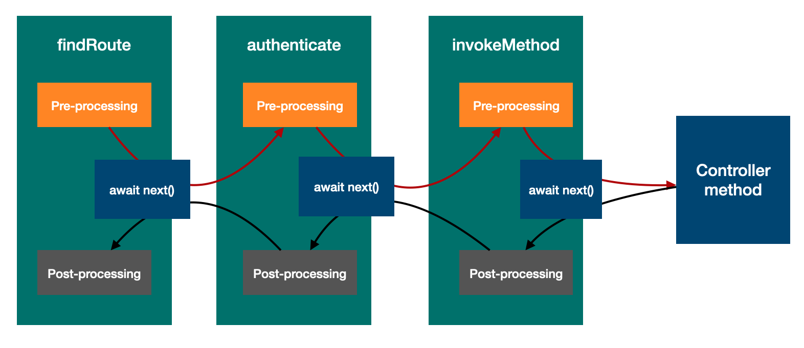

## What is a Sequence?

A `Sequence` is a series of steps to control how a specific type of `Server`
responds to incoming requests. Each types of servers, such as RestServer,
GraphQLServer, GRPCServer, and WebSocketServer, will have its own flavor of
sequence. The sequence represents the pipeline for inbound connections.

The contract of a `Sequence` is simple: it must produce a response for a
request. The signature will vary by server types.

Each server type has a default sequence. It's also possible to create your own
`Sequence` to have full control over how your `Server` instances handle requests
and responses.

This page describes the middleware-based sequence for REST server.

The `handle` method receives an instance of `RequestContext`, which is a
subclass of `Context` that wraps the `Request` and `Response` objects from the
underlying Express server.

## Use the sequence for your REST Application

When a LoopBack application is scaffolded using `lb4 app` command, a
`MySequence` class is generated in `src/sequence.ts`.

```ts
import {MiddlewareSequence} from '@loopback/rest';

export class MySequence extends MiddlewareSequence {}
```

`MySequence` is then used by the `RestApplication` in `src/application.ts`:

```ts
import {BootMixin} from '@loopback/boot';
import {ApplicationConfig} from '@loopback/core';
import {RepositoryMixin} from '@loopback/repository';
import {RestApplication} from '@loopback/rest';
import {ServiceMixin} from '@loopback/service-proxy';
import {MySequence} from './sequence';

export {ApplicationConfig};

export class TodoListApplication extends BootMixin(
  ServiceMixin(RepositoryMixin(RestApplication)),
) {
  constructor(options: ApplicationConfig = {}) {
    super(options);

    // Set up the custom sequence
    this.sequence(MySequence);

    // ...
  }
}
```

## The default sequence

Since version 6.0.0 of `@loopback/rest`, we have switched to a middleware-based
sequence as the default for flexibility, composability, and consistency. The
sequence itself is basically a named middleware chain. Each middleware serves as
an action within the sequence. The `handle` function executes registered
middleware in cascading fashion.

```ts
/**
 * A sequence implementation using middleware chains
 */
export class MiddlewareSequence implements SequenceHandler {
  static defaultOptions: InvokeMiddlewareOptions = {
    chain: 'middlewareChain.rest',
    orderedGroups: [
      // Please note that middleware is cascading. The `sendResponse` is
      // added first to invoke downstream middleware to get the result or
      // catch errors so that it can produce the http response.
      'sendResponse',

      // default
      'cors',
      'apiSpec',

      // default
      'middleware',

      // rest
      'findRoute',

      // authentication
      'authentication',

      // rest
      'parseParams',
      'invokeMethod',
    ],
  };

  /**
   * Constructor: Injects `InvokeMiddleware` and `InvokeMiddlewareOptions`
   *
   * @param invokeMiddleware - invoker for registered middleware in a chain.
   * To be injected via SequenceActions.INVOKE_MIDDLEWARE.
   */
  constructor(
    @inject(SequenceActions.INVOKE_MIDDLEWARE)
    readonly invokeMiddleware: InvokeMiddleware,
    @config()
    readonly options: InvokeMiddlewareOptions = MiddlewareSequence.defaultOptions,
  ) {}

  /**
   * Runs the default sequence. Given a handler context (request and response),
   * running the sequence will produce a response or an error.
   *
   * @param context - The request context: HTTP request and response objects,
   * per-request IoC container and more.
   */
  async handle(context: RequestContext): Promise<void> {
    debug(
      'Invoking middleware chain %s with groups %s',
      this.options.chain,
      this.options.orderedGroups,
    );
    await this.invokeMiddleware(context, this.options);
  }
}
```



## Middleware as actions

The middleware function is responsible for processing HTTP requests and
responses. It typically includes the following logic.

1.  Process the request from the server or upstream middleware with one of the
    following outcomes:

    - Reject the request by throwing an error if the request is invalid

      ```ts
      import {Middleware} from '@loopback/rest';
      const middleware = async (ctx, next) => {
        // validate input
        throw new Error('invalid input');
      };
      ```

    - Produce a response by itself, such as from the cache

      ```ts
      import {Middleware} from '@loopback/rest';
      const middleware = async (ctx, next) => {
        // Find the response from cache
        const cachedResponse = {};
        return cachedResponse;
      };
      ```

    - Proceed by calling `await next()` to invoke downstream middleware. When
      `await next()` returns, it goes to step 2. If an error thrown from
      `await next()`, step 3 handles the error.

      ```ts
      import {Middleware} from '@loopback/rest';
      const middleware = async (ctx, next) => {
        const result = await next();
        return result;
      };
      ```

2.  Process the response from downstream middleware or the target operation with
    one the following outcomes:

    - Reject the response by throwing an error

      ```ts
      import {Middleware} from '@loopback/rest';
      const middleware = async (ctx, next) => {
        const result = await next();
        // validate result
        throw new Error('...');
      };
      ```

    - Transform the response to a different value

      ```ts
      import {Middleware} from '@loopback/rest';
      const middleware = async (ctx, next) => {
        const result = await next();
        return {data: result};
      };
      ```

    - Return the response to upstream middleware

      ```ts
      import {Middleware} from '@loopback/rest';
      const middleware = async (ctx, next) => {
        const result = await next();
        return result;
      };
      ```

3.  Catch the error thrown from `await next()`. If the `catch` block does not
    exist, the error will be bubbled up to upstream middleware.

    ```ts
    import {Middleware} from '@loopback/rest';
    const middleware = async (ctx, next) => {
      try {
        const result = await next();
        return result;
      } catch (err) {
        // handle err
        // either return a new value or throw an error
        throw err;
      }
    };
    ```



Default sequence executes these groups of middleware in order:

- `cors`: Enforces `CORS`
- `openApiSpec`: Serves OpenAPI specs
- `findRoute`: Finds the appropriate controller method, swagger spec and args
  for invocation
- `parseParams`: Parses HTTP request to get API argument list
- `invokeMethod`: Invokes the API which is defined in the Application controller
  method

In front of the groups above, we have a special middleware called
`sendResponse`, which first invokes downstream middleware to get a result and
handles the result or error respectively.

- Writes the result from API into the HTTP response (if the HTTP response has
  not been produced yet by the middleware chain.
- Catches error logs it using 'logError' if any of the above steps in the
  sequence fails with an error.

## Migrate from legacy sequence

The `Sequence` generated before `@loopback/rest@6.0.0` comes with hard-coded
actions as follows:

```ts
import {inject} from '@loopback/core';
import {
  FindRoute,
  InvokeMethod,
  InvokeMiddleware,
  ParseParams,
  Reject,
  RequestContext,
  RestBindings,
  Send,
  SequenceHandler,
} from '@loopback/rest';

const SequenceActions = RestBindings.SequenceActions;

export class MySequence implements SequenceHandler {
  /**
   * Optional invoker for registered middleware in a chain.
   * To be injected via SequenceActions.INVOKE_MIDDLEWARE.
   */
  @inject(SequenceActions.INVOKE_MIDDLEWARE, {optional: true})
  protected invokeMiddleware: InvokeMiddleware = () => false;

  constructor(
    @inject(SequenceActions.FIND_ROUTE) protected findRoute: FindRoute,
    @inject(SequenceActions.PARSE_PARAMS) protected parseParams: ParseParams,
    @inject(SequenceActions.INVOKE_METHOD) protected invoke: InvokeMethod,
    @inject(SequenceActions.SEND) public send: Send,
    @inject(SequenceActions.REJECT) public reject: Reject,
  ) {}

  async handle(context: RequestContext) {
    try {
      const {request, response} = context;
      const finished = await this.invokeMiddleware(context);
      if (finished) return;
      const route = this.findRoute(request);
      const args = await this.parseParams(request, route);
      const result = await this.invoke(route, args);
      this.send(response, result);
    } catch (err) {
      this.reject(context, err);
    }
  }
}
```

The legacy `Sequence` is now deprecated but it should continue to work without
any changes.

If you have never customized `src/sequence.ts` generated by `lb4 app`, or you
have only modified the code by adding
[`authenticate`](Authentication-component-action.md) action per our docs, you
can simply migrate to the middleware based sequence by replacing the content of
`src/sequence.ts` with the code below.

```ts
import {MiddlewareSequence} from '@loopback/rest';

export class MySequence extends MiddlewareSequence {}
```

If you have other actions in your sequence, you'll have to write a middleware to
wrap your action and register it with the middleware chain for the
middleware-based sequence. For example, the `invokeMethod` action is a function
with the following signature:

```ts
export type InvokeMethod = (
  route: RouteEntry,
  args: OperationArgs,
) => Promise<OperationRetval>;
```

As part of the legacy action-based sequence, the `invoke` function takes `route`
and `args` as input parameters and returns `result`.

```ts
const route = this.findRoute(request);
const args = await this.parseParams(request, route);
const result = await this.invoke(route, args);
this.send(response, result);
```

The corresponding middleware for `invokeMethod` looks like the following. It now
uses the `context` to retrieve `route` and `params` instead. The return value is
also bound to `RestBindings.Operation.RETURN_VALUE` to expose to other
middleware in the chain.

```ts
async (ctx, next) => {
  // Locate or inject input parameters from the request context
  const route: RouteEntry = await ctx.get(RestBindings.Operation.ROUTE);
  const params: OperationArgs = await ctx.get(RestBindings.Operation.PARAMS);
  const retVal = await this.invokeMethod(route, params);
  // Bind the return value to the request context
  ctx.bind(RestBindings.Operation.RETURN_VALUE).to(retVal);
  return retVal;
};
```

## Extend the middleware sequence

The middleware based sequence is a middleware chain that accepts contribution of
middleware against `RestTags.REST_MIDDLEWARE_CHAIN`.

### Add middleware to the chain

LoopBack middleware (including Express middleware) can be added to the sequence.
See
[Middleware](Middleware.md#register-middleware-to-be-executed-by-invokemiddleware-actions)
for more details.

### Sort middleware by groups

The middleware for the sequence are executed in the order of groups in a
cascading style. The order of groups is determined by two factors:

1.  The relative order specified for a middleware binding.

    - upstreamGroups: An array of group names that should be upstream to this
      middleware

      ```ts
      @injectable(
        asMiddleware({
          chain: RestTags.REST_MIDDLEWARE_CHAIN,
          group: 'authentication',
          upstreamGroups: ['cors', 'findRoute'],
        }),
      )
      export class AuthenticationMiddlewareProvider
        implements Provider<Middleware> {}
      ```

    - downstreamGroups: An array of group names that should be downstream to
      this middleware

      ```ts
      @injectable(
        asMiddleware({
          group: 'sendResponse',
          downstreamGroups: ['cors', 'invokeMethod'],
          chain: RestTags.REST_MIDDLEWARE_CHAIN,
        }),
      )
      export class SendResponseMiddlewareProvider
        implements Provider<Middleware> {}
      ```

2.  The overall order of groups for the sequence

- It can be set as in `InvokeMiddlewareOptions`, which is the configuration for
  the middleware-based sequence. For example:

  ```ts
  import {BootMixin} from '@loopback/boot';
  import {ApplicationConfig} from '@loopback/core';
  import {RepositoryMixin} from '@loopback/repository';
  import {
    InvokeMiddlewareOptions,
    Request,
    Response,
    RestApplication,
    RestTags,
  } from '@loopback/rest';
  import {RestExplorerComponent} from '@loopback/rest-explorer';
  import {ServiceMixin} from '@loopback/service-proxy';
  import {MySequence} from './sequence';

  export class TodoListApplication extends BootMixin(
    ServiceMixin(RepositoryMixin(RestApplication)),
  ) {
    constructor(options: ApplicationConfig = {}) {
      super(options);

      const middlewareOptions: InvokeMiddlewareOptions = {
        chain: 'middlewareChain.rest',
        orderedGroups: [
          // Please note that middleware is cascading. The `sendResponse` is
          // added first to invoke downstream middleware to get the result or
          // catch errors so that it can produce the http response.

          'sendResponse',

          // default
          'cors',
          'apiSpec',

          // default
          'middleware',

          // rest
          'findRoute',

          // authentication
          'authentication',

          // rest
          'parseParams',
          'invokeMethod',
        ],
      };
      this.configure(RestBindings.SEQUENCE).to(middlewareOptions); // Set up the custom sequence
      this.sequence(MySequence);
    }
  }
  ```

When each middleware is added to the chain, its settings of `downstreamGroups`
and `upstreamGroups` are honored in conjunction with the overall order. If there
is a conflict, an error will be thrown.

Here are some examples:

1. Form a middleware chain with the execution order of
   `sendResponse => group2 => cors => group1`:

```
orderedGroups: ['sendResponse', 'cors']
middleware 1:
  - group: 'group1'
  - upstreamGroups: ['cors']

middleware 2:
  - group: 'group2'
  - downstreamGroups: ['cors']
```

2. a middleware chain with the execution order of
   `sendResponse => group2 => cors => group1`:

```
orderedGroups: ['sendResponse', 'cors']
middleware 1:
  - group: 'group1'
  - upstreamGroups: ['group2', 'cors']

middleware 2:
  - group: 'group2'
  - downstreamGroups: ['cors']
```

2. a middleware chain with an invalid order as `group1` and `group2` creates a
   circular dependency:

```
orderedGroups: ['sendResponse', 'cors']
middleware 1:
  - group: 'group1'
  - upstreamGroups: ['group2', 'cors']

middleware 2:
  - group: 'group2'
  - downstreamGroups: ['group1']
```

## Custom Sequences

Most use cases can be accomplished with `MiddlewareSequence`. When an app is
generated by the command `lb4 app`, a sequence file extending
`MiddlewareSequence` at `src/sequence.ts` is already generated and bound for you
so that you can easily customize it.

A `Sequence` class for REST server is required to implement the
`SequenceHandler` interface:

```ts
import {RequestContext} from '@loopback/rest';
/**
 * A sequence handler is a class implementing sequence of actions
 * required to handle an incoming request.
 */
export interface SequenceHandler {
  /**
   * Handle the request by running the configured sequence of actions.
   *
   * @param context - The request context: HTTP request and response objects,
   * per-request IoC container and more.
   */
  handle(context: RequestContext): Promise<void>;
}
```

Here is an example where the application logs out a message before and after a
request is handled:

```ts
import {MiddlewareSequence, Request, Response} from '@loopback/rest';

class MySequence extends MiddlewareSequence {
  log(msg: string) {
    console.log(msg);
  }
  async handle(context: RequestContext) {
    this.log('before request');
    await super.handle(context);
    this.log('after request');
  }
}
```

In order for LoopBack to use your custom sequence, you must register it before
starting your `Application`:

```js
import {RestApplication} from '@loopback/rest';

const app = new RestApplication();
app.sequence(MySequence);

app.start();
```

## Advanced topics

### Customizing Sequence Actions

There might be scenarios where the default sequence _ordering_ is not something
you want to change, but rather the individual actions that the sequence will
execute.

To do this, you'll need to override one or more of the sequence action bindings
used by the `RestServer`, under the `RestBindings.SequenceActions` constants.

As an example, we'll implement a custom sequence action to replace the default
"send" action. This action is responsible for returning the response from a
controller to the client making the request.

To do this, we'll register a custom send action by binding a
[Provider](https://loopback.io/doc/en/lb4/apidocs.context.provider.html) to the
`RestBindings.SequenceActions.SEND` key.

First, let's create our `CustomSendProvider` class, which will provide the send
function upon injection.


**custom-send.provider.ts**

```ts
import {Send, Response} from '@loopback/rest';
import {Provider, BoundValue, inject} from '@loopback/core';
import {writeResultToResponse, RestBindings, Request} from '@loopback/rest';

// Note: This is an example class; we do not provide this for you.
import {Formatter} from '../utils';

export class CustomSendProvider implements Provider<Send> {
  // In this example, the injection key for formatter is simple
  constructor(
    @inject('utils.formatter') public formatter: Formatter,
    @inject(RestBindings.Http.REQUEST) public request: Request,
  ) {}

  value() {
    // Use the lambda syntax to preserve the "this" scope for future calls!
    return (response: Response, result: OperationRetval) => {
      this.action(response, result);
    };
  }
  /**
   * Use the mimeType given in the request's Accept header to convert
   * the response object!
   * @param response - The response object used to reply to the  client.
   * @param result - The result of the operation carried out by the controller's
   * handling function.
   */
  action(response: Response, result: OperationRetval) {
    if (result) {
      // Currently, the headers interface doesn't allow arbitrary string keys!
      const headers = (this.request.headers as any) || {};
      const header = headers.accept || 'application/json';
      const formattedResult = this.formatter.convertToMimeType(result, header);
      response.setHeader('Content-Type', header);
      response.end(formattedResult);
    } else {
      response.end();
    }
  }
}
```

Our custom provider will automatically read the `Accept` header from the request
context, and then transform the result object so that it matches the specified
MIME type.

Next, in our application class, we'll inject this provider on the
`RestBindings.SequenceActions.SEND` key.



```ts
import {RestApplication, RestBindings} from '@loopback/rest';
import {
  RepositoryMixin,
  Class,
  Repository,
  juggler,
} from '@loopback/repository';
import {CustomSendProvider} from './providers/custom-send.provider';
import {Formatter} from './utils';
import {BindingScope} from '@loopback/core';

export class YourApp extends RepositoryMixin(RestApplication) {
  constructor() {
    super();
    // Assume your controller setup and other items are in here as well.
    this.bind('utils.formatter')
      .toClass(Formatter)
      .inScope(BindingScope.SINGLETON);
    this.bind(RestBindings.SequenceActions.SEND).toProvider(CustomSendProvider);
  }
}
```

As a result, whenever the send action of the
[`DefaultSequence`](https://loopback.io/doc/en/lb4/apidocs.rest.defaultsequence.html)
is called, it will make use of your function instead! You can use this approach
to override any of the actions listed under the `RestBindings.SequenceActions`
namespace.

### Query string parameters and path parameters

OAI 3.0.x describes the data from a request’s header, query and path in an
operation specification’s parameters property. In a Controller method, such an
argument is typically decorated by @param(). We've made multiple shortcuts
available to the `@param()` decorator in the form of
`@param.<http_source>.<OAI_primitive_type>`. Using this notation, path
parameters can be described as `@param.path.string`. Here is an example of a
controller method which retrieves a Note model instance by obtaining the `id`
from the path object.

```ts
@get('/notes/{id}', {
  responses: {
    '200': {
      description: 'Note model instance',
      content: {
        'application/json': {
          schema: getModelSchemaRef(Note, {includeRelations: true}),
        },
      },
    },
  },
})
async findById(
  @param.path.string('id') id: string,
  @param.filter(Note, {exclude: 'where'}) filter?: FilterExcludingWhere<Note>
): Promise<Note> {
  return this.noteRepository.findById(id, filter);
}
```

(Notice: the filter for `findById()` method only supports the `include` clause
for now.)

You can also specify a parameter which is an object value encoded as a JSON
string or in multiple nested keys. For a JSON string, a sample value would be
`location={"lang": 23.414, "lat": -98.1515}`. For the same `location` object, it
can also be represented as `location[lang]=23.414&location[lat]=-98.1515`. Here
is the equivalent usage for `@param.query.object()` decorator. It takes in the
name of the parameter and an optional schema or reference object for it.

```ts
@param.query.object('location', {
  type: 'object',
  properties: {lat: {type: 'number', format: 'float'}, long: {type: 'number', format: 'float'}},
})
```

The parameters are retrieved as the result of `parseParams` Sequence action.
Please note that deeply nested properties are not officially supported by OAS
yet and is tracked by
[OAI/OpenAPI-Specification#1706](https://github.com/OAI/OpenAPI-Specification/issues/1706).
Therefore, our REST API Explorer does not allow users to provide values for such
parameters and unfortunately has no visible indication of that. This problem is
tracked and discussed in
[swagger-api/swagger-js#1385](https://github.com/swagger-api/swagger-js/issues/1385).

### Parsing Requests

Parsing and validating arguments from the request url, headers, and body. See
page [Parsing requests](Parsing-requests.md).

### Invoking controller methods

The `invoke` sequence action simply takes the parsed request parameters from the
`parseParams` action along with non-decorated arguments, calls the corresponding
controller method or route handler method, and returns the value from it. The
default implementation of
[invoke](https://github.com/strongloop/loopback-next/blob/6bafa0774662991199090219913c3dc77ad5b149/packages/rest/src/providers/invoke-method.provider.ts)
action calls the handler function for the route with the request specific
context and the arguments for the function. It is important to note that
controller methods use `invokeMethod` from `@loopback/core` and can be used with
global and custom interceptors. See
[Interceptor docs](Interceptor.md#use-invokemethod-to-apply-interceptors) for
more details. The request flow for two route flavours is explained below.

For controller methods:

- A controller instance is instantiated from the context. As part of the
  instantiation, constructor and property dependencies are injected. The
  appropriate controller method is invoked via the chain of interceptors.
- Arguments decorated with `@param` are resolved using data parsed from the
  request. Arguments decorated with `@inject` are resolved from the context.
  Arguments with no decorators are set to undefined, which is replaced by the
  argument default value if it's provided.

For route handlers, the handler function is invoked via the chain of
interceptors. The array of method arguments is constructed using OpenAPI spec
provided at handler registration time (either via `.api()` for full schema or
`.route()` for individual route registration).

### Writing the response

The
[send](https://github.com/strongloop/loopback-next/blob/6bafa0774662991199090219913c3dc77ad5b149/packages/rest/src/providers/send.provider.ts)
sequence action is responsible for writing the result of the `invoke` action to
the HTTP response object. The default sequence calls send with (transformed)
data. Under the hood, send performs all steps required to send back the
response, from content-negotiation to serialization of the response body. In
Express, the handler is responsible for setting response status code, headers
and writing the response body. In LoopBack, controller methods and route
handlers return data describing the response and it's the responsibility of the
Sequence to send that data back to the client. This design makes it easier to
transform the response before it is sent.

LoopBack 4 does not yet provide first-class support for streaming responses, see
[Issue#2230](https://github.com/strongloop/loopback-next/issues/2230). As a
short-term workaround, controller methods are allowed to send the response
directly, effectively bypassing send action. The default implementation of send
is prepared to handle this case
[here](https://github.com/strongloop/loopback-next/blob/bf07ff959a1f90577849b61221b292d3127696d6/packages/rest/src/writer.ts#L22-L26).

### Handling errors

There are many reasons why the application may not be able to handle an incoming
request:

- The requested endpoint (method + URL path) was not found.
- Parameters provided by the client were not valid.
- A backend database or a service cannot be reached.
- The response object cannot be converted to JSON because of cyclic
  dependencies.
- A programmer made a mistake and a `TypeError` is thrown by the runtime.
- And so on.

In the Sequence implementation described above, all errors are handled by a
single `catch` block at the end of the sequence, using the Sequence Action
called `reject`.

The default implementation of `reject` does the following steps:

- Call
  [strong-error-handler](https://github.com/strongloop/strong-error-handler) to
  send back an HTTP response describing the error.
- Log the error to `stderr` if the status code was 5xx (an internal server
  error, not a bad request).

To prevent the application from leaking sensitive information like filesystem
paths and server addresses, the error handler is configured to hide error
details.

- For 5xx errors, the output contains only the status code and the status name
  from the HTTP specification. For example:

  ```json
  {
    "error": {
      "statusCode": 500,
      "message": "Internal Server Error"
    }
  }
  ```

- For 4xx errors, the output contains the full error message (`error.message`)
  and the contents of the `details` property (`error.details`) that
  `ValidationError` typically uses to provide machine-readable details about
  validation problems. It also includes `error.code` to allow a machine-readable
  error code to be passed through which could be used, for example, for
  translation.

  ```json
  {
    "error": {
      "statusCode": 422,
      "name": "Unprocessable Entity",
      "message": "Missing required fields",
      "code": "MISSING_REQUIRED_FIELDS"
    }
  }
  ```

During development and testing, it may be useful to see all error details in the
HTTP response returned by the server. This behavior can be enabled by enabling
the `debug` flag in error-handler configuration as shown in the code example
below. See strong-error-handler
[docs](https://github.com/strongloop/strong-error-handler#options) for a list of
all available options.

```ts
app.bind(RestBindings.ERROR_WRITER_OPTIONS).to({debug: true});
```

An example error message when the debug mode is enabled:

```json
{
  "error": {
    "statusCode": 500,
    "name": "Error",
    "message": "ENOENT: no such file or directory, open '/etc/passwords'",
    "errno": -2,
    "syscall": "open",
    "code": "ENOENT",
    "path": "/etc/passwords",
    "stack": "Error: a test error message\n    at Object.openSync (fs.js:434:3)\n    at Object.readFileSync (fs.js:339:35)"
  }
}
```

### Keeping your Sequences

For most use cases, the
[default](https://github.com/strongloop/loopback-next/blob/6bafa0774662991199090219913c3dc77ad5b149/packages/rest/src/sequence.ts)
sequence supplied with LoopBack 4 applications is good enough for
request-response handling pipeline. Check out
[Custom Sequences](#custom-sequences) on how to extend it and implement custom
actions.

## Working with Express middleware



Under the hood, LoopBack leverages [Express](https://expressjs.com) framework
and its concept of middleware. To avoid common pitfalls, it is not possible to
mount Express middleware directly on a LoopBack application. Instead, LoopBack
provides and enforces a higher-level structure.

In a typical Express application, there are four kinds of middleware invoked in
the following order:

1. Request-preprocessing middleware like
   [cors](https://www.npmjs.com/package/cors) or
   [body-parser](https://www.npmjs.com/package/body-parser).
2. Route handlers handling requests and producing responses.
3. Middleware serving static assets (files).
4. Error handling middleware.

In LoopBack, we handle the request in the following steps:

1. The built-in request-preprocessing middleware is invoked.
2. The registered Sequence is started. The default implementation of `findRoute`
   and `invoke` actions will try to match the incoming request against the
   following resources:
   1. Native LoopBack routes (controller methods, route handlers).
   2. External Express routes (registered via `mountExpressRouter` API)
   3. Static assets
3. Errors are handled by the Sequence using `reject` action.

Let's see how different kinds of Express middleware can be mapped to LoopBack
concepts:

### Request-preprocessing middleware

At the moment, LoopBack does not provide API for mounting arbitrary middleware,
we are discussing this feature in issues
[#1293](https://github.com/strongloop/loopback-next/issues/1293) and
[#2035](https://github.com/strongloop/loopback-next/issues/2035). Please up-vote
them if you are interested in using Express middleware in LoopBack applications.

All applications come with [cors](https://www.npmjs.com/package/cors) enabled,
this middleware can be configured via RestServer options - see
[Customize CORS](Server.md#customize-cors).

While it is not possible to add additional middleware to a LoopBack application,
it is possible to mount the entire LoopBack application as component of a parent
top-level Express application where you can add arbitrary middleware as needed.
You can find more details about this approach in
[Creating an Express Application with LoopBack REST API](express-with-lb4-rest-tutorial.md)

### Route handlers

In Express, a route handler is a middleware function that serves the response
and does not call `next()`. Handlers can be registered using APIs like
`app.get()`, `app.post()`, but also a more generic `app.use()`.

In LoopBack, we typically use [Controllers](Controller.md) and
[Route handlers](Route.md) to implement request handling logic.

To support interoperability with Express, it is also possible to take an Express
Router instance and add it to a LoopBack application as an external router - see
[Mounting an Express Router](Route.md#mounting-an-express-router). This way it
is possible to implement server endpoints using Express APIs.

### Static files

LoopBack provides native API for registering static assets as described in
[Serve static files](Application.md#serve-static-files). Under the hood, static
assets are served by [serve-static](https://www.npmjs.com/package/serve-static)
middleware from Express.

The main difference between LoopBack and vanilla Express applications: LoopBack
ensures that static-asset middleware is always invoked as the last one, only
when no other route handled the request. This is important for performance
reasons to avoid costly filesystem calls.

### Error handling middleware

In Express, errors are handled by a special form of middleware, one that's
accepting four arguments: `err`, `request`, `response`, `next`. It's up to the
application developer to ensure that error handler is registered as the last
middleware in the chain, otherwise not all errors may be routed to it.

In LoopBack, we use async functions instead of callbacks and thus can use simple
`try`/`catch` flow to receive both sync and async errors from individual
sequence actions. A typical Sequence implementation then passes these errors to
the Sequence action `reject`.

You can learn more about error handling in [Handling errors](#handling-errors).

```

```
