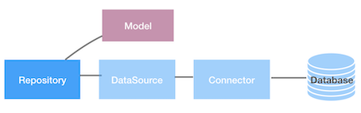

A `Repository` represents a specialized `Service` interface that provides
strong-typed data access (for example, CRUD) operations of a domain model
against the underlying database or service.







A `Repository` can be defined and implemented by application developers.
LoopBack ships a few predefined `Repository` interfaces for typical CRUD and KV
operations. These `Repository` implementations leverage `Model` definition and
`DataSource` configuration to fulfill the logic for data access.

```js
interface Repository<T extends Model> {}

interface CustomerRepository extends Repository<Customer> {
  find(filter?: Filter<Customer>, options?: Options): Promise<Customer[]>;
  findByEmail(email: string): Promise<Customer>;
  // ...
}
```

See more examples at:

- [Repository/CrudRepository/EntityRepository](https://github.com/strongloop/loopback-next/blob/master/packages/repository/src/repositories/repository.ts)
- [KeyValueRepository](https://github.com/strongloop/loopback-next/blob/master/packages/repository/src/repositories/kv.repository.ts)

## Installation

Legacy juggler support has been enabled in `loopback-next` and can be imported
from the `@loopback/repository` package. In order to do this, save
`@loopback/repository` as a dependency in your application.

You can then install your favorite connector by saving it as part of your
application dependencies.

## Repository Mixin

`@loopback/repository` provides a mixin for your Application that enables
convenience methods that automatically bind repository classes for you.
Repositories declared by components are also bound automatically.

Repositories are bound to `repositories.${ClassName}`. See example below for
usage.

```ts
import {Application} from '@loopback/core';
import {RepositoryMixin} from '@loopback/repository';
import {AccountRepository, CategoryRepository} from './repositories';

// Using the Mixin
class MyApplication extends RepositoryMixin(Application) {}

const app = new MyApplication();
// AccountRepository will be bound to key `repositories.AccountRepository`
app.repository(AccountRepository);
// CategoryRepository will be bound to key `repositories.CategoryRepository`
app.repository(CategoryRepository);
```

## Configure datasources

`DataSource` is a named configuration of a connector. The configuration
properties vary by connectors. For example, a datasource for `MySQL` needs to
set the `connector` property to `loopback-connector-mysql` with settings as
follows:

```json
{
  "host": "localhost",
  "port": 3306,
  "user": "my-user",
  "password": "my-password",
  "database": "demo"
}
```

`Connector` is a provider that implements data access or api calls with a
specific backend system, such as a database, a REST service, a SOAP Web Service,
or a gRPC micro-service. It abstracts such interactions as a list of operations
in the form of Node.js methods.

Typically, a connector translates LoopBack query and mutation requests into
native api calls supported by the underlying Node.js driver for the given
backend. For example, a connector for `MySQL` will map `create` method to SQL
INSERT statement, which can be executed through MySQL driver for Node.js.

When a `DataSource` is instantiated, the configuration properties will be used
to initialize the connector to connect to the backend system. You can define a
DataSource using legacy Juggler in your LoopBack 4 app as follows:



```ts
import {juggler} from '@loopback/repository';

// this is just an example, 'test' database doesn't actually exist
export const db = new juggler.DataSource({
  connector: 'mysql',
  host: 'localhost',
  port: 3306,
  database: 'test',
  password: 'pass',
  user: 'root',
});
```

## Define models

Models are defined as regular JavaScript classes. If you want your model to be
persisted in a database, your model must have an `id` property and inherit from
`Entity` base class.

TypeScript version:

```ts
import {Entity, model, property} from '@loopback/repository';

@model()
export class Account extends Entity {
  @property({id: true})
  id: number;

  @property({required: true})
  name: string;
}
```

JavaScript version:

```js
import {Entity, ModelDefinition} from '@loopback/repository';

export class Account extends Entity {}

Account.definition = new ModelDefinition({
  name: 'Account',
  properties: {
    id: {type: 'number', id: true},
    name: {type: 'string', required: true},
  },
});
```

## Define repositories

Use `DefaultCrudRepository` class to create a repository leveraging the legacy
juggler bridge and binding your Entity-based class with a datasource you have
configured earlier. It's recommended that you use
[Dependency Injection](Dependency-injection.md) to retrieve your datasource.

TypeScript version:

```ts
import {DefaultCrudRepository, juggler} from '@loopback/repository';
import {Account, AccountRelations} from '../models';
import {DbDataSource} from '../datasources';
import {inject} from '@loopback/context';

export class AccountRepository extends DefaultCrudRepository<
  Account,
  typeof Account.prototype.id,
  AccountRelations
> {
  constructor(@inject('datasources.db') dataSource: DbDataSource) {
    super(Account, dataSource);
  }
}
```

JavaScript version:

```js
import {DefaultCrudRepository} from '@loopback/repository';
import {Account} from '../models/account.model';
import {db} from '../datasources/db.datasource';

export class AccountRepository extends DefaultCrudRepository {
  constructor() {
    super(Account, db);
  }
}
```

### Controller Configuration

Once your DataSource is defined for your repository, all the CRUD methods you
call in your repository will use the Juggler and your connector's methods unless
you overwrite them. In your controller, you will need to define a repository
property and create a new instance of the repository you configured your
DataSource for in the constructor of your controller class as follows:

```ts
export class AccountController {
  constructor(
    @repository(AccountRepository) public repository: AccountRepository,
  ) {}
}
```

### Defining CRUD methods for your application

When you want to define new CRUD methods for your application, you will need to
modify the API Definitions and their corresponding methods in your controller.
Here are examples of some basic CRUD methods:

1.  Create API Definition:

```json
{
  "/accounts/create": {
    "post": {
      "x-operation-name": "createAccount",
      "requestBody": {
        "description": "The account instance to create.",
        "required": true,
        "content": {
          "application/json": {
            "schema": {
              "type": "object"
            }
          }
        }
      },
      "responses": {
        "200": {
          "description": "Account instance created",
          "content": {
            "application/json": {
              "schema": {
                "$ref": "#/components/schemas/Account"
              }
            }
          }
        }
      }
    }
  }
}
```

Create Controller method:

```ts
async createAccount(accountInstance: Account) {
  return this.repository.create(accountInstance);
}
```

2.  Find API Definition:

```json
{
  "/accounts": {
    "get": {
      "x-operation-name": "getAccount",
      "responses": {
        "200": {
          "description": "List of accounts",
          "content": {
            "application/json": {
              "schema": {
                "type": "array",
                "items": {
                  "$ref": "#/components/schemas/Account"
                }
              }
            }
          }
        }
      }
    }
  }
}
```

Find Controller method:

```ts
async getAccount() {
  return this.repository.find();
}
```

Don't forget to register the complete version of your OpenAPI spec through
`app.api()`.

Please See [Testing Your Application](Testing-Your-Application.md) section in
order to set up and write unit, acceptance, and integration tests for your
application.

## Access KeyValue Stores

We can now access key-value stores such as [Redis](https://redis.io/) using the
[KeyValueRepository](https://github.com/strongloop/loopback-next/blob/master/packages/repository/src/repositories/kv.repository.ts).

### Define a KeyValue Datasource

We first need to define a datasource to configure the key-value store. For
better flexibility, we split the datasource definition into two files. The json
file captures the configuration properties and it can be possibly overridden by
dependency injection.

1. redis.datasource.json

```json
{
  "name": "redis",
  "connector": "kv-redis",
  "host": "127.0.0.1",
  "port": 6379,
  "password": "",
  "db": 0
}
```

2. redis.datasource.ts

The class uses a configuration object to set up a datasource for the Redis
instance. By default, the configuration is loaded from `redis.datasource.json`.
We can override it by binding a new object to `datasources.config.redis` for a
context.

```ts
import {inject} from '@loopback/core';
import {juggler, AnyObject} from '@loopback/repository';
import * as config from './redis.datasource.json';

export class RedisDataSource extends juggler.DataSource {
  static dataSourceName = 'redis';

  constructor(
    @inject('datasources.config.redis', {optional: true})
    dsConfig: AnyObject = config,
  ) {
    super(dsConfig);
  }
}
```

To generate the datasource automatically, use `lb4 datasource` command and
select `Redis key-value connector (supported by StrongLoop)`.

### Define a KeyValueRepository

The KeyValueRepository binds a model such as `ShoppingCart` to the
`RedisDataSource`. The base `DefaultKeyValueRepository` class provides an
implementation based on `loopback-datasource-juggler`.

```ts
import {DefaultKeyValueRepository} from '@loopback/repository';
import {ShoppingCart} from '../models/shopping-cart.model';
import {RedisDataSource} from '../datasources/redis.datasource';
import {inject} from '@loopback/context';

export class ShoppingCartRepository extends DefaultKeyValueRepository<
  ShoppingCart
> {
  constructor(@inject('datasources.redis') ds: RedisDataSource) {
    super(ShoppingCart, ds);
  }
}
```

### Perform Key Value Operations

The KeyValueRepository provides a set of key based operations, such as `set`,
`get`, `delete`, `expire`, `ttl`, and `keys`. See
[KeyValueRepository](https://github.com/strongloop/loopback-next/blob/master/packages/repository/src/repositories/kv.repository.ts)
for a complete list.

```ts
// Please note the ShoppingCartRepository can be instantiated using Dependency
// Injection
const repo: ShoppingCartRepository =
  new ShoppingCartRepository(new RedisDataSource());
const cart1: ShoppingCart = givenShoppingCart1();
const cart2: ShoppingCart = givenShoppingCart2();

async function testKV() {
  // Store carts using userId as the key
  await repo.set(cart1.userId, cart1);
  await repo.set(cart2.userId, cart2);

  // Retrieve a cart by its key
  const result = await repo.get(cart1.userId);
  console.log(result);
});

testKV();
```

## Persist Data without Juggler [Using MySQL database]



LoopBack 4 gives you the flexibility to create your own custom Datasources which
utilize your own custom connector for your favorite back end database. You can
then fine tune your CRUD methods to your liking.

### Example Application

You can look at
[the account-without-juggler application as an example.](https://github.com/strongloop/loopback-next-example/tree/master/services/account-without-juggler)

<!--lint enable no-duplicate-headings -->

1.  Implement the `CrudConnector` interface from `@loopback/repository` package.
    [Here is one way to do it](https://github.com/strongloop/loopback-next-example/blob/master/services/account-without-juggler/repositories/account/datasources/mysqlconn.ts)

2.  Implement the `DataSource` interface from `@loopback/repository`. To
    implement the `DataSource` interface, you must give it a name, supply your
    custom connector class created in the previous step, and instantiate it:

    ```ts
    export class MySQLDs implements DataSource {
      name: 'mysqlDs';
      connector: MySqlConn;
      settings: Object;

      constructor() {
        this.settings = require('./mysql.json'); // connection configuration
        this.connector = new MySqlConn(this.settings);
      }
    }
    ```

3.  Extend `CrudRepositoryImpl` class from `@loopback/repository` and supply
    your custom DataSource and model to it:

    ```ts
    import {CrudRepositoryImpl} from '@loopback/repository';
    import {MySQLDs} from './datasources/mysqlds.datasource';
    import {Account} from './models/account.model';

    export class NewRepository extends CrudRepositoryImpl<Account, string> {
      constructor() {
        const ds = new MySQLDs();
        super(ds, Account);
      }
    }
    ```

You can override the functions it provides, which ultimately call on your
connector's implementation of them, or write new ones.

### Configure Controller

The next step is to wire your new DataSource to your controller. This step is
essentially the same as above, but can also be done as follows using Dependency
Injection:

1.  Bind instance of your repository to a certain key in your application class

    ```ts
    class AccountMicroservice extends Application {
      private _startTime: Date;

      constructor() {
        super();
        const app = this;
        app.controller(AccountController);
        app.bind('repositories.NewRepository').toClass(NewRepository);
      }
    ```

2.  Inject the bound instance into the repository property of your controller.
    `inject` can be imported from `@loopback/context`.

    ```ts
    export class AccountController {
      @repository(NewRepository)
      private repository: NewRepository;
    }
    ```

### Example custom connector CRUD methods

Here is an example of a `find` function which uses the node-js `mysql` driver to
retrieve all the rows that match a particular filter for a model instance.

```ts
public find(
  modelClass: Class<Account>,
  filter: Filter<Account>,
  options: Options
): Promise<Account[]> {
  let self = this;
  let sqlStmt = "SELECT * FROM " + modelClass.name;
  if (filter.where) {
    let sql = "?? = ?";
    let formattedSql = "";
    for (var key in filter.where) {
      formattedSql = mysql.format(sql, [key, filter.where[key]]);
    }
    sqlStmt += " WHERE " + formattedSql;
  }
  debug("Find ", sqlStmt);
  return new Promise<Account[]>(function(resolve, reject) {
    self.connection.query(sqlStmt, function(err: any, results: Account[]) {
      if (err !== null) return reject(err);
      resolve(results);
    });
  });
}
```

## Example Application

You can look at
[the account application as an example.](https://github.com/strongloop/loopback4-example-microservices/tree/master/services/account)
