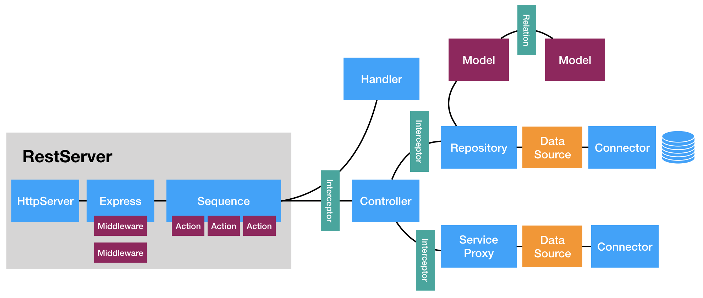
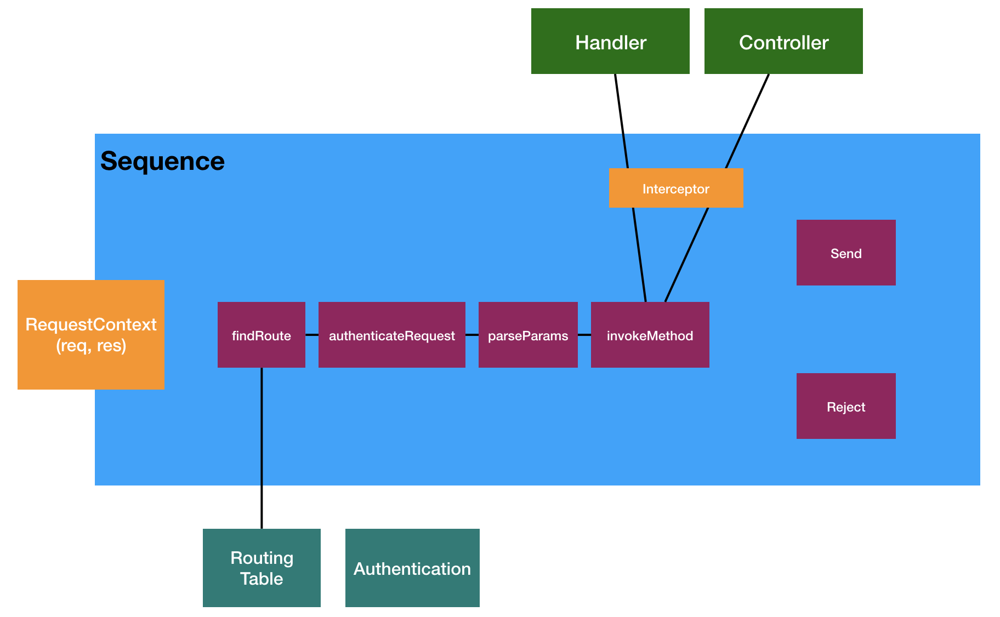

## The LoopBack 4 request/response cycle

To understand the LoopBack 4 request/response cycle, let's start by enumerating
the APIs that create the endpoints on the server. We will then follow the path
taken by a request, to see how it makes its way through the various parts of the
framework to return a result.

### Setting up the request/response infrastruture

The endpoints on a LoopBack app can be categorized into controller endpoints and
non-controller endpoints. Controller endpoints are those that are created by
LoopBack controller methods; non-controller endpoints are those that are created
by other APIs.

#### Controller endpoints

Controller methods decorated with operation decorators like `@get()`, `@post()`,
`@put` etc., create endpoints on the app for the corresponding HTTP verbs. The
behavior of these endpoints are entirely dependent on the implementation of the
controller method.



In the request/response cycle section we will see how implemenation details
determine the course of a request to these endpoints - they may or may not
actually interact with a model.

#### Non-controller endpoints

The following APIs can create non-controller endpoints.

##### 1. app.static(path, rootDir, options)

This method maps to the underlying Express'
[static](https://expressjs.com/en/4x/api.html#express.static) method. It creates
dynamic endpoints for files in the `rootDir` to be served at `path`.

More details at
[RestApplication.static()](https://loopback.io/doc/en/lb4/apidocs.rest.restapplication.static.html)
doc.

##### 2. app.redirect(fromPath, toPathOrUrl, statusCode)

This method redirects requests to `fromPath` to `toPathOrUrl` with the status
code `statusCode`.

More details at
[RestApplication.redirect()](https://loopback.io/doc/en/lb4/apidocs.rest.restapplication.redirect.html)
doc.

##### 3. app.mountExpressRouter(basePath, router, spec)

This method mounts an Express
[router](https://expressjs.com/en/4x/api.html#router) in the LoopBack app. You
can use it for adding custom endpoints in your app using the Express middleware
format.

More details at
[RestApplication.mountExpressRouter() ](https://loopback.io/doc/en/lb4/apidocs.rest.restapplication.mountexpressrouter.html)
doc.

##### 4. non-controller endpoints added by components

[Components](https://loopback.io/doc/en/lb4/Components.html) are the extension
units of LoopBack. Since they can access the LoopBack app instance, the request
and response instances using
[dependency injection](https://loopback.io/doc/en/lb4/Dependency-injection.html),
they are capable of adding new endpoints and determining the result of a
request.

### The request/response cycle

The request/response cycle involves many components, especially if the request
is to a controller-endpoint which interacts with the database.



The request handling process starts with the app's
[sequence](https://loopback.io/doc/en/lb4/Sequence.html); it is the gatekeeper
of all requests to the app. Every request, whether to controller endpoints or
non-controller endpoints, must pass through the sequence.

The sequence identifies the responsible handler for the requested endpoint and
passes on the request to the handler. The handler then take care of sending the
response back to the client.

#### The sequence

The sequence is a simple class with five injected helper methods in the
constructor. These five methods come together in the sequence class to make the
request/response cycle possible in LoopBack.





##### 1. FindRoute

[FindRoute](https://loopback.io/doc/en/lb4/apidocs.rest.findrouteprovider.html)
finds the appropriate
[ControllerRoute](https://loopback.io/doc/en/lb4/apidocs.rest.controllerroute.html)
(for controller endpoints) or `ExternalRoute` (for non-controller endpoints)
route for invocation.

##### 2. ParseParams

[ParseParams](https://loopback.io/doc/en/lb4/apidocs.rest.parseparamsprovider.html)
parses LoopBack-relevant request paremeters from the request body, URL segment,
and query parameters.

It is also responsible for validating the property types of the request body, as
defined in the model. If the request body does not match the schema, it throws a
HTTP 422 error.

##### 3. InvokeMethod

[InvokeMethod](https://loopback.io/doc/en/lb4/apidocs.rest.invokemethodprovider.html)
is responsible for calling the endpoint handler, passing in the route found by
`FindRoute` and the paremeters found by `ParseParams`.

For non-controller endpoints, control is passed on to the respective handlers at
this stage, which may then handle the response sending process themselves. For
controller endpoints, the result of invoking the controller method is returned.

If the LoopBack route found by `FindRoute` does not resolve to a handler,
`InvokeMethod` throws a `NotFoundError` error, which is send to the client as a
HTTP 404 error.

##### 4. Send

[Send](https://loopback.io/doc/en/lb4/apidocs.rest.sendprovider.html) is
responsible for sending the result from calling controller methods after some
sanity checks.

##### 5. Reject

[Reject](https://loopback.io/doc/en/lb4/apidocs.rest.rejectprovider.html) is
responsible for sending error back to the client in case any of the above helper
methods throw or encounter any errors; this includes `4xx`, `5xx`, and any other
type of errors.

The implementation of the `handle()` method of the default sequence looks like
this:

```ts
async handle(context: RequestContext) {
  try {
    const {request, response} = context;
    const route = this.findRoute(request);
    const args = await this.parseParams(request, route);
    const result = await this.invoke(route, args);
    this.send(response, result);
  } catch (err) {
    this.reject(context, err);
  }
}
```

Any provider can be plugged in in the sequence for additional functionality in
the app. For example, the
[authentication provider](https://loopback.io/doc/en/lb4/apidocs.authentication.authenticateactionprovider.html)
may be plugged in right after the `FindRoute` phase to enforce authentication on
all requests to the app.

```ts
export class MySequence implements SequenceHandler {
  constructor(
    ...
    @inject(AuthenticationBindings.AUTH_ACTION)
    protected authenticateRequest: AuthenticateFn,
  ) {}

  async handle(context: RequestContext) {
    try {
      const {request, response} = context;
      const route = this.findRoute(request);
      await this.authenticateRequest(request);
...
```

#### Request to a controller endpoint

Requests to a controller endpoint are handled in a very different context than
requests to a non-controller endpoint. Support for dependency injection and
interceptors make controller methods very extensible and powerful.

##### Controller methods

Controller methods decorated with operation decorators like `@get()`, `@post()`,
`@put` etc., are executed when a matching request arrives at the app. These
methods may, then call a corresponding repository method to read from or write
to the database.

Whatever a controller method returns, becomes the response body. If it throws, a
HTTP 500 error is returned to the client.

Controller methods injected with `RestBindings.Http.RESPONSE` (instance of
Express response object) can use the response object to send custom responses.



##### Services

[Services](https://loopback.io/doc/en/lb4/Services.html) are LoopBack's helper
units with support for dependency injection. They come in three varieties -
proxy, class, and provider.

A proxy service acts as a proxy to an external service. A class service creates
an instance of a helper class. A provider service resolves a value.

All of them have access to the app, request, and response objects via dependency
injections, and can influence the handling of the request/response cycle.

Services can be injected in the controller constructor so controller methods may
use them.

##### Repositories

[Repositories](https://loopback.io/doc/en/lb4/Repositories.html) are the links
between controllers and the data. They use an underlying datasource and a
connector to interact with the data.

Controller methods can call corresponding methods in the respository to read
from or write to the database.

Repositories can be injected in the controller constructor so controller methods
may use them.

##### Interceptors

[Interceptors](https://loopback.io/doc/en/lb4/Interceptors.html) intercept
invocation of method on classes decorate with the `@intercept()` decorator.

All controllers, services, and repositories; and their methods can be
intercepted. This makes interceptors a powerful participant in the
request/response cycle, since they can modify the request and response objects
and call their methods.



##### Walkthrough of a request

Now that we know all the components that may be involve in a request to a
controller endpoint, let's walk through a request to an endpoint - `/ping`
endpoint of a scaffolded LoopBack app.

The `PingController` controller has a method named `ping()`, decorated with a
`@get()` decorator. This setup creates the `/ping` endpoint on the app.

The app is configured to use the `MySequence` sequence.

Now this is a step-wise sequence of what happens when a request is made to
`http://localhost:4000/ping`.

1. The request is dispatched to `MySequence` by the HTTP server.
2. The route is then identified by `FindRoute` based on the verb and path
   defined by OpenAPI decorators. There is a handler for this request.
3. `ParseParams` then tries to parses any parameters might have been submitted.
   There is none in this case.
4. `InvokeMethod` then invokes the handler with the resolved parameters, which
   is empty in this case. It returns whatever the handler returns, in this case,
   it is a JSON object with `greeting`, `date`, `url`, and `headers` properties.
5. `Send` then sends this JSON object back to the client.
6. `Reject` is in place to catch any errors that might be thrown in any of the
   steps above.

#### Request to a non-controller endpoint

Non-controller endpoints can be created by static files, redirection rules,
custom Express routes, and non-controller endpoints added by components.

Requests to non-controller endpoints are also intercepted by the app's sequence,
but the control is handed over to the underlying Express middleware from the
`InvokeMethod` phase, and never make it to `Send` unless the middleware calls
`next()`. Unhandled errors from Express middleware still reach `Reject`.
