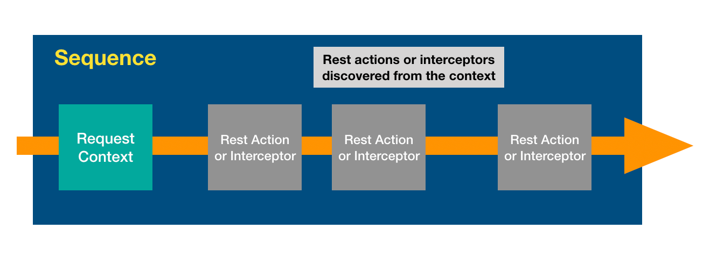
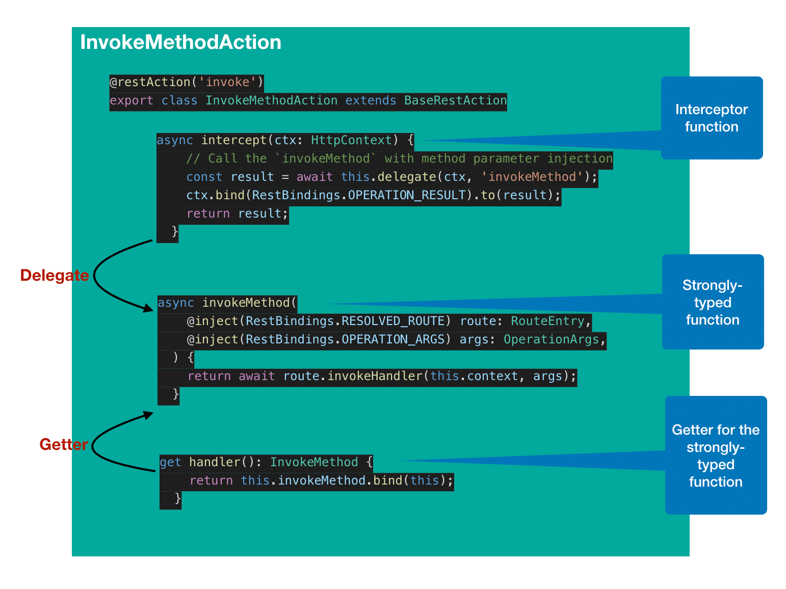

## Introduction

In the basic form of [`Sequence`](Sequence.md), actions are defined as
strong-typed functions, which are then composed in the implementation code using
plain function calls. For example:

```ts
import {Context, inject} from '@loopback/context';
import {
  FindRoute,
  InvokeMethod,
  ParseParams,
  Reject,
  RequestContext,
  RestBindings,
  Send,
  SequenceHandler,
} from '@loopback/rest';

const SequenceActions = RestBindings.SequenceActions;

export class MySequence implements SequenceHandler {
  constructor(
    @inject(RestBindings.Http.CONTEXT) public ctx: Context,
    @inject(SequenceActions.FIND_ROUTE) protected findRoute: FindRoute,
    @inject(SequenceActions.PARSE_PARAMS) protected parseParams: ParseParams,
    @inject(SequenceActions.INVOKE_METHOD) protected invoke: InvokeMethod,
    @inject(SequenceActions.SEND) public send: Send,
    @inject(SequenceActions.REJECT) public reject: Reject,
  ) {}

  async handle(context: RequestContext) {
    try {
      const {request, response} = context;
      const route = this.findRoute(request);
      const args = await this.parseParams(request, route);
      const result = await this.invoke(route, args);
      this.send(response, result);
    } catch (error) {
      this.reject(context, error);
    }
  }
}
```

The functional composition by code is simple and flexible. For each application,
a default sequence is generated when the project is scaffolded. It then becomes
the application developer's responsibility to maintain the code.

There are a few challenges in this approach:

1. The application code needs to be fully aware of all elements for a sequence
   and how they are composed using the waterfall style.

2. The application code needs to understand the signature and responsibility of
   each function representing an action.

3. It's cumbersome to add new actions, especially for existing applications as
   code change is required.

4. It's not easy to monitor or trap actions within a sequence.

5. It's not easy to reuse Express middleware as actions.

To mitigate such issues, we now introduce a new form of sequence built with REST
interceptors in a similar approach as method invocation interceptors. The new
style fully leverages the pluggability and extensibility offered by
`@loopback/context`.

To allow actions to be plugged into the sequence without changing the
implementation, we now support actions based on `GenericInterceptor` and
`GenericInterceptorChain`.

```ts
export class DefaultSequence implements SequenceHandler {
  constructor(
    @inject(RestBindings.SEQUENCE_OPTIONS, {optional: true})
    private options: SequenceOptions = {},
  ) {}

  async handle(context: RequestContext): Promise<void> {
    const restActions: RestAction[] = await this.getActions(context);

    const actionHandlers: GenericInterceptor<
      RequestContext
    >[] = restActions.map(action => (ctx, next) => action.intercept(ctx, next));
    const actionChain = new GenericInterceptorChain(context, actionHandlers);
    await actionChain.invokeInterceptors();
  }
}
```



## What is a RestInterceptor?

`RestInterceptor` is a function that intercepts REST API requests and responses.
We can now build a [`Sequence`](Sequence.md) to using REST interceptors.

```ts
const interceptor: RestInterceptor = async (ctx: HttpContext, next: Next) => {
  try {
    // Process the request
    // ...
    // Pass control to next interceptor
    const result = await next();
    // Process the response
    // ...
    return result;
  } catch (err) {
    // Handle error
  }
};
```

Now you probably realize that `RestInterceptor` is very similar as
[Koa Middleware](https://github.com/koajs/koa/blob/master/docs/guide.md).

`RestAction` is an object that provides the `RestInterceptor` function via
`intercept` method.

```ts
/**
 * Action for REST request/response processing sequence
 */
export interface RestAction {
  intercept: RestInterceptor;
}
```

## Implement RestAction

### Simple action

### Action that allows both styles

```ts
import {Context, inject} from '@loopback/context';
import {RestBindings} from '../keys';
import {RouteEntry} from '../router';
import {HttpContext, InvokeMethod, OperationArgs, restAction} from '../types';
import {BaseRestAction} from './base-action';

@restAction('invoke')
export class InvokeMethodAction extends BaseRestAction {
  constructor(
    @inject(RestBindings.Http.CONTEXT)
    private context: Context,
  ) {
    super();
  }

  /**
   * The interceptor function
   */
  async intercept(ctx: HttpContext) {
    // Call the `invokeMethod` with method parameter injection
    const result = await this.delegate(ctx, 'invokeMethod');
    ctx.bind(RestBindings.OPERATION_RESULT).to(result);
    return result;
  }

  /**
   * Strongly-typed `invokeMethod` function
   */
  async invokeMethod(
    @inject(RestBindings.RESOLVED_ROUTE) route: RouteEntry,
    @inject(RestBindings.OPERATION_ARGS) args: OperationArgs,
  ) {
    return await route.invokeHandler(this.context, args);
  }

  /**
   * Getter for the strong-typed function
   */
  get handler(): InvokeMethod {
    return this.invokeMethod.bind(this);
  }
}
```



### Wrap Express middleware

1. Use the `MiddlewareAction` constructor

```ts
import {MiddlewareAction} from '@loopback/rest';
import * as cors from 'cors';

const corsAction = new MiddlewareAction(cors(options));
```

2. Use `createMiddlewareAction` factory function

```ts
const corsAction = createMiddlewareAction('cors', options);
```

3. Use `createMiddlewareActionProvider` utility function

```ts
const corsActionProviderClass = createMiddlewareActionProvider('cors');
const corsActionBinding = ctx
  .bind('rest.sequence.actions.cors')
  .toProvider(corsActionProviderClass)
  .tag(RestTags.ACTION);
ctx.configure(corsActionBinding.key).to(options);
```

## Register REST actions

```ts
@restAction('invoke')
export class InvokeMethodAction extends BaseRestAction {
  // ...
}

ctx
  .bind(RestBindings.INVOKE_METHOD_ACTION)
  .toClass(InvokeMethodAction)
  .tag(RestTags.ACTION);
```
