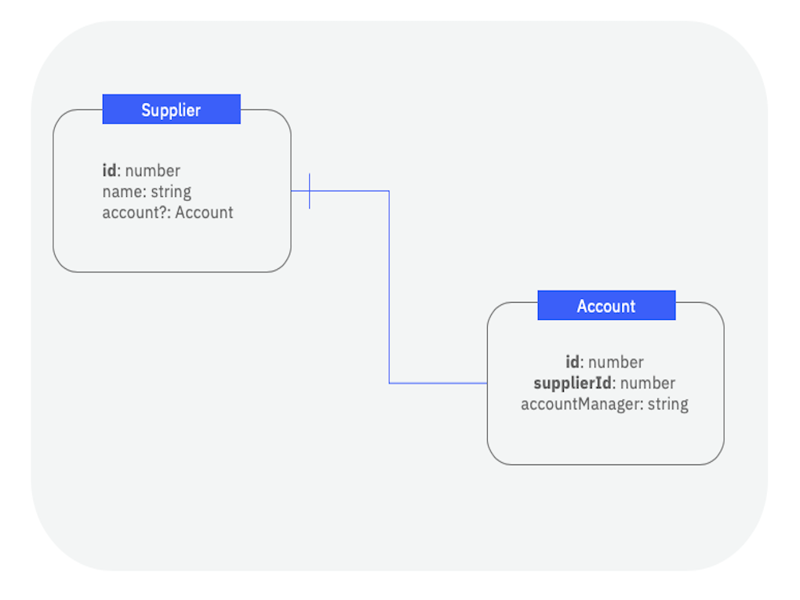
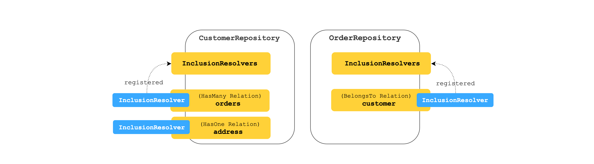
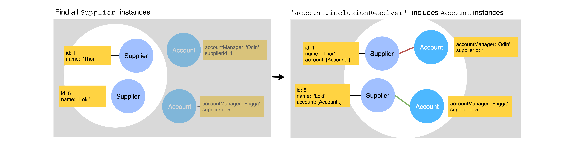

## Overview

{% include note.html content="
This relation best works with databases that support foreign key and unique
constraints (SQL).
Using this relation with NoSQL databases will result in unexpected behavior,
such as the ability to create a relation with a model that does not exist. We are [working on a solution](https://github.com/strongloop/loopback-next/issues/2341) to better handle this. It is fine to use this relation with NoSQL databases for purposes such as navigating related models, where the referential integrity is not critical.
" %}

A `hasOne` relation denotes a one-to-one connection of a model to another model
through referential integrity. The referential integrity is enforced by a
foreign key constraint on the target model which usually references a primary
key on the source model and a unique constraint on the same column/key to ensure
one-to-one mapping. This relation indicates that each instance of the declaring
or source model has exactly one instance of the target model. Let's take an
example where an application has models `Supplier` and `Account` and a
`Supplier` can only have one `Account` on the system as illustrated in the
diagram below.



The diagram shows target model **Account** has property **supplierId** as the
foreign key to reference the declaring model **Supplier's** primary key **id**.
**supplierId** needs to also be used in a unique index to ensure each
**Supplier** has only one related **Account** instance.

To add a `hasOne` relation to your LoopBack application and expose its related
routes, you need to perform the following steps:

1.  Decorate properties on the source and target models with `@hasOne` and
    `@belongsTo` to let LoopBack gather the necessary metadata.
2.  Modify the source model repository class to provide access to a constrained
    target model repository.
3.  Call the constrained target model repository CRUD APIs in your controller
    methods.

Right now, LoopBack collects the necessary metadata and exposes the relation
APIs for the `hasOne` relation, but does not guarantee referential integrity.
This has to be set up by the user or DBA in the underlying database and an
example is shown below on how to do it with MySQL.

## Defining a hasOne Relation

This section describes how to define a `hasOne` relation at the model level
using the `@hasOne` decorator. The relation constrains the target repository by
the foreign key property on its associated model. The `hasOne` relation is
defined on a source model `Supplier` in the example below:



```ts
import {Account, AccountWithRelations} from './account.model';
import {Entity, property, hasOne} from '@loopback/repository';

export class Supplier extends Entity {
  @property({
    type: 'number',
    id: true,
  })
  id: number;

  @property({
    type: 'string',
    required: true,
  })
  name: string;

  @hasOne(() => Account)
  account?: Account;

  constructor(data: Partial<Supplier>) {
    super(data);
  }
}

export interface SupplierRelations {
  account?: AccountWithRelations;
}

export type SupplierWithRelations = Supplier & SupplierRelations;
```

On the other side of the relation, we'd need to declare a `belongsTo` relation
since every `Account` has to belong to exactly one `Supplier`:

```ts
import {Supplier, SupplierWithRelations} from './supplier.model';
import {Entity, property, belongsTo} from '@loopback/repository';

export class Account extends Entity {
  @property({
    type: 'number',
    id: true,
  })
  id: number;

  @property({
    type: 'string',
  })
  accountManager: string;

  @belongsTo(() => Supplier)
  supplierId: number;

  constructor(data: Partial<Account>) {
    super(data);
  }
}

export interface AccountRelations {
  supplier?: SupplierWithRelations;
}

export type AccountWithRelations = Account & AccountRelations;
```

### Relation Metadata

The definition of the `hasOne` relation is inferred by using the `@hasOne`
decorator. The decorator takes in a function resolving the target model class
constructor and optionally a has one relation definition object which can e.g.
contain a custom foreign key to be stored as the relation metadata. The
decorator logic also designates the relation type and tries to infer the foreign
key.

LB4 uses three `keyFrom`, `keyTo` and `name` fields in the `hasMany` relation
metadata to configure relations. The relation metadata has its own default
values for these three fields:

<table>
  <thead>
    <tr>
      <th width="95">Field Name</th>
      <th width="260">Description</th>
      <th width="260">Default Value</th>
      <th>Example</th>
    </tr>
  </thead>
  <tbody>
    <tr>
      <td><code>keyFrom</code></td>
      <td>the primary key of the source model</td>
      <td>the id property of the source model</td>
      <td><code>Supplier.id</code></td>
    </tr>
    <tr>
      <td><code>keyTo</code></td>
      <td>the foreign key of the target model</td>
      <td>the source model name appended with `id` in camel case</td>
      <td><code>Account.supplierId</code></td>
    </tr>
    <tr>
      <td><code>name</code></td>
      <td>the name of the relation</td>
      <td>decorated property name</td>
      <td><code>Supplier.account</code></td>
    </tr>

  </tbody>
</table>

We recommend to use default values. If you'd like to customize foreign key name,
you'll need to specify some fields through the relation decorators.

For customizing the foreign key name, `keyTo` field needs to be specified via
`@hasOne` decorator. The following example shows how to customize the foreign
key name as `suppId` instead of `supplierId`:

```ts
// import statements
@model()
export class Supplier extends Entity {
  // constructor, properties, etc.
  @hasOne(() => Account, {keyTo: 'suppId'})
  account?: Account;
}
```

Notice that if you decorate the corresponding foreign key of the target model
with `@belongsTo`, you also need to specify the `belongTo` relation name in the
`name` field of its relation metadata. See [BelongsTo](BelongsTo-relation.md)
for more details.

```ts
// import statements
@model()
export class Account extends Entity {
  // constructor, properties, etc.

  // specify the belongsTo relation name if a customized name is used here
  @belongsTo(() => Supplier, {name: 'supplier'}) // specify the belongsTo relation name
  suppId: number; // customized foreign key name
}
```

If you need to use _different names for models and database columns_, to use
`suppAccount` as db column name instead of `account` for example, the following
setting would allow you to do so:

```ts
// import statements
@model()
export class Supplier extends Entity {
  // constructor, properties, etc.
  @hasOne(() => Supplier, {keyFrom: 'account'}, {name: 'suppAccount'})
  account: number;
}
```

_Notice: the `name` field in the third parameter is not part of the relation
metadata. It's part of property definition._

## Setting up your database for hasOne relation - MySQL

At the moment, LoopBack does not provide the means to enforce referential
integrity for the `hasOne` relation. It is up to users to set this up at the
database layer so constraints are not violated. Let's take MySQL as the backing
database for our application. Given the `Supplier` has one `Account` scenario
above, we need to run two SQL statements on the `Account` table for the database
to enforce referential integrity and align with LoopBack's `hasOne` relation.

1. Make `supplierId` property or column a foreign key which references the `id`
   from Supplier model's `id` property:

```sql
ALTER TABLE <databaseName>.Account ADD FOREIGN KEY (supplierId) REFERENCES <databaseName>.Supplier(id);
```

2. Create a unique index for the same property `supplierId`, so that for each
   `Supplier` instance, there is only one associated `Account` instance.

```sql
   ALTER TABLE <databaseName>.Account ADD UNIQUE INDEX supplierIndex (supplierId);
```

Before making the following changes, please follow the steps outlined in
[Database Migrations](Database-migrations.md) to create the database schemas
defined by the models in your application.

## Configuring a hasOne relation

The configuration and resolution of a `hasOne` relation takes place at the
repository level. Once `hasOne` relation is defined on the source model, then
there are a couple of steps involved to configure it and use it. On the source
repository, the following are required:

- In the constructor of your source repository class, use
  [Dependency Injection](Dependency-injection.md) to receive a getter function
  for obtaining an instance of the target repository. \_Note: We need a getter
  function, accepting a string repository name instead of a repository
  constructor, or a repository instance, in `Account` to break a cyclic
  dependency between a repository with a hasOne relation and a repository with
  the matching belongsTo relation.

- Declare a property with the factory function type
  `HasOneRepositoryFactory<targetModel, typeof sourceModel.prototype.id>` on the
  source repository class.

- Call the `createHasOneRepositoryFactoryFor` function in the constructor of the
  source repository class with the relation name (decorated relation property on
  the source model) and target repository instance and assign it the property
  mentioned above.

The following code snippet shows how it would look like:



```ts
import {Account, Supplier, SupplierRelations} from '../models';
import {AccountRepository} from './account.repository';
import {
  DefaultCrudRepository,
  juggler,
  HasOneRepositoryFactory,
  repository,
} from '@loopback/repository';
import {inject, Getter} from '@loopback/core';

export class SupplierRepository extends DefaultCrudRepository<
  Supplier,
  typeof Supplier.prototype.id,
  SupplierRelations
> {
  public readonly account: HasOneRepositoryFactory<
    Account,
    typeof Supplier.prototype.id
  >;
  constructor(
    @inject('datasources.db') protected db: juggler.DataSource,
    @repository.getter('AccountRepository')
    getAccountRepository: Getter<AccountRepository>,
  ) {
    super(Supplier, db);
    this.account = this.createHasOneRepositoryFactoryFor(
      'account',
      getAccountRepository,
    );
  }
}
```

The following CRUD APIs are now available in the constrained target repository
factory `Account` for instances of `supplierRepository`:

- `create` for creating an `Account` model instance belonging to `Supplier`
  model instance
  ([API Docs](https://loopback.io/doc/en/lb4/apidocs.repository.hasonerepository.create.html))
- `get` finding the target model instance belonging to `Supplier` model instance
  ([API Docs](https://loopback.io/doc/en/lb4/apidocs.repository.hasonerepository.get.html))

## Using hasOne constrained repository in a controller

The same pattern used for ordinary repositories to expose their CRUD APIs via
controller methods is employed for `hasOne` repositories. Once the hasOne
relation has been defined and configured, controller methods can call the
underlying constrained repository CRUD APIs and expose them as routes once
decorated with
[Route decorators](Routes.md#using-route-decorators-with-controller-methods). It
will require the value of the foreign key and, depending on the request method,
a value for the target model instance as demonstrated below.



```ts
import {post, param, requestBody} from '@loopback/rest';
import {SupplierRepository} from '../repositories/';
import {Supplier, Account} from '../models/';
import {repository} from '@loopback/repository';

export class SupplierAccountController {
  constructor(
    @repository(SupplierRepository)
    protected supplierRepository: SupplierRepository,
  ) {}

  @post('/suppliers/{id}/account')
  async createAccount(
    @param.path.number('id') supplierId: typeof Supplier.prototype.id,
    @requestBody() accountData: Account,
  ): Promise<Account> {
    return this.supplierRepository.account(supplierId).create(accountData);
  }
}
```

In LoopBack 3, the REST APIs for relations were exposed using static methods
with the name following the pattern `__{methodName}__{relationName}__` (e.g.
`Supplier.__find__account`). We recommend to create a new controller for each
relation in LoopBack 4. First, it keeps controller classes smaller. Second, it
creates a logical separation of ordinary repositories and relational
repositories and thus the controllers which use them. Therefore, as shown above,
don't add `Account`-related methods to `SupplierController`, but instead create
a new `SupplierAccountController` class for them.



## Querying related models

Different from LB3, LB4 creates a different inclusion resolver for each relation
type to query related models. Each **relation** has its own inclusion resolver
`inclusionResolver`. And each **repository** has a built-in property
`inclusionResolvers` as a registry for its inclusionResolvers. Here is a diagram
to show the idea:



A `hasOne` relation has an `inclusionResolver` function as a property. It
fetches target models for the given list of source model instances.

Using the relation between `Supplier` and `Account` we have shown above, a
`Supplier` has one `Account`.

After setting up the relation in the repository class, the inclusion resolver
allows users to retrieve all suppliers along with their related account
instances through the following code at the repository level:

```ts
supplierRepository.find({include: [{relation: 'account'}]});
```

or use APIs with controllers:

```
GET http://localhost:3000/suppliers?filter[include][][relation]=account
```

### Enable/disable the inclusion resolvers:

- Base repository classes have a public property `inclusionResolvers`, which
  maintains a map containing inclusion resolvers for each relation.
- The `inclusionResolver` of a certain relation is built when the source
  repository class calls the `createHasOneRepositoryFactoryFor` function in the
  constructor with the relation name.
- Call `registerInclusionResolver` to add the resolver of that relation to the
  `inclusionResolvers` map. (As we realized in LB3, not all relations are
  allowed to be traversed. Users can decide to which resolvers can be added.)

The following code snippet shows how to register the inclusion resolver for the
hasOne relation 'account':

```ts
export class SupplierRepository extends DefaultCrudRepository {
  account: HasOneRepositoryFactory<Account, typeof Supplier.prototype.id>;
  constructor(
    dataSource: juggler.DataSource,
    accountRepositoryGetter: Getter<AccountRepository>,
  ) {
    super(Supplier, dataSource);
    // we already have this line to create a HasOneRepository factory
    this.account = this.createHasOneRepositoryFactoryFor(
      'account',
      accountRepositoryGetter,
    );
    // add this line to register inclusion resolver
    this.registerInclusionResolver('account', this.account.inclusionResolver);
  }
}
```

- We can simply include the relation in queries via `find()`, `findOne()`, and
  `findById()` methods. For example, these queries return all suppliers with
  their `Account`:

  if you process data at the repository level:

  ```ts
  supplierRepository.find({include: [{relation: 'account'}]});
  ```

  this is the same as the url:

  ```
  GET http://localhost:3000/suppliers?filter[include][][relation]=account
  ```

  which returns:

  ```ts
  [
    {
      id: 1,
      name: 'Thor',
      account: {accountManager: 'Odin', supplierId: 1},
    },
    {
      id: 5,
      name: 'Loki',
      account: {accountManager: 'Frigga', supplierId: 5},
    },
  ];
  ```

  Here is a diagram to make this more intuitive:

  

- You can delete a relation from `inclusionResolvers` to disable the inclusion
  for a certain relation. e.g
  `supplierRepository.inclusionResolvers.delete('account')`


