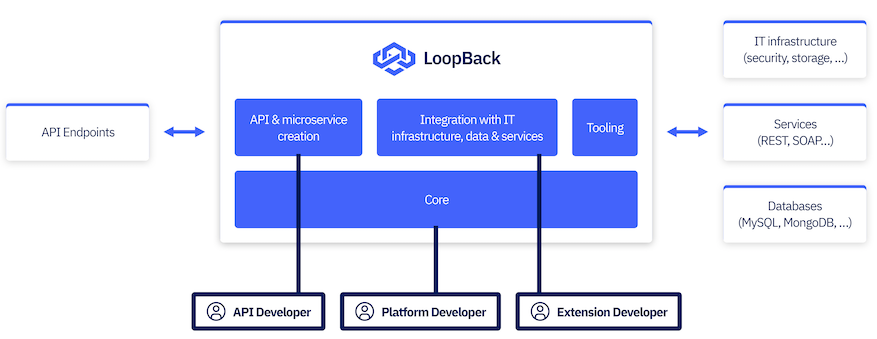





LoopBack is a highly extensible, open-source Node.js framework based on Express
that enables you to quickly create APIs and microservices composed from backend
systems such as databases and SOAP or REST services.

The diagram below demonstrates how LoopBack serves as a composition bridge
between incoming requests and outgoing integrations. It also shows the different
personas who are interested in various capabilities provided by LoopBack.

## Built for API developers

- Define your API endpoints and schemas using the
  [OpenAPI](https://www.openapis.org/) standard.
- Write your endpoints in modern JavaScript using ES2017, `async` / `await`,
  modules.
- Use your defined endpoints and schemas as the source of truth without
  generating code.

## Built for teams

- Review changes to API endpoints without digging through JavaScript.
- Maintain consistency by automating the validation of your endpoints and
  schemas.
- First class support for [TypeScript](https://www.typescriptlang.org) (strongly
  typed JavaScript).

## Built for your platform

- Use LoopBack as a starting point for your own framework or platform.
- Build libraries of reusable components in a standardized way.
- Integrate with databases, web services, and other platforms using connectors.
