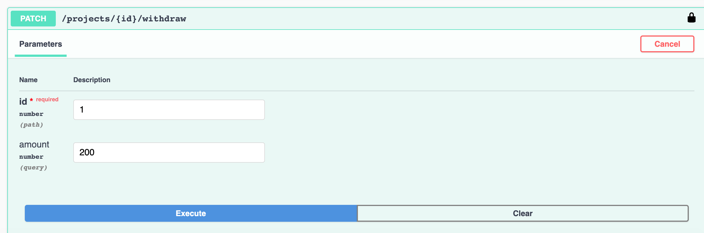



This example is migrated from
[loopback-example-access-control](https://github.com/strongloop/loopback-example-access-control),
and uses the authentication and authorization system in LoopBack 4 to implement
the access control.

## App Scenario

In this example, we create "Startkicker" (a basic Kickstarter-like application)
to demonstrate authentication and authorization mechanisms in LoopBack. The
application consists of four types of users:

- guest
- owner
- team member
- administrator

Each user type has permission to perform tasks based on their role and the
application's ACL (access control list) entries.

Here is the diagram that describes the models:


And the following operations can be processed by different roles:

- /projects/list-projects
  - guest, admin, owner, teamMember
- /projects/view-all
  - admin
- /projects/{id}/show-balance
  - owner, teamMember
- /projects/{id}/donate
  - admin, owner, teamMember
- /projects/{id}/withdraw
  - owner

This application includes some pre-created data. They are shown in the above
diagram. For example, as you can see, u1 owns project1, and u1 created a team
with u1 and u2 as members. This means u1 is the **owner** of project1, and u1
and u2 are the **team members** of project1. And u3 is the **admin**.

## Differences Between LoopBack 3 and 4

LoopBack 3 has several built-in models that consists of a RBAC system. The
models are `User`, `Role`, `RoleMapping`, `ACL`, and `AccessToken`. You can
learn how they work together in the
[Controlling data access](https://loopback.io/doc/en/lb3/Controlling-data-access.html)
tutorial.

The LoopBack 4 authorization system gives developers the flexibility to
implement the RBAC on their own. You can leverage popular third-party libraries
like [casbin](https://github.com/casbin/casbin) or [Auth0](https://auth0.com/)
for the role mapping.

This guide includes a demo for using
[casbin](#migrating-example-to-loopback-4-with-casbin) and using
[Auth0](#migrating-example-to-loopback-4-with-auth0)(TBD)

## Migrating Example to LoopBack 4 with Casbin

Let's migrate the LoopBack 3 access control example to LoopBack 4.

Here is an overview of the steps:

- Create models (migrates model properties)
- Set up login endpoint (migrates User endpoint)
- Set up project endpoints (migrates Project endpoints)
- Set up authentication (migrates boot/authentication.js)
- Set up authorization (This is the core of the tutorial, migrates role
  resolvers and model acls)
- Seed data (migrates boot/sample-models.js)

### Creating models

There are four models involved in this example. Three of them are migrated from
[the original models](https://github.com/strongloop/loopback-example-access-control/tree/master/common/models)
(`Project`, `Team`, `User`). And we add one more model `UserCredentials` to
separate the sensitive information from the `User` model.

You can run `lb4 model` to create the 4 models, and then run `lb4 repository` to
create their corresponding persistency layers.

_A LoopBack 3 model provides 3 layers: data shape, persistency, REST APIs,
whereas LoopBack 4 model only describes the data shape. Therefore in this
section we also need to create repositories for data persistency. You can read
about the differences in document
[migrating model definitions and built-in APIs](../models/core.md)._

_To keep the tutorial concise and focus on the core implementation, the detailed
commands are listed in the reference [model creation](#model-creation)._

### Setting up login endpoint

LoopBack 3 has a default User model with a bunch of pre-defined APIs exposed. In
this example, since we create the `User` model from scratch, we need to add the
required endpoints in the `UserController`. In the demo we only need
`User/login`.

This application uses token based authentication. A user logs in by providing
correct credentials (email and password) in the payload of 'User/login', then
gets a token back with its identity information encoded and includes it in the
header of next requests.

To create the login endpoint, we first run `lb4 controller` to create a
`UserController` (see [user controller creation](#user-controller-creation)).
Then add a new controller function `login` decorated with the REST decorators
that describe the request and response (see
[the complete user controller file](https://github.com/strongloop/loopback-next/tree/master/examples/access-control-migration/src/controllers/user.controller.ts)).
The core logic of `login` does 3 things:

- call `userService.verifyCredentials()` to verify the credentials and find the
  right user.
- call `userService.convertToUserProfile()` to convert the user into a standard
  principal shared across the authentication and authorization modules.
- call `jwtService.generateToken()` to encode the principal that carries the
  user's identity information into a JSON web token.

To keep the controller file concise and to organize the token and user-related
utils, we will create the token service and user service in section
[Setting up authentication](#setting-up-authentication).

### Setting up project endpoints

Next let's create the 5 project endpoints which will be used to demo the access
of different roles. We start from creating a controller for Project (see
[project controller creation](#project-controller-creation)). Then incrementally
add the following endpoints:

- `/project/listProjects`: show all the projects but hide the `balance` field
- `/project/viewAll`: show all the projects with the full information
- `/project/{id}/findById`: show a project's information
- `/projects/{id}/donate`: donate to a project
- `/projects/{id}/withdraw`: withdraw from a project

The complete code can be found in
[src/controller/project.controller.ts](https://github.com/strongloop/loopback-next/tree/master/examples/access-control-migration/src/controllers/project.controller.ts)

### Setting up authentication



This demo uses token based authentication, and it uses the jwt authentication
strategy to verify a user's identity. The authentication setup is borrowed from
[loopback4-example-shopping](https://github.com/strongloop/loopback4-example-shopping/tree/master/packages).
The authentication system aims to understand **who sends the request**. It
retrieves the token from a request, decodes the user's information in it as
`principal`, then passes the `principal` to the authorization system which will
decide the `principal`'s access later.

To simplify the implementation for readers, we extracted the services and
bindings into a component in folder `src/components/jwt-authentication`, it
consists of the following files:

- creating the jwt authentication strategy to decode the user profile from
  token. See file
  [jwt.auth.strategy.ts](https://github.com/strongloop/loopback-next/tree/master/examples/access-control-migration/src/components/jwt-authentication/jwt.auth.strategy.ts).
- creating the token service to organize utils for token operations. See file
  [jwt.service.ts](https://github.com/strongloop/loopback-next/tree/master/examples/access-control-migration/src/components/jwt-authentication/jwt.service.ts).
- creating user service to organize utils for user operations. see file
  [user.service.ts](https://github.com/strongloop/loopback-next/tree/master/examples/access-control-migration/src/components/jwt-authentication/user.service.ts).
- adding OpenAPI security specification to your app so that the explorer has an
  Authorize button to setup the token for secured endpoints. See file
  [security.spec.ts](https://github.com/strongloop/loopback-next/tree/master/examples/access-control-migration/src/components/jwt-authentication/security.spec.ts).
- creating bindings for the above services. See file
  [keys.ts](https://github.com/strongloop/loopback-next/blob/master/examples/access-control-migration/src/components/jwt-authentication/keys.ts).

You can enable the jwt authentication by mounting the authentication component
in the application constructor:



```ts
// Add this line to import the component
import {JWTAuthenticationComponent} from './components/jwt-authentication';

export class AccessControlApplication extends BootMixin(
  ServiceMixin(RepositoryMixin(RestApplication)),
) {
  constructor(options: ApplicationConfig = {}) {
    // ...
    // Add this line to mount the jwt authentication component
    this.component(JWTAuthenticationComponent);
    // ...
  }
}
```

Finally decorate the 4 project endpoints (excluding the public `listProjects`)
with `@authenticate('jwt')`. See example for endpoint
[viewAll](https://github.com/strongloop/loopback-next/tree/master/examples/access-control-migration/src/controllers/project.controller.ts#L90)

### Setting up authorization

#### Background

The authorization system aims to decide, given a principal passed from the
authentication system, whether it has access to a resource.

In LoopBack 3, the access control rules for APIs are described by a model
configuration property called 'acls'. In our case they were defined in
[models/project.json](https://github.com/strongloop/loopback-example-access-control/blob/master/common/models/project.json#L21-L61).

For example, the acl for endpoint `/projects/{id}/findById` is:

```
{
  "accessType": "READ",
  "principalType": "ROLE",
  "principalId": "teamMember",
  "permission": "ALLOW",
  "property": "findById"
},
```

It means only team members have access to the resource returned by
`/projects/{id}/findById`. And the authorization system is responsible to figure
out whether a principal is a team member of `project${id}`, which is considered
as role resolving.

#### Role Resolving

Role resolving is the core of an RBAC system. In the original application, you
create and register role resolvers to resolve a role at run time. Role `admin`
is defined in
[sample-models.js](https://github.com/strongloop/loopback-example-access-control/blob/master/server/boot/sample-models.js#L62)
and `teamMember` is defined and registered in
[role-resolver](https://github.com/strongloop/loopback-example-access-control/blob/master/server/boot/role-resolver.js).

In the migrated application, we use a 3rd-party library
[casbin](https://github.com/casbin/casbin) to resolve the role.

#### Using Casbin

- Overview of casbin

[Casbin](https://casbin.org/docs/en/overview) is a powerful and efficient
open-source access control library. It uses policies to make decisions: whether
a subject can perform an action on a certain object. It enforces the policy in
the classic `{subject, object, action}` form or a customized form as you
defined, both allow and deny authorizations are supported. And it manages the
role-user mappings and role-role mappings (aka role hierarchy in RBAC).

In our example, the casbin system works as a whole to make decisions. The
following diagram explains how the authorization system and casbin system work
together:


- Model and Policies

If you are not familiar with casbin, you can take a look of the brief summary of
[our usage of casbin](#usage-of-casbin) in the reference.

The Casbin system consists of a model file and policy files. The model file
describes the shape of request, policy, role mapping, and the decision rules.
And to optimize the enforcers, policies are divided into multiple smaller ones
based on roles.

Here is the screenshot of the model file and policy file of role "teamMember",
different colors maps to different concepts:


Based on the screenshot, suppose u2(user with id 2) makes a request to
'/projects/1/donate', the authorization system will send subject as u2, object
as project1, action as donate to casbin. And since u2 inherits role p1_team, and
p1_team can perform donate on project1, casbin system returns allow to the
authorization system.

#### Migrating Authorization

First let's migrate the ACLs. Access control information is considered as
authorization metadata, and provided in decorator `@authorize()`. Referring back
to the Project controller file, we can now specify the following fields for each
endpoint:

- resource: the resource name, it's 'project' in this controller
- scopes: it maps to the action in the casbin policy
- allowedRoles: since the casbin system handles the role resolving, this field
  is for optimizing the comparison scope. E.g. when executing the enforcer to
  make decision, only compares with the policies in the admin policy file.

To make the tutorial concise, the code details is omitted here. You can find the
ACLs and how the endpoints are decorated in file
[src/controller/project.controller.ts](https://github.com/strongloop/loopback-next/tree/master/examples/access-control-migration/src/controllers/project.controller.ts)

Next, we write the authorizer that calls casbin enforcers to make the decision.

1. Create an authorizer that retrieves the authorization metadata from context,
   then execute casbin enforcers to make decision.

   _If you are not familiar with the concept authorizer, you can learn it in the
   document
   [Programming Access Policies](../../Loopback-component-authorization#programming-access-policies)_

   The complete authorizer file can be found in
   [components/casbin-authorization/services/casbin.authorizer.ts](https://github.com/strongloop/loopback-next/blob/master/examples/access-control-migration/src/components/casbin-authorization/services/casbin.authorizer.ts).
   It retrieves the three required fields from the authorization context:
   subject from `principal`, `resource` as object, and action, to invoke casbin
   enforcers and make decision.

2. Create a voter for instance level endpoints to append the project id to the
   resource name

   Class level means operations applied to all projects like `/projects/*`,
   whereas instance level operation applies to a certain project like
   `/project{id}/*`. For instance level endpoints, the resource name should
   include the resource's `id`. Since the `id` comes from the request, the
   endpoint metadata cannot provide it and therefore we define the pre-process
   logic in a voter to generate the resource name as `project${id}`, then passes
   it to the authorizer.

   The complete voter file can be found in file
   [components/casbin-authorization/services/assign-project-instance-id.voter.ts](https://github.com/strongloop/loopback-next/blob/master/examples/access-control-migration/src/components/casbin-authorization/services/assign-project-instance-id.voter.ts)

3. Create casbin enforcers

   A casbin enforcer is configured with a policy file. It compares the given
   data with the policy file and returns a decision when invoked. To optimize
   the scope and speed of the access check, this example splits the policies
   into separate files per role. The authorizer will only invoke the enforcers
   for allowed role(s).

   The complete enforcer file can be found in file
   [components/casbin-authorization/services/casbin.enforcers.ts](https://github.com/strongloop/loopback-next/blob/master/examples/access-control-migration/src/components/casbin-authorization/services/casbin.enforcers.ts)

4. Write casbin model and policies

   Since the model and policy are already covered in section
   [Using Casbin](#using-casbin), we will not repeat it here. The corresponding
   files are defined in folder
   [fixtures/casbin](https://github.com/strongloop/loopback-next/blob/master/examples/access-control-migration/fixtures/casbin).

5. Mount the casbin authorization system as a component

   The casbin authorizer, voter and enforcers above are packed under component
   'src/components/casbin-authorization'. You can export their bindings in a
   [component file](https://github.com/strongloop/loopback-next/blob/master/examples/access-control-migration/src/components/casbin-authorization/casbin-authorization-component.ts)
   and mount the component in the application constructor:

   

   ```ts
   // Add this line to import the component
   import {CasbinAuthorizationComponent} from './components/casbin-authorization';

   export class AccessControlApplication extends BootMixin(
     ServiceMixin(RepositoryMixin(RestApplication)),
   ) {
     constructor(options: ApplicationConfig = {}) {
       // ...
       // Add this line to mount the casin authorization component
       this.component(CasbinAuthorizationComponent);
       // ...
     }
   }
   ```

6. Casbin persistency and synchronize(2nd Phase implementation, TBD)

   This will be supported at the 2nd phase of implementation. The plan is to
   have model or operation hooks to update the casbin policies when new data
   created. It requires a persistent storage for casbin policies (see reference
   in
   [casbin policy persistence](https://github.com/casbin/casbin#policy-persistence)).
   Here is an overview of the hooks:

   - when create a new project
     - create a set of p, project\${id}\_owner, action policies
     - create a set of p, project\${id}\_team, action policies
   - add a new user to a team
     - find the projects owned by the team owner, then create role inherit rules
       g, u${id}, project${id}\_team
   - add a new endpoint(operation)
     - for each of its allowed roles, add p, \${role}, action policy

#### Summary

The following diagram summarizes the authorization mechanism described above:


### Seeding Data

The application has pre-created data to try each role's permission. The original
example seeds data in the boot script, now they are migrated to an observer file
called `sample.observer.ts`.

_Since the data are already generated in `db.json`, that observer file is
skipped by default._

### Try It Out

Start the application:

- Run `npm start` to start the application.
- Open the explorer

Try the 'admin' role:

- Login as admin first (user Bob)
  - Go to UserController, try endpoint `users/login` with {"email":
    "bob@projects.com", "password": "opensesame"}
    
  - Get the returned token
    
  - Click the authorize button and paste the token
    
- Try the 5 endpoints, 'show-balance' and 'withdraw' will return 401, others
  succeed
  - A sample screenshot for 'withdraw':
    
    

Try the 'owner' role:

- Login as owner (user John)
  - Go to UserController, try endpoint `users/login` with {"email":
    "John@projects.com", "password": "opensesame"}
  - Get the returned token
  - Click authorize button and paste the token
- Try the 5 endpoints, 'view-all' will return 401, others succeed

Try the 'team-member' role:

- Login as team-member (user Jane)
  - Go to UserController, try endpoint `users/login` with {"email":
    "Jane@projects.com", "password": "opensesame"}
  - Get the returned token
  - Click authorize button and paste the token
- Try the 5 endpoints, 'show-balance' and 'donate' will succeed, others returns
  401

## References

### Model Creation

Import model `User`, `Project`, `Team` from the LB3 application by the migration
CLI:

```sh
$ lb4 import-lb3-models <path_to_loopback-example-access-control> --outDir src/models
```

Choose model `User`, `Project`, `Team` for the prompt.

For model `UserCredentials`, you need to create it by `lb4 model`:

```sh
$ lb4 model
? Model class name: UserCredentials
? Please select the model base class Entity (A persisted model with an ID)
? Allow additional (free-form) properties? Yes
Model UserCredentials will be created in src/models/user-credentials.model.ts

Lets add a property to UserCredentials
Enter an empty property name when done

? Enter the property name: id
? Property type: number
? Is id the ID property? Yes
? Is id generated automatically? No
? Is it required?: Yes
? Default value [leave blank for none]:

Lets add another property to UserCredentials
Enter an empty property name when done

? Enter the property name: password
? Property type: string
? Is it required?: Yes
? Default value [leave blank for none]:

Lets add another property to UserCredentials
Enter an empty property name when done

? Enter the property name: userId
? Property type: number
? Is it required?: Yes
? Default value [leave blank for none]:

Lets add another property to UserCredentials
Enter an empty property name when done

? Enter the property name:
   create src/models/user-credentials.model.ts
   update src/models/index.ts

Model UserCredentials was created in src/models/
```

Considering the difference between the original application and the migrated
one, you need to adjust the properties a bit for the three migrated models.

- For `Project`, open file `src/models/project.model.ts`

  - decorate `ownerId` with `@belongsTo(() => User)` and remove the generated
    `@property` decorator.
  - `balance` should be a required property: change it from `balance?` to
    `balance`

- For `Team`, open file `src/models/team.model.ts`

  - replace `memberId` with `memberIds` as an array:
    ```ts
      @property({
        type: 'array',
        itemType: 'number',
        required: true,
      })
      memberIds: number[];
    ```

- For `User`, open file `src/models/user.model.ts`

  - remove `password` because we have a `UserCredential` model created to
    separate it from `User`

- For all the three models above, allow generating their `id` field:
  ```ts
  @property({
    type: 'number',
    id: 1,
    // change it from `true` to `false`
    generated: false,
    updateOnly: true,
  })
  // change it from optional `id?` to required `id`
  id: number;
  ```

Create corresponding repositories:

```sh
$ lb4 repository
? Please select the datasource DbDatasource
? Select the model(s) you want to generate a repository Project, Team, UserCredentials, User
? Please select the repository base class DefaultCrudRepository (Juggler bridge)
```

Create relations:

- `Project` belongsTo `User`

```sh
lb4 relation
? Please select the relation type belongsTo
? Please select source model Project
? Please select target model User
? What is the name of ID property of the source model? id
? What is the type of the source model primary key? number
? What is the name of ID property of the target model? id
? What is the type of the target model primary key? number
? Foreign key name to define on the source model ownerId
? Relation name owner
? Allow Project queries to include data from related User instances? Yes
```



- `User` hasOne `UserCredentials`

```sh
lb4 relation
? Please select the relation type hasOne
? Please select source model User
? Please select target model UserCredentials
? What is the name of ID property of the source model? id
? What is the type of the source model primary key? number
? What is the name of ID property of the target model? id
? What is the type of the target model primary key? number
? Foreign key name to define on the target model userId
? Source property name for the relation getter (will be the relation name) userCredentials
? Allow User queries to include data from related UserCredentials instances? Yes
```



- `User` hasMany `Team`

```sh
lb4 relation
? Please select the relation type hasMany
? Please select source model User
? Please select target model Team
? What is the name of ID property of the source model? id
? What is the type of the source model primary key? number
? What is the name of ID property of the target model? id
? What is the type of the target model primary key? number
? Foreign key name to define on the target model ownerId
? Source property name for the relation getter (will be the relation name) teams
? Allow User queries to include data from related Team instances? Yes
```



### User Controller Creation

```sh
$ lb4 controller
? Controller class name: User
Controller User will be created in src/controllers/user.controller.ts

? What kind of controller would you like to generate? REST Controller with CRUD functions
? What is the name of the model to use with this CRUD repository? User
? What is the name of your CRUD repository? UserRepository
? What is the name of ID property? id
? What is the type of your ID? number
? Is the id omitted when creating a new instance? No
? What is the base HTTP path name of the CRUD operations? /users
   create src/controllers/user.controller.ts
   update src/controllers/index.ts

Controller User was created in src/controllers/
```

### Project Controller Creation

```sh
$ lb4 controller
? Controller class name: Project
Controller Project will be created in src/controllers/project.controller.ts

? What kind of controller would you like to generate? REST Controller with CRUD functions
? What is the name of the model to use with this CRUD repository? Project
? What is the name of your CRUD repository? ProjectRepository
? What is the name of ID property? id
? What is the type of your ID? number
? Is the id omitted when creating a new instance? No
? What is the base HTTP path name of the CRUD operations? /projects
   create src/controllers/project.controller.ts
   update src/controllers/index.ts

Controller Project was created in src/controllers/
```

### Usage of Casbin

The app has very basic usage of casbin:

- uses a model file to describe the shape of request, policy, role mapping, and
  the decision rules.
  - syntax doc for [casbin models](https://casbin.org/docs/en/syntax-for-models)
  - syntax doc for [casbin role inheritance](https://casbin.org/docs/en/rbac)
  - what is request definition: a set of info collected from the client request.
    In our case: subject, object, operation
  - what is policy definition: who has permission for what. In our case the info
    are same as request: subject, object, operation
  - when make a decision, the casbin enforcer compares the info from request to
    the policies
- uses policy files to store the policies.
  - the casbin docs I post above also contain the policy examples
  - divide policy files into multiple smaller ones based on roles
