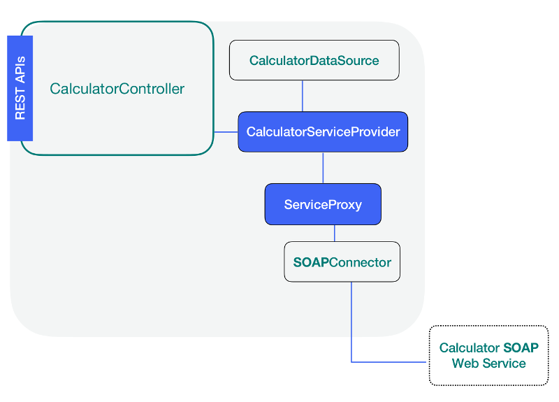

### Add a Service



**LB4** has the package _@loopback/proxy-server_ that contains the artifacts
needed to implement the link between the methods described in the .json file and
the Node.js methods. All we need to do is to write the service provider that
will serve as the glue to make this implementation real.

#### Installing the proxy-server

Make sure you are inside the soap-calculator directory and run the following
command:

```sh
npm install @loopback/service-proxy -—save
```

#### Writing a service provider

We will create the directory `src/services` and two files using the editor of
your choice.

- calculator.service.ts
- index.ts

#### src/services/calculator.service.ts

We will start by adding the imports and are explained in the following sections.

##### Adding datasource related imports

We need the getService import in order to bind the remote methods with their
corresponding Node.js methods as specified in .json datasource configuration
file and the juggler to be able to work with this data source.

The inject is used in order to work the _LB4_ dependency injection to obtain a
reference of the data source and the Provider to be able to extend this class in
order to make a service provider.

The CalculatorDataSource is our previously created data source and corresponds
to a SOAP connector type.

```ts
import {getService, juggler} from '@loopback/service-proxy';
import {inject, Provider} from '@loopback/core';
import {CalculatorDataSource} from '../datasources';
```

##### Adding our interfaces

When we reviewed the remote SOAP web service, we found that there were four
different results for the four operations and each of these operations were
expecting the same pair of arguments intA and intB. Now, it is time to define
this scenario using interfaces as follows:

```ts
export interface MultiplyResult {
  result: {
    MultiplyResult: number;
  };
}
export interface AddResult {
  result: {
    AddResult: number;
  };
}
export interface SubtractResult {
  result: {
    SubtractResult: number;
  };
}
export interface DivideResult {
  result: {
    DivideResult: number;
  };
}
export interface CalculatorParameters {
  intA: number;
  intB: number;
}
```

One important interface we need to add now is the one that describes the four
Node.js methods that will be mapped to the SOAP operations. At this point we
have just mentioned them in the .json data source file, so let's add them now as
follows:

```ts
export interface CalculatorService {
  Multiply(args: CalculatorParameters): Promise<MultiplyResult>;
  Add(args: CalculatorParameters): Promise<AddResult>;
  Divide(args: CalculatorParameters): Promise<DivideResult>;
  Subtract(args: CalculatorParameters): Promise<SubtractResult>;
}
```

##### Adding our service provider class

We are defining the type of the provider as CalculatorService which is the
interface that describes the Node.js methods. The actual implementation of these
methods occur by calling the appropriate remote SOAP operation and this is done
by the help of the proxy-server and the corresponding soap-connector.

```ts
export class CalculatorServiceProvider implements Provider<CalculatorService> {
```

Now let's add its constructor. Here we get a reference for the connector by
using **LB4** Dependency Injection.

```ts
constructor(
    @inject('datasources.calculator')
    protected datasource: juggler.DataSource = new CalculatorDataSource(),
  ) {}
```

And finally implement the value() method required by the Provider class.

```ts
  value(): Promise<CalculatorService> {
    return getService(this.datasource);
  }
}
```

##### Adding an export instruction to src/services/index.ts

We need to add the the following line in the index.ts file. Notice that in the
case of artifacts generated by **CLI** it is done automatically for us.

```ts
export * from './calculator.service';
```

### Navigation

Previous step: [Add a Datasource](soap-calculator-tutorial-add-datasource.md)

Next step: [Add a Controller](soap-calculator-tutorial-add-controller.md)
