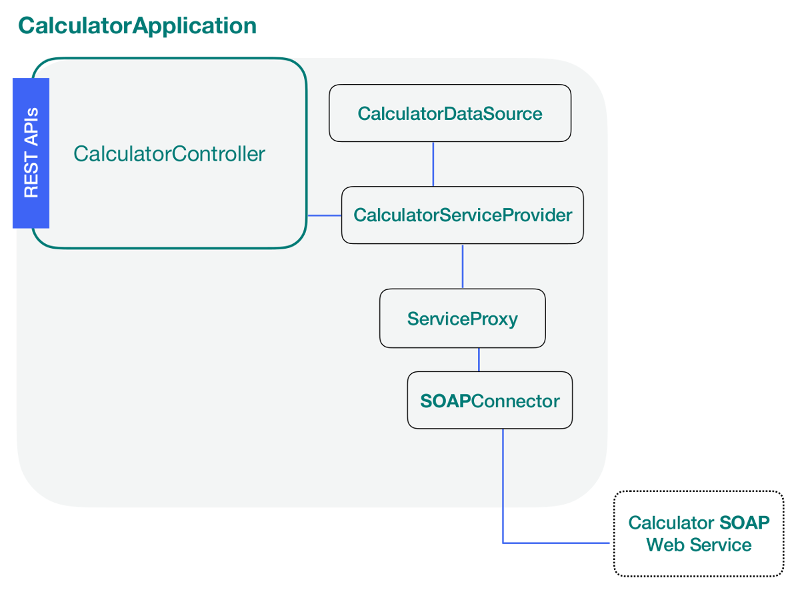

# @loopback/example-soap-calculator

Integrating a Calculator SOAP web service with LoopBack 4.

## Overview

This example project shows how to integrate a SOAP web service with LoopBack 4
and expose its methods through the REST API server. Acceptance and Integration
tests are provided.

Before each step, you will be presented an image containing the artifacts that
you will be creating in blue.



## Setup

You'll need to make sure you have some things installed:

- [Node.js](https://nodejs.org/en/) at v8.9 or greater

Lastly, you'll need to install the LoopBack 4 CLI toolkit:

```sh
npm i -g @loopback/cli
```

## Start the Tutorial

Follow the following steps to start buiding your application:

### Steps

1. [SOAP Web Service Overview](soap-calculator-tutorial-web-service-overview.md)
2. [Scaffold the Application](soap-calculator-tutorial-scaffolding.md)
3. [Add a data source](soap-calculator-tutorial-add-datasource.md)
4. [Add a Service](soap-calculator-tutorial-add-service.md)
5. [Add a controller](soap-calculator-tutorial-add-controller.md)
6. [Register the service](soap-calculator-tutorial-make-service-available.md)
7. [Run and Test the application](soap-calculator-run-and-and-test.md)

## or Try it out

If you'd like to see the final results of this tutorial as an example
application, follow these steps:

### Generate the example using CLI

1.Run the `lb4 example` command to select and clone the soap-calculator
repository:

```sh
$ lb4 example
? What example would you like to clone? (Use arrow keys)
  todo: Tutorial example on how to build an application with LoopBack 4.
  todo-list: Continuation of the todo example using relations in LoopBack 4.
  hello-world: A simple hello-world Application using LoopBack 4.
  log-extension: An example extension project for LoopBack 4.
  rpc-server: A basic RPC server using a made-up protocol.
> soap-calculator: An example on how to integrate SOAP web services.
```

2.Jump into the directory and then install the required dependencies:

```sh
cd loopback4-example-soap-calculator
```

3.Finally, start the application!

    ```sh
    $ npm start

    Server is running on port 3000
    ```

Feel free to look around in the application's code to get a feel for how it
works.

## License

MIT
