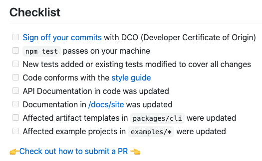
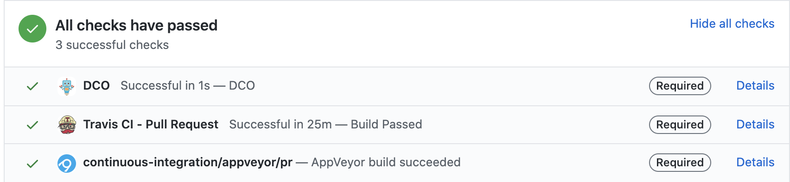

## How to submit a pull request (PR) for LoopBack 4

This tutorial is about how to submit a pull request (PR) for LoopBack 4 while
following our conventions and requirements.

Pick [Expert Instructions](#expert-instructions) or
[Beginner Instructions](#beginner-instructions) mode based on your experience
with GitHub's PR flow.

To contribute high-quality code/docs, please read
[Contributing to LoopBack](https://loopback.io/doc/en/contrib/index.html),
[Contributing code](https://loopback.io/doc/en/contrib/code-contrib-lb4.html),
and [Contributing to docs](https://loopback.io/doc/en/contrib/doc-contrib.html),
before diving into the PR process.

## Expert Instructions

In addition to your knowledge about GitHub and creating a pull request, we have
specific conventions and requirements you need to follow when submitting a pull
request for LoopBack 4.

### 1. Commits to local repository

Our commit messages are formatted according to
[Conventional Commits](https://conventionalcommits.org/).

Please read the
[Commit Message Format](https://loopback.io/doc/en/contrib/code-contrib-lb4.html#commit-message-guidelines)
guidelines to correctly format your commit messages.

To change an existing commit please refer to
[Changing a commit message](https://help.github.com/articles/changing-a-commit-message/).



### 2. Before pushing to remote repository

Before pushing to the remote repository, ensure your files are free of
formatting, syntax, and logical/execution errors by running:

```
npm run lint:fix && npm test
```



### 3. After creating PR, sign the CLA and fill out checklist

After creating the pull request, make sure the Contributor License Agreement
(CLA) has been signed for the `loopback-next` repository.

The pull request has a checklist that must be filled out appropriately.



Of particular importance are the
`'Read and sign the CLA (Contributor License Agreement)'` link and the
`'npm test passes on your machine'` checkbox.

Click on the
[Read and sign the CLA (Contributor License Agreement)](https://cla.strongloop.com/agreements/strongloop/loopback-next)
link, and sign it. This is done once per repository.

### 4. Check CI status

Ensure that the continuous integration (CI) jobs associated with your pull
request complete successfully.

It might take some time for CI jobs to be scheduled and completed.



If a build fails, click on its `Details` link for more information.

For example, clicking on the `Details` link for the `Travis CI build` job takes
us to the Travis CI build page.


Here you can investigate the status of the job, its sub-jobs, or restart them.

### 5. PR Review Process

The review process is iterative, so it is normal that `multiple commits` may be
required until the pull request is finally accepted.



Reactively [rebase](https://help.github.com/articles/about-git-rebase/) your
forked repository against the upstream master branch to keep them in sync; if
needed.

### 6. Before your PR is merged by a maintainer

Before the PR is merged by a maintainer, your may be asked to clean up the
commits by
[squashing commits](https://git-scm.com/book/en/v2/Git-Tools-Rewriting-History)
to ensure meaningful change logs. Use the `git rebase -i` command if necessary.

## Beginner Instructions

Here is a complete tutorial on how to submit a pull request (PR) for LoopBack
v4.

### 1. Fork the loopback-next repository

In your browser, navigate to <https://github.com/strongloop/loopback-next>.

Create your own fork of the repository by pressing the `Fork` link on the
right-hand side.


When the forking process is complete, the repository will show up as
`{ your user id }/loopback-next`. In my case, it is `emonddr/loopback-next`.


### 2. Create the feature branch

Notice your repo has a `master` branch already created (refer to bottom left
corner of the picture above). It is commonplace to have this branch represent
the latest, clean version of this repository's content. For the purposes of your
PR, let's create a `feature` branch with a name indicative of your changes. In
my case, it is `emonddr-doc-changes`.

Click on the `Clone or download` button


This brings up tiny dialog with different choices: Clone with SSH, Use HTTPS,
Open in Desktop, or Download Zip.

In my case, I will leave it as `Clone with SSH`, and click on the
`copy to clipboard` icon on the right side of the repository url (we are going
to paste this value in a terminal window soon).


Open a terminal window, and navigate to the directory where you want to clone
the repository. In my case, this is `/Users/dremond/git`.

To create the `feature` branch, run:

```
git clone { repository url from clipboard }
cd loopback-next
git checkout -b { your feature branch }
```

To install the package dependencies, run

```
npm install
```

### 3. Make changes locally

Whether you are contributing to code or documentation, make all your changes
inside in the local feature branch directory.

To ensure your files are free of formatting, syntax, and logical/execution
errors, run:

```
npm run lint:fix && npm test
```



### 4. Commit changes to the local feature branch

When you are pleased with the work you have done on the local copy of your
feature branch, you will want to `stage` your changes in preparation for a
`commit`.

To find out which files have been modified, added, deleted, and also what is
staged or unstaged, run:

```
git status
```

To stage all untracked files, run:

```
git add --all
```

To stage one untracked file at a time, run:

```
git add  { relative path to file from root directory }
```

When you are pleased with your staged changes, it is time to create a `commit`
and give it a message.

Our commit messages are formatted according to
[Conventional Commits](https://conventionalcommits.org/).

Please read the
[Commit Message Format](https://loopback.io/doc/en/contrib/code-contrib-lb4.html#commit-message-guidelines)
guidelines to correctly format your commit messages.

To help with abiding by the rules of commit messages, please use the
`commitizen` tool mentioned in the documentation above. This means will we use
`git cz` instead of `git commit`. Install `commitizen` by running
`npm install -g commitizen`.

In my case, I want the commit message to look like this:

```
docs: tutorial on how to submit a pull request to lb4

This tutorial shows contributors step-by-step instructions on how to submit a pull request (PR) to LoopBack v4

```

To start `commitizen`, run:

```
git cz
```

Follow the prompts for the various fields.

In my case I have entered:

```
type                : docs
scope               : <blank>
short description   : tutorial on how to submit a pull request to lb4
long description    : This tutorial shows contributors step-by-step instructions on how to submit a pull request (PR) to LoopBack v4
breaking changes    : N
affects open issues : N
```


The interactive `commitizen` prompts complete and the commit is created with a
properly formatted message.

### 5. Push commits to the remote feature branch

It is now time to push your local committed changes of your local feature branch
directory to your remote feature branch; to keep them in sync.

The very `first` time you push your changes you should run:

```
git push --set-upstream origin emonddr-doc-changes
```

The `--set-upstream` parameter will set up the tracking between your local
feature branch and your remote feature branch.

Afterwards, for any additional push, you just need to run:

```
git push
```

It is not necessary to create a pull request immediately on the push of your
first commit; this can be done later.

Do take some time to think about how many commits you want in the pull request
when you eventually create it.

If it makes sense to place your changes into one commit, then do so.

If, however, it makes more sense to place your changes into a few logically
separate commits, then do so.

Whatever is the best way for the maintainers to understand the changes when the
pull request is being reviewed.

You can always re-organize commits or compress the number of commits later
through a step called `Squashing Commits`.

### 6. Rebasing

Eventually your fork of the original repository will become stale, and it will
be necessary to bring it up-to-date.

It is recommended that you perform a `rebase` before actually creating a pull
request; if necessary.

In my case, the fork of the repository is behind by several commits.


It is necessary to perform a `rebase`.

To `rebase` your forked repository's `master` branch off of the original
repository, run:

```
git remote add upstream git@github.com:strongloop/loopback-next.git
git checkout master
git pull --rebase upstream master
git push --force-with-lease origin master
```

To `rebase` your `feature` branch off of your `master` branch, run:

```
git checkout { your feature branch }
git rebase master
git push --force-with-lease origin { your feature branch }
```

Now we can see that the copy of the repository is no longer behind in several
commits.

The `master` branch the forked repository is `even` with original repository.


The `feature` branch of the forked repository is 1 commit ahead of the `master`
branch, and not `behind` on any number of commits.


### 7. Create the pull request (PR)

In your browser, navigate to your remote `feature` branch, and press the
`Compare & pull request` button.


The short and long description fields of the pull request are auto-filled using
the short and long description of your commit.




A `template` is also provided in the long description field.

Use the template to fill in as much information as possible to properly describe
the purpose of the pull request.

There is `checklist` that must be appropriately filled out.

Of particular importance are the
`'Read and sign the CLA (Contributor License Agreement)'` link and the
`'npm test passes on your machine'` checkbox. They are a `pre-condition` to your
pull request being approved.

Press the `Create pull request` button.

The pull request is created.


Some continuous integration (CI) jobs commence; ensure they complete
successfully.

### 8. Agree to the contributor license agreement (CLA)

You must agree to the contributor license agreement (CLA) before the pull
request can be `approved` and `merged` by the maintainers.

In the checklist of your pull request, click on the
[Read and sign the CLA (Contributor License Agreement)](https://cla.strongloop.com/agreements/strongloop/loopback-next)
link, and sign it. This is done once per repository.

### 9. PR review process

Once your PR is created, the appropriate reviewer(s) will be notified. This is
determined by the configuration settings in `/loopback-next/CODEOWNERS`.

The review process is iterative, so it is normal that multiple extra commits may
be required until the pull request is finally accepted.



For example, I pushed a second commit to my remote feature branch **after** I
created my pull request, and it automatically got added to the same pull
request.


### 10. Final rebase and squashing of commits

Once the pull request is finally approved, repeat the `Rebase` section;if
necessary.

Then `squash` (or compress) many commits into a few distinct commits; whatever
the maintainers suggest. Squashing commits is a great way to keep the repository
commit history concise and clean.

In my case, I have 3 commits in my remote feature branch that I want to squash
into one.


Ensure that you currently have your feature branch checked out, and that your
local feature branch is in sync with your remote feature branch.

Run:

```
git status
```


I do have my feature branch checked out, and it is in sync with the remote
feature branch.

Now let's rebase the feature branch off of the master branch in an interactive
mode that allows us to `squash` the commits.

Run:

```
git rebase -i master
```


The `vim` editor opens and lists my 3 commits, and some commands that are
available.

Type `i` to place the editor into `INSERT` mode. Use the `arrow` keys to move
around, and the `delete` or `backspace` key for deleting characters.

I want to keep the commit message from the first commit, so I will leave the
word `pick` in front of the first commit, and change the words from `pick` to
`squash` for the second and third commits.

To save these changes, press the `escape` key, and type `:wq`


The `vim` editor comes up again to give me a chance to change my commit message.
You'll notice that because I previously chose `squash` for the second and third
commits, it appended the commit messages of the second and third commits onto
the commit message of the first.


This can give a user a chance to view all messages before formulating one final
message.

If I had a large number of commits and didn't want all commit messages to be
appended together, I would have specified: `pick, fixup, fixup` instead of
`pick, squash, squash`. The command `fixup` is like `squash`, except that it
discards a commit's log message.

In my case, I only like the message of the first commit, so I will delete the
others.


Save the changes, and the interactive `rebase` command finally completes.

Push the changes from the local feature branch to the remote feature branch.

Run:

```
git push --force-with-lease
```

The remote feature branch and the pull request now have one commit.


### 11. Ensure CI jobs complete successfully

The `post-condition` to your pull request being approved, is that all the
continuous integration (CI) jobs complete successfully.

It might take some time for CI jobs to be scheduled and completed.


Ensure that these CI jobs do complete successfully.

If a build fails, click on its `Details` link for more information.

For example, clicking on the `Details` link for the `Travis CI build` job takes
us to the Travis CI build page.


Here you can investigate the status of the job, its sub-jobs, or restart them.

### 12. Maintainer merges the pull request

When a project maintainer is satisfied with the pull request, he/she will
`merge` it into the `master` branch of the `strongloop/loopback-next`
[repo](https://github.com/strongloop/loopback-next).

## References

- [Getting into open source for the first time](https://www.nearform.com/blog/getting-into-open-source-for-the-first-time/)

- [Contributing to LoopBack](https://loopback.io/doc/en/contrib/index.html)

- [Contributing code](https://loopback.io/doc/en/contrib/code-contrib-lb4.html)

- [Contributing to docs](https://loopback.io/doc/en/contrib/doc-contrib.html)

- [Commit Message Format](https://loopback.io/doc/en/contrib/code-contrib-lb4.html#commit-message-guidelines)

- [Agreeing to the CLA](https://loopback.io/doc/en/contrib/code-contrib.html#agreeing-to-the-cla)

- [Collaborating with issues and pull requests](https://help.github.com/categories/collaborating-with-issues-and-pull-requests/)

- [Cloning a repository](https://help.github.com/en/articles/cloning-a-repository)

- [About Git rebase](https://help.github.com/articles/about-git-rebase/)

- [Git Tools - Rewriting History](https://git-scm.com/book/en/v2/Git-Tools-Rewriting-History)
