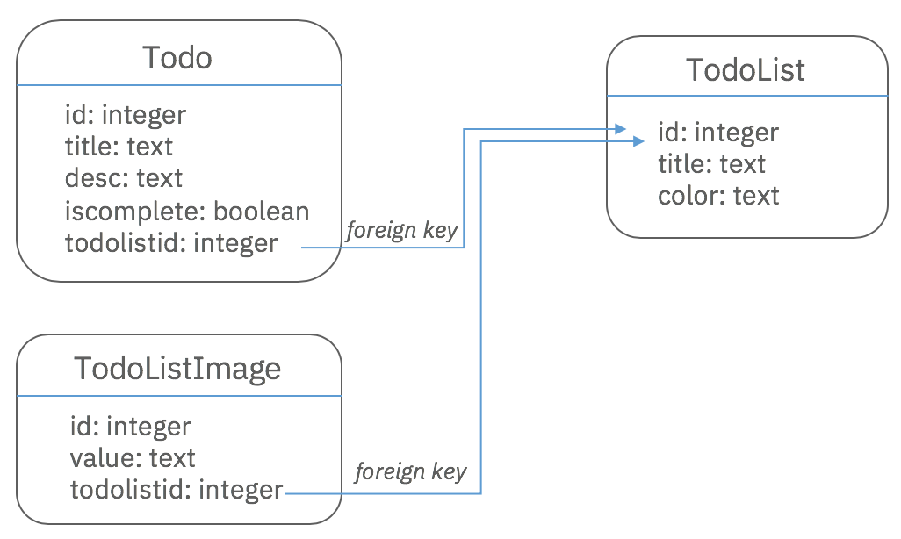

If you are running this example using a relational database, there are extra
steps in order to set up constraints in the database. We're using PostgreSQL for
illustration, but it would work for other relational databases in a similar way.

### Create a new datasource

We're going to update the DataSource `db` to connect to the PostgreSQL database
instead of the in-memory database.

First, remove the existing `db`, run:

```sh
rm src/datasources/db.datasource.*
```

Then, create the datasource with the same name with the `lb4 datasource` command
and select `PostgreSQL` as the connector.

```sh
$ lb4 datasource
? Datasource name: db
? Select the connector for db:
  Redis key-value connector (supported by StrongLoop)
  MongoDB (supported by StrongLoop)
  MySQL (supported by StrongLoop)
❯ PostgreSQL (supported by StrongLoop)
  Oracle (supported by StrongLoop)
  Microsoft SQL (supported by StrongLoop)
  REST services (supported by StrongLoop)
  ...
```

### Specify the foreign key constraint in the models

Based on the model relations we've specified in the 3 models, the expected
database tables look like below:




#### Specify the foreign key constraints in Todo model

We will use the `foreignKeys` attribute to determine the constraints in the
database table.

In `src/models/todo.model.ts`, add the `settings` options in the `@model`
decorator.

```ts
@model({
  settings: {
    foreignKeys: {
      fk_todo_todoListId: {
        name: 'fk_todo_todoListId',
        entity: 'TodoList',
        entityKey: 'id',
        foreignKey: 'todolistid',
      },
    },
  },
})
export class Todo extends Entity {
  //etc.
}
```

Check out the details for
[auto-migrate and auto-update](https://loopback.io/doc/en/lb3/PostgreSQL-connector.html#auto-migrateauto-update-models-with-foreign-keys)
for PostgreSQL connector. For other connectors, go to the corresponding
connector from the
[Connectors Reference](https://loopback.io/doc/en/lb3/Connectors-reference.html)
section.

#### Specify the foreign key constraints in TodoListImage model

Similar to the `Todo` model, we will specify the constraints in the `settings`.

```ts
@model({
  settings: {
    foreignKeys: {
      fk_todoListImage_todoListId: {
        name: 'fk_todoListImage_todoListId',
        entity: 'TodoList',
        entityKey: 'id',
        foreignKey: 'todolistid',
      },
    },
  },
})
export class TodoListImage extends Entity {
  //etc.
}
```

### Database migration using `npm run migrate` command

The order of table creation is important. We are going to migrate `TodoList`
model before the `Todo` and `TodoListImage` models.

In `src/migrate.ts`, modify this line:

```ts
await app.migrateSchema({existingSchema});
```

to:

```ts
await app.migrateSchema({
  existingSchema,
  // The order of table creation is important.
  // A referenced table must exist before creating a
  // foreign key constraint.
  // For PostgreSQL connector, it does not create tables in the
  // right order.  Therefore, this change is needed.
  models: ['TodoList', 'Todo', 'TodoListImage'],
});
```

Run the following commands:

```sh
$ npm run build
$ npm run migrate
```

The `todolist`, `todo` and `todolistimage` tables are created.

For details, see the [Database migrations](Database-migrations.md) documentation
page.
