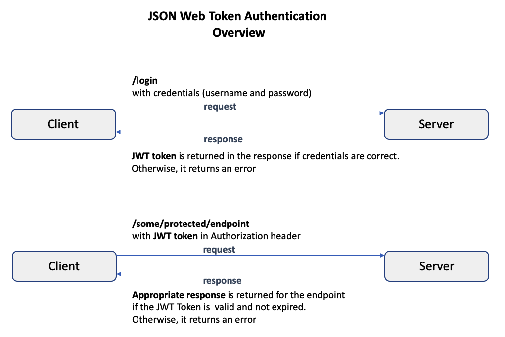
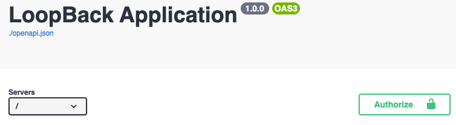
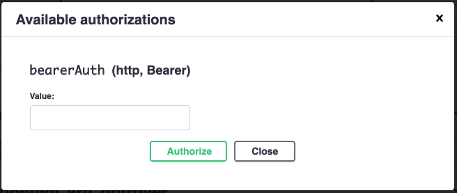
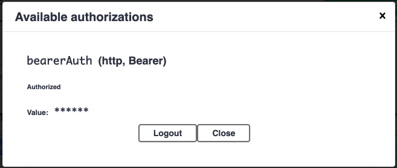
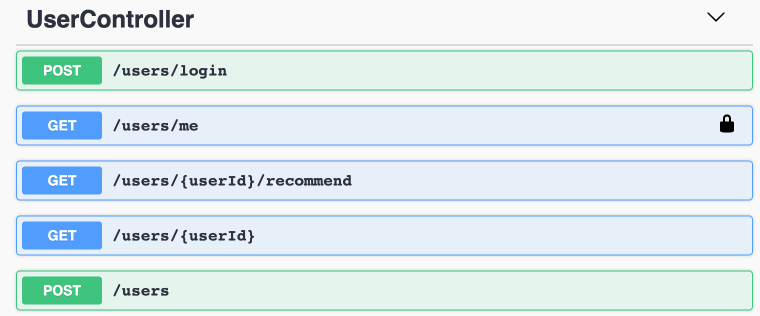
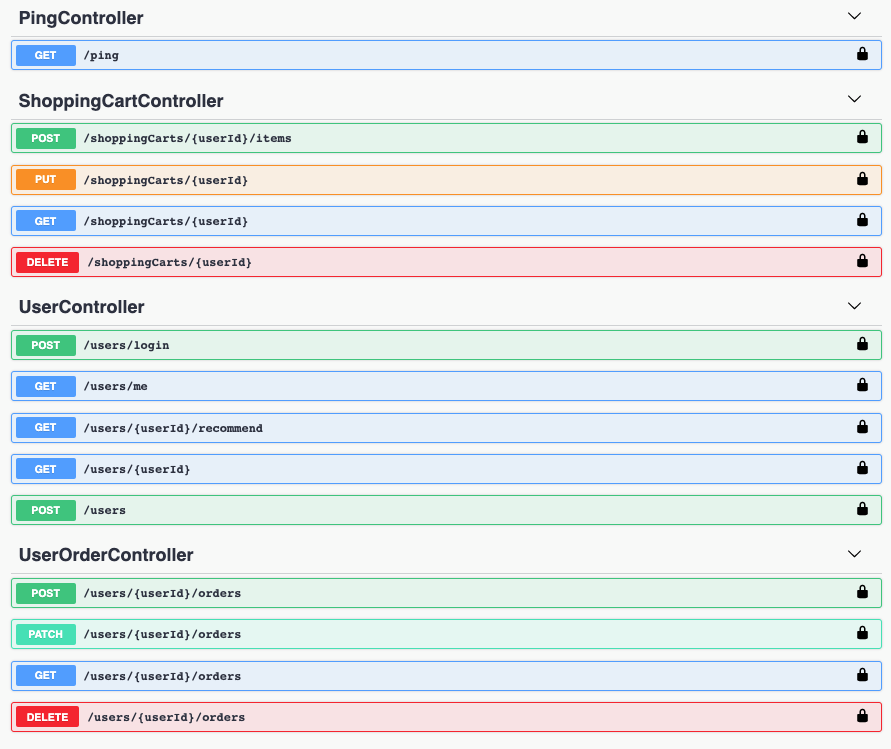

## Overview

LoopBack 4 has an authentication package `@loopback/authentication` which allows
you to secure your application's API endpoints with custom authentication
strategies and an `@authenticate` decorator.

This tutorial showcases how `authentication` was added to the
[loopback4-example-shopping](https://github.com/strongloop/loopback4-example-shopping)
application by **creating** and **registering** a custom authentication strategy
based on the `JSON Web Token (JWT)` approach.

Here is a brief summary of the `JSON Web Token (JWT)` approach.



In the **JSON Web Token (JWT)** authentication approach, when the user provides
the **correct** credentials to a **login** endpoint, the server creates a JWT
token and returns it in the response. The token is of type **string** and
consists of 3 parts: the **header**, the **payload**, and the **signature**.
Each part is encrypted using a **secret**, and the parts are separated by a
period.

For example:

```ts
// {encrypted-header}.{encrypted-payload}.{encrypted-signature}
eyJhbXVCJ9.eyJpZCI6Ij.I3wpRNCH4;
// actual parts have been reduced in size for viewing purposes
```



After logging in and obtaining this token, whenever the user attempts to access
a protected endpoint, the token must be provided in the **Authorization**
header. The server verifies that the token is valid and not expired, and then
permits access to the protected endpoint.

Please see [JSON Web Token (JWT)](https://en.wikipedia.org/wiki/JSON_Web_Token)
for more details.

To view and run the completed `loopback4-example-shopping` application, follow
the instructions in the [Try it out](#try-it-out) section.

To understand the details of how JWT authentication can be added to a LoopBack 4
application, read the
[Adding JWT Authentication to a LoopBack 4 Application](#adding-jwt-authentication-to-a-loopback-4-application)
section.

## Try it out

If you'd like to see the final results of this tutorial as an example
application, follow these steps:

1. Start the application:

   ```sh
   git clone https://github.com/strongloop/loopback4-example-shopping.git
   cd loopback4-example-shopping
   npm install
   npm run docker:start
   npm start
   ```

   Wait until you see:

   ```sh
   Recommendation server is running at http://127.0.0.1:3001.
   Server is running at http://[::1]:3000
   Try http://[::1]:3000/ping
   ```

1. In a browser, navigate to [http://[::1]:3000](http://127.0.0.1:3000) or
   [http://127.0.0.1:3000](http://127.0.0.1:3000), and click on `/explorer` to
   open the `API Explorer`.

1. In the `UserController` section, click on `POST /users`, click on
   `'Try it out'`, specify:

   ```ts
   {
   "id": "1",
   "email": "user1@example.com",
   "password": "thel0ngp@55w0rd",
   "firstName": "User",
   "lastName": "One"
   }
   ```

   and click on `'Execute'` to **add** a new user named `'User One'`.

1. In the `UserController` section, click on `POST /users/login`, click on
   `'Try it out'`, specify:

   ```ts
   {
     "email":    "user1@example.com",
     "password": "thel0ngp@55w0rd"
   }
   ```

   and click on `'Execute'` to **log in** as `'User One'`.

   A JWT token is sent back in the response.

   For example:

   ```ts
   {
     "token": "some.token.value"
   }
   ```

1. Scroll to the top of the API Explorer, and you should see an `Authorize`
   button. This is the place where you can set the JWT token.

   

1. Click on the `Authorize` button, and a dialog opens up.

   

1. In the `bearerAuth` value field, enter the token string you obtained earlier,
   and press the `Authorize` button. This JWT token is now available for the
   `/users/me` endpoint we will interact with next. Press the `Close` button to
   dismiss the dialog.

   

   

1. Scroll down to the `UserController` section to find `GET /users/me`

   

   Notice it has a **lock** icon and the other endpoints in this section do not.
   This is because this endpoint specified an operation-level
   `security requirement object` in the OpenAPI specification. (For details, see
   the
   [Specifying the Security Settings in the OpenAPI Specification](#specifying-the-security-settings-in-the-openapi-specification)
   section.)

1. Expand the `GET /users/me` section, and click on `Try it out`. There is no
   data to specify, so simply click on `Execute`. The JWT token you specified
   earlier was automatically placed in the `Authorization` header of the
   request.

   If authentication succeeds, the
   [user profile](https://github.com/strongloop/loopback-next/blob/master/packages/security/src/types.ts)
   of the currently authenticated user will be returned in the response. If
   authentication fails due to a missing/invalid/expired token, an
   [HTTP 401 UnAuthorized](https://developer.mozilla.org/en-US/docs/Web/HTTP/Status/401)
   is thrown.

   The response is:

   ```sh
   {"id":"1","name":"User One"}
   ```

## Adding JWT Authentication to a LoopBack 4 Application

In this section, we will demonstrate how `authentication` was added to the
[loopback4-example-shopping](https://github.com/strongloop/loopback4-example-shopping)
application using the
[JSON Web Token (JWT)](https://en.wikipedia.org/wiki/JSON_Web_Token) approach.

### Installing @loopback/authentication

The `loopback4-example-shopping` application **already** has the
`@loopback/authentication` dependency set up in its **package.json**

It was installed as a project dependency by performing:

```sh
npm install --save @loopback/authentication
```

### Adding the AuthenticationComponent to the Application

The core of authentication framework is found in the
[AuthenticationComponent](https://github.com/strongloop/loopback-next/blob/master/packages/authentication/src/authentication.component.ts),
so it is important to add the component in the `ShoppingApplication` class in
[loopback4-example-shopping/packages/shopping/src/application.ts](https://github.com/strongloop/loopback4-example-shopping/blob/master/packages/shopping/src/application.ts).

```ts
import {
  AuthenticationComponent
} from '@loopback/authentication';

export class ShoppingApplication extends BootMixin(
  ServiceMixin(RepositoryMixin(RestApplication)),
) {
  constructor(options?: ApplicationConfig) {
    super(options);

    // ...

    // Bind authentication component related elements
    this.component(AuthenticationComponent);

    // ...
```

### Securing an Endpoint with the Authentication Decorator

Securing your application's API endpoints is done by decorating controller
functions with the
[Authentication Decorator](../../decorators/Decorators_authenticate.md).

The decorator's syntax is:

```ts
@authenticate(strategyName: string, options?: object)
```

In the `loopback4-example-shopping` application, there is only one endpoint that
is secured.

In the `UserController` class in the
[loopback4-example-shopping/packages/shopping/src/controllers/user.controller.ts](https://github.com/strongloop/loopback4-example-shopping/blob/master/packages/shopping/src/controllers/user.controller.ts),
a user can print out his/her user profile by performing a `GET` request on the
`/users/me` endpoint which is handled by the `printCurrentUser()` function.

```ts
  // ...

  @get('/users/me', {
    responses: {
      '200': {
        description: 'The current user profile',
        content: {
          'application/json': {
            schema: UserProfileSchema,
          },
        },
      },
    },
  })
  @authenticate('jwt')
  async printCurrentUser(
    @inject(SecurityBindings.USER)
    currentUserProfile: UserProfile,
  ): Promise<UserProfile> {
    currentUserProfile.id = currentUserProfile[securityId];
    delete currentUserProfile[securityId];
    return currentUserProfile;
  }

  // ...
```

{% include note.html content="Since this controller method is obtaining CURRENT_USER via [method injection](../../Dependency-injection.md#method-injection) (instead of [constructor injection](../../Dependency-injection.md#constructor-injection)) and this method is decorated with the <b>@authenticate</b> decorator, there is no need to specify <b>@inject(SecurityBindings.USER, {optional:true})</b>. See [Using the Authentication Decorator](../../Loopback-component-authentication.md#using-the-authentication-decorator) for details.
" %}

The `/users/me` endpoint is decorated with

```ts
@authenticate('jwt')
```

and authentication will only succeed if a valid JWT token is provided in the
`Authorization` header of the request.

Basically, the
[AuthenticateFn](https://github.com/strongloop/loopback-next/blob/master/packages/authentication/src/providers/auth-action.provider.ts)
action in the custom sequence `MyAuthenticationSequence` (discussed in a later
section) asks
[AuthenticationStrategyProvider](https://github.com/strongloop/loopback-next/blob/master/packages/authentication/src/providers/auth-strategy.provider.ts)
to resolve the registered authentication strategy with the name `'jwt'` (which
is `JWTAuthenticationStrategy` and discussed in a later section). Then
`AuthenticateFn` calls `JWTAuthenticationStrategy`'s `authenticate(request)`
function to authenticate the request.

If the provided JWT token is valid, then `JWTAuthenticationStrategy`'s
`authenticate(request)` function returns the user profile. `AuthenticateFn` then
places the user profile on the request context using the `SecurityBindings.USER`
binding key. The user profile is available to the `printCurrentUser()`
controller function in a variable `currentUserProfile: UserProfile` through
dependency injection via the same `SecurityBindings.USER` binding key. The user
profile is returned in the response.

If the JWT token is missing/expired/invalid, then `JWTAuthenticationStrategy`'s
`authenticate(request)` function fails and an
[HTTP 401 UnAuthorized](https://developer.mozilla.org/en-US/docs/Web/HTTP/Status/401)
is thrown.

If an **unknown** authentication strategy **name** is specified in the
`@authenticate` decorator:

```ts
@authenticate('unknown')
```

then
[AuthenticationStrategyProvider](https://github.com/strongloop/loopback-next/blob/master/packages/authentication/src/providers/auth-strategy.provider.ts)'s
`findAuthenticationStrategy(name: string)` function cannot find a registered
authentication strategy by that name, and an
[HTTP 401 UnAuthorized](https://developer.mozilla.org/en-US/docs/Web/HTTP/Status/401)
is thrown.

So, be sure to specify the correct authentication strategy name when decorating
your endpoints with the `@authenticate` decorator.

### Creating a Custom Sequence and Adding the Authentication Action

In a LoopBack 4 application with REST API endpoints, each request passes through
a stateless grouping of actions called a [Sequence](../../Sequence.md).

Authentication is **not** part of the default sequence of actions, so you must
create a custom sequence and add the authentication action.

The custom sequence `MyAuthenticationSequence` in
[loopback4-example-shopping/packages/shopping/src/sequence.ts](https://github.com/strongloop/loopback4-example-shopping/blob/master/packages/shopping/src/sequence.ts)
implements the
[SequenceHandler](https://github.com/strongloop/loopback-next/blob/master/packages/rest/src/sequence.ts)
interface.

```ts
export class MyAuthenticationSequence implements SequenceHandler {
  constructor(
    @inject(SequenceActions.FIND_ROUTE) protected findRoute: FindRoute,
    @inject(SequenceActions.PARSE_PARAMS)
    protected parseParams: ParseParams,
    @inject(SequenceActions.INVOKE_METHOD) protected invoke: InvokeMethod,
    @inject(SequenceActions.SEND) protected send: Send,
    @inject(SequenceActions.REJECT) protected reject: Reject,
    @inject(AuthenticationBindings.AUTH_ACTION)
    protected authenticateRequest: AuthenticateFn,
  ) {}

  async handle(context: RequestContext) {
    try {
      const {request, response} = context;
      const route = this.findRoute(request);

      //call authentication action
      await this.authenticateRequest(request);

      // Authentication successful, proceed to invoke controller
      const args = await this.parseParams(request, route);
      const result = await this.invoke(route, args);
      this.send(response, result);
    } catch (error) {
      //
      // The authentication action utilizes a strategy resolver to find
      // an authentication strategy by name, and then it calls
      // strategy.authenticate(request).
      //
      // The strategy resolver throws a non-http error if it cannot
      // resolve the strategy. When the strategy resolver obtains
      // a strategy, it calls strategy.authenticate(request) which
      // is expected to return a user profile. If the user profile
      // is undefined, then it throws a non-http error.
      //
      // It is necessary to catch these errors and add HTTP-specific status
      // code property.
      //
      // Errors thrown by the strategy implementations already come
      // with statusCode set.
      //
      // In the future, we want to improve `@loopback/rest` to provide
      // an extension point allowing `@loopback/authentication` to contribute
      // mappings from error codes to HTTP status codes, so that application
      // don't have to map codes themselves.
      if (
        error.code === AUTHENTICATION_STRATEGY_NOT_FOUND ||
        error.code === USER_PROFILE_NOT_FOUND
      ) {
        Object.assign(error, {statusCode: 401 /* Unauthorized */});
      }

      this.reject(context, error);
      return;
    }
  }
}
```

The authentication action/function is injected via the
`AuthenticationBindings.AUTH_ACTION` binding key, is given the name
`authenticateRequest` and has the type
[AuthenticateFn](https://github.com/strongloop/loopback-next/blob/master/packages/authentication/src/types.ts).

Calling

```ts
await this.authenticateRequest(request);
```

before

```ts
// ...
const result = await this.invoke(route, args);
this.send(response, result);
// ...
```

ensures that authentication has succeeded before a controller endpoint is
reached.

To add the custom sequence `MyAuthenticationSequence` in the application, we
must code the following in
[loopback4-example-shopping/packages/shopping/src/application.ts](https://github.com/strongloop/loopback4-example-shopping/blob/master/packages/shopping/src/application.ts):

```ts
export class ShoppingApplication extends BootMixin(
  ServiceMixin(RepositoryMixin(RestApplication)),
) {
  constructor(options?: ApplicationConfig) {
    super(options);

    // ...

    // Set up the custom sequence
    this.sequence(MyAuthenticationSequence);

    // ...
  }
}
```

### Creating a Custom JWT Authentication Strategy

When creating a custom authentication strategy, it is necessary to implement the
[AuthenticationStrategy](https://github.com/strongloop/loopback-next/blob/master/packages/authentication/src/types.ts)
interface.

A custom JWT authentication strategy `JWTAuthenticationStrategy` in
[loopback4-example-shopping/packages/shopping/src/authentication-strategies/jwt-strategy.ts](https://github.com/strongloop/loopback4-example-shopping/blob/master/packages/shopping/src/authentication-strategies/jwt-strategy.ts)
was implemented as follows:

```ts
import {inject} from '@loopback/context';
import {HttpErrors, Request} from '@loopback/rest';
import {AuthenticationStrategy, TokenService} from '@loopback/authentication';
import {UserProfile} from '@loopback/security';

import {TokenServiceBindings} from '../keys';

export class JWTAuthenticationStrategy implements AuthenticationStrategy {
  name: string = 'jwt';

  constructor(
    @inject(TokenServiceBindings.TOKEN_SERVICE)
    public tokenService: TokenService,
  ) {}

  async authenticate(request: Request): Promise<UserProfile | undefined> {
    const token: string = this.extractCredentials(request);
    const userProfile: UserProfile = await this.tokenService.verifyToken(token);
    return userProfile;
  }

  extractCredentials(request: Request): string {
    if (!request.headers.authorization) {
      throw new HttpErrors.Unauthorized(`Authorization header not found.`);
    }

    // for example: Bearer xxx.yyy.zzz
    const authHeaderValue = request.headers.authorization;

    if (!authHeaderValue.startsWith('Bearer')) {
      throw new HttpErrors.Unauthorized(
        `Authorization header is not of type 'Bearer'.`,
      );
    }

    //split the string into 2 parts: 'Bearer ' and the `xxx.yyy.zzz`
    const parts = authHeaderValue.split(' ');
    if (parts.length !== 2)
      throw new HttpErrors.Unauthorized(
        `Authorization header value has too many parts. It must follow the pattern: 'Bearer xx.yy.zz' where xx.yy.zz is a valid JWT token.`,
      );
    const token = parts[1];

    return token;
  }
}
```

It has a **name** `'jwt'`, and it implements the
`async authenticate(request: Request): Promise<UserProfile | undefined>`
function.

An extra function `extractCredentials(request: Request): string` was added to
extract the JWT token from the request. This authentication strategy expects
every request to pass a valid JWT token in the `Authorization` header.

`JWTAuthenticationStrategy` also makes use of a token service `tokenService` of
type `TokenService` that is injected via the
`TokenServiceBindings.TOKEN_SERVICE` binding key. It is used to verify the
validity of the JWT token and return a user profile.

This token service is explained in a later section.

### Registering the Custom JWT Authentication Strategy

To register the custom authentication strategy `JWTAuthenticationStrategy` with
the **name** `'jwt'` as a part of the authentication framework, we need to code
the following in
[loopback4-example-shopping/packages/shopping/src/application.ts](https://github.com/strongloop/loopback4-example-shopping/blob/master/packages/shopping/src/application.ts).

```ts
import {registerAuthenticationStrategy} from '@loopback/authentication';

export class ShoppingApplication extends BootMixin(
  ServiceMixin(RepositoryMixin(RestApplication)),
) {
  constructor(options?: ApplicationConfig) {
    super(options);
    // ...
    registerAuthenticationStrategy(this, JWTAuthenticationStrategy);
    // ...
  }
}
```

### Creating a Token Service

The token service `JWTService` in
[loopback4-example-shopping/packages/shopping/src/services/jwt-service.ts](https://github.com/strongloop/loopback4-example-shopping/blob/master/packages/shopping/src/services/jwt-service.ts)
implements an **optional** helper
[TokenService](https://github.com/strongloop/loopback-next/blob/master/packages/authentication/src/services/token.service.ts)
interface.

```ts
import {inject} from '@loopback/context';
import {HttpErrors} from '@loopback/rest';
import {promisify} from 'util';
import {TokenService} from '@loopback/authentication';
import {UserProfile} from '@loopback/security';
import {TokenServiceBindings} from '../keys';

const jwt = require('jsonwebtoken');
const signAsync = promisify(jwt.sign);
const verifyAsync = promisify(jwt.verify);

export class JWTService implements TokenService {
  constructor(
    @inject(TokenServiceBindings.TOKEN_SECRET)
    private jwtSecret: string,
    @inject(TokenServiceBindings.TOKEN_EXPIRES_IN)
    private jwtExpiresIn: string,
  ) {}

  async verifyToken(token: string): Promise<UserProfile> {
    if (!token) {
      throw new HttpErrors.Unauthorized(
        `Error verifying token: 'token' is null`,
      );
    }

    let userProfile: UserProfile;

    try {
      // decode user profile from token
      const decryptedToken = await verifyAsync(token, this.jwtSecret);
      // don't copy over  token field 'iat' and 'exp', nor 'email' to user profile
      userProfile = Object.assign(
        {id: '', name: ''},
        {id: decryptedToken.id, name: decryptedToken.name},
      );
    } catch (error) {
      throw new HttpErrors.Unauthorized(
        `Error verifying token: ${error.message}`,
      );
    }

    return userProfile;
  }

  async generateToken(userProfile: UserProfile): Promise<string> {
    if (!userProfile) {
      throw new HttpErrors.Unauthorized(
        'Error generating token: userProfile is null',
      );
    }

    // Generate a JSON Web Token
    let token: string;
    try {
      token = await signAsync(userProfile, this.jwtSecret, {
        expiresIn: Number(this.jwtExpiresIn),
      });
    } catch (error) {
      throw new HttpErrors.Unauthorized(`Error encoding token: ${error}`);
    }

    return token;
  }
}
```

`JWTService` generates or verifies JWT tokens using the `sign` and `verify`
functions of [jsonwebtoken](https://www.npmjs.com/package/jsonwebtoken).

It makes use of `jwtSecret` and `jwtExpiresIn` **string** values that are
injected via the `TokenServiceBindings.TOKEN_SECRET` and the
`TokenServiceBindings.TOKEN_EXPIRES_IN` binding keys respectively.

The `async generateToken(userProfile: UserProfile): Promise<string>` function
takes in a user profile of type
[UserProfile](https://github.com/strongloop/loopback-next/blob/master/packages/security/src/types.ts),
generates a JWT token of type `string` using: the **user profile** as the
payload, **jwtSecret** and **jwtExpiresIn**.

The `async verifyToken(token: string): Promise<UserProfile>` function takes in a
JWT token of type `string`, verifies the JWT token, and returns the payload of
the token which is a user profile of type `UserProfile`.

To bind the JWT `secret`, `expires in` values and the `JWTService` class to
binding keys, we need to code the following in
[loopback4-example-shopping/packages/shopping/src/application.ts](https://github.com/strongloop/loopback4-example-shopping/blob/master/packages/shopping/src/application.ts):

```ts
export class ShoppingApplication extends BootMixin(
  ServiceMixin(RepositoryMixin(RestApplication)),
) {
  constructor(options?: ApplicationConfig) {
    super(options);

    // ...
    this.setUpBindings();
    // ...
  }

  setUpBindings(): void {
    // ...

    this.bind(TokenServiceBindings.TOKEN_SECRET).to(
      TokenServiceConstants.TOKEN_SECRET_VALUE,
    );

    this.bind(TokenServiceBindings.TOKEN_EXPIRES_IN).to(
      TokenServiceConstants.TOKEN_EXPIRES_IN_VALUE,
    );

    this.bind(TokenServiceBindings.TOKEN_SERVICE).toClass(JWTService);

    // ...
  }
}
```

In the code above, `TOKEN_SECRET_VALUE` has a value of `'myjwts3cr3t'` and
`TOKEN_EXPIRES_IN_VALUE` has a value of `'600'`.

`JWTService` is used in two places within the application:
`JWTAuthenticationStrategy` in
[loopback4-example-shopping/packages/shopping/src/authentication-strategies/jwt-strategy.ts](https://github.com/strongloop/loopback4-example-shopping/blob/master/packages/shopping/src/authentication-strategies/jwt-strategy.ts),
and `UserController` in
[loopback4-example-shopping/packages/shopping/src/controllers/user.controller.ts](https://github.com/strongloop/loopback4-example-shopping/blob/master/packages/shopping/src/controllers/user.controller.ts).

### Creating a User Service

The user service `MyUserService` in
[loopback4-example-shopping/packages/shopping/src/services/user-service.ts](https://github.com/strongloop/loopback4-example-shopping/blob/master/packages/shopping/src/services/user-service.ts)
implements an **optional** helper
[UserService](https://github.com/strongloop/loopback-next/blob/master/packages/authentication/src/services/user.service.ts)
interface.

```ts
export class MyUserService implements UserService<User, Credentials> {
  constructor(
    @repository(UserRepository) public userRepository: UserRepository,
    @inject(PasswordHasherBindings.PASSWORD_HASHER)
    public passwordHasher: PasswordHasher,
  ) {}

  async verifyCredentials(credentials: Credentials): Promise<User> {
    const foundUser = await this.userRepository.findOne({
      where: {email: credentials.email},
    });

    if (!foundUser) {
      throw new HttpErrors.NotFound(
        `User with email ${credentials.email} not found.`,
      );
    }
    const passwordMatched = await this.passwordHasher.comparePassword(
      credentials.password,
      foundUser.password,
    );

    if (!passwordMatched) {
      throw new HttpErrors.Unauthorized('The credentials are not correct.');
    }

    return foundUser;
  }

  convertToUserProfile(user: User): UserProfile {
    // since first name and lastName are optional, no error is thrown if not provided
    let userName = '';
    if (user.firstName) userName = `${user.firstName}`;
    if (user.lastName)
      userName = user.firstName
        ? `${userName} ${user.lastName}`
        : `${user.lastName}`;
    return {id: user.id, name: userName};
  }
}
```

The `async verifyCredentials(credentials: Credentials): Promise<User>` function
takes in a credentials of type
[Credentials](https://github.com/strongloop/loopback4-example-shopping/blob/master/packages/shopping/src/repositories/user.repository.ts),
and returns a **user** of type
[User](https://github.com/strongloop/loopback4-example-shopping/blob/master/packages/shopping/src/models/user.model.ts).
It searches through an injected user repository of type `UserRepository`.

The `convertToUserProfile(user: User): UserProfile` function takes in a **user**
of type `User` and returns a user profile of type
[UserProfile](https://github.com/strongloop/loopback-next/blob/master/packages/security/src/types.ts).
A user profile, in this case, is the minimum set of user properties which
identify an authenticated user.

`MyUserService` is used in by `UserController` in
[loopback4-example-shopping/packages/shopping/src/controllers/user.controller.ts](https://github.com/strongloop/loopback4-example-shopping/blob/master/packages/shopping/src/controllers/user.controller.ts).

To bind the `MyUserService` class, and the password hashing utility it uses, to
binding keys, we need to code the following in
[loopback4-example-shopping/packages/shopping/src/application.ts](https://github.com/strongloop/loopback4-example-shopping/blob/master/packages/shopping/src/application.ts):

```ts
export class ShoppingApplication extends BootMixin(
  ServiceMixin(RepositoryMixin(RestApplication)),
) {
  constructor(options?: ApplicationConfig) {
    super(options);

    // ...

    this.setUpBindings();

    // ...
  }

  setUpBindings(): void {
    // ...

    // Bind bcrypt hash services - utilized by 'UserController' and 'MyUserService'
    this.bind(PasswordHasherBindings.ROUNDS).to(10);
    this.bind(PasswordHasherBindings.PASSWORD_HASHER).toClass(BcryptHasher);

    this.bind(UserServiceBindings.USER_SERVICE).toClass(MyUserService);

    // ...
  }
}
```

### Adding Users

In the `UserController` class in the
[loopback4-example-shopping/packages/shopping/src/controllers/user.controller.ts](https://github.com/strongloop/loopback4-example-shopping/blob/master/packages/shopping/src/controllers/user.controller.ts),
users can be added by performing a `POST` request to the `/users` endpoint which
is handled by the `create()` function.

```ts
export class UserController {
  constructor(
    // ...
    @repository(UserRepository) public userRepository: UserRepository,
    @inject(PasswordHasherBindings.PASSWORD_HASHER)
    public passwordHasher: PasswordHasher,
    @inject(TokenServiceBindings.TOKEN_SERVICE)
    public jwtService: TokenService,
    @inject(UserServiceBindings.USER_SERVICE)
    public userService: UserService<User, Credentials>,
  ) {}

  // ...

  @post('/users')
  async create(@requestBody() user: User): Promise<User> {
    // ensure a valid email value and password value
    validateCredentials(_.pick(user, ['email', 'password']));

    // encrypt the password
    user.password = await this.passwordHasher.hashPassword(user.password);

    // create the new user
    const savedUser = await this.userRepository.create(user);
    delete savedUser.password;

    return savedUser;
  }

  // ...
```

A user of type
[User](https://github.com/strongloop/loopback4-example-shopping/blob/master/packages/shopping/src/models/user.model.ts)
is added to the database via the user repository if the user's email and
password values are in an acceptable format.

### Issuing a JWT Token on Successful Login

In the `UserController` class in the
[loopback4-example-shopping/packages/shopping/src/controllers/user.controller.ts](https://github.com/strongloop/loopback4-example-shopping/blob/master/packages/shopping/src/controllers/user.controller.ts),
a user can `log in` by performing a `POST` request, containing an `email` and
`password`, to the `/users/login` endpoint which is handled by the `login()`
function.

```ts
export class UserController {
  constructor(
    // ...
    @repository(UserRepository) public userRepository: UserRepository,
    @inject(PasswordHasherBindings.PASSWORD_HASHER)
    public passwordHasher: PasswordHasher,
    @inject(TokenServiceBindings.TOKEN_SERVICE)
    public jwtService: TokenService,
    @inject(UserServiceBindings.USER_SERVICE)
    public userService: UserService<User, Credentials>,
  ) {}

  // ...

  @post('/users/login', {
    responses: {
      '200': {
        description: 'Token',
        content: {
          'application/json': {
            schema: {
              type: 'object',
              properties: {
                token: {
                  type: 'string',
                },
              },
            },
          },
        },
      },
    },
  })
  async login(
    @requestBody(CredentialsRequestBody) credentials: Credentials,
  ): Promise<{token: string}> {
    // ensure the user exists, and the password is correct
    const user = await this.userService.verifyCredentials(credentials);

    // convert a User object into a UserProfile object (reduced set of properties)
    const userProfile = this.userService.convertToUserProfile(user);

    // create a JSON Web Token based on the user profile
    const token = await this.jwtService.generateToken(userProfile);

    return {token};
  }
}
```

The user service returns a user object when the email and password are verified
as valid; otherwise it throws an
[HTTP 401 UnAuthorized](https://developer.mozilla.org/en-US/docs/Web/HTTP/Status/401).
The user service is then called to create a slimmer user profile from the user
object. Then this user profile is used as the payload of the JWT token created
by the token service. The token is returned in the response.

### Specifying the Security Settings in the OpenAPI Specification

In the shopping cart application, only one endpoint, `GET /users/me` is secured
with a custom JWT authentication strategy. In order to be able to `set` and
`use` a JWT token in the `API Explorer` (as opposed to using a REST API client),
it is necessary to specify
[security scheme object](https://github.com/OAI/OpenAPI-Specification/blob/master/versions/3.0.1.md#security-scheme-object)
and
[security requirement object](https://github.com/OAI/OpenAPI-Specification/blob/master/versions/3.0.1.md#securityRequirementObject)
information in the application's OpenAPI specification.

In
[loopback4-example-shopping/packages/shopping/src/utils/security-spec.ts](https://github.com/strongloop/loopback4-example-shopping/blob/master/packages/shopping/src/utils/security-spec.ts)
we defined the following:

```ts
import {SecuritySchemeObject, ReferenceObject} from '@loopback/openapi-v3';

export const OPERATION_SECURITY_SPEC = [{bearerAuth: []}];
export type SecuritySchemeObjects = {
  [securityScheme: string]: SecuritySchemeObject | ReferenceObject;
};
export const SECURITY_SCHEME_SPEC: SecuritySchemeObjects = {
  bearerAuth: {
    type: 'http',
    scheme: 'bearer',
    bearerFormat: 'JWT',
  },
};
```

`SECURITY_SCHEME_SPEC` is a map of security scheme object definitions that are
defined globally for the application. For our purposes, it only contains a
single security scheme object that contains the
[bearerAuth](https://github.com/OAI/OpenAPI-Specification/blob/master/versions/3.0.1.md#jwt-bearer-sample)
definition.

`OPERATION_SECURITY_SPEC` is an **operation-level**
[security requirement object](https://github.com/OAI/OpenAPI-Specification/blob/master/versions/3.0.1.md#securityRequirementObject)
that references the `bearerAuth` security scheme object definition. It is used
by the `/users/me` endpoint in
[loopback4-example-shopping/packages/shopping/src/controllers/user.controller.ts](https://github.com/strongloop/loopback4-example-shopping/blob/master/packages/shopping/src/controllers/user.controller.ts).

Notice the line

```
security: OPERATION_SECURITY_SPEC,
```

in the code below:

```ts
@get('/users/me', {
  security: OPERATION_SECURITY_SPEC,
  responses: {
    '200': {
      description: 'The current user profile',
      content: {
        'application/json': {
          schema: UserProfileSchema,
        },
      },
    },
  },
})
@authenticate('jwt')
async printCurrentUser(
  @inject(SecurityBindings.USER)
  currentUserProfile: UserProfile,
): Promise<UserProfile> {
  currentUserProfile.id = currentUserProfile[securityId];
  delete currentUserProfile[securityId];
  return currentUserProfile;
}
```

[loopback4-example-shopping/packages/shopping/src/application.ts](https://github.com/strongloop/loopback4-example-shopping/blob/master/packages/shopping/src/application.ts)
contributes the `security scheme object` definitions to the OpenAPI
specification in the following manner:

```ts
import {SECURITY_SCHEME_SPEC} from './utils/security-spec';

export class ShoppingApplication extends BootMixin(
  ServiceMixin(RepositoryMixin(RestApplication)),
) {
  constructor(options?: ApplicationConfig) {
    super(options);

    this.api({
      openapi: '3.0.0',
      info: {title: pkg.name, version: pkg.version},
      paths: {},
      components: {securitySchemes: SECURITY_SCHEME_SPEC},
      servers: [{url: '/'}],
    });
// ...
```

Later, when you visit
[http://[::1]:3000/openapi.json](http://[::1]:3000/openapi.json) while the
application is running, search for the text `bearerAuth`. You should find these
two occurrences:

```
"components": {
    "securitySchemes": {
      "bearerAuth": {
        "type": "http",
        "scheme": "bearer",
        "bearerFormat": "JWT"
      }
    },
```

and

```
"/users/me": {
      "get": {
        "x-controller-name": "UserController",
        "x-operation-name": "printCurrentUser",
        "tags": [
          "UserController"
        ],
        "security": [
          {
            "bearerAuth": []
          }
        ],
```

Later, when you visit [http://[::1]:3000/explorer/](http://[::1]:3000/explorer/)
while the application is running, you should see an `Authorize` button at the
top.


as well as a **lock** icon on the `GET /users/me` endpoint in the
`UserController` section


### How to Specify A Single OpenAPI Specification Security Requirement Object For All Endpoints

Currently, the `loopback4-example-shopping` application does not implement this,
but there is a way to specify the same OpenAPI specification security
requirement object to **all** endpoints of your application.

The security scheme object definition is still defined in `components` section,
but the `security` property value is set at the **top** level instead of the
**operation** level.

```
"components": {
    "securitySchemes": {
      "bearerAuth": {
        "type": "http",
        "scheme": "bearer",
        "bearerFormat": "JWT"
      }
    },
  // ...
},
"security": [
    {
      "bearerAuth": []
    }
  ]
```

To accomplish this, we only need to make some minor changes to the code examples
provided earlier.

In
[loopback4-example-shopping/packages/shopping/src/utils/security-spec.ts](https://github.com/strongloop/loopback4-example-shopping/blob/master/packages/shopping/src/utils/security-spec.ts),
we simply rename `OPERATION_SECURITY_SPEC` to `SECURITY_SPEC`.

```ts
import {SecuritySchemeObject, ReferenceObject} from '@loopback/openapi-v3';

export const SECURITY_SPEC = [{bearerAuth: []}];
export type SecuritySchemeObjects = {
  [securityScheme: string]: SecuritySchemeObject | ReferenceObject;
};
export const SECURITY_SCHEME_SPEC: SecuritySchemeObjects = {
  bearerAuth: {
    type: 'http',
    scheme: 'bearer',
    bearerFormat: 'JWT',
  },
};
```

In
[loopback4-example-shopping/packages/shopping/src/controllers/user.controller.ts](https://github.com/strongloop/loopback4-example-shopping/blob/master/packages/shopping/src/controllers/user.controller.ts),
we remove the line:

```
security: SECURITY_SPEC_OPERATION,
```

from the `/users/me` endpoint:

```ts
@get('/users/me', {
  responses: {
    '200': {
      description: 'The current user profile',
      content: {
        'application/json': {
          schema: UserProfileSchema,
        },
      },
    },
  },
})
@authenticate('jwt')
async printCurrentUser(
  @inject(SecurityBindings.USER)
  currentUserProfile: UserProfile,
): Promise<UserProfile> {
  currentUserProfile.id = currentUserProfile[securityId];
  delete currentUserProfile[securityId];
  return currentUserProfile;
}
```

In
[loopback4-example-shopping/packages/shopping/src/application.ts](https://github.com/strongloop/loopback4-example-shopping/blob/master/packages/shopping/src/application.ts),
we simply add the line

```
security: SECURITY_SPEC
```

to the call to `this.api({...})`. This basically means the security requirement
object definition, `bearerAuth`, will be applied to all endpoints.

```ts
import {SECURITY_SCHEME_SPEC, SECURITY_SPEC} from './utils/security-spec';

export class ShoppingApplication extends BootMixin(
  ServiceMixin(RepositoryMixin(RestApplication)),
) {
  constructor(options?: ApplicationConfig) {
    super(options);

    this.api({
      openapi: '3.0.0',
      info: {title: pkg.name, version: pkg.version},
      paths: {},
      components: {securitySchemes: SECURITY_SCHEME_SPEC},
      servers: [{url: '/'}],
      security: SECURITY_SPEC
    });
// ...
```

Visiting [http://[::1]:3000/explorer/](http://[::1]:3000/explorer/) while the
application is running, you should still see an `Authorize` button at the top as
before.


But now, **all** the endpoints have the lock icon.



This means that you can set the JWT token once via the
`Authorize button/dialog`, and the token will be available to all the endpoints
your interact with.

There are plans to allow contributions to the OpenAPI specification via an
extensionPoint/extensions pattern (
[Issue #3854](https://github.com/strongloop/loopback-next/issues/3854) );
including having authentication strategies automatically contribute security
scheme/requirement object information (
[Issue #3669](https://github.com/strongloop/loopback-next/issues/3669) ).

### Summary

We've gone through the steps that were used to add JWT `authentication` to the
`loopback4-example-shopping` application, and add
`security scheme/requirement object` settings to its OpenAPI specification.

The final `ShoppingApplication` class in
[loopback4-example-shopping/packages/shopping/src/application.ts](https://github.com/strongloop/loopback4-example-shopping/blob/master/packages/shopping/src/application.ts)
should look like this:

```ts
import {BootMixin} from '@loopback/boot';
import {ApplicationConfig, BindingKey} from '@loopback/core';
import {RepositoryMixin} from '@loopback/repository';
import {RestApplication} from '@loopback/rest';
import {ServiceMixin} from '@loopback/service-proxy';
import {MyAuthenticationSequence} from './sequence';
import {
  RestExplorerBindings,
  RestExplorerComponent,
} from '@loopback/rest-explorer';
import {
  TokenServiceBindings,
  UserServiceBindings,
  TokenServiceConstants,
} from './keys';
import {JWTService} from './services/jwt-service';
import {MyUserService} from './services/user-service';

import * as path from 'path';
import {
  AuthenticationComponent,
  registerAuthenticationStrategy,
} from '@loopback/authentication';
import {PasswordHasherBindings} from './keys';
import {BcryptHasher} from './services/hash.password.bcryptjs';
import {JWTAuthenticationStrategy} from './authentication-strategies/jwt-strategy';
import {SECURITY_SCHEME_SPEC} from './utils/security-spec';

/**
 * Information from package.json
 */
export interface PackageInfo {
  name: string;
  version: string;
  description: string;
}
export const PackageKey = BindingKey.create<PackageInfo>('application.package');

const pkg: PackageInfo = require('../package.json');

export class ShoppingApplication extends BootMixin(
  ServiceMixin(RepositoryMixin(RestApplication)),
) {
  constructor(options?: ApplicationConfig) {
    super(options);

    this.api({
      openapi: '3.0.0',
      info: {title: pkg.name, version: pkg.version},
      paths: {},
      components: {securitySchemes: SECURITY_SCHEME_SPEC},
      servers: [{url: '/'}],
    });

    this.setUpBindings();

    // Bind authentication component related elements
    this.component(AuthenticationComponent);

    registerAuthenticationStrategy(this, JWTAuthenticationStrategy);

    // Set up the custom sequence
    this.sequence(MyAuthenticationSequence);

    // Set up default home page
    this.static('/', path.join(__dirname, '../public'));

    // Customize @loopback/rest-explorer configuration here
    this.bind(RestExplorerBindings.CONFIG).to({
      path: '/explorer',
    });
    this.component(RestExplorerComponent);

    this.projectRoot = __dirname;
    // Customize @loopback/boot Booter Conventions here
    this.bootOptions = {
      controllers: {
        // Customize ControllerBooter Conventions here
        dirs: ['controllers'],
        extensions: ['.controller.js'],
        nested: true,
      },
    };
  }

  setUpBindings(): void {
    // Bind package.json to the application context
    this.bind(PackageKey).to(pkg);

    this.bind(TokenServiceBindings.TOKEN_SECRET).to(
      TokenServiceConstants.TOKEN_SECRET_VALUE,
    );

    this.bind(TokenServiceBindings.TOKEN_EXPIRES_IN).to(
      TokenServiceConstants.TOKEN_EXPIRES_IN_VALUE,
    );

    this.bind(TokenServiceBindings.TOKEN_SERVICE).toClass(JWTService);

    // // Bind bcrypt hash services
    this.bind(PasswordHasherBindings.ROUNDS).to(10);
    this.bind(PasswordHasherBindings.PASSWORD_HASHER).toClass(BcryptHasher);

    this.bind(UserServiceBindings.USER_SERVICE).toClass(MyUserService);
  }
}
```

## Running the Completed Application

To run the completed application, follow the instructions in the
[Try it out](#try-it-out) section.

For more information, please visit
[Authentication Component](../../Loopback-component-authentication.md).

## Bugs/Feedback

Open an issue in
[loopback4-example-shopping](https://github.com/strongloop/loopback4-example-shopping)
and we'll take a look!

## Contributions

- [Guidelines](https://github.com/strongloop/loopback-next/blob/master/docs/CONTRIBUTING.md)
- [Join the team](https://github.com/strongloop/loopback-next/issues/110)

## Tests

Run `npm test` from the root folder.

## Contributors

See
[all contributors](https://github.com/strongloop/loopback-next/graphs/contributors).

## License

MIT
