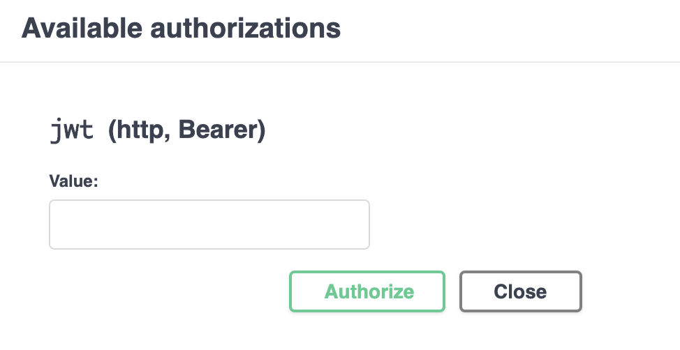

## Overview

LoopBack 4 has an authentication package `@loopback/authentication` which allows
you to secure your application's API endpoints with custom authentication
strategies and an `@authenticate` decorator.

This tutorial shows you how to add JWT authentication to your LoopBack
application using the extension
[`@loopback/authentication-jwt`](https://github.com/loopbackio/loopback-next/tree/master/extensions/authentication-jwt).

For demonstration purpose, we will be using the
[Todo application](https://loopback.io/doc/en/lb4/todo-tutorial.html) as the
base application.

At the end of this tutorial, it supports the following scenarios:

- User needs to log in first to get the token before calling any of the todo
  endpoints
- User can sign up if they don’t have any account already
- If the token is valid, user can call the REST APIs, otherwise an error with
  401 status code will occur.

## JSON Web Token Approach

Here is a brief summary of the `JSON Web Token (JWT)` approach.


In the **JSON Web Token (JWT)** authentication approach, when the user provides
the **correct** credentials to a **login** endpoint, the server creates a JWT
token and returns it in the response. The token is of type **string** and
consists of 3 parts: the **header**, the **payload**, and the **signature**. The
**header** and **payload** are digitally signed with **secret**, and the parts
are separated by a period.

For example:

```ts
// {base64UrlEncode-header}.{base64UrlEncode-payload}.{encrypted-signature}
eyJhbXVCJ9.eyJpZCI6Ij.I3wpRNCH4;
// actual parts have been reduced in size for viewing purposes
```



After logging in and obtaining this token, whenever the user attempts to access
a protected endpoint, the token must be provided in the **Authorization**
header. The server verifies that the token is valid and not expired, and then
permits access to the protected endpoint.

Please see [JSON Web Token (JWT)](https://en.wikipedia.org/wiki/JSON_Web_Token)
for more details.

To understand the details of how JWT authentication can be added to a LoopBack 4
application, read the
[Adding JWT Authentication to a LoopBack 4 Application](#adding-jwt-authentication-to-a-loopback-4-application)
section.

## Before we begin

Let’s download the Todo example and install the `@loopback/authentication-jwt`
extension.

```sh
$ lb4 example todo
$ cd loopback4-example-todo
$ npm i --save @loopback/authentication @loopback/authentication-jwt
```

## Step 1: Bind JWT Component in the Application

In `src/application.ts`, bind the authentication components to your application
class.



```ts
// ---------- ADD IMPORTS -------------
import {AuthenticationComponent} from '@loopback/authentication';
import {
  JWTAuthenticationComponent,
  SECURITY_SCHEME_SPEC,
  UserServiceBindings,
} from '@loopback/authentication-jwt';
import {DbDataSource} from './datasources';
// ------------------------------------

export class TodoListApplication extends BootMixin(
  ServiceMixin(RepositoryMixin(RestApplication)),
) {
  constructor(options: ApplicationConfig = {}) {
    //...
    // ------ ADD SNIPPET AT THE BOTTOM ---------
    // Mount authentication system
    this.component(AuthenticationComponent);
    // Mount jwt component
    this.component(JWTAuthenticationComponent);
    // Bind datasource
    this.dataSource(DbDataSource, UserServiceBindings.DATASOURCE_NAME);
    // ------------- END OF SNIPPET -------------
  }
}
```

## Step 2: Add Authenticate Action



Next, we will add the authenticate action in the Sequence. We’ll also modify the
error when authentication fails to return status code 401.



```ts
// ---------- ADD IMPORTS -------------
import {
  AuthenticateFn,
  AuthenticationBindings,
  AUTHENTICATION_STRATEGY_NOT_FOUND,
  USER_PROFILE_NOT_FOUND,
} from '@loopback/authentication';
// ------------------------------------
export class MySequence implements SequenceHandler {
  constructor(
    // ---- ADD THIS LINE ------
    @inject(AuthenticationBindings.AUTH_ACTION)
    protected authenticateRequest: AuthenticateFn,
  ) {}
  async handle(context: RequestContext) {
    try {
      const {request, response} = context;
      const route = this.findRoute(request);
      // - enable jwt auth -
      // call authentication action
      // ---------- ADD THIS LINE -------------
      await this.authenticateRequest(request);
      const args = await this.parseParams(request, route);
      const result = await this.invoke(route, args);
      this.send(response, result);
    } catch (err) {
      // ---------- ADD THIS SNIPPET -------------
      // if error is coming from the JWT authentication extension
      // make the statusCode 401
      if (
        err.code === AUTHENTICATION_STRATEGY_NOT_FOUND ||
        err.code === USER_PROFILE_NOT_FOUND
      ) {
        Object.assign(err, {statusCode: 401 /* Unauthorized */});
      }
      // ---------- END OF SNIPPET -------------
      this.reject(context, err);
    }
  }
}
```

## Step 3: Create the UserController for login

In the UserController, we are going to create three endpoints:

- `/login` for users to provide credential to login
- `/whoami` for showing who is the current user
- `/signup` for users to sign up

### 3a. Create the UserController

Create the controller using `lb4 controller` command with the empty controller
option.

```sh
$ lb4 controller
? Controller class name: User
Controller User will be created in src/controllers/user.controller.ts

? What kind of controller would you like to generate? Empty Controller

create src/controllers/user.controller.ts
   update src/controllers/index.ts

Controller User was created in src/controllers/
```

### 3b. Add endpoints in UserController

For UserService which verifies the credentials, we are going to use the default
implementation in the `@loopback/authentication-jwt` extension. Therefore, the
constructor injects the `MyUserService` from this extension.



```ts
// ---------- ADD IMPORTS -------------
import {inject} from '@loopback/core';
import {
  TokenServiceBindings,
  MyUserService,
  UserServiceBindings,
  UserRepository,
} from '@loopback/authentication-jwt';
import {TokenService} from '@loopback/authentication';
import {SecurityBindings, UserProfile} from '@loopback/security';
import {repository} from '@loopback/repository';
// ----------------------------------

constructor(
    @inject(TokenServiceBindings.TOKEN_SERVICE)
    public jwtService: TokenService,
    @inject(UserServiceBindings.USER_SERVICE)
    public userService: MyUserService,
    @inject(SecurityBindings.USER, {optional: true})
    public user: UserProfile,
    @repository(UserRepository) protected userRepository: UserRepository,
  ) {}
```

For the implementation of all the 3 endpoints, you can take a look at this
[user.controller.ts](https://github.com/loopbackio/loopback-next/blob/master/examples/todo-jwt/src/controllers/user.controller.ts)
in the [`todo-jwt` example].

## Step 4: Protect the Todo APIs

Finally, we need to protect other endpoints that we have, i.e. the `/todos`
APIs. Go to `src/controllers/todo.controller.ts`. Simple add
`@authenticate('jwt')` before the `TodoController` class. This will protect all
the APIs in this controller.



```ts
// ---------- ADD IMPORTS -------------
import {authenticate} from '@loopback/authentication';
// ------------------------------------
@authenticate('jwt') // <---- Apply the @authenticate decorator at the class level
export class TodoController {
  //...
}
```

If there are particular API that you want to make it available to everyone
without authentication, you can add `@authenticate.skip()` before that function.
See https://loopback.io/doc/en/lb4/Decorators_authenticate.html for more
details.

## Try it out

Start the application by running npm start and go to
http://localhost:3000/explorer.



You’ll see the 3 new endpoints under `UserController` together with the other
endpoints under `TodoController`.


1. Sign up using the `/signup` API

   Since we don’t have any users created, click on `POST /signup`. For the
   requestBody, the minimum you need is `email` and `password`. i.e.

   ```json
   {
     "email": "testuser2@abc.com",
     "password": "testuser2"
   }
   ```

2. Log in using the `POST /users/login` API

   After calling `/users/login`, the response body will look something like:

   ```json
   {
     "token": "aaaaaaaaa.aaaaaaaaaaaaaaaaa"
   }
   ```

   Copy the token. Go to the top of the API Explorer, click the “Authorize”
   button.

   

   Paste the token that you previously copied to the “Value” field and then
   click Authorize.

   

   In the future API calls, this token will be added to the `Authorization`
   header .

3. Get all todos using `GET /todos` API You should be able to call this API
   successfully.

## Conclusion

Congratulations! You have successfully added the JWT authentication to the
LoopBack application! We did the following:

- bind the JWT Component in the Application
- add Authenticate Action in the sequence
- create the UserController for login and signup functions
- protect the APIs by adding the `@authenticate` decorator

See the
[todo-jwt example](https://github.com/loopbackio/loopback-next/blob/master/examples/todo-jwt)
for the working application. You can also run `lb4 example todo-jwt` to download
the example.
