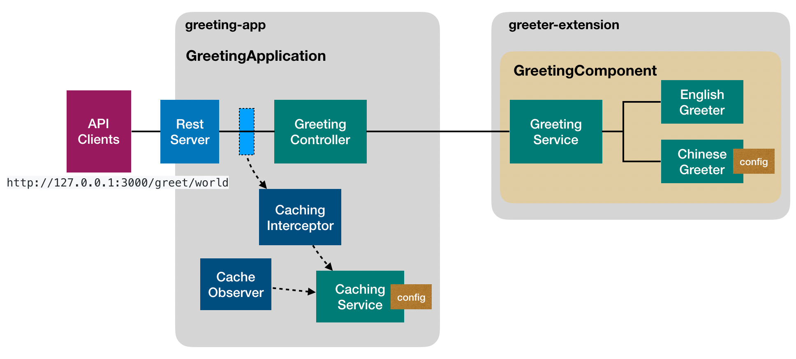

# Introduction (#1)

At the core of LoopBack 4, we provide a powerful Inversion of Control and
Dependency Injection container in TypeScript that serves as the foundation to
manage various artifacts for scalable Node.js applications. Independent of API
and Microservice capabilities offered by the LoopBack framework, these core
modules can be used as a platform to develop large scale Node.js projects that
require flexibility, extensibility, and composability.

To help our users leverage the core packages, we create a series of tutorials to
explain why such features matter and how to use them for your development.

## Greeting scenario

Let's first introduce the business scenario for our series of tutorials.

We're going to build an fancy version of `hello world` with the following
requirements:

1. The service is capable of speaking different languages to greet people. For
   example:

   - English: Hello, Raymond!
   - Chinese: Raymond，你好！

2. It should be easy to add support for a new language, such as French

3. A REST API is provided to access the service via
   `http://<server>:<port>/greet/<name>`. It will receive a response based on
   the `Accept-Language` http request header.

4. Caching is supported using the request url (`/greet/<name>`) and language as
   the key. Expiration is controlled by a configurable `ttl`.

5. The application can be run standalone to try the greeting service or as a
   server to expose REST APIs.

## High level design

Instead of creating a monolithic application, we would like to have good
separation of concerns by dividing responsibilities into a few artifacts. The
key building blocks are illustrated below based on features offered by
LoopBack 4. The code is being developed in the
[Greeter Extension Example](https://github.com/strongloop/loopback-next/tree/core-tutorial/examples/greeter-extension).

## Key artifacts

We are going to decompose the application into two packages:

1. [example-greeter-extension](https://github.com/strongloop/loopback-next/tree/core-tutorial/examples/greeter-extension)

   - GreetingService to greet by language and name
   - English and Chinese greeters to greet in English and Chinese respectively

2. [example-greeting-app](https://github.com/strongloop/loopback-next/tree/core-tutorial/examples/greeting-app)

   - CachingService to provide caching facilities
   - GreetingController to expose REST APIs
   - CachingInterceptor to apply caching
   - CachingObserver to start/stop caching and sweep the store to remove expired
     entries

There are dependencies between such artifacts, such as:

- GreetingService -> English Greeter and Chinese Greeter
- GreetingController -> GreetingService
- CachingInterceptor/CachingObserver -> CachingService

Some of the artifacts can be configurable, either statically at startup time or
dynamically when the application is running.
