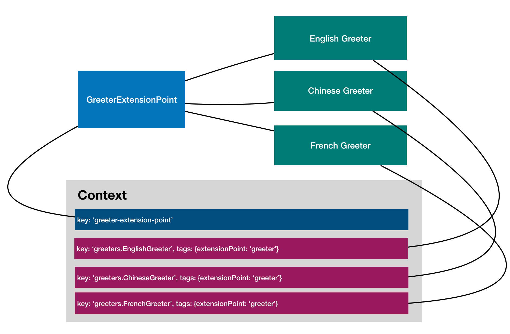

[Extension Point/extension pattern](https://wiki.eclipse.org/FAQ_What_are_extensions_and_extension_points%3F)
promotes loose coupling and offers great extensibility.

We'll use the following scenario to walk through the important steps to organize
the `GreetingService` that allows extensible languages - each of them being
supported by a `Greeter` extension.



Various constructs from LoopBack 4, such as `Context`, `@inject.*`, and
`Component`, are used to build the service in an extensible fashion.

## Define an extension point

In our scenario, we want to allow other modules to extend or customize how
people are greeted in different languages. To achieve that, we declare the
`greeter` extension point, which defines a contract as TypeScript interfaces
that extensions must conform.

### Define an interface for extensions

An extension point interacts with unknown number of extensions. It needs to
define one or more interfaces as the contracts that each extension must
implements.

```ts
/**
 * Typically an extension point defines an interface as the contract for
 * extensions to implement
 */
export interface Greeter {
  language: string;
  greet(name: string): string;
}
```

### Define a class for the extension point

Typically an extension point is defined as a TypeScript class and bound to a
context. In our case, we mark `GreetingService` as the extension point that has
access to a list of greeters which are defined as extensions.

```ts
import {Getter} from '@loopback/context';
import {extensionFilter, CoreTags} from '@loopback/core';
/**
 * An extension point for greeters that can greet in different languages
 */
export class GreetingService {
  constructor(
    /**
     * Inject a getter function to fetch greeters (bindings tagged with
     * `{extensionFor: GREETER_EXTENSION_POINT_NAME}`)
     */
    @inject.getter(extensionFilter(GREETER_EXTENSION_POINT_NAME))
    private getGreeters: Getter<Greeter[]>,
  ) {}
  // ...
}
```

By default, the name of the extension point is the same as the class name. To
customize metadata such as `name` for the extension point, we can use
`@extensionPoint` to decorate the class, such as:

```ts
import {extensionPoint} from '@loopback/core';
@extensionPoint(GREETER_EXTENSION_POINT_NAME)
export class GreetingService {}
```

#### Access extensions for a given extension point

To simplify access to extensions for a given extension point, we use dependency
injection to receive a `getter` function that gives us a list of greeters.

```ts
import {extensions, extensionPoint} from '@loopback/core';
@extensionPoint(GREETER_EXTENSION_POINT_NAME)
export class GreetingService {
  constructor(
    /**
     * Inject a getter function to fetch greeters (bindings tagged with
     * `{extensionFor: GREETER_EXTENSION_POINT_NAME}`)
     */
    @extensions()
    private getGreeters: Getter<Greeter[]>, // ...
  ) {}
}
```

Please note that it's possible to add/remove greeters after the extension point
is instantiated. If we use `@inject` to receive a list of registered greeters,
the `GreetingService` instance is injected with a snapshot of greeters but it
won't pick up any changes afterward. With `@inject.getter`, LoopBack injects a
getter function that will return the latest list of greeters, reflecting any
changes made since the last call. For example:

```ts
// Get the latest list of greeters
const greeters = await this.getGreeters();
```

#### Implement the delegation logic

Typically, the extension point implementation will get a list of registered
extensions. For example, when a person needs to be greeted in a specific
language, the code iterates through all greeters to find an instance that
matches the language. In this module, `GreetingService` implements the `greet`
operation which uses `findGreeter` to find a greeter and produces a greeting for
the given language.

```ts
export class GreetingService {
  // ...
  /**
   * Find a greeter that can speak the given language
   * @param language - Language code for the greeting
   */
  async findGreeter(language: string): Promise<Greeter | undefined> {
    // Get the latest list of greeters
    const greeters = await this.getGreeters();
    // Find a greeter that can speak the given language
    return greeters.find(g => g.language === language);
  }
  /**
   * Greet in the given language
   * @param language - Language code
   * @param name - Name
   */
  async greet(language: string, name: string): Promise<string> {
    let greeting: string = '';
    const greeter = await this.findGreeter(language);
    if (greeter) {
      greeting = greeter.greet(name);
    } else {
      // Fall back to English
      greeting = `Hello, ${name}`;
    }
    if (this.options && this.options.color) {
      greeting = chalk.keyword(this.options.color)(greeting);
    }
    return greeting;
  }
}
```

## Implement an extension

Modules that want to connect to `greeter` extension point must implement
`Greeter` interface in their extension. The key attribute is that the
`GreetingService` being extended knows nothing about the module that is
connecting to it beyond the scope of that contract. This allows `greeters` built
by different individuals or companies to interact seamlessly, even without their
knowing much about one another.

```ts
import {Greeter, asGreeter} from '../types';
import {bind, inject} from '@loopback/context';
/**
 * Options for the Chinese greeter
 */
export interface ChineseGreeterOptions {
  // Name first, default to `true`
  nameFirst: boolean;
}
/**
 * A greeter implementation for Chinese
 */
@bind(asGreeter)
export class ChineseGreeter implements Greeter {
  language = 'zh';
  constructor(
    /**
     * Inject the configuration for ChineseGreeter
     */
    @inject('greeters.ChineseGreeter.options', {optional: true})
    private options: ChineseGreeterOptions = {nameFirst: true},
  ) {}
  greet(name: string) {
    if (this.options && this.options.nameFirst === false) {
      return `你好，${name}！`;
    }
    return `${name}，你好！`;
  }
}
```

Please note we use
[`@bind`](https://loopback.io/doc/en/lb4/Binding.html#configure-binding-attributes-for-a-class)
to customize how the class can be bound. In this case, `asGreeter` is a binding
template function, which is equivalent as configuring a binding with
`{extensionFor: 'greeter'}` tag and in the `SINGLETON` scope.

```ts
/**
 * A binding template for greeter extensions
 * @param binding
 */
export const asGreeter: BindingTemplate = binding => {
  extensionFor(GREETER_EXTENSION_POINT_NAME)(binding);
  binding.tag({namespace: 'greeters'});
};
```

## Register an extension point

To register an extension point, we simply bind the implementation class to a
`Context`. For example:

```ts
app
  .bind('services.GreetingService')
  .toClass(GreetingService)
  .inScope(BindingScope.SINGLETON);
```

**NOTE**: Your extension point may choose to use a different
[binding scope](https://loopback.io/doc/en/lb4/apidocs.context.bindingscope.html).

The process can be automated with a component:

```ts
import {createBindingFromClass} from '@loopback/context';
import {Component} from '@loopback/core';
import {GreetingService} from './greeting-service';
import {GREETING_SERVICE} from './keys';
/**
 * Define a component to register the greeter extension point and built-in
 * extensions
 */
export class GreetingComponent implements Component {
  bindings = [
    createBindingFromClass(GreetingService, {
      key: GREETING_SERVICE,
    }),
    // ...
  ];
}
```

## Register extensions

There are different ways to register the extensions.

### Method 1

Bind the extension to the `Context` and tag the binding with
`{extensionFor: 'greeters'}`. For example:

```ts
import {addExtension} from '@loopback/core';
addExtension(app, 'greeters', FrenchGreeter);
```

### Method 2

Bind the extension with the binding key to the application , for example:

```ts
app
  .bind('greeters.FrenchGreeter')
  .toClass(FrenchGreeter)
  .apply(asGreeter);
```

### Method 3

Add the binding class to the application, for example:

```ts
app.add(createBindingFromClass(FrenchGreeter));
```

### Method 4

The registration can be done using a component too:

```ts
export class GreetingComponent implements Component {
  bindings = [
    // ...
    createBindingFromClass(EnglishGreeter),
    createBindingFromClass(ChineseGreeter),
  ];
}
```

## Configure an extension point

Sometimes it's desirable to make the extension point configurable. Two steps are
involved to achieve that.

1. Declare an injection for the configuration for your extension point class:

   ```ts
   export class GreetingService {
     constructor(
       // ...
       private getGreeters: Getter<Greeter[]>,
       /**
        * An extension point should be able to receive its options via dependency
        * injection.
        */
       @config()
       public readonly options?: GreetingServiceOptions,
     ) {}
   }
   ```

2. Set configuration for the extension point

   ```ts
   // Configure the extension point
   import {GREETING_SERVICE} from './keys';
   app.configure(GREETING_SERVICE).to({color: 'blue'});
   ```

## Configure an extension

Some extensions also support customization. The approach is similar as how to
configure an extension point.

1. Declare an injection for the configuration in the extension class

   ```ts
   export class ChineseGreeter implements Greeter {
     language = 'zh';
     constructor(
       /**
        * Inject the configuration for ChineseGreeter
        */
       @config()
       private options: ChineseGreeterOptions = {nameFirst: true},
     ) {}
   }
   ```

2. Set configuration for the extension

   ```ts
   // Configure the ChineseGreeter
   app.configure('greeters.ChineseGreeter').to({nameFirst: false});
   ```

---

Previous: [Part 4 - Dependency injection](./4-dependency-injection.md)

Next: [Part 6 - Interception and observation](./6-interception.md)
