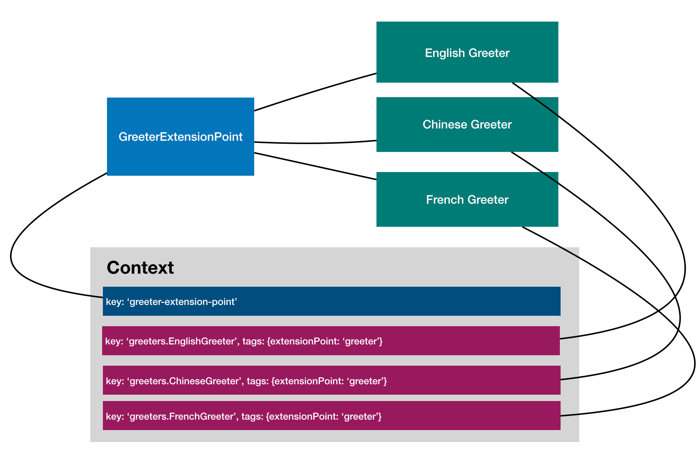

# Configuration



```ts
/**
 * A greeter implementation for Chinese.
 */
@bind(asGreeter)
export class ChineseGreeter implements Greeter {
  language = 'zh';

  constructor(
    /**
     * Inject the configuration for ChineseGreeter
     */
    @config()
    private options: ChineseGreeterOptions = {nameFirst: true},
  ) {}

```

```ts
export class GreetingService {
  constructor(
    /**
     * Inject a getter function to fetch greeters (bindings tagged with
     * `{[CoreTags.EXTENSION_POINT]: GREETER_EXTENSION_POINT_NAME}`)
     */
    @extensions()
    private getGreeters: Getter<Greeter[]>,
    /**
     * An extension point should be able to receive its options via dependency
     * injection.
     */
    @config()
    public readonly options?: GreetingServiceOptions,
  ) {}
}
```
