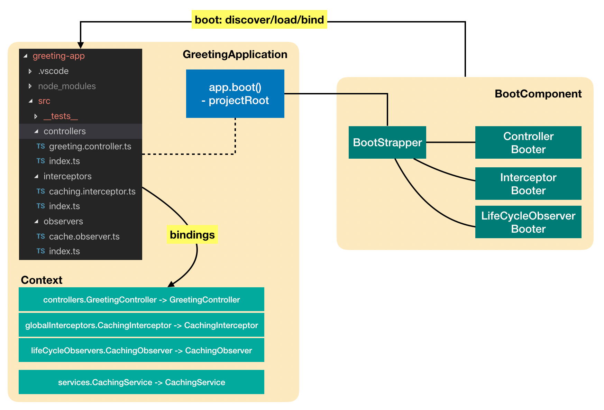

There are various types of artifacts being added to the application, such as
controller, interceptor, observer. Such artifacts need to be loaded and
registered with the application so that they can be used for composition. It can
be achieved by calling `Context` APIs or helper methods on the application
object:

```ts
import {createBindingFromClass, BindingScope} from '@loopback/context';
import {CACHING_SERVICE} from './keys';
import {CachingService} from './caching-service';
import {GreetingController} from './controllers';
import {CachingObserver} from './observers';
import {CachingInterceptor} from './interceptors';
// Use a helper method
app.controller(GreetingController);
// Use bind directly
app
  .bind(CACHING_SERVICE)
  .toClass(CachingService)
  .scope(BindingScope.SINGLETON);
// Use a helper method
app.lifeCycleObserver(CachingObserver);
// Use a helper method to create bindings and add them to the application
app.add(createBindingFromClass(CachingObserver));
app.add(createBindingFromClass(CachingInterceptor));
```

As the number of artifacts increases over time, it becomes cumbersome and
error-prone. A better and simpler way is to use
[`boot`](https://loopback.io/doc/en/lb4/Booting-an-Application.html).

## Use `@loopback/boot`

The `BootMixin` adds `boot()` to your application. The new code looks much
simpler:

```ts
import {BootMixin} from '@loopback/boot';
import {ApplicationConfig} from '@loopback/core';
import {RestApplication} from '@loopback/rest';
import {GreetingComponent} from './component';
import {CACHING_SERVICE} from './keys';
import {CachingService} from './caching-service';
export class GreetingApplication extends BootMixin(RestApplication) {
  constructor(config: ApplicationConfig = {}) {
    super(config);
    // Set up the root of the project for booting
    this.projectRoot = __dirname;
    this.add(createBindingFromClass(CachingService, {key: CACHING_SERVICE}));
    this.component(GreetingComponent);
  }
  async main() {
    // Discover, load, and bind artifacts by convention
    await this.boot();
    await this.start();
  }
}
```



---

Previous: [Part 8 - Configuration](./8-configuration.md)

Next: [Part 10 - Advanced recipes](./10-advanced-recipes.md)
