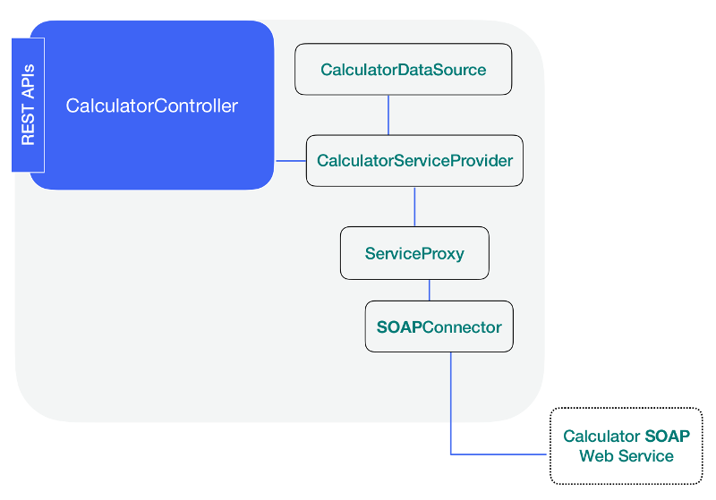

### Add a Controller



Now it is time to add the controller which will make the REST endpoints
available to client applications through the REST server.

#### Scaffold a BASIC controller

Run the following command to create a **BASIC** controller.

```sh
lb4 controller calculator
```

Next, select the **Empty Controller**.

```sh
Controller Calculator will be created in src/controllers/calculator.controller.ts

? What kind of controller would you like to generate? (Use arrow keys)
❯ Empty Controller
  REST Controller with CRUD functions
```

At this point, you should have two files in the `src/controllers` directory.

- calculator.controller.ts
- index.ts

The generated Empty controller looks like this. You may remove the comments at
this point.

```ts
// Uncomment these imports to begin using these cool features!

// import {inject} from '@loopback/context';

export class CalculatorController {
  constructor() {}
}
```

#### Adding the imports into the Controller

Add the following two lines at the begining of the
src/controllers/calculator.controller.ts file.

The **get** and **param** are classes imported from the **LB4** REST server and
used to make the `@get` and `@param` decorators available.

The **HttpErrors** is used to help use raise the precondition error whenever we
find that the client application is trying to divide by zero.

```ts
import {inject} from '@loopback/core';
import {get, param, HttpErrors} from '@loopback/rest';
```

To complete importing the necessary classes, we need to also include the service
and the interfaces we modeled in the previous step as follows:

```ts
import {
  CalculatorService,
  CalculatorParameters,
  AddResponse,
  MultiplyResponse,
  DivideResponse,
  SubtractResponse,
} from '../services/calculator.service';
```

#### Injecting the Service into the Controller

In the constructor method, we inject the service. Please note that the key
`services.CalculatorService` has not been defined so far, we will inform our
Application about this key in the last step.

```ts
export class CalculatorController {
  constructor(
    @inject('services.CalculatorService')
    protected calculatorService: CalculatorService,
  ) {}
}
```

#### Creating the end point methods

Now we need to create an endpoint for each operation. There will be four (4)
endpoints in total. Each endpoint is a method inside the `CalculatorController`,
so make sure the next code segments are placed before the last `}` in the file.

##### Adding the Divide end point

Our divide method looks like this initially. Notice we are using the
`<CalculatorParameters>` for type assertion. The Node.js methods defined in the
service are available from here due to the dependency injection available
through **LB4**.

```ts
async divide(intA: number, intB: number): Promise<DivideResponse> {
  //Preconditions
  if (intB === 0) {
    throw new HttpErrors.PreconditionFailed('Cannot divide by zero');
  }
  return this.calculatorService.divide(<CalculatorParameters>{
    intA,
    intB,
  });
}
```

Now, if we add the **@GET** decorator we are making it available to the **REST**
_server_ as follows.

```ts
@get('/divide/{intA}/{intB}')
async divide(intA: number, intB: number): Promise<DivideResponse> {
```

Finally we can use the **@param** decorator on the two properties to help us
validate the data type associated to each parameter. In this case we are making
sure the client application only sends integer values as the remote SOAP web
service expects this data type and this is done automatically for us.

The final code looks like as follows:

```ts
@get('/divide/{intA}/{intB}')
async divide(
  @param.path.integer('intA') intA: number,
  @param.path.integer('intB') intB: number,
): Promise<DivideResponse> {
  //Preconditions
  if (intB === 0) {
    throw new HttpErrors.PreconditionFailed('Cannot divide by zero');
  }
  return this.calculatorService.divide(<CalculatorParameters>{
    intA,
    intB,
  });
}
```

##### Adding the remaining end points

Add the following end point methods inside the CalculatorController class above
the divide end point method.

```ts
@get('/multiply/{intA}/{intB}')
async multiply(
  @param.path.integer('intA') intA: number,
  @param.path.integer('intB') intB: number,
): Promise<MultiplyResponse> {
  return this.calculatorService.multiply(<CalculatorParameters>{
    intA,
    intB,
  });
}
@get('/add/{intA}/{intB}')
async add(
  @param.path.integer('intA') intA: number,
  @param.path.integer('intB') intB: number,
): Promise<AddResponse> {
  return this.calculatorService.add(<CalculatorParameters>{
    intA,
    intB,
  });
}

@get('/subtract/{intA}/{intB}')
async subtract(
  @param.path.integer('intA') intA: number,
  @param.path.integer('intB') intB: number,
): Promise<SubtractResponse> {
  return this.calculatorService.subtract(<CalculatorParameters>{
    intA,
    intB,
  });
}
```

### Navigation

Previous step: [Add a Service](soap-calculator-tutorial-add-service.md)

Next step:
[Run and Test the Application](soap-calculator-tutorial-run-and-test.md)
