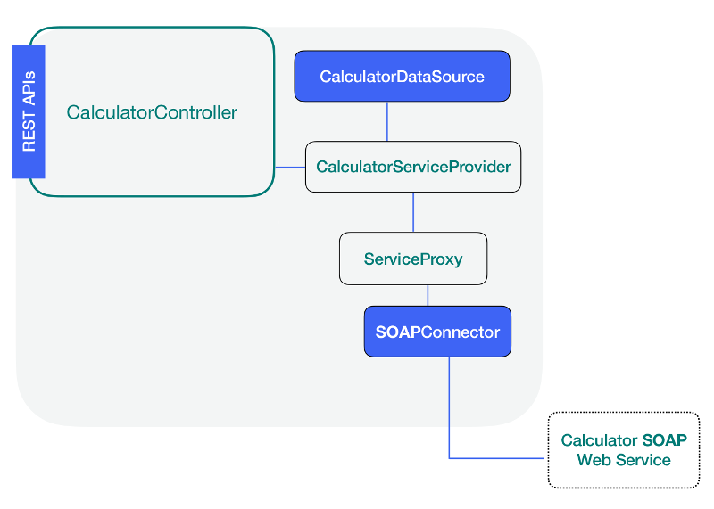

### Add a Datasource



We will add a Datasource to the **LB4** application using the **CLI**. This step
will not only create two files under the src/datasources, but also will install
the necessary connector and its dependencies for us. Let's run the following
command inside our application directory.

```sh
lb4 datasource calculator
```

#### Select a Connector type

We specified _calculator_ as the name for our Datasource. Now **CLI** is asking
us to select a connector type. Let's choose the **SOAP webservices** (supported
by StrongLoop) connector from the list as shown below:

```sh
? Select the connector for calculator:
  Oracle (supported by StrongLoop)
  Microsoft SQL (supported by StrongLoop)
  REST services (supported by StrongLoop)
❯ SOAP webservices (supported by StrongLoop)
  Couchbase (provided by community)
  Neo4j (provided by community)
  Kafka (provided by community)
(Move up and down to reveal more choices)
```

#### Specify the SOAP web service endpoint

Now we must tell **CLI** about the full URL path for our web service. In this
case, let's type `https://calculator-webservice.mybluemix.net/calculator` for
the URL and `https://calculator-webservice.mybluemix.net/calculator?wsdl` for
the WSDL path.

```sh
? Select the connector for calculator: SOAP webservices (supported by StrongLoop)
? URL to the SOAP web service endpoint: https://calculator-webservice.mybluemix.net/calculator
? HTTP URL or local file system path to the WSDL file: https://calculator-webservice.mybluemix.net/calculator?wsdl
```

#### Enabling expose REST API operations

Following the URL endpoints, we need to tell **CLI** that we are going to expose
the methods available in the SOAP web service as REST end points, type **Y** and
leave blank the Maps WSDL binding operations to Node.js methods for now, as we
will add them manually in the Datasource configuration file.

```sh
? Expose operations as REST APIs: Yes
? Maps WSDL binding operations to Node.js methods:
```

You will see the following message in the screen. Note that **CLI** created a
JSON configuration file and a .ts file with the Datasource name and added an
entry inside the index.ts file.

```sh
   create src/datasources/calculator.datasource.json
   create src/datasources/calculator.datasource.ts
   update src/datasources/index.ts

Datasource Calculator was created in src/datasources/
```

#### Binding WSDL operations to Node.js methods

The **SOAP** web service is exposing 4 operations, all of them share the same
SOAP port, which in this case is **CalculatorSoap** and the service
**Calculator**. The operations are:

- multiply
- add
- subtract
- divide

We need to configure in the Datasource JSON file, the corresponding Node.js
methods for these remote SOAP operations. For simplicity, we will name the
Node.js methods the same as their SOAP operation counterparts.

For example, having the following property, we are configuring the SOAP operator
Multiply that is reached in the port CalculatorSoap and Calculator service to
bind the Node.js method _Multiply_.

```ts
"operations": {
     "multiply": {
      "service": "CalculatorService",
      "port": "CalculatorPort",
      "operation": "multiply"
   }
 }
```

Edit the file `src/datasources/calculator.datasource.json` and add the following
configuration after the `remoteEnabled: true,` property as follows:



```ts
"operations": {
     "multiply": {
      "service": "CalculatorService",
      "port": "CalculatorPort",
      "operation": "Multiply"
    },
    "add": {
      "service": "CalculatorService",
      "port": "CalculatorPort",
      "operation": "Add"
    },
    "subtract": {
      "service": "CalculatorService",
      "port": "CalculatorPort",
      "operation": "Subtract"
    },
    "divide": {
      "service": "CalculatorService",
      "port": "CalculatorPort",
      "operation": "Divide"
    }
  }
```

### Navigation

Previous step:
[Create your app scaffolding](soap-calculator-tutorial-scaffolding.md)

Next step: [Add a Service](soap-calculator-tutorial-add-service.md)
