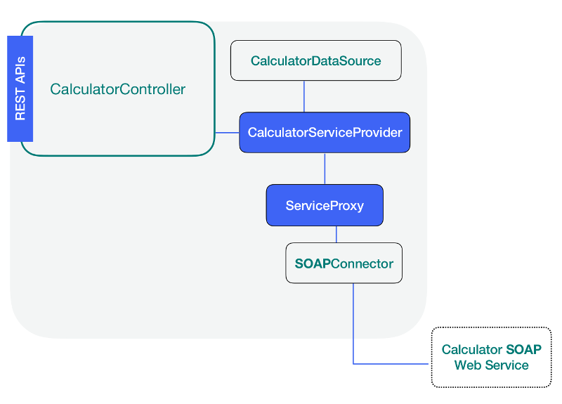

### Add a Service



**LB4** has the package _@loopback/proxy-server_ that contains the artifacts
needed to implement the link between the methods described in the .json file and
the Node.js methods. All we need to do is to write the service provider that
will serve as the glue to make this implementation real.

#### Installing the proxy-server

Make sure you are inside the soap-calculator directory and run the following
command:

```sh
npm install @loopback/service-proxy -—save
```

#### Writing a service provider

Use the `lb4 service` command and the following inputs to create a calculator
service:

```sh
lb4 service
? Please select the datasource CalculatorDatasource
? Service name: Calculator
   create src/services/calculator.service.ts
   update src/services/index.ts

Service Calculator was created in src/services/
```



```ts
import {getService} from '@loopback/service-proxy';
import {inject, Provider} from '@loopback/core';
import {CalculatorDataSource} from '../datasources';

export interface CalculatorService {
  // this is where you define the Node.js methods that will be
  // mapped to the SOAP operations as stated in the datasource
  // json file.
}

export class CalculatorServiceProvider implements Provider<CalculatorService> {
  constructor(
    // calculator must match the name property in the datasource json file
    @inject('datasources.calculator')
    protected dataSource: CalculatorDataSource = new CalculatorDataSource(),
  ) {}

  value(): Promise<CalculatorService> {
    return getService(this.dataSource);
  }
}
```

#### Adding our interfaces

When we reviewed the remote SOAP web service, we found that there were four
different results for the four operations and each of these operations were
expecting the same pair of arguments intA and intB. Now, it is time to define
this scenario using interfaces as follows:

```ts
export interface MultiplyResponse {
  result: {
    value: number;
  };
}
export interface AddResponse {
  result: {
    value: number;
  };
}
export interface SubtractResponse {
  result: {
    value: number;
  };
}
export interface DivideResponse {
  result: {
    value: number;
  };
}
export interface CalculatorParameters {
  intA: number;
  intB: number;
}
```

One important interface we need to add now is the one that describes the four
Node.js methods that will be mapped to the SOAP operations. At this point we
have just mentioned them in the .json data source file, so let's add them now as
follows:

```ts
export interface CalculatorService {
  multiply(args: CalculatorParameters): Promise<MultiplyResponse>;
  add(args: CalculatorParameters): Promise<AddResponse>;
  divide(args: CalculatorParameters): Promise<DivideResponse>;
  subtract(args: CalculatorParameters): Promise<SubtractResponse>;
}
```

### Navigation

Previous step: [Add a Datasource](soap-calculator-tutorial-add-datasource.md)

Next step: [Add a Controller](soap-calculator-tutorial-add-controller.md)
