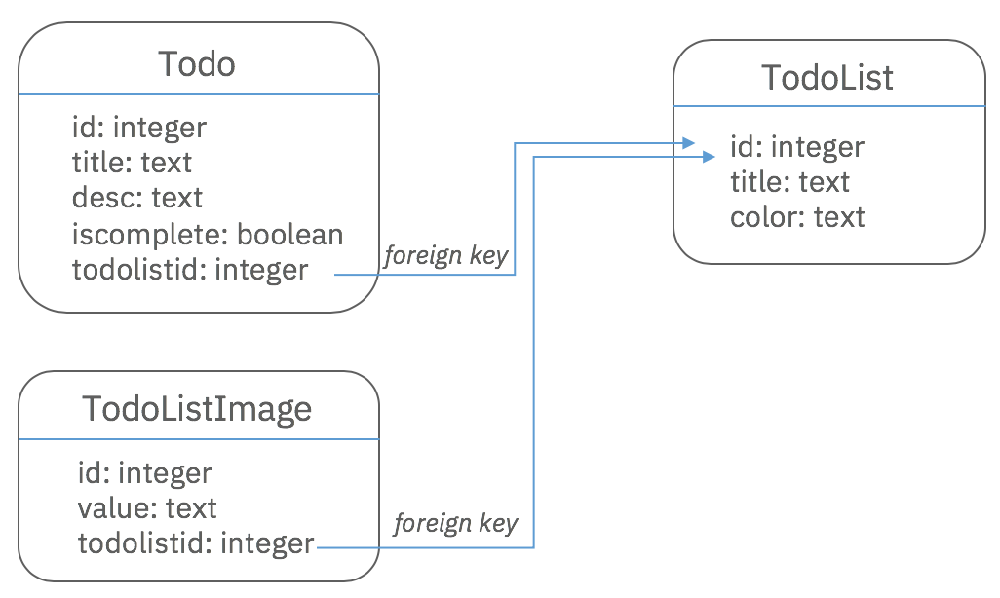

If you want to run this example using a relational database, there are some
extra steps that need to be followed.

We're going to use MySQL for illustration purposes, but it would be similar for
other relational databases.

If you don't have MySQL already installed on your machine, see
[Setting up MySQL in Docker](./todo-list-tutorial-docker-mysql.md) for some
quick instructions on getting MySQL 5.7.22 running in a Docker container on your
machine.

To use MySQL 8.0, please read
[Using MySQL 8.0](./todo-list-tutorial-docker-mysql.md#using-mysql-8.0) as it
involves several extra steps due to its new default authentication approach.

### Create a new datasource

We're going to update the DataSource `db` to connect to the MySQL database
instead of the in-memory database.

First, remove the existing `db`, run:

```sh
rm src/datasources/db.datasource.*
```

Then, create the datasource with the same name with the `lb4 datasource` command
and select `MySQL` as the connector. Then you will be prompted for various
details about your MySQL database. You can specify the values, or you can press
the ENTER key for each prompt to specify nothing. We will be opening and editing
the file anyways.

```sh
$ lb4 datasource
? Datasource name: db
? Select the connector for db:
  Redis key-value connector (supported by StrongLoop)
  MongoDB (supported by StrongLoop)
❯ MySQL (supported by StrongLoop)
  PostgreSQL (supported by StrongLoop)
  Oracle (supported by StrongLoop)
  Microsoft SQL (supported by StrongLoop)
  REST services (supported by StrongLoop)
  ...
```

Your db.datasource.ts file should look like this:



```json
const config = {
  name: 'db',
  connector: 'mysql',
  url: '',
  host: ',
  port: 0,
  user: '',
  password: '',
  database: '',
};
```

### Specifying the datasource properties

Please fill in the `host`, `port`, `user`, and `password` based on whether:

- you already have your own MySQL installation
- you followed the steps in
  [Setting up MySQL in Docker](./todo-list-tutorial-docker-mysql.md),

For the purposes of this tutorial, please set the `database` property to
`testdb`.

The MySQL connector has an extra property, `createDatabase: true`, we can add to
the datasource settings to create the database for us if it doesn't already
exist. (If you are using a different relational database, you will need to
manually create the database before attempting to connect to it.)

The final settings for the datasource for connecting to the Docker MySQL setup:



```json
const config = {
  name: 'db',
  connector: 'mysql',
  url: '',
  host: '127.0.0.1',
  port: 3306,
  user: 'root',
  password: 'my-secret-pw',
  database: 'testdb',
  createDatabase: true,
};
```

See [MySQL connector](https://loopback.io/doc/en/lb4/MySQL-connector.html) for
detailed information about different settings you can specify here, but what we
currently have is sufficient.

### Change id property's 'generated' setting to true for all models

Currently the `Todo`, `TodoList`, and `TodoListImage` models have an `id`
property with a setting of `generated: false` .

```json
 @property({
    type: 'number',
    id: true,
    generated: false,
  })
  id?: number;
```

We need to change the `id` property's `generated` setting to `true` for all
these models in order for the create and update CRUD functions to work in a
MySQL database.

```json
 @property({
    type: 'number',
    id: true,
    generated: true,
  })
  id?: number;
```

### Creating the database tables

Every LoopBack application contains a `/src/migrate.ts` file.

```ts
import {TodoListApplication} from './application';

export async function migrate(args: string[]) {
  const existingSchema = args.includes('--rebuild') ? 'drop' : 'alter';
  console.log('Migrating schemas (%s existing schema)', existingSchema);

  const app = new TodoListApplication();
  await app.boot();
  await app.migrateSchema({existingSchema});

  // Connectors usually keep a pool of opened connections,
  // this keeps the process running even after all work is done.
  // We need to exit explicitly.
  process.exit(0);
}

migrate(process.argv).catch(err => {
  console.error('Cannot migrate database schema', err);
  process.exit(1);
});
```

It is used either to create or update your database tables with respect to your
model file definitions.

All you need to know at the moment, is that it boots your application, loads
your datasource and model files, and then either creates or updates your tables.
It can be adjusted to perform extra tasks as well.

For the moment, nothing in it needs to be changed. But to understand it in more
detail, see
[Database Migrations](https://loopback.io/doc/en/lb4/Database-migrations.html)
and
[Discovery and auto-migration for MySQL Connector](https://loopback.io/doc/en/lb4/MySQL-connector.html#discovery-and-auto-migration).

We can create our database tables by entering this command:

```sh
npm run migrate
```

Upon successful completion, you should see

```sh
Migrating schemas (alter existing schema)
```

without any errors reported.

However, if any of your settings in the datasource are incorrect, you will see
some connection issues.

If you run into any authentication issues related to MySQL, double-check your
host, port, user, password, and database values in your datasource file.

### Viewing the database tables

If you have mySQL already installed on your machine, you can go into MySQL
Workbench to see if the tables have been created.

If you are running MySQL in a Docker container, you can see that the database
and the tables have been created by executing a few commands from a MySQL
interactive prompt.

Open up an interactive prompt;

```sh
docker exec -it dom-mysql mysql -uroot -p
```

You will be prompted for the password. Enter `my-secret-pw`.

Perform the following command:

```sh
show databases;
```

You should see a list of databases, including `testdb`.

```sh
+--------------------+
| Database           |
+--------------------+
| information_schema |
| mysql              |
| performance_schema |
| sys                |
| testdb             |
+--------------------+
```

List the tables of the `testdb` database:

```sh
use testdb;
show tables;
```

you should see:

```sh
+--------------------+
| Tables_in_testdb   |
+--------------------+
| ToDo               |
| ToDoList           |
| ToDoListImage      |
+--------------------+
```

The table names match the model class names exactly.

Show the columns of the `Todo` table:

```sh
describe Todo;
```

you should see:

```sh
+------------+--------------+------+-----+---------+----------------+
| Field      | Type         | Null | Key | Default | Extra          |
+------------+--------------+------+-----+---------+----------------+
| id         | int          | NO   | PRI | NULL    | auto_increment |
| title      | varchar(512) | NO   |     | NULL    |                |
| desc       | varchar(512) | YES  |     | NULL    |                |
| isComplete | tinyint(1)   | YES  |     | NULL    |                |
| todoListId | int          | YES  |     | NULL    |                |
+------------+--------------+------+-----+---------+----------------+
```

The column names match the `Todo` model class' property names exactly.



### Starting the application

You are now ready to start the application.

```sh
npm start
```

Open your browser to the API Explorer, http://127.0.0.1:3000/explorer, and
interact with the different endpoints.

To see the data in any of the tables, use the interactive MySQL prompt

```sh
select * from <table name>;
```

where `<table name>` is the name of your table.

Stop the application with `Ctrl+C` before continuing.

### Adding MySQL properties to your model properties

As mentioned earlier, it is possible to specify extra settings in the `@model`,
`@property`, and relation decorators ( for example, `@belongTo`) in the model
files in order to change the default behaviour of how tables and columns are
created in the database.

These settings and others are explained in
[MySQL connector](../../MySQL-connector.md).

However, for the purposes of this tutorial, we will specify only some simple
settings such as table names and column names.

#### Assigning a specific table name for a model

To specify that you want a table name of `my_todo` to be created for the model
`Todo` in the database `testdb`, you need to specify `mysql` settings in the
`@model` decorator.

Specifically, you use `schema` (database name) and `table` values.



```ts
@model({
  settings: {
    mysql: {
      schema: 'testdb',
      table: 'my_todo'
    },
  },
})
export class Todo extends Entity {
```



Apply a similar change to the TodoList and TodoListImage models.



```ts
@model({
  settings: {
    mysql: {
      schema: 'testdb',
      table: 'my_todo_list'
    },
  },
})
export class TodoList extends Entity {
```



```ts
@model({
  settings: {
    mysql: {
      schema: 'testdb',
      table: 'my_todo_list_image'
    },
  },
})
export class TodoListImage extends Entity {
```

#### Assigning a specific column name for a model property

To specify that you want particular column names in a database table for each
model property, you need to specify `mysql` settings in the `@property` and
`@belongsTo` decorators.

Specifically, you use a `columnName` value.

For example, to create a column name `the_id` for the `Todo` model property
`id`, you need to specify:

```ts
   @property({
    type: 'number',
    id: true,
    generated: true,
    mysql: {
      columnName: 'the_id',
    },
  })
  id?: number;
```

For the `Todo` model property `todoListId`, which has the relation decorator
`@belongsTo`, there is a different way of providing these `mysql` settings. You
need to place them in the 3rd parameter.

```ts
 @belongsTo(
    () => TodoList,
    {},
    {
      type: 'number',
      mysql: {
        columnName: 'todo_list_id',
      },
    },
  )
  todoListId: number;
```

To save some time, we will provide the final versions of the `Todo`, `TodoList`,
`TodoListImage` models below, but do take the time to look at all the settings.



```ts
@model({
  settings: {
    mysql: {
      schema: 'testdb',
      table: 'my_todo',
    },
  },
})
export class Todo extends Entity {
  @property({
    type: 'number',
    id: true,
    generated: true,
    mysql: {
      columnName: 'the_id',
    },
  })
  id?: number;

  @property({
    type: 'string',
    required: true,
    mysql: {
      columnName: 'title',
    },
  })
  title: string;

  @property({
    type: 'string',
    mysql: {
      columnName: 'desc',
    },
  })
  desc?: string;

  @property({
    type: 'boolean',
    mysql: {
      columnName: 'is_complete',
    },
  })
  isComplete?: boolean;

  @belongsTo(
    () => TodoList,
    {},
    {
      type: 'number',
      mysql: {
        columnName: 'todo_list_id',
      },
    },
  )
  todoListId: number;

  constructor(data?: Partial<Todo>) {
    super(data);
  }
}
```



```ts
@model({
  settings: {
    mysql: {
      schema: 'testdb',
      table: 'my_todo_list',
    },
  },
})
export class TodoList extends Entity {
  @property({
    type: 'number',
    id: true,
    generated: true,
    mysql: {
      columnName: 'the_id',
    },
  })
  id?: number;

  @property({
    type: 'string',
    required: true,
    mysql: {
      columnName: 'title',
    },
  })
  title: string;

  @property({
    type: 'string',
    mysql: {
      columnName: 'color',
    },
  })
  color?: string;

  @hasMany(() => Todo)
  todos: Todo[];

  @hasOne(() => TodoListImage)
  image: TodoListImage;

  constructor(data?: Partial<TodoList>) {
    super(data);
  }
}
```



```ts
@model({
  settings: {
    mysql: {
      schema: 'testdb',
      table: 'my_todo_list_image',
    },
  },
})
export class TodoListImage extends Entity {
  @property({
    type: 'number',
    id: true,
    generated: true,
    mysql: {
      columnName: 'the_id',
    },
  })
  id?: number;

  @property({
    type: 'string',
    required: true,
    mysql: {
      columnName: 'value',
    },
  })
  value: string;

  @belongsTo(
    () => TodoList,
    {},
    {
      type: 'number',
      mysql: {
        columnName: 'todo_list_id',
      },
    },
  )
  todoListId: number;

  constructor(data?: Partial<TodoListImage>) {
    super(data);
  }
}
```

### Change the table and column names currently in the database

The table and column names currentlyin the `testdb` database still have
mixed-case names.

Delete the `testdb` database.

Open up an interactive prompt:

```sh
docker exec -it dom-mysql mysql -uroot -p
```

You will be prompted for the password. Enter `my-secret-pw`.

Perform the following command:

```sh
drop database testdb;
```

In a separate command window, run the command to create all the tables:

```sh
npm run migrate
```

Now return to the MySQL interactive prompt.

```sh
use testdb;
show tables;
```

```sh
+--------------------+
| Tables_in_testdb   |
+--------------------+
| my_todo            |
| my_todo_list       |
| my_todo_list_image |
+--------------------+
```

The table names match what we specified in the `@model` decorator settings.

Let's now take a look at all the column names in each table. They will match the
column names we specified in the `@property` and `@belongsTo` decorators.

```sh
describe my_todo;
```

```sh
+--------------+--------------+------+-----+---------+----------------+
| Field        | Type         | Null | Key | Default | Extra          |
+--------------+--------------+------+-----+---------+----------------+
| the_id       | int          | NO   | PRI | NULL    | auto_increment |
| title        | varchar(512) | NO   |     | NULL    |                |
| desc         | varchar(512) | YES  |     | NULL    |                |
| is_complete  | tinyint(1)   | YES  |     | NULL    |                |
| todo_list_id | int          | YES  |     | NULL    |                |
+--------------+--------------+------+-----+---------+----------------+
```

```sh
describe my_todo_list;
```

```sh
+--------+--------------+------+-----+---------+----------------+
| Field  | Type         | Null | Key | Default | Extra          |
+--------+--------------+------+-----+---------+----------------+
| the_id | int(11)      | NO   | PRI | NULL    | auto_increment |
| title  | varchar(512) | NO   |     | NULL    |                |
| color  | varchar(512) | YES  |     | NULL    |                |
+--------+--------------+------+-----+---------+----------------+
```

```sh
describe my_todo_list_image;
```

```sh
+--------------+--------------+------+-----+---------+----------------+
| Field        | Type         | Null | Key | Default | Extra          |
+--------------+--------------+------+-----+---------+----------------+
| the_id       | int(11)      | NO   | PRI | NULL    | auto_increment |
| value        | varchar(512) | NO   |     | NULL    |                |
| todo_list_id | int(11)      | YES  |     | NULL    |                |
+--------------+--------------+------+-----+---------+----------------+
```

### Restarting the application

Let's restart the application.

```sh
npm start
```

Open your browser to the API Explorer, http://127.0.0.1:3000/explorer, and
interact with the different endpoints.

To see the data in any of the tables, use the interactive MySQL prompt

```sh
select * from <table name>;
```

where `<table name>` is the name of your table.

The application will run, and allow you to perform CRUD operations on all the
resources. But referential integrity is not enforced by default.

For example, you can:

- add a todo list
- create a todo in that todo list
- delete the todo list

The third step won't result in an error. But it leaves a todo entry in the
`my_todo` table with a `todoListId` value that no longer exists in the
`my_todo_list` table.

Calling `GET /todos/{todo id}/todo-list` results in

```json
{
  "error": {
    "statusCode": 404,
    "name": "Error",
    "message": "Entity not found: TodoList with id \"constraint {\\\"id\\\":1}\"",
    "code": "ENTITY_NOT_FOUND"
  }
}
```

We cover referential integrity and foreign key constraints in the next section.

### Specify the foreign key constraint in the models

Based on the model relations we've specified in the 3 models, the expected
database tables look like: 



We will use the `foreignKeys` attribute to determine the constraints in the
database table.

The
[syntax for foreign key constraints](https://github.com/strongloop/loopback-next/blob/7f92406a2ef36aa4699749f8acb63a2fe14fb09b/_SPIKE_.md#syntax-for-foreign-key-constraints)
is as follows:

```json
{
  "foreignKeys": {
    [keyName]: {
      // optional, overrides keyName
      "name": "constraint_name_for_db",
      "entity": "TargetModel",

      // MySQL: property name, PostgreSQL: column name!
      "foreignKey": "source property or column name",
      // MySQL & PostgreSQL: column name!
      "entityKey": "target column name"
    }
  }
}
```

- `keyName`: the name you want to give the foreign key constraint.
- `name`: optional. Overrides the `keyName`.
- `entity`: the target model.
- `foreignKey`: For the
  [MySQL Connector](https://github.com/strongloop/loopback-connector-mysql),
  this value must be the `source model`'s `property name` (not the column name)
  containing the target model's id value.
- `entityKey`: For the
  [MySQL Connector](https://github.com/strongloop/loopback-connector-mysql),
  this value must be the `column name` (not the property name) of the
  `target model`'s id property.

For more details on `foreignKeys` as it relates to the `MySQL Connector`, please
consult
[Auto-migrate/Auto-update models with foreign keys](https://loopback.io/doc/en/lb4/MySQL-connector.html#auto-migrateauto-update-models-with-foreign-keys).

#### Specify the foreign key constraints in Todo model

Since:

- TodoList `hasMany` Todo
- Todo `belongsTo` TodoList
- Todo has the `todoListId` property which holds the `id` of the TodoList

we need to specify a `foreignKeys` entry in the `Todo` model `settings` property



```ts
@model({
  settings: {
    mysql: {
      schema: 'testdb',
      table: 'my_todo',
    },

  foreignKeys: {
    // eslint-disable-next-line @typescript-eslint/naming-convention
    fk_todo_todoListId: {
      name: 'fk_todo_todoListId',
      entity: 'TodoList',
      entityKey: 'the_id',
      foreignKey: 'todoListId',
    },
  },

  },
})
export class Todo extends Entity {
```

#### Specify the foreign key constraints in TodoListImage model

Since:

- TodoList `hasOne` TodoListImage
- TodoListImage `belongsTo` TodoList
- TodoListImage has the `todoListId` property which holds the `id` of the
  TodoList

we need to specify a `foreignKeys` entry in the `TodoListImage` model `settings`
property



```ts
@model({
  settings: {
    mysql: {
      schema: 'testdb',
      table: 'my_todo_list_image',
    },

    foreignKeys: {
      // eslint-disable-next-line @typescript-eslint/naming-convention
      fk_todoListImage_todoListId: {
        name: 'fk_todoListImage_todoListId',
        entity: 'TodoList',
        entityKey: 'the_id',
        foreignKey: 'todoListId',
      },
    },

  },
})
export class TodoListImage extends Entity {
```

These foreign key constraints are sufficient for our tutorial, but for more
information, check out the details for
[auto-migrate and auto-update](https://loopback.io/doc/en/lb4/MySQL-connector.html#auto-migrateauto-update-models-with-foreign-keys)
for the MySQL connector. For other connectors, go to the corresponding connector
from the
[Connectors Reference](https://loopback.io/doc/en/lb4/Connectors-reference.html)
section.

### Update the migrate.ts file

Since we've added foreign key constraints, the order of table creation is
important.

We need to migrate the `TodoList` model before the `Todo` and `TodoListImage`
models.

In `src/migrate.ts`, modify this line:

```ts
await app.migrateSchema({existingSchema});
```

to:

```ts
await app.migrateSchema({
  existingSchema,
  // The order of table creation is important.
  // A referenced table must exist before creating a
  // foreign key constraint.
  models: ['TodoList', 'Todo', 'TodoListImage'],
});
```

### Building the database tables with the proper foreign key constraints

The tables currently in the database do not have the proper foreign key
constraints.

Delete the `testdb` database.

Open up an interactive prompt;

```sh
docker exec -it dom-mysql mysql -uroot -p
```

You will be prompted for the password. Enter `my-secret-pw`.

Perform the following command:

```sh
drop database testdb;
```

In a separate command window, run the command to create all the tables:

```sh
npm run migrate
```

Now return to the MySQL interactive prompt.

```sh
use testdb;
```

Let's now take a look at all the column definitions.

```sh
describe my_todo;
```

```sh
+--------------+--------------+------+-----+---------+----------------+
| Field        | Type         | Null | Key | Default | Extra          |
+--------------+--------------+------+-----+---------+----------------+
| the_id       | int(11)      | NO   | PRI | NULL    | auto_increment |
| title        | varchar(512) | NO   |     | NULL    |                |
| desc         | varchar(512) | YES  |     | NULL    |                |
| is_complete  | tinyint(1)   | YES  |     | NULL    |                |
| todo_list_id | int(11)      | YES  | MUL | NULL    |                |
+--------------+--------------+------+-----+---------+----------------+
```

The `todo_list_id` column now has a key type of `MUL` and is explained
[MySQL - SHOW COLUMNS Statement](https://dev.mysql.com/doc/refman/8.0/en/show-columns.html).

```sh
describe my_todo_list;
```

```sh
+--------+--------------+------+-----+---------+----------------+
| Field  | Type         | Null | Key | Default | Extra          |
+--------+--------------+------+-----+---------+----------------+
| the_id | int(11)      | NO   | PRI | NULL    | auto_increment |
| title  | varchar(512) | NO   |     | NULL    |                |
| color  | varchar(512) | YES  |     | NULL    |                |
+--------+--------------+------+-----+---------+----------------+
```

The `TodoList` model doesn't have any foreign key constraints, so the
`my_todo_list` table definition looks like it did before.

```sh
describe my_todo_list_image;
```

```sh
+--------------+--------------+------+-----+---------+----------------+
| Field        | Type         | Null | Key | Default | Extra          |
+--------------+--------------+------+-----+---------+----------------+
| the_id       | int(11)      | NO   | PRI | NULL    | auto_increment |
| value        | varchar(512) | NO   |     | NULL    |                |
| todo_list_id | int(11)      | YES  | MUL | NULL    |                |
+--------------+--------------+------+-----+---------+----------------+
```

The `todo_list_id` column now has a key type of `MUL`.

### Starting the application and testing referential integrity

Let's restart the application.

```sh
npm start
```

Open your browser to the API Explorer, http://127.0.0.1:3000/explorer

Now if you:

- add a todo list
- create a todo in that todo list
- delete that todo list

you will get a referential integrity error

```sh
Unhandled error in DELETE /todo-lists/1: 500 Error: ER_ROW_IS_REFERENCED_2: Cannot delete or update a parent row: a foreign key constraint fails (`testdb`.`my_todo`, CONSTRAINT `fk_todo_todoListId` FOREIGN KEY (`todo_list_id`) REFERENCES `my_todo_list` (`id`))
    at Query.Sequence._packetToError

```

However if you:

- add a todo list
- create a todo in that todo list
- delete that todo list
- delete that todo

Then everything works fine.

### Summary

Congratulations! You've successfully set up the TodoList application to work
with a MySQL database with custom table and column names and proper referential
integrity.
