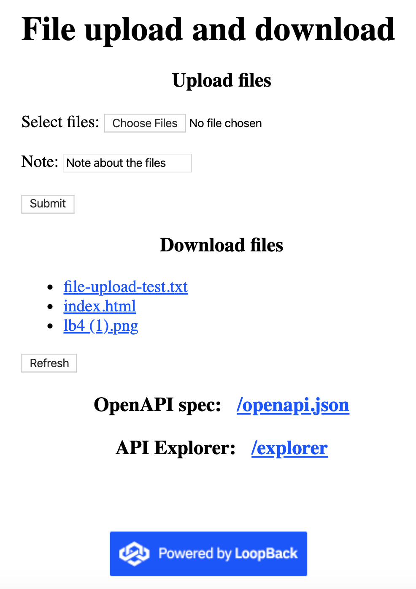

# @loopback/example-file-transfer

An example application to demonstrate file uploads and downloads for LoopBack 4

## Summary

This application exposes `POST /files` endpoint that accepts
`multipart/form-data` based file uploads. The uploaded files can be listed using
`GET /files` and individual files can be downloaded using
`GET /files/<filename>`.

## Key artifacts

- [FileUploadController](src/controllers/files.controller.ts)

  - Expose `POST /files` endpoint to allow file uploads

- [FileUploadService - an Express middleware from multer](src/services/files.service.ts)

  - A service provider that returns a configured `multer` request handler

    The file upload is configured with `multer` options in
    [src/application.ts](src/application.ts) as follows:

    ```ts
    // Configure file upload with multer options
    const multerOptions: multer.Options = {
      storage: multer.diskStorage({
        // Upload files to `.sandbox`
        destination: path.join(__dirname, '../.sandbox'),
        // Use the original file name as is
        filename: (req, file, cb) => {
          cb(null, file.originalname);
        },
      }),
    };
    this.configure(FILE_UPLOAD_SERVICE).to(multerOptions);
    ```

- [FileDownloadController](src/controllers/files.controller.ts)

  - Expose `GET /files` endpoint to list uploaded files
  - Expose `GET /files/{filename}` endpoint to download a file

## Use

Start the app:

```sh
npm start
```

The application will start on port `3000`. Open http://localhost:3000 in your
browser. You can try to upload a few files using the web UI or API explorer.



By default, the uploaded files will be stored in `.sandbox` folder under the
application root directory. The directory can be configured via
`fileStorageDirectory` of application config.

## Contributions

- [Guidelines](https://github.com/strongloop/loopback-next/blob/master/docs/CONTRIBUTING.md)
- [Join the team](https://github.com/strongloop/loopback-next/issues/110)

## Tests

Run `npm test` from the root folder.

## Contributors

See
[all contributors](https://github.com/strongloop/loopback-next/graphs/contributors).

## License

MIT
