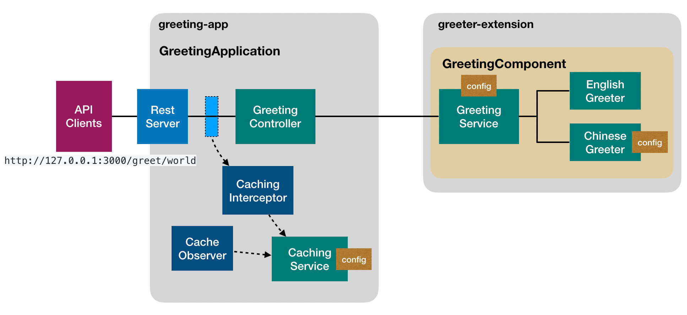

# @loopback/example-greeting-app

This application is built on top of
[`@loopback/example-greeter-extension`](https://github.com/strongloop/loopback-next/tree/master/examples/greeter-extension).

## Compose the application

1. Add REST API

   - GreetingController - providing endpoints over `GreetingService`

2. Add caching

   - CachingService - implementing cache operations, such as set,get, delete,
     and sweep
   - CachingInterceptor - intercepting http requests to apply caching
   - CacheObserver - watching and sweeping cache in the background



## Contributions

- [Guidelines](https://github.com/strongloop/loopback-next/blob/master/docs/CONTRIBUTING.md)
- [Join the team](https://github.com/strongloop/loopback-next/issues/110)

## Try out

Run `npm start`:

The service is running at http://127.0.0.1:3000/greet/world.

Open your browser to try the REST APIs. You can replace `world` with other
names.

The following `curl` command sets `Accept-Language` header to `zh` to receive
the greeting in Chinese.

```sh
curl -H 'Accept-Language: zh' http://127.0.0.1:3000/greet/Ray
```

```json
{
  "timestamp": "2019-05-29T22:48:03.040Z",
  "language": "zh",
  "greeting": "Ray，你好！"
}
```

## Tests

Run `npm test` from the root folder.

## Contributors

See
[all contributors](https://github.com/strongloop/loopback-next/graphs/contributors).

## License

MIT
