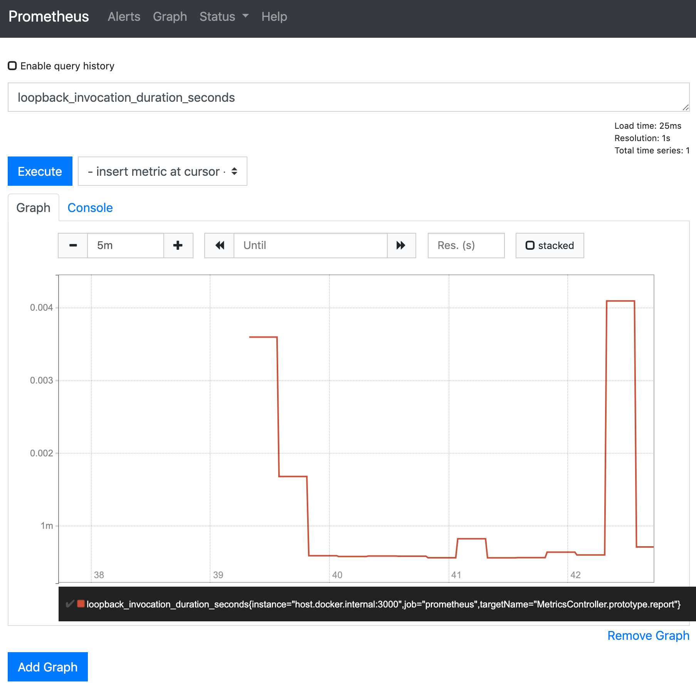

# @loopback/example-metrics-prometheus

This project contains an example to illustrate metrics provided by
[`@loopback/extension-metrics`](https://github.com/strongloop/loopback-next/blob/master/extensions/metrics)
and [Prometheus](https://prometheus.io/).

## Use

```sh
npm start
```

To run full demo:

```sh
npm run demo
```

Now let's generate some traffic:

http://127.0.0.1:3000/greet/world?count=50

The metrics is reported at http://127.0.0.1:3000/metrics.

Open http://localhost:9090 for the Prometheus Web UI.



## Contributions

- [Guidelines](https://github.com/strongloop/loopback-next/blob/master/docs/CONTRIBUTING.md)
- [Join the team](https://github.com/strongloop/loopback-next/issues/110)

## Tests

Run `npm test` from the root folder.

## Contributors

See
[all contributors](https://github.com/strongloop/loopback-next/graphs/contributors).

## License

MIT
