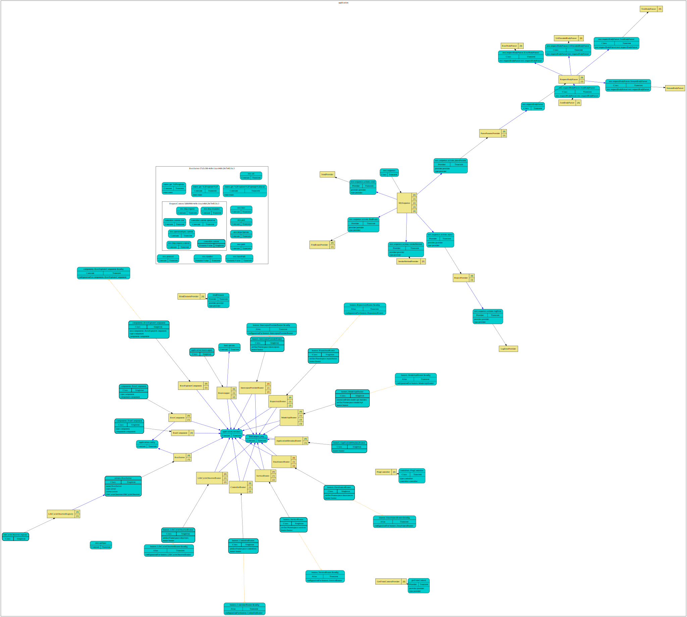

# @loopback/context-explorer

This module contains a component adding a Context Explorer to LoopBack
applications.

## Stability: ⚠️Experimental⚠️

> Experimental packages provide early access to advanced or experimental
> functionality to get community feedback. Such modules are published to npm
> using `0.x.y` versions. Their APIs and functionality may be subject to
> breaking changes in future releases.

## Installation

```sh
npm install --save @loopback/context-explorer
```

## Basic use

The component should be loaded in the constructor of your custom Application
class.

Start by importing the component class:

```ts
import {ContextExplorerComponent} from '@loopback/context-explorer';
```

In the constructor, add the component to your application:

```ts
this.component(ContextExplorerComponent);
```

By default, API Explorer is mounted at `/context-explorer`. This path can be
customized via ContextExplorer configuration as follows:

```ts
this.configure(ContextExplorerBindings.COMPONENT).to({
  path: '/context-ui',
});
```

## Endpoints

The following endpoints are added by the component.

1. `/context-explorer/inspect`: Fetch a JSON document for the context hierarchy.

   The following query parameters are supported:

   - includeParent: include parent contexts (default: `true`)
   - includeInjections: include injections (default: `true`)
   - includeGraph: include a graph in [graphviz](https://www.graphviz.org/) dot
     format (default: `true`)

2. `/context-explorer/graph`: Render the LoopBack application as a SVG diagram.

   The following query parameters are supported:

   - includeParent: include parent contexts (default: `true`)
   - includeInjections: include injections (default: `true`)
   - format: `dot` or `svg` (default: `svg`)

3. `/context-explorer`: Display the graph using
   [d3-graphviz](https://github.com/magjac/d3-graphviz).

## Sample graph



## Contributions

- [Guidelines](https://github.com/loopbackio/loopback-next/blob/master/docs/CONTRIBUTING.md)
- [Join the team](https://github.com/loopbackio/loopback-next/issues/110)

## Tests

Run `npm test` from the root folder.

## Contributors

See
[all contributors](https://github.com/loopbackio/loopback-next/graphs/contributors).

## License

MIT
