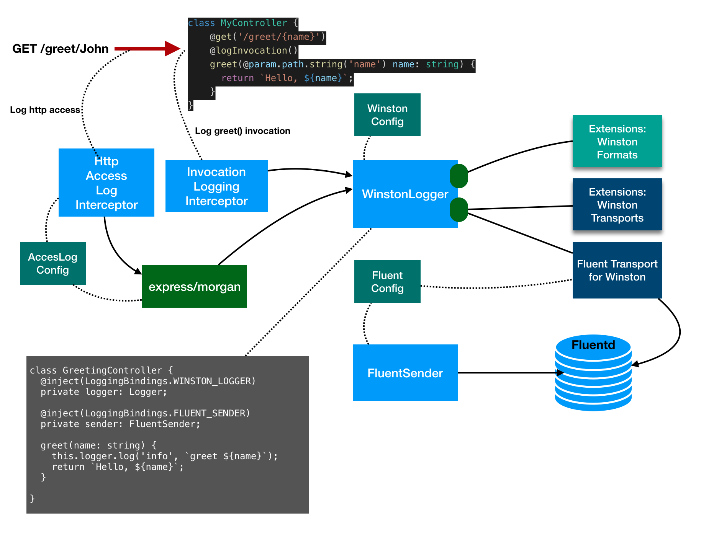

# @loopback/extension-logging

This module contains a component provides logging facilities based on
[Winston](https://github.com/winstonjs/winston) and
[Fluentd](https://github.com/fluent/fluent-logger-node).

## Stability: ⚠️Experimental⚠️

> Experimental packages provide early access to advanced or experimental
> functionality to get community feedback. Such modules are published to npm
> using `0.x.y` versions. Their APIs and functionality may be subject to
> breaking changes in future releases.

## Architecture overview



## Installation

```sh
npm install --save @loopback/extension-logging
```

## Basic use

The component should be loaded in the constructor of your custom Application
class.

Start by importing the component class:

```ts
import {LoggingComponent} from '@loopback/extension-logging';
```

In the constructor, add the component to your application:

```ts
this.component(LoggingComponent);
```

Now your application can add a controller as follows to leverage the logging
facilities:

```ts
import {inject} from '@loopback/context';
import {Logger, logInvocation} from '@loopback/extension-logging';
import {get, param} from '@loopback/rest';

class MyController {
  // Inject a winston logger
  @inject(LoggingBindings.WINSTON_LOGGER)
  private logger: Logger;

  // http access is logged by a global interceptor
  @get('/greet/{name}')
  // log the `greet` method invocations
  @logInvocation()
  greet(@param.path.string('name') name: string) {
    return `Hello, ${name}`;
  }

  @get('/hello/{name}')
  hello(@param.path.string('name') name: string) {
    // Use the winston logger explicitly
    this.logger.log('info', `greeting ${name}`);
    return `Hello, ${name}`;
  }
}
```

## Configure the logging component

The logging component can be configured as follows:

```ts
app.configure(LoggingBindings.COMPONENT).to({
  enableFluent: false, // default to true
  enableHttpAccessLog: true, // default to true
});
```

- `enableFluent`: Enable logs to be sent to Fluentd
- `enableHttpAccessLog`: Enable all http requests to be logged via a global
  interceptor

The component contributes bindings with keys declared under `LoggingBindings`
namespace as follows:

- FLUENT_SENDER - A fluent sender
- WINSTON_LOGGER - A winston logger
- WINSTON_TRANSPORT_FLUENT - A fluent transport for winston
- WINSTON_INTERCEPTOR - A local interceptor set by `@logInvocation` to log
  method invocations
- WINSTON_HTTP_ACCESS_LOGGER - A global interceptor that logs http access with
  [Morgan](https://github.com/expressjs/morgan) format

The fluent sender and transport for winston can be configured against
`FLUENT_SENDER`:

```ts
import {LoggingBindings} from '@loopback/extension-logging';

app.configure(LoggingBindings.FLUENT_SENDER).to({
  host: process.env.FLUENTD_SERVICE_HOST ?? 'localhost',
  port: +(process.env.FLUENTD_SERVICE_PORT_TCP ?? 24224),
  timeout: 3.0,
  reconnectInterval: 600000, // 10 minutes
});
```

The winston logger can be configured against `LoggingBindings.WINSTON_LOGGER`:

```ts
import {LoggingBindings} from '@loopback/extension-logging';

ctx.configure<LoggerOptions>(LoggingBindings.WINSTON_LOGGER).to({
  level: 'info',
  format: format.json(),
  defaultMeta: {framework: 'LoopBack'},
});
```

The winston logger accepts two types of extensions to the following extension
points:

- WINSTON_TRANSPORT = 'logging.winston.transport'
- WINSTON_FORMAT = 'logging.winston.format'

```ts
import {extensionFor} from '@loopback/core';
import {format} from 'winston';
import {
  WINSTON_FORMAT,
  WINSTON_TRANSPORT,
  WinstonFormat,
  WinstonTransports,
} from '@loopback/extension-logging';

const myFormat: WinstonFormat = format((info, opts) => {
  console.log(info);
  return false;
})();

ctx
  .bind('logging.winston.formats.myFormat')
  .to(myFormat)
  .apply(extensionFor(WINSTON_FORMAT));
ctx
  .bind('logging.winston.formats.colorize')
  .to(format.colorize())
  .apply(extensionFor(WINSTON_FORMAT));

const consoleTransport = new WinstonTransports.Console({
  level: 'info',
  format: format.combine(format.colorize(), format.simple()),
});
ctx
  .bind('logging.winston.transports.console')
  .to(consoleTransport)
  .apply(extensionFor(WINSTON_TRANSPORT));
```

If no transport is contributed, the winston logger uses the
[console transport](https://github.com/winstonjs/winston/blob/master/docs/transports.md#console-transport).

No default format is configured for the winston logger.

The access log interceptor can also be configured to customize
[Morgan format and options](https://github.com/expressjs/morgan#morganformat-options):

```ts
ctx
  .configure(LoggingBindings.WINSTON_HTTP_ACCESS_LOGGER)
  .to({format: 'combined'});
```

## Contributions

- [Guidelines](https://github.com/strongloop/loopback-next/blob/master/docs/CONTRIBUTING.md)
- [Join the team](https://github.com/strongloop/loopback-next/issues/110)

## Tests

Run `npm test` from the root folder.

The acceptance test against fluentd is available as a separate package at
`acceptance/extension-logging-fluentd`.

## Contributors

See
[all contributors](https://github.com/strongloop/loopback-next/graphs/contributors).

## License

MIT
