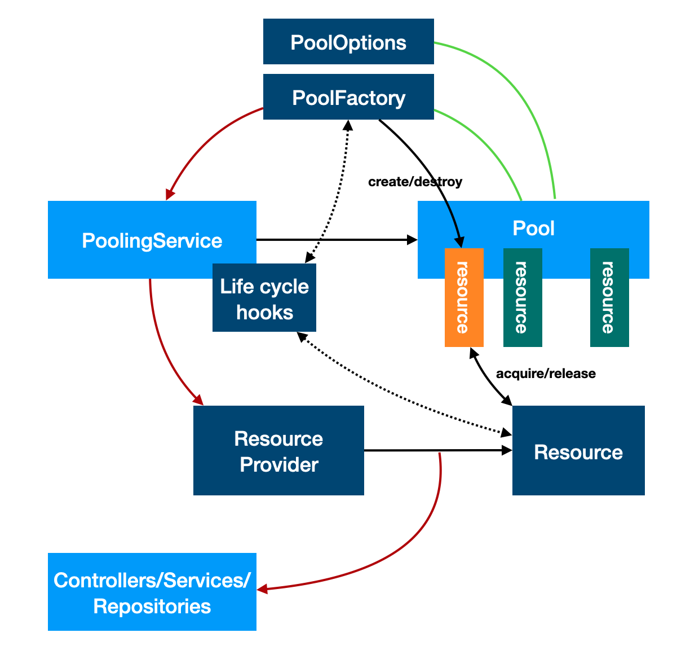

# @loopback/pooling

This module contains a resource pooling service for LoopBack 4.

## Overview

Some resources can be expensive to create/start. For example, a datasource has
overhead to connect to the database. There will be performance penalty to use
`TRANSIENT` binding scope and creates a new instance per request. But it is not
feasible to be a singleton for some use cases, for example, each request may
have different security contexts.

The `PoolingService` is a singleton service to maintain a pool of resources.
This pool service can be bound to different keys to represent multiple pools.
Each binding is a singleton so that the state stays the same for injections into
multiple instances for other artifacts.

The pooling service observes life cycle events to start and stop.

The extension is built with
[generic-pool](https://github.com/coopernurse/node-pool).



## Stability: ⚠️Experimental⚠️

> Experimental packages provide early access to advanced or experimental
> functionality to get community feedback. Such modules are published to npm
> using `0.x.y` versions. Their APIs and functionality may be subject to
> breaking changes in future releases.

## Installation

```sh
npm install --save @loopback/pooling
```

## Basic use

Let's use the following class as an expensive resource that requires pooling for
performance.

```ts
class ExpensiveResource {
  static id = 1;
  id: number;
  status: string;

  constructor() {
    this.status = 'created';
    this.id = ExpensiveResource.id++;
  }
}
```

### Register a pooling service

```ts
import {Application, ContextTags} from '@loopback/core';
import {PoolingService, PoolServiceOptions} from '@loopback/pooling';

const app = new Application();
const poolingServiceBinding = app.service(PoolingService, {
  [ContextTags.KEY]: 'services.MyPoolingService',
});
```

### Configure the pooling service

A pooling service has to be configured first. We must provide a factory that
handles `create/destroy` of resource instances to be pooled. There are also
options to control the pooling behavior.

```ts
app
  .configure<PoolServiceOptions<ExpensiveResource>>(poolingServiceBinding.key)
  .to({
    factory: {
      async create() {
        const res = new ExpensiveResource();
        return res;
      },

      async destroy(resource: ExpensiveResource) {
        resource.status = 'destroyed';
      },
    },
    {max: 16}, // Pooling options
  });
```

See more details at
https://github.com/coopernurse/node-pool/blob/master/README.md#creating-a-pool.

### Locate the pooling service

```ts
const myPoolingService = await app.get<PoolingService>(
  'services.MyPoolingService',
);
```

### Acquire a resource instance from the pool

```ts
const res1 = await myPoolingService.acquire();
// Do some work with res1
```

### Release the resource instance back to the pool

After the resource is used, it **MUST** be released back to the pool.

```ts
myPoolingService.release(res1);
```

## Advanced use

### Pooling life cycle methods

We can optionally implement life cycle methods for the factory and the resource
to provide additional logic for pooling life cycle events:

- create
- destroy
- acquire
- release

#### Factory level methods

```ts
const options: PoolingServiceOptions<ExpensiveResource> = {
  factory: {
    async create() {
      const res = new ctor();
      res.status = status;
      if (status === 'invalid') {
        // Reset status so that the next try will be good
        status = 'created';
      }
      return res;
    },

    async destroy(resource: ExpensiveResource) {
      resource.status = 'destroyed';
    },

    async validate(resource) {
      const result = resource.status === 'created';
      resource.status = 'validated';
      return result;
    },

    acquire(resource) {
      resource.status = 'in-use-set-by-factory';
    },

    release(resource) {
      resource.status = 'idle-set-by-factory';
    };
  },
  poolOptions,
};
```

#### Resource level methods

The resource can also implement similar methods:

```ts
class ExpensiveResourceWithHooks extends ExpensiveResource implements Poolable {
  /**
   * Life cycle method to be called by `create`
   */
  start() {
    // In real world, this may take a few seconds to start
    this.status = 'started';
  }

  /**
   * Life cycle method to be called by `destroy`
   */
  stop() {
    this.status = 'stopped';
  }

  acquire() {
    this.status = 'in-use';
  }

  release() {
    this.status = 'idle';
  }
}
```

If the resource implements life cycle methods, they will be invoked for the
pooled resource.

- `start`: It will be called right after the resource is newly created by the
  pool. This method should be used to initialize/start the resource.

- `stop`: It will be called when the pool is stopping/draining. This method
  should be used to stop the resource.

- `acquire`: It will be called right after the resource is acquired from the
  pool. If it fails, the resource will be destroyed from the pool. The method
  should be used to set up the acquired resource.

- `release`: It will be called right before the resource is released back to the
  pool. If it fails, the resource will be destroyed from the pool. The method
  should be used to clean up the resource to be released.

### Pooled resource provider

The pooled resource can be wrapped into a provider class to provide pooled
instances.

```ts
import {PooledValue, PoolingService} from '@loopback/pooling';

class ExpensiveResourceProvider
  implements Provider<PooledValue<ExpensiveResource>> {
  constructor(
    @inject(POOL_SERVICE)
    private poolingService: PoolingService<ExpensiveResource>,
  ) {}

  async value() {
    return getPooledValue(this.poolingService);
  }
}
```

Now we can bind the pooled resource provider:

```ts
ctx.bind('resources.ExpensiveResource').toProvider(ExpensiveResourceProvider);
const res: PooledValue<ExpensiveResource> = await ctx.get(
  'resources.ExpensiveResource',
);
// Do some work with the acquired resource
// The resource must be released back to the pool
await res.release();
```

### Use a binding as the pooled resource

We can leverage a binding as the factory to create resources for a pool.

```ts
const MY_RESOURCE = BindingKey.create<ExpensiveResource>('my-resource');
ctx.bind(MY_RESOURCE).toClass(ExpensiveResource);
const factory = createPooledBindingFactory(MY_RESOURCE);
const poolBinding = createBindingFromClass(PoolingService, {
  [ContextTags.KEY]: POOL_SERVICE,
});
ctx.add(poolBinding);
ctx.configure<PoolingServiceOptions<ExpensiveResource>>(poolBinding.key).to({
  factory,
});
```

## Contributions

- [Guidelines](https://github.com/strongloop/loopback-next/blob/master/docs/CONTRIBUTING.md)
- [Join the team](https://github.com/strongloop/loopback-next/issues/110)

## Tests

Run `npm test` from the root folder.

## Contributors

See
[all contributors](https://github.com/strongloop/loopback-next/graphs/contributors).

## License

MIT
