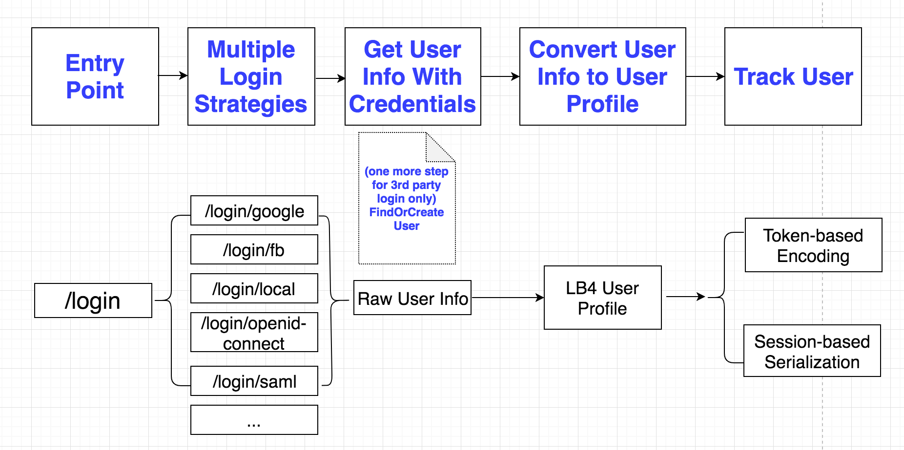
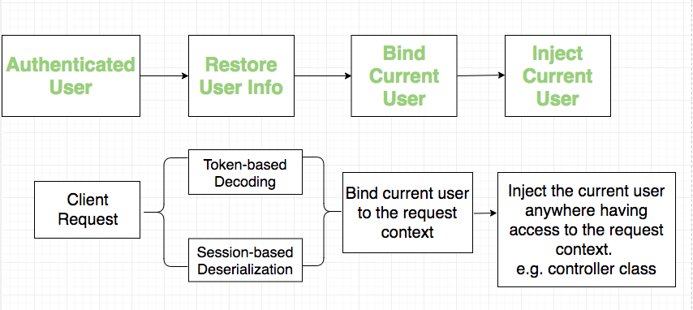
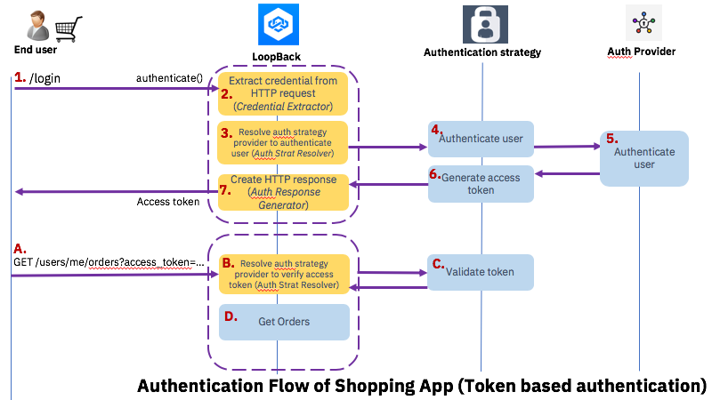
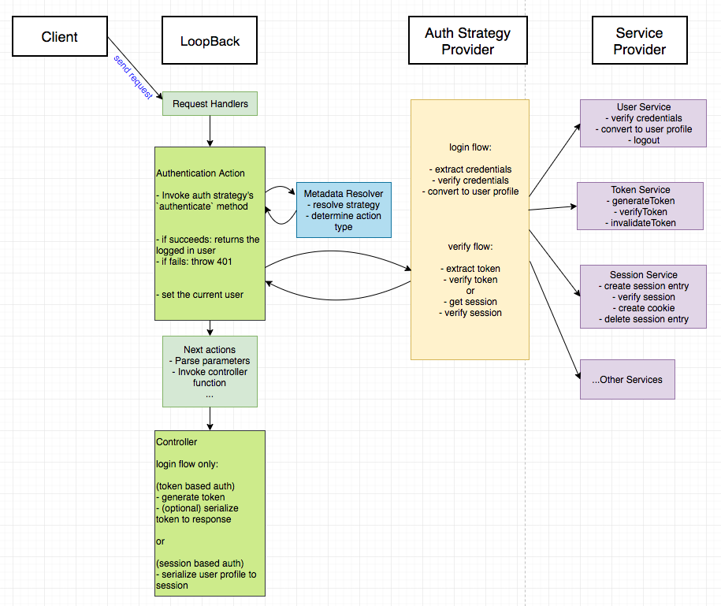

## Multiple Authentication strategies

An authentication system in a LoopBack 4 application could potentially support
multiple popular strategies, including basic auth, oauth2, saml, openid-connect,
etc...And also allow programmers to use either a token based or a session based
approach to track the logged-in user.

The diagram below illustrates the high level abstraction of such an extensible
authentication system.

Assume the app has a static login page with a list of available choices for
users to login:

- local: basic auth with email/username + password
- facebook account: oauth2
- google account: oauth2
- ibm intranet account: saml
- openid account: openid-connect
- ...

For the local login, we retrieve the user from a local database.

For the third-party service login, e.g. facebook account login, we retrieve the
user info from the facebook authorization server using oauth2, then find or
create the user in the local database.

By clicking any one of the links, you login with a particular account and your
status will be tracked in a session(with session-based auth), or your profile
will be encoded into a JWT token(with token-based auth).

A common flow for all the login strategies would be: the authentication action
verifies the credentials and returns the raw information of that logged-in user.

Here the raw information refers to the data returned from a third-party service
or a persistent database. Therefore you need another step to convert it to a
user profile instance which describes your application's user model. Finally the
user profile is either tracked by a generated token OR a session + cookie.

The next diagram illustrates the flow of verifying the client requests sent
after the user has logged in.

The request goes through the authentication action which invokes the
authentication strategy to decode/deserialize the user profile from the
token/session, binds it to the request context so that actions after
'authenticate' could inject it using DI.

Next let's walk through the typical API flow of user login and user
verification.

## API Flows (using BasicAuth + JWT as example)

Other than the LoopBack core and its authentication module, there are different
parts included and integrated together to perform the authentication.

The next diagram, using the BasicAuth + JWT authentication strategy as an
example, draws two API flows:

- Login: user login with email+password
- Verify: verify the logged-in user

along with the responsibilities divided among different parts:

- LoopBack core: resolve a strategy based on the endpoint's corresponding
  authentication metadata, execute the authentication action which invokes the
  strategy's `authenticate` method.

- Authentication strategy:

  - (login flow) verify user credentials and return a user profile(it's up to
    the programmer to create the JWT access token inside the controller
    function).
  - (verify flow) verify the token and decode user profile from it.

- Authentication services: some utility services that can be injected in the
  strategy class. (Each service's functionalities will be covered in the next
  section)

_Note: FixIt! the step 6 in the following diagram should be moved to LoopBack
side_

_Note: Another section for session based auth TBD_

## Authentication framework architecture

The following diagram describes the architecture of the entire authentication
framework and the detailed responsibility of each part.

You can check the pseudo code in folder `docs` for:

- [authentication-action](./authentication-action.md)
- [authentication-strategy](./authentication-strategy.md)
- [basic auth strategy](./strategies/basic-auth.md)
- [jwt strategy](./strategies/jwt.md)
- [oauth2 strategy](./strategies/oauth2.md)
- [endpoints defined in controller](./controller-functions.md)

And the abstractions for:

- [user service](../src/services/user.service.ts)
- [token service](../src/services/token.service.ts)

### Token based authentication

- Login flow

  - authentication action:
    - resolve metadata to get the strategy
    - invoke strategy.authenticate()
    - set the current user as the return of strategy.authenticate()
  - strategy:
    - extract credentials from
      - transport layer(request)
      - or local configuration file
    - verify credentials and return the user profile (call user service)
  - controller function:
    - generate token (call token service)
    - return token or serialize it into the response

- Verify flow
  - authentication action:
    - resolve metadata to get the strategy
    - invoke strategy.authenticate()
    - set the current user as the return of strategy.authenticate()
  - strategy:
    - extract access token from transport layer(request)
    - verify access token(call token service)
    - decode user from access token(call token service)
    - return user
  - controller:
    - process the injected user

### Session based authentication

- Login flow

  - authentication action:
    - resolve metadata to get the strategy
    - invoke strategy.authenticate()
  - strategy:
    - extract credentials from
      - transport layer (request)
      - or local configuration file
    - verify credentials (call user service) and return the user profile
  - controller:
    - serialize user info into the session

- Verify flow
  - authentication action:
    - resolve metadata to get the strategy
    - invoke strategy.authenticate()
    - set the current user as the return of strategy.authenticate()
  - strategy:
    - extract session info from cookie(call session service)
    - deserialize user info from session(call session service)
    - return user
  - controller function:
    - process the injected user
